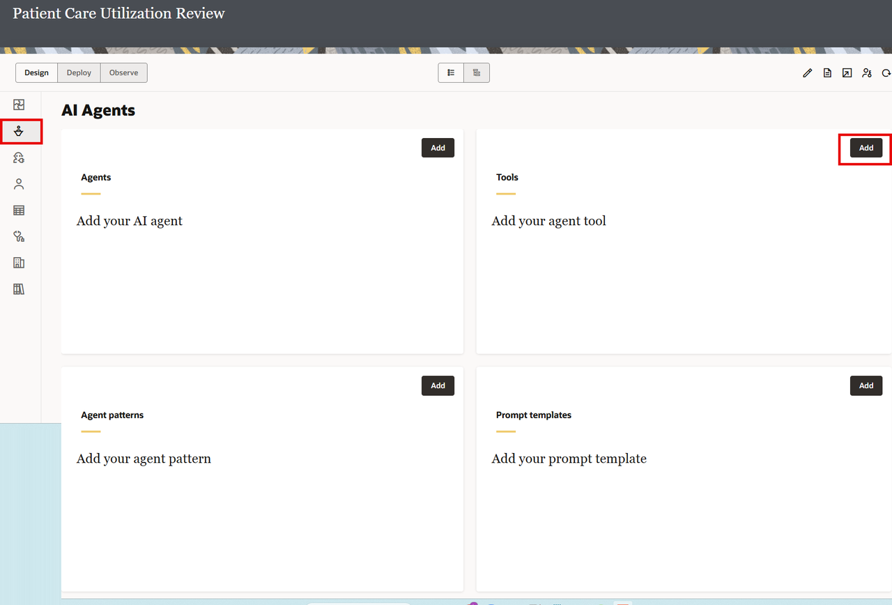
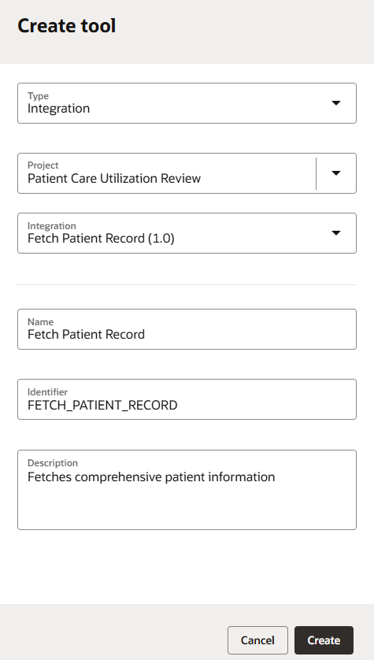
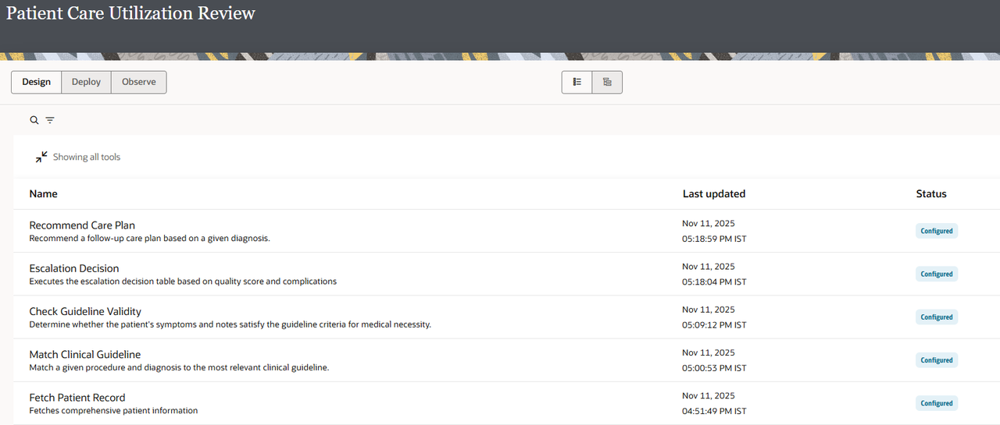

# Register an Integration as an Agentic AI Tool

## Introduction

Now that you have successfully imported the Patient Utilization Review project and configured all necessary connections in the previous Section, you are ready to register each of the five healthcare integrations as agentic AI tools.
When an integration is registered as an agentic AI tool, it becomes available for your AI agent to invoke intelligently. Each tool must have clear descriptions and parameter guidelines so that the Large Language Model (LLM) can understand when and how to use it.

Estimated Time: 30 minutes

### Objectives
In this lab, you will:

1.  Register all five healthcare integrations as agentic AI tools from the AI Agents page
2.  Configure tool descriptions, identifiers, and parameter guidelines for each tool
3.  Verify that all tools are properly configured and ready for agent use

### Prerequisites and Tool Overview

This lab assumes you have:
- Completed all the previous labs

**Integration Requirements Met**

All five integrations have been pre-configured and meet the Agentic AI tool requirements:

| Requirement | Status | Notes |
|-------------|--------|-------|
| Part of a project | ✓ | Imported in Previous Section |
| Integration is Active | ✓ | Activated in Previous Section |
| First connection is REST trigger with REST Adapter | ✓ | Configured in Previous Section |
| REST trigger configured with OAuth Auth, JSON payload, POST verb | ✓ | Configured in Previous Section |
{: title="Integrations Requirement"}

**Five Healthcare Tools Overview**

| Tool Name | Description |
|-----------|-------------|
| **Fetch Patient Record** | Fetches comprehensive patient information |
| **Match Clinical Guideline** | Match a given procedure and diagnosis to the most relevant clinical guideline |
| **Check Guideline Validity** | Determine whether the patient's symptoms and notes satisfy the guideline criteria for medical necessity |
| **Escalation Decision** | Executes the escalation decision table based on quality score and complications |
| **Recommend Care Plan** | Recommend a follow-up care plan based on a given diagnosis |
{: title="Overview of Tools you will create"}

## Task 1: Access AI Agents and Tools Section

1. In the OIC navigation pane, click **Projects**

2. Select the **Patient Care Utilization Review** project

3. In the left navigation pane, click **AI Agents**

4. On the AI Agents page, locate the **Tools** card section

## Task 2: Register Fetch Patient Record as an Agentic AI Tool

### Step 1: Create New Tool from Tools Card

1. On the AI Agents page, in the **Tools** section, click **Add** or **+**
2. Create tool dialog appears

### Step 2: Enter Tool Information

In the Create Tool dialog , fill in the following fields as shown in the table:

| Field | Value | Notes |
|-------|-------|-------|
| **Type** | Integration |  |
| **Project** | Patient Care Utilization Review |  |
| **Integration** | Fetch Patient Record |  |
| **Name** | Fetch Patient Record | Auto-populated from integration name |
| **Identifier** | FETCH\_PATIENT\_RECORD | Sent to LLM; uniquely identifies the tool |
| **Description** | Fetches comprehensive patient information | Clear, concise description of what the tool does |
{: title="Fetch Patient Record Tool Properties"}

Click on **Create**

### Step 3: Configure Parameters

In the **Parameters configuration** section:

| Parameter | Visible | Required | Description |
|-----------|---------|----------|-------------|
| patientId | ✓ | ✓ | The patient's Medical Record Number (MRN) or unique patient identifier |
{: title="Fetch Patient Record Parameter Configuration"}

### Step 4: Configure Guidelines (Optional)

- Ideally we need to add any specific guidelines or constraints for LLM use (as applicable). For now use the text provided in the description and paste it in Guidelines.

### Step 5: Save Tool

1. Click **Save** to register the tool
2. Navigate back to the AI Agents page.

## Task 3: Register Match Clinical Guideline as an Agentic AI Tool

### Step 1: Create New Tool from Tools Card

1. On the AI Agents page, in the **Tools** section, click **Add** or **+**
2. A tool selection or Create tool dialog appears
3. Select **Match Clinical Guideline** integration from the list of available integrations

### Step 2: Enter Tool Information

Fill in the following fields as shown in the table:

| Field | Value | Notes |
|-------|-------|-------|
| **Type** | Integration |  |
| **Project** | Patient Care Utilization Review |  |
| **Integration** | Match Clinical Guideline |  |
| **Name** | Match Clinical Guideline | Auto-populated from integration name |
| **Identifier** | MATCH\_CLINICAL\_GUIDELINE | Sent to LLM; uniquely identifies the tool |
| **Description** | Match a given procedure and diagnosis to the most relevant clinical guideline | Explains matching process |
{: title="Match Clinical Guideline Tool Properties"}

Click on **Create**

### Step 3: Configure Parameters

In the **Parameters configuration** section:

| Parameter | Visible | Required | Description |
|-----------|---------|----------|-------------|
| procedure | ✓ | ✓ | The type of clinical procedure performed |
| diagnosis | ✓ | ✓ | The primary clinical diagnosis |
{: title="Match Clinical Guideline Parameter Configuration"}

### Step 4: Configure Guidelines (Optional)

- Ideally we need to add any specific guidelines or constraints for LLM use (as applicable). For now use the text provided in the description and paste it in Guidelines.

### Step 5: Save Tool

1. Click **Save** to register the tool
2. Navigate back to the AI Agents page.

## Task 4: Register Check Guideline Validity as an Agentic AI Tool

### Step 1: Create New Tool from Tools Card

1. On the AI Agents page, in the **Tools** section, click **Add** or **+**
2. A tool selection or Create tool dialog appears
3. Select **Check Guideline Validity** integration from the list of available integrations

### Step 2: Enter Tool Information

Fill in the following fields as shown in the table:

| Field | Value | Notes |
|-------|-------|-------|
| **Type** | Integration |  |
| **Project** | Patient Care Utilization Review |  |
| **Integration** | Check Guideline Validity |  |
| **Name** | Check Guideline Validity | Auto-populated from integration name |
| **Identifier** | CHECK\_GUIDELINE\_VALIDITY | Sent to LLM; uniquely identifies the tool |
| **Description** | Determine whether the patient's symptoms and notes satisfy the guideline criteria for medical necessity. | Core compliance validation |
{: title="Check Guideline Validity Tool Properties"}

Click on **Create**

### Step 3: Configure Parameters

In the **Parameters configuration** section:

| Parameter | Visible | Required | Description |
|-----------|---------|----------|-------------|
| symptoms | ✓ | ✓ | Patient's documented symptoms before procedure |
| required_symptoms | ✓ | ✓ | Symptoms required by guideline for medical necessity |
| notes | ✓ | ✓ | Complete clinical documentation from patient record |
{: title="Check Guideline Validity Parameter Configuration"}

### Step 4: Configure Guidelines (Optional)

- Ideally we need to add any specific guidelines or constraints for LLM use (as applicable). For now use the text provided in the description and paste it in Guidelines.

### Step 5: Save Tool

1. Click **Save** to register the tool
2. Navigate back to the AI Agents page.

## Task 5: Register Escalation Decision as an Agentic AI Tool

### Step 1: Create New Tool from Tools Card

1. On the AI Agents page, in the **Tools** section, click **Add** or **+**
2. A tool selection or Create tool dialog appears
3. Select **Escalation Decision** integration from the list of available integrations

### Step 2: Enter Tool Information

Fill in the following fields as shown in the table:

| Field | Value | Notes |
|-------|-------|-------|
| **Type** | Integration |  |
| **Project** | Patient Care Utilization Review |  |
| **Integration** | Escalation Decision |  |
| **Name** | Escalation Decision | Auto-populated from integration name |
| **Identifier** | ESCALATION\_DECISION | Sent to LLM; uniquely identifies the tool |
| **Description** | Executes the escalation decision table based on quality score and complications | Risk assessment and policy application|
{: title="Escalation Decision Tool Properties"}

Click on **Create**

### Step 3: Configure Parameters

In the **Parameters configuration** section:

| Parameter | Visible | Required | Description | Enum Values |
|-----------|---------|----------|-------------|-------------|
| quality_score | ✓ | ✓ | Overall quality rating (EXCELLENT/SATISFACTORY/NEEDS IMPROVEMENT/NON COMPLIANT) |EXCELLENT,SATISFACTORY,NEEDS IMPROVEMENT,NON COMPLIANT
| complications_present | ✓ | ✓ | Boolean indicating if complications occurred (true/false) |Leave Blank|
{: title="Escalate Decision Parameter Configuration"}
### Step 4: Configure Guidelines (Optional)

- Ideally we need to add any specific guidelines or constraints for LLM use (as applicable). For now use the text provided in the description and paste it in Guidelines.

### Step 5: Save Tool

1. Click **Save** to register the tool
2. Navigate back to the AI Agents page.

## Task 6: Register Recommend Care Plan as an Agentic AI Tool

### Step 1: Create New Tool from Tools Card

1. On the AI Agents page, in the **Tools** section, click **Add** or **+**
2. A tool selection or Create tool diaglog appears
3. Select **Recommend Care Plan** integration from the list of available integrations

### Step 2: Enter Tool Information

Fill in the following fields as shown in the table:

| Field | Value | Notes |
|-------|-------|-------|
| **Type** | Integration |  |
| **Project** | Patient Care Utilization Review |  |
| **Integration** | Recommend Care Plan|  |
| **Name** | Recommend Care Plan| Auto-populated from integration name |
| **Identifier** | RECOMMEND\_CARE\_PLAN | Sent to LLM; uniquely identifies the tool |
| **Description** | Recommend a follow-up care plan based on a given diagnosis | Evidence-based care recommendations|
{: title="Recommend Care Plan Tool Properties"}

Click on **Create**

### Step 3: Configure Parameters

In the **Parameters configuration** section:

| Parameter | Visible | Required | Description |
|-----------|---------|----------|-------------|
| diagnosis | ✓ | ✓ | Primary diagnosis description) |
{: title="Recommend Care Plan Parameter Configuration"}

### Step 4: Configure Guidelines (Optional)

- Ideally we need to add any specific guidelines or constraints for LLM use (as applicable). For now use the text provided in the description and paste it in Guidelines.

### Step 5: Save Tool

1. Click **Save** to register the tool
2. Navigate back to the AI Agents page.

## Task 7: Verify All Tools are Registered

1. Navigate to **AI Agents** page in the project
2. Verify all five tools appear in the **Tools** section:
   - ✓ Fetch Patient Record
   - ✓ Match Clinical Guideline
   - ✓ Check Guideline Validity
   - ✓ Escalation Decision
   - ✓ Recommend Care Plan

You may now **proceed to the next lab**.

## Learn More

* [Register Integration as Tools](https://docs.oracle.com/en/cloud/paas/application-integration/aiagents/register-integration-agentic-ai-tool1.html)

## Acknowledgements
* **Author** - Kishore Katta, Director Product Management - Oracle Integration
* **Last Updated By/Date** - Kishore Katta - Nov 2025
