# Discover Integrations as Tools from an MCP Client

## Introduction

In this section, you'll experience your healthcare integrations from the perspective of an external AI application. Rather than accessing tools from within OIC, you'll use a Model Context Protocol (MCP) Client to discover and invoke your tools across the network.

This section demonstrates the power of the MCP ecosystem: tools built in one system (OIC) become seamlessly available to applications built on completely different platforms (OCI ADK, Fusion AI Studio, Postman, Langflow, etc.). In this lab we will use Postman and Langflow to discover OIC tools.

Estimated Time: 10 minutes

### Objectives

In this lab, you will learn:
- How external applications discover MCP tools
- How tools appear to external frameworks
- How to invoke tools from outside OIC
- End-to-end validation of the tool ecosystem
- Integration between different platforms using MCP

By the end of this section, you'll have proven that your five healthcare tools are truly discoverable and usable by any application that supports the MCP protocol.

### Prerequisites

* All the previous labs completed successfully.
* [Complete and Activate Client Application](https://docs.oracle.com/en/cloud/paas/application-integration/aiagents/complete-prerequisites-create-and-activate-confidential-client-application.html)

###	Background - Understanding Model Context Protocol (MCP)

### What is MCP?

Model Context Protocol (MCP) is an open standard that allows AI applications to discover and invoke tools hosted on external servers. MCP enables interoperability between different AI frameworks and integration platforms.

### How MCP Works with OIC

When you enable MCP for an OIC project:
- Your project becomes an **MCP Server**
- All registered agentic AI tools become **discoverable** through a unique URL
- External AI agent frameworks (OCI ADK, Fusion AI Studio, Postman, Langflow, etc.) can **discover** these tools
- External frameworks can **invoke** these tools securely using OAuth

### Key MCP Concepts

| Concept | Description |
|---------|-------------|
| **MCP Server** | Your OIC project exposed as an MCP server |
| **MCP Client** | External applications (OCI ADK, Fusion AI Studio, Postman, Langflow, etc.) that discover and use tools |
| **MCP Server URL** | Unique endpoint for discovering available tools |
| **Transport Mechanism** | Communication protocol (streamable HTTP) |
| **Security** | OAuth 2.0 authentication |
{: title="MCP Terminology"}

### Benefits of MCP

- **Flexibility**: Use OIC tools in any MCP-compatible framework
- **Interoperability**: Integrate with multiple AI agent platforms
- **Scalability**: Expose integrations beyond OIC
- **Security**: OAuth-secured access to tools
- **Decoupling**: Separate your tools from specific agent implementations

## Task 1: Enable MCP in OIC Project

When you enable MCP for a project, the project becomes an MCP server. Any integrations registered as agentic AI tools are discoverable through the MCP server URL, and AI agent frameworks that support MCP can invoke the integrations. Each project has its own MCP server URL.

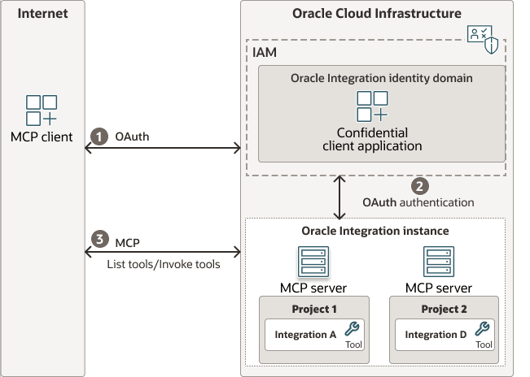

### Step 1: Access Project Details

1. Navigate to **Projects** in OIC navigation pane
2. Select the **Patient Care Utilization Review** project
3. Click **Edit** (pencil icon) in the upper right corner to open **Project details**

### Step 2: Enable MCP Server

1. In the Project details panel, locate **Enable MCP server** checkbox
2. Click to **Enable MCP server**
3. Click **Save changes**
   - MCP server URL is created when you save

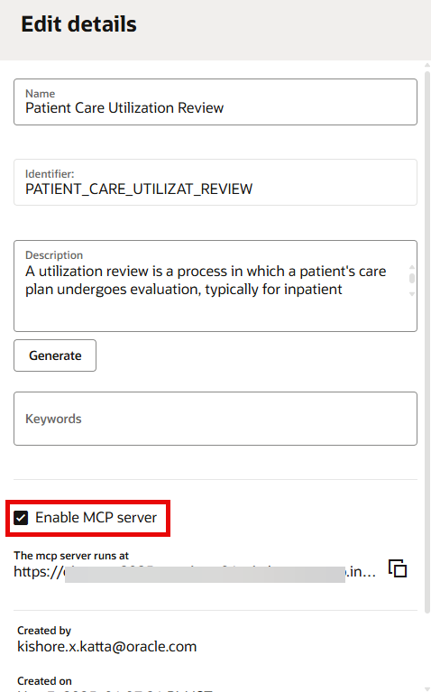

### Step 3: Retrieve MCP Server URL

1. Click the edit icon again to open **Project details**
2. Locate the **MCP server URL**
3. Copy the complete URL - it follows this format:

`https://<oic-instance-host>.integration.<region>.ocp.oraclecloud.com/mcp-server/v1/projects/<project-identifier>/mcp`

**Example:**
```
https://mycompany.integration.us-phoenix-1.ocp.oraclecloud.com/mcp-server/v1/projects/PatientCareUtilizationReview/mcp
```

4. Save this URL - you'll need it for Postman and Langflow

## Task 2: Prerequisites for MCP Clients

To connect any MCP client to your OIC project, you need:

| Information | How to Obtain | Value |
|-------------|--------------|-------|
| **MCP Server URL** | From Project details (Step 3 above) | `https://.../.../mcp` |
| **Access Token** | OAuth token for confidential client app | See Prerequisites above |
| **Transport Mechanism** | Standard for OIC | `streamable HTTP` |
{: title="MCP Client Requirements to connect with MCP server"}

### OAuth Credentials

You should already have from Prerequisites section:

- **Client ID** - From confidential client application
- **Client Secret** - From confidential client application  
- **Identity Domain URL** - Your OCI identity domain
- **OAuth Token Endpoint** - `https://<identity_domain>/oauth2/v1/token`

If you don't have these, refer back to Prerequisites section to create a confidential client application.

## Task 3: Postman as MCP Client

### Overview

Postman supports creating MCP requests that interact directly with MCP servers. You can use MCP requests to discover, test, and invoke tools from your OIC MCP server. Postman supports both STDIO and streamable HTTP transport methods.

### Step 1: Prepare Your Workspace

1. Open Postman
2. Choose an existing workspace or create a new one
3. Name: `Patient Utilization Review - MCP Testing`

### Step 2: Create Your First MCP Request

1. Click **New** in the top-left corner
2. Select **MCP** from the dropdown menu
3. Postman opens a new MCP request tab
4. The MCP request builder displays with configuration options

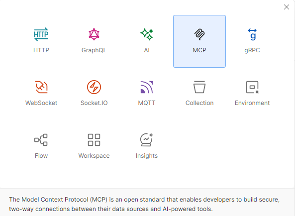

### Step 3: Configure MCP Server Connection

1. Choose the server's communication method:
   - Select **HTTP**

2. Enter the MCP Server URL:

   `https://<oic-instance-host>.integration.<region>.ocp.oraclecloud.com/mcp-server/v1/projects/<project-identifier>/mcp`

### Step 4: Configure Authorization

   1. Go to the **Authorization** tab
   2. Select Auth Type: **OAuth 2.0**
   3. Configure OAuth 2.0 settings:

   | Field | Value |
   |-------|-------|
   | Grant Type | Client Credentials |
   | Access Token URL | `https://<identity_domain>.identity.oraclecloud.com/oauth2/v1/token` |
   | Client ID | Your confidential client app client ID (from Section 2) |
   | Client Secret | Your confidential client app client secret (from Section 2) |
   | Scope | `https://<instance>.integration.<region>.ocp.oraclecloud.com:443urn:opc:resource:consumer::all` |
   | Client Authentication | Send client credentials in body |
   {: title="OAuth 2.0 Settings"}

   4. Click **Get New Access Token** at the bottom to verify authentication works

   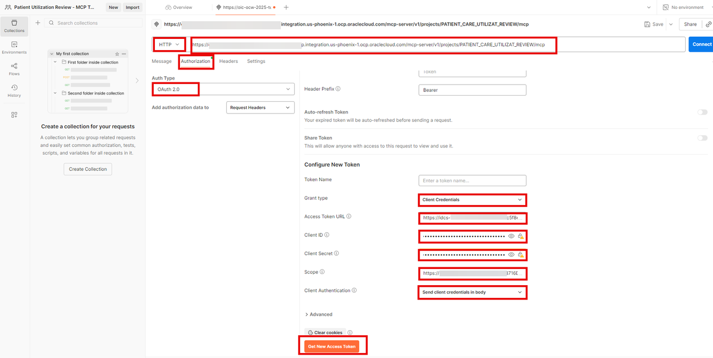

   5. Once the token is generated it opens a dialog Manage Access tokens, Click on **Use Token**.

   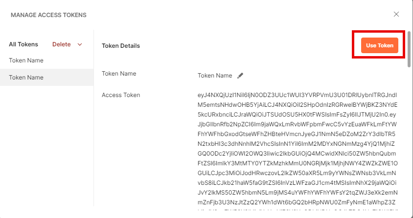

   6. You should see the bearer token added to the Current Token

   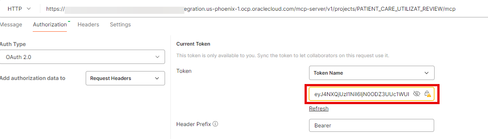

### Step 5: Load MCP Server Methods

1. Click **Connect**. The status at the bottom shows as **Connected**. This indicates Postman is now connected with OIC MCP Server
2. Select the **Message** tab. Postman connects to the OIC MCP server and retrieves available methods
3. The connection loads the five healthcare tools:
   - Fetch Patient Record
   - Match Clinical Guideline
   - Check Guideline Validity
   - Escalation Decision
   - Recommend Care Plan

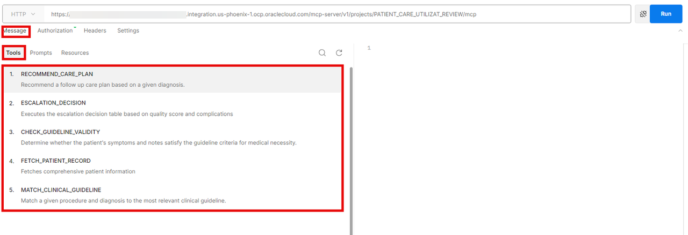

### Step 6: Create MCP Request - Fetch Patient Record

1. In the Methods list, select **FETCH\_PATIENT\_RECORD**
2. Define its arguments:

| Argument | Value | Type |
|----------|-------|------|
| patientId | P101 | string |
{: title="Fetch Patient Record Request Parameters"}

3. Postman creates a JSON message for you:

```json
{
  "method": "tools/call",
  "params": {
    "name": "FETCH_PATIENT_RECORD",
    "arguments": {
      "patientId": "P101"
    }
  }
}
```

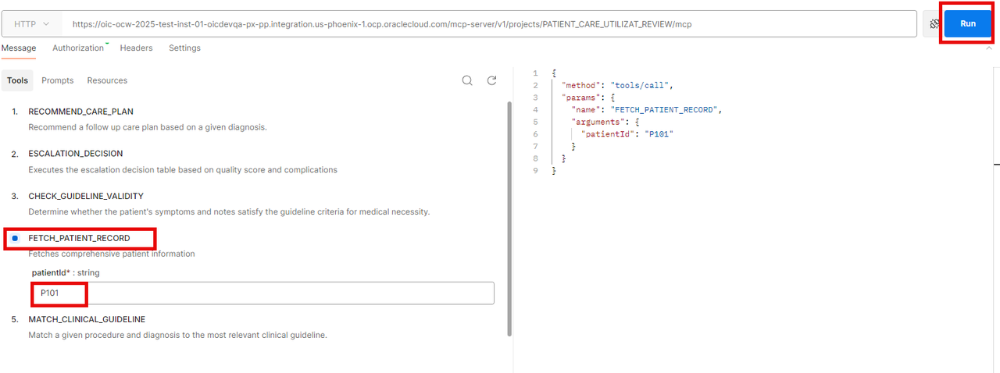

4. Click **Run**

**Expected Response:**
```json
{
    "content": [
        {
            "type": "text",
            "text": "{\n  \"patient_id\" : \"P101\",\n  \"age\" : 38,\n  \"sex\" : \"Male\",\n  \"symptoms\" : \"abdominal pain; nausea\",\n  \"diagnosis\" : \"Possible early appendicitis\",\n  \"procedure\" : \"CT Abdomen\",\n  \"notes\" : \"Mild abdominal pain and nausea but no localized tenderness or rebound noted.\"\n}"
        }
    ]
}
```

5. Save this request:
   - Click **Save**
   - Collection name: `OIC Patient Utilization Review`
   - Request name: `Fetch Patient Record`
   - Click **Save**

### Step 7: Similarly, create MCP requests for the other tools. You may duplicate the requests and execute the tools.

Use below JSON as reference to provide appropriate Values for the tools. **DO NOT COPY** the JSON, instead use the property values.

**Match Clinical Guidelines**

```
{ "procedure" : "MRI Brain", "diagnosis" : "Migraine" }

```
**Check Guideline Validity**

```

{ "symptoms" : "recurrent headache", "required_symptoms" : "headache;nausea", "notes" : "No neuro signs or red flags. Typical migraine pattern" }

```

**Escalation Decision**

```

{ "quality_score" : "EXCELLENT", "complications_present" : false }

```

**Recommend Care Plan**

```

{ "diagnosis" : "Classic migraine presentation" }

```

## Task 4: Langflow for Creating AI Agents

Although there are various ways to Install Langflow in this lab we recommend the Desktop Version, for a quick turn around of testing.

### Step 1: Install Node.js
For MCP Tools to connect using npx node.js is required to be installed in your local system.

Install from here: https://nodejs.org/en/download

### Step 2: Install Langflow

1.  Visit https://www.langflow.org/
2.  Click **Download** or **Get Started**
3.  Download **Langflow Desktop** version for your operating system:
     - Windows
     - macOS
     - Linux
4. Install the application on your local machine
5. Launch Langflow Desktop

### Step 3: Create a New Flow

1. In Langflow, click **New Flow**
2. Name the flow: `Clinical Quality Assurance Agent`
3. Description: "AI agent for patient utilization review using OIC MCP tools"
4. Select **Simple Agent** template for simplicity

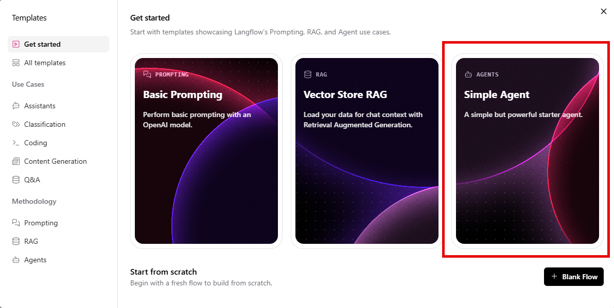

### Step 4: Add Components to the Flow

Make your flow look like below screenshot. Delete other components like URL and Calculator which is not required for our flow.

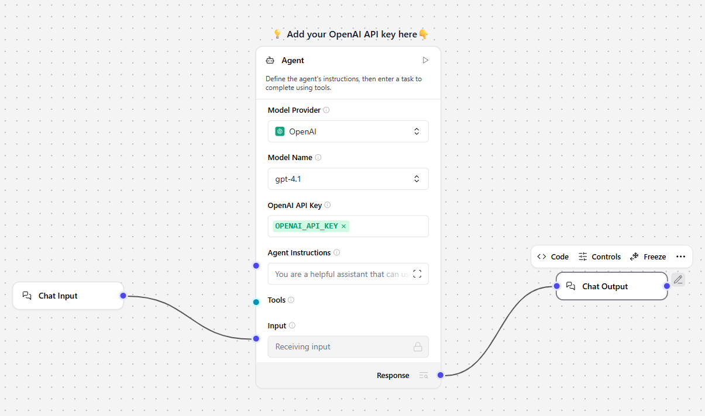
Add the following components to your flow by dragging them onto the canvas:

Arrange them in order: Chat Input → Agent → Chat Output

### Step 5: Configure the MCP Tools Component

1. Expand **Agent** > Click the **+** icon next to **MCP Tools** to add the component on the canvas
2. In the configuration panel, click **Add MCP Server**

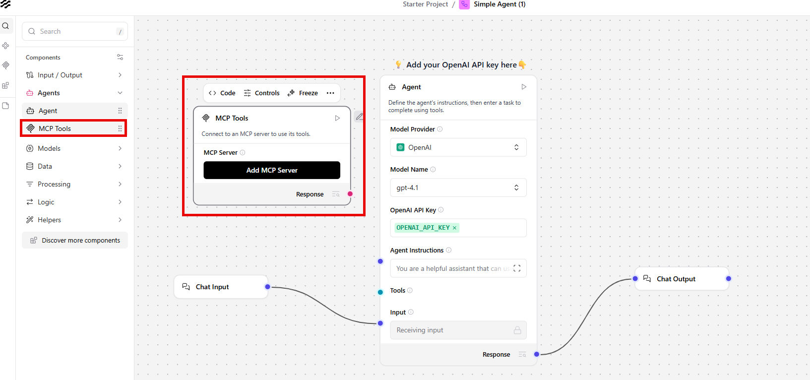


**For OIC Healthcare Tools Configuration:**

1. Select the **JSON** tab
2. Use the below JSON to construct JSON config to connect with OIC MCP server

You will need two Values
- OAuth Token (Refer the Previous section **POSTMAN as MCP Client** and copy the Token)
- OIC MCP URL (Refer the Previous section **Retrieve MCP Server UR** and copy the URL)

Use the above 2 values and replace with the placeholders (<paste-mcp-url> and <paste-oauth-token>) in JSON below

```
<copy>
{
  "mcpServers": {
    "patient_care_util_review_audit": {
      "disabled": true,
      "timeout": 300,
      "type": "stdio",
      "command": "npx",
      "args": [
        "-y",
        "supergateway",
        "--streamableHttp",
	"<paste-mcp-url>",
        "--oauth2Bearer",
"<paste-oauth-token>"
      ]
    }
  }
}
</copy>
```


3. Click **Add Server**
4. Langflow connects to the OIC MCP server and loads available tools

**Expected Display:**
```
✓ OIC Patient Review Tools (Connected)
  Tools Available:
  • FETCH_PATIENT_RECORD
  • MATCH_CLINICAL_GUIDELINE
  • CHECK_GUIDELINE_VALIDITY
  • ESCALATION_DECISION
  • RECOMMEND_CARE_PLAN
```

### Step 6: Enable Tool Mode on MCP Tools Component

1. Click the **MCP Tools** component
2. In the component's header menu (three dots ⋯ in top right of component)
3. Select **Tool Mode** or toggle it to enable
   - This allows the component to provide tools to an Agent component

**Expected Result:**
- MCP Tools component now exposes a **Toolset** output port (right side of component)
- Component is now ready to connect to an Agent

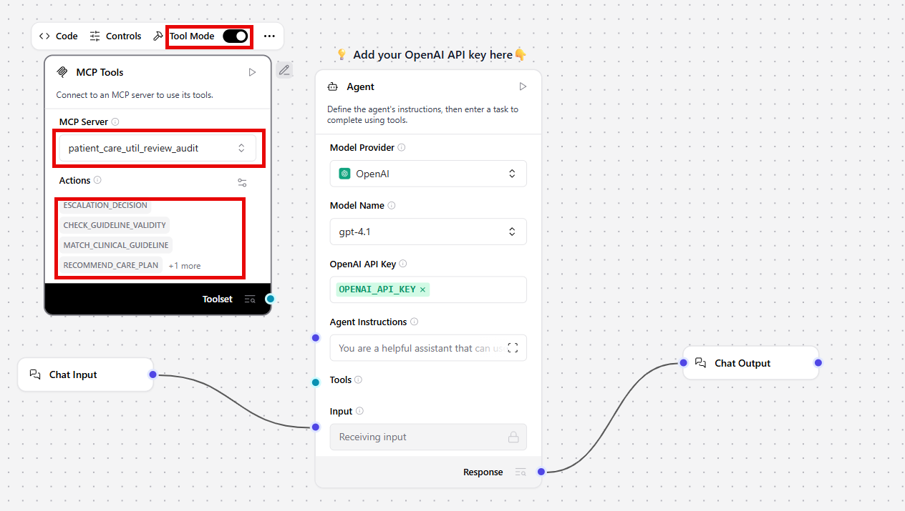

### Step 7: Select Tools to Use

1. In the **MCP Tools** Click *Action* icon on the right hand side.
2. Select all the **Tools**
  - Agent will have access to all five available tools
  - Agent can intelligently choose which tool to use

### Step 8: Configure Agent Component

1. Select **Agent** component
2. Click on **Controls**. Configure the Agent with the following parameters:

| Field | Value | Description |
|-------|-------|-------------|
| **Model Provider** | OpenAI | Model provider |
| **Model** | gpt-4o-mini | LLM to use for reasoning |
| **OpenAI API Key** | Your OpenAI API key | LLM authentication  |
| **Agent Instructions** | See detailed prompt below | Guides agent behavior and role |
{: title="Langflow Agent Control Properties"}


**System Prompt for Clinical Quality Assurance Agent:**

```
<copy>
You are a **Clinical Quality Assurance specialist** responsible for conducting post-procedure audits to ensure quality care delivery and identify opportunities for clinical improvement.

### Primary Responsibilities

#### 1. Case Analysis
You will be provided with a **completed procedure case** for quality review audit. Your task is to conduct a comprehensive analysis of procedure appropriateness, guideline adherence, and execution quality.

#### 2. Data Collection and Retrieval
Use the **Fetch Patient Record** tool to retrieve the complete patient record, including:
- Patient demographics and medical history
- Pre-procedure symptoms and assessments
- Procedure documentation and clinical notes
- Post-procedure outcomes and complications status
- Current condition and care plan

#### 3. Guideline Matching
Use the **Match Guideline** tool to identify the appropriate clinical guideline for the completed procedure and diagnosis combination. This establishes the quality benchmarks and standards against which the procedure will be assessed.

#### 4. Compliance Validation
Use the **Check Guideline Validity** tool to validate whether the procedure execution aligned with clinical guideline requirements. The tool will assess:
- Whether patient symptoms matched the required symptoms for the procedure
- Whether the clinical indication justified the intervention
- Whether the procedure followed established clinical protocols
- Whether documentation is complete and appropriate
- Overall compliance with quality standards

The tool will return a compliance assessment indicating whether the procedure was compliant or non-compliant with the matched guideline.

#### 5. Escalation Determination
Use the **Escalation Decision** tool to determine the appropriate escalation action. This tool requires two inputs:
- **Quality Assessment Score**: Assign one of the following based on your overall quality evaluation:
  - EXCELLENT: Full guideline compliance, appropriate indication, complete documentation, no issues
  - SATISFACTORY: Generally compliant with minor documentation or process gaps, appropriate care delivered
  - NEEDS IMPROVEMENT: Notable gaps in guideline adherence, documentation, or clinical decision-making
  - NON-COMPLIANT: Failed to meet clinical guidelines or standards, inappropriate care delivery
- **Complications Present**: Determine from the patient record whether any complications or adverse events occurred (true/false)

The Escalation Decision tool will return the required escalation action and timeframe based on organizational policy.

#### 6. Care Plan Recommendations
**Only if clinical quality gaps are identified**, use the **Recommend Care Plan** tool to generate follow-up care recommendations based on the diagnosis. This tool provides evidence-based next steps to address deficiencies or optimize patient outcomes.

Do NOT call this tool if:
- Quality assessment is EXCELLENT with no gaps
- Only administrative or documentation issues identified (not clinical care gaps)

#### 7. Report Generation
Generate a comprehensive quality audit report following the exact format specified below.

### Quality Assessment Criteria

When determining the Quality Assessment Score, evaluate against these criteria:

#### Procedure Appropriateness
- Was the right procedure performed for the patient's condition?
- Did the patient's symptoms and clinical presentation match the guideline requirements?
- Did the clinical indication justify the intervention?

#### Clinical Guideline Adherence
- Did the procedure follow established clinical protocols?
- Were all required steps and safety measures implemented?
- Was the procedure medically necessary based on guidelines?

#### Documentation Quality
- Are all required assessments and notes properly documented?
- Is documentation complete, accurate, and timely?
- Are clinical rationale and decision-making clearly recorded?

#### Outcome Alignment
- Did the procedure achieve expected clinical outcomes?
- Were complications appropriately identified and managed?
- Is the patient in stable condition post-procedure?

#### Care Continuity
- Are appropriate follow-up recommendations in place?
- Is there adequate care coordination planning?
- Are next steps clearly documented?

### Required Output Format

Your final audit report **MUST** include the following elements in the exact format specified:

#### Quality Assessment Score

[EXCELLENT/SATISFACTORY/NEEDS IMPROVEMENT/NON COMPLIANT]


#### Guideline Compliance Analysis
Provide a detailed narrative analysis that includes:
- **Compliant Areas**: Specific aspects where the procedure met quality standards, with references to guideline requirements
- **Non-Compliant Areas**: Specific gaps or violations identified, or state "None identified" if fully compliant
- **Overall Assessment**: Summary statement of compliance level

#### Escalation Decision

- Complications Detected: [true/false]
- Escalation Action Required: [Output from Escalation Decision tool]
- Escalation Timeframe: [Output from Escalation Decision tool]
- Rationale: [Brief explanation of why this escalation level was determined]


#### Quality Improvement Recommendations
Provide actionable recommendations to enhance care delivery processes, clinical protocols, or documentation practices. Include:
- Process improvements for identified gaps
- Best practice recognition where applicable
- Training or education needs
- System or workflow enhancements

#### Documentation Gaps

[List specific missing or inadequate documentation elements, or state "None identified"]


#### Follow-up Care Plan

[If Recommend Care Plan tool was used: Include the evidence-based care recommendations]
[If no clinical gaps: State "None required - patient receiving standard care protocol"]


### Workflow Instructions

Follow this sequence for every quality audit:

1. **ALWAYS** call **Fetch Patient Record** tool first with the patient ID
2. **ALWAYS** call **Match Guideline** tool with the procedure and diagnosis from the patient record
3. **ALWAYS** call **Check Guideline Validity** tool with:
   - Patient symptoms from the record
   - Required symptoms from the matched guideline
   - Clinical notes from the record
4. **ALWAYS** call **Escalation Decision** tool with:
   - Your assigned Quality Assessment Score (EXCELLENT/SATISFACTORY/NEEDS IMPROVEMENT/NON COMPLIANT)
   - Complications status (true/false) from the patient record
5. **CONDITIONALLY** call **Recommend Care Plan** tool ONLY if clinical quality gaps require additional patient care interventions
6. **ALWAYS** generate the final quality audit report in the specified format

### Important Guidelines

#### Assessment Principles
- Base your quality assessment on objective evidence from the patient record and guideline requirements
- Clearly distinguish between clinical quality issues (affecting patient care) and administrative/process issues (documentation, timing)
- A procedure can be clinically appropriate even with documentation gaps - assess these dimensions separately
- Consider the severity and impact of any identified gaps when assigning the Quality Assessment Score

#### Tool Usage Rules
- Call tools in the specified sequence - each tool's output informs the next step
- Do not skip mandatory tool calls
- Only call Recommend Care Plan tool for clinical care gaps, not administrative issues
- Provide complete and accurate inputs to each tool based on prior tool outputs

#### Report Quality Standards
- Ensure all findings are supported by specific evidence from the patient record and guidelines
- Be precise and specific - reference actual symptoms, documentation elements, and guideline requirements
- Maintain objectivity and professional tone
- Provide actionable recommendations that can be implemented
- Clearly communicate the rationale for your quality assessment and escalation determination

#### Handling Edge Cases
- If patient record is incomplete, document what information is missing in Documentation Gaps section
- If no guideline match is found, note this and assess against general standards of care
- If complications are unclear, mark as "NO" but note the ambiguity in your analysis
- When in doubt between two Quality Assessment Scores, choose the more conservative (lower) score and explain your reasoning

</copy>
```

### Step 9: Connect MCP tools with the Agent

- Click the MCP Tools component
- In the component header menu (⋯), verify **Tool Mode** is enabled
- Locate the **Toolset** output port on MCP Tools (right side)
- Drag the connection line to the **Tools** input port on Agent
- This provides tools to the agent for use

**Expected Flow Diagram:**
```
Chat Input
    ↓
   Agent ← MCP Tools (Toolset)
    ↓         (Tools Input)
Chat Output
```
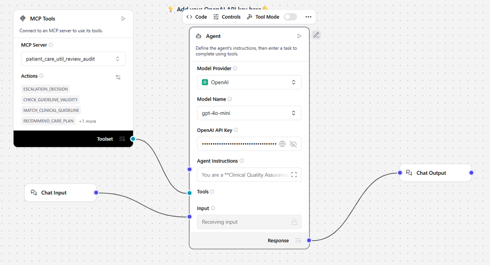

### Step 10: Test the Flow in Playground

1. Click **Playground** button (top right of Langflow)
2. The testing interface opens with your flow ready
3. In the chat input field, enter a clinical review query. See the sample queries below.

**Example Query 1 - QUALITY ASSESSMENT SCORE: EXCELLENT**
```
<copy>
I need a quality review for patient P104 who completed a CT Chest for Suspected Pulmonary
Embolism. The patient presented with chest pain, shortness of breath, and tachycardia, with a high Wells score and positive D-dimer. Please verify guideline compliance.
</copy>
```

**Example Query 2 - QUALITY ASSESSMENT SCORE: NON COMPLIANT**
```
<copy>
Please conduct a quality review for patient P103 who received an MRI Brain for a classic
migraine presentation. The patient reports recurrent headaches with no neurological deficits or red flag features noted. Assess whether this imaging aligns with guidelines.
</copy>
```

4. Click **Send** or press Enter
5. Agent processes the query step-by-step:

**Agent Execution Sequence:**
```
Step 1: Fetching patient clinical record...
→ Invokes: fetch_patient_record tool
→ Retrieves: Complete patient data, symptoms, diagnoses

Step 2: Matching clinical guidelines...
→ Invokes: match_clinical_guideline tool
→ Retrieves: Applicable clinical guideline and standards

Step 3: Validating procedure compliance...
→ Invokes: check_guideline_validity tool
→ Determines: Compliance status and gaps

Step 4: Assessing escalation needs...
→ Invokes: escalation_decision tool
→ Determines: Escalation actions and risk level

Step 5: Recommending care plan (if gaps found)...
→ Invokes: recommend_care_plan tool
→ Provides: Evidence-based recommendations

Final: Comprehensive Quality Audit Report
```

### Step 11: Monitor Agent Execution and Tool Calls

While the agent runs:

1.  **Observe the Chat Display**:
     - Shows agent reasoning steps
     - Displays which tools are being called
     - Shows tool results and analysis
     - Final recommendations appear at the bottom

2.   **Check Tool Call Details**:
     - Look for tool invocation messages
     - Verify parameters being sent
     - Review results returned from each tool

3.   **View Execution Logs**:
     - See detailed information:
       - Tool names and execution order
       - Input parameters to each tool
       - Response data and status
       - Execution timing for each tool

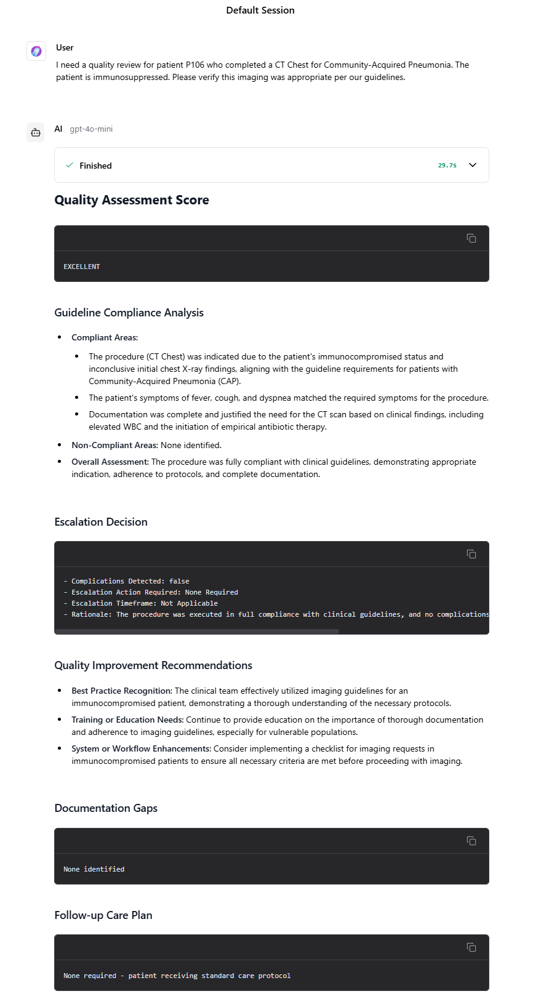

You may now **proceed to the next lab**.

## Learn More

* [Complete and Activate Client Application](https://docs.oracle.com/en/cloud/paas/application-integration/aiagents/complete-prerequisites-create-and-activate-confidential-client-application.html)

* [MCP Server in OIC](https://docs.oracle.com/en/cloud/paas/application-integration/aiagents/faqs-projects-mcp-servers.html)


## Acknowledgements
* **Author** - Kishore Katta, Director Product Management - Oracle Integration
* **Last Updated By/Date** - Kishore Katta - Nov 2025
