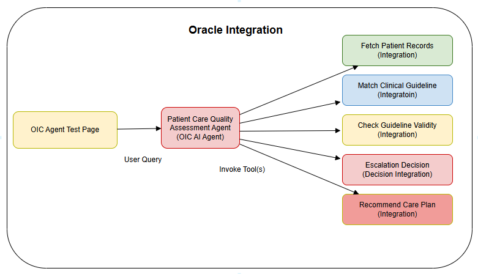
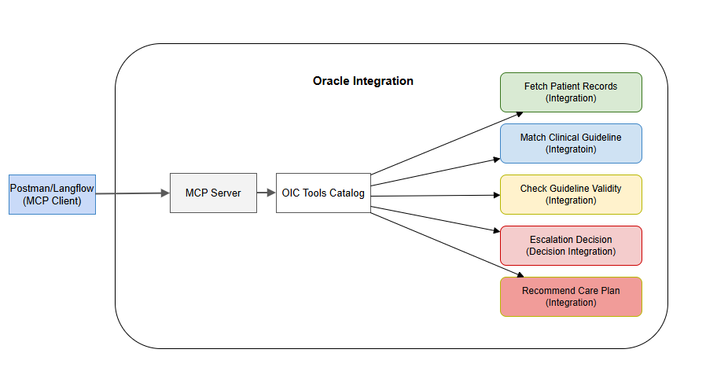

# Introduction

Healthcare organizations face increasing pressure to ensure quality care delivery, optimize resource utilization, and maintain compliance with clinical guidelines. Manual review processes for patient procedures are time-consuming, prone to inconsistency, and resource-intensive. This live lab introduces you to a modern approach: leveraging AI agents within Oracle Integration to automate and enhance clinical quality assurance workflows.

**Agentic AI** represents a paradigm shift in healthcare automation. Unlike traditional integration workflows that follow a fixed sequence of steps, AI agents use Large Language Models (LLMs) to reason intelligently, make adaptive decisions, and orchestrate multiple integrations based on the clinical context. This capability is particularly valuable in healthcare, where procedures and patient conditions vary significantly, and decision-making requires nuanced judgment aligned with clinical guidelines.

In this live lab, you'll build a complete AI-driven solution for **patient utilization review**—a critical healthcare process that evaluates the medical necessity of procedures, ensures guideline compliance, and identifies opportunities for clinical improvement. You'll see firsthand how AI agents can transform routine clinical audits from manual, labor-intensive processes into intelligent, automated workflows that maintain the highest quality standards.

## Use Case: Patient Utilization Review##

**What is Utilization Review?**

A utilization review (UR) is a systematic process in which a patient's care plan and completed procedures undergo evaluation on a case-by-case basis. The review determines the medical necessity of procedures, validates adherence to clinical guidelines, and makes recommendations for optimal care delivery or alternative treatment pathways.

Healthcare organizations typically employ utilization review professionals who:
- Evaluate procedure appropriateness against clinical guidelines
- Assess guideline compliance and documentation quality
- Communicate findings with clinical and administrative stakeholders
- Identify quality improvement opportunities
- Escalate cases requiring additional review or intervention

**Business Challenge**

Traditional utilization review processes face several limitations:

***Manual and Time-Consuming:*** Clinical staff must manually review patient records, match procedures to guidelines, and document findings—a process that can take hours per case.

***Inconsistency:*** Different reviewers may apply guidelines differently, leading to variable quality assessments and escalation decisions.

***Resource Constraints:*** Limited UR professionals mean backlogs of cases awaiting review, delaying identification of quality issues and care recommendations.

***Delayed Insights:*** Time lags between procedure completion and quality assessment mean clinical teams cannot quickly address gaps or optimize care protocols.

***Complexity Management:*** Integrating data from multiple systems (EHR, guideline databases, decision tables) and orchestrating review logic is challenging with traditional point-to-point integrations.

**The AI Agent Solution**

In this live lab, you'll build an **AI-driven Clinical Quality Assurance Agent** that:

1. **Intelligently Retrieves Patient Data** - Fetches comprehensive patient records including demographics, medical history, procedure documentation, and outcomes

2. **Matches Clinical Guidelines** - Uses AI reasoning to identify the most appropriate clinical guideline for the patient's procedure and diagnosis combination

3. **Validates Compliance** - Systematically checks whether the procedure execution aligned with guideline requirements, including symptom matching, clinical indication validation, and protocol adherence

4. **Determines Escalation Actions** - Analyzes quality assessment scores and complication status to determine appropriate escalation actions and timeframes

5. **Recommends Care Plans** - When clinical gaps are identified, generates evidence-based follow-up care recommendations

6. **Generates Audit Reports** - Produces comprehensive quality audit reports with findings, compliance analysis, and improvement recommendations

## About this Workshop

You'll build an **end-to-end AI Agent workflow** that automates clinical utilization reviews. The workflow integrates five specialized healthcare tools that work together to conduct comprehensive quality audits:

- **Fetch Patient Record Tool** - Retrieves complete patient information from healthcare systems
- **Match Clinical Guideline Tool** - Identifies relevant clinical guidelines for procedure-diagnosis pairs
- **Check Guideline Validity Tool** - Validates procedure compliance against guideline criteria
- **Escalation Decision Tool** - Determines escalation actions based on quality scores and complications
- **Recommend Care Plan Tool** - Generates evidence-based follow-up recommendations

These integrations become **agentic AI tools** that the AI agent orchestrates intelligently based on the clinical context and audit requirements.

You'll also explore how these tools can be discovered and used from external agent frameworks via **Model Context Protocol (MCP)**.

**Technology Stack**

***Oracle Integration Cloud (OIC)*** - The platform where you'll build integrations, register tools, configure AI agents, and manage the complete workflow

***Large Language Models (LLM)*** - The AI engine powering agent reasoning and decision-making (we will use OpenAI as LLM provider)

***REST Adapters*** - For application connectivity

***Agentic AI Framework*** - Oracle Integration AI agent orchestration capabilities with built-in thinking patterns (ReAct, Plan and Execute)

***Model Context Protocol (MCP)*** - For exposing integrations as discoverable tools to external agent frameworks

**Workshop Flow**

1. ***Import Pre-Built Project*** - Start with a ready-made OIC project containing all five healthcare integrations already configured

2. ***Register as Agentic AI Tools*** - Convert each integration into an agentic AI tool with clear descriptions, identifiers, and parameter definitions

3. ***Enable MCP Server*** - Configure the project as an MCP server to expose tools to external agent frameworks

4. ***Discover Tools from MCP Clients*** - Verify tool discoverability from external applications using MCP protocol

5. ***Build the AI Agent*** - Create the Clinical Quality Assurance Agent, configure AI thinking patterns, add tools, and define agent behavior

6. ***Run and Test*** - Execute the agent with sample utilization review cases, monitor execution, and validate the complete workflow

**High level workflow of the Workshop**

Estimated Time: 2 hours

### Objectives

By completing this live lab, you will:

**Understand Agentic AI Concepts**
- Grasp the fundamental differences between traditional integrations (fixed workflow) and AI agents (adaptive reasoning)
- Learn how AI agents use Large Language Models to reason about which tools to use and in what order
- Understand the role of thinking patterns in agent decision-making

**Master Agentic AI Tool Registration**
- Register existing integrations as agentic AI tools in Oracle Integration
- Define clear tool identifiers, descriptions, and guidelines for LLM interpretation
- Map integration parameters to tool inputs that AI agents can invoke

**Configure and Discover Tools via MCP**
- Enable MCP server capabilities in an OIC project
- Understand how integrations become discoverable tools for external agent frameworks
- Verify tool discovery using MCP clients

**Build and Deploy AI Agents**
- Create a complete AI agent workflow in Oracle Integration
- Configure agent thinking patterns (ReAct or Plan and Execute)
- Add and orchestrate multiple agentic AI tools
- Define agent behaviors, guardrails, and execution parameters

**Test and Monitor Agent Execution**
- Run AI agents with sample inputs
- Monitor agent execution flows and tool invocations
- Validate agent reasoning and decision-making
- Troubleshoot agent behavior

**Knowledge Outcomes**

By the end of this workshop, you will have a comprehensive understanding of how to leverage OIC's Agentic AI features and capabilities.

1. Explain how AI agents differ from traditional integrations and when each is appropriate
2. Design integrations with agentic AI capabilities in mind
3. Register integrations as agentic AI tools with effective descriptions and guidelines
4. Configure MCP servers to expose tools to external frameworks
5. Build and deploy AI agents that orchestrate multiple integrations
6. Leverage thinking patterns for agent reasoning
7. Monitor and validate AI agent behavior
8. Apply agentic AI patterns to other business use cases

### Prerequisites

This lab assumes you have the following:

* Oracle Cloud Account with credits to provision services.

You may now **proceed to the next lab**.

## Learn More

* [Oracle Integration 3 Documentation](https://docs.oracle.com/en/cloud/paas/application-integration/index.html)
* [Oracle Integration 3 Agentic AI](https://docs.oracle.com/en/cloud/paas/application-integration/aiagents/get-started.html)

## Acknowledgements
* **Author** - Kishore Katta, Oracle Integration Product Management
* **Last Updated By/Date** - Kishore Katta, Nov 2025
