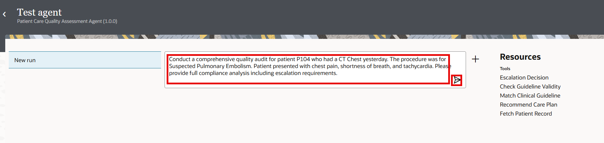

# Test AI Agent in OIC

## Introduction

In this final section, you'll execute your **Patient Care Quality Assessment Agent** with real utilization review cases and validate the complete end-to-end workflow.

This is where all your prior work comes together:

- Your five healthcare integrations become active
- Your agentic AI tools are invoked intelligently
- Your thinking pattern guides clinical reasoning
- Your LLM powers autonomous decision-making
- Your agent generates comprehensive audit reports

You'll see firsthand how the OIC AI agent reasons about clinical cases, decides which tools to invoke in what sequence, and produces actionable quality audit recommendations.

Estimated Time: 15 minutes

### Objectives

In this lab you will learn:

- How to Test OIC AI Agent

### Prerequisites

* All the previous labs completed successfully.
* Agent in Activated Status

## Task 1: Configure the Agentic AI Thinking Pattern

1.  In the left navigation pane, select **Projects**.

2.  Select the **Patient Care Utilizaton Review** project that you created.

3.  In the left navigation pane, select **AI Agents** icon.

4.  Run the agent
    a.  In the Agents card, find the AI agent to run: **Patient Care Quality Assessment Agent**
    b.  Click **Actions icon**, and select *Run*.

5.  Test the agent.
    a.  In the Test Agent page, enter a natural language prompt to test the AI agent. Enter the below User prompt.

    ```
    <copy>
      Conduct a comprehensive quality audit for patient P104 who had a CT Chest yesterday. The procedure was for Suspected Pulmonary Embolism. Patient presented with chest pain, shortness of breath, and tachycardia. Please provide full compliance analysis including escalation requirements.
    </copy>
    ```

    

    The progress bar displays and then you see agent actions.

    b.  Look at the agent actions.
        - System: indicates what you sent to the LLM in the system prompt. This includes the agent role, the agent guidelines, the AI agent pattern guidelines.
        - User: user indicates what you entered to send to the LLM.
        - Tool: shows response from the tool. You should see the audit report and quality assurance done for a specific Patient
        - Assistant: shows the agent reasoning. You should see in the reasoning that the agent needs to use the various tools. It waits for the return from the tool and concludes that the expense is approved.


Congratulations!

You have successfully completed the entire Patient Utilization Review AI Agent Live Lab!

What You've Accomplished
✅ Understood agentic AI concepts and use case
✅ Imported project and configured healthcare connections
✅ Registered five healthcare integrations as agentic AI tools
✅ Enabled MCP to expose tools to external frameworks
✅ Discovered tools from external MCP clients (such as Postman and Langflow)
✅ Built intelligent Clinical Quality Assurance AI Agent
✅ Executed and validated agent with comprehensive test cases

## Learn More

* [Using Agentic AI](https://docs.oracle.com/en/cloud/paas/application-integration/aiagents/welcome-agentic-ai.html)

## Acknowledgements
* **Author** - Kishore Katta, Director Product Management - Oracle Integration
* **Last Updated By/Date** - Kishore Katta - Nov 2025
