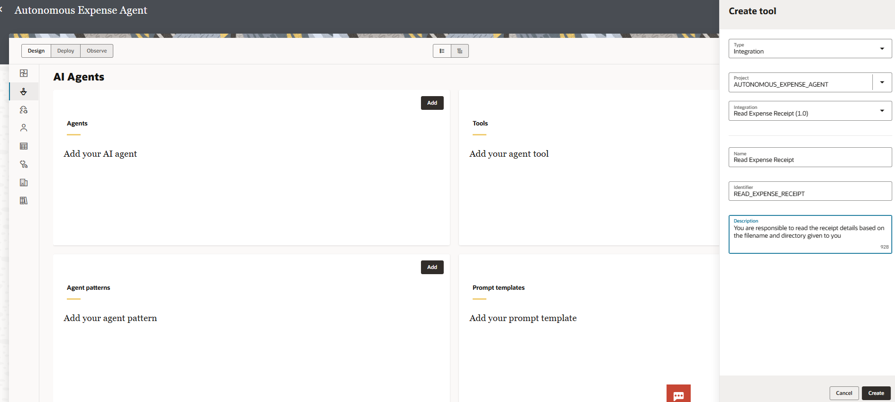
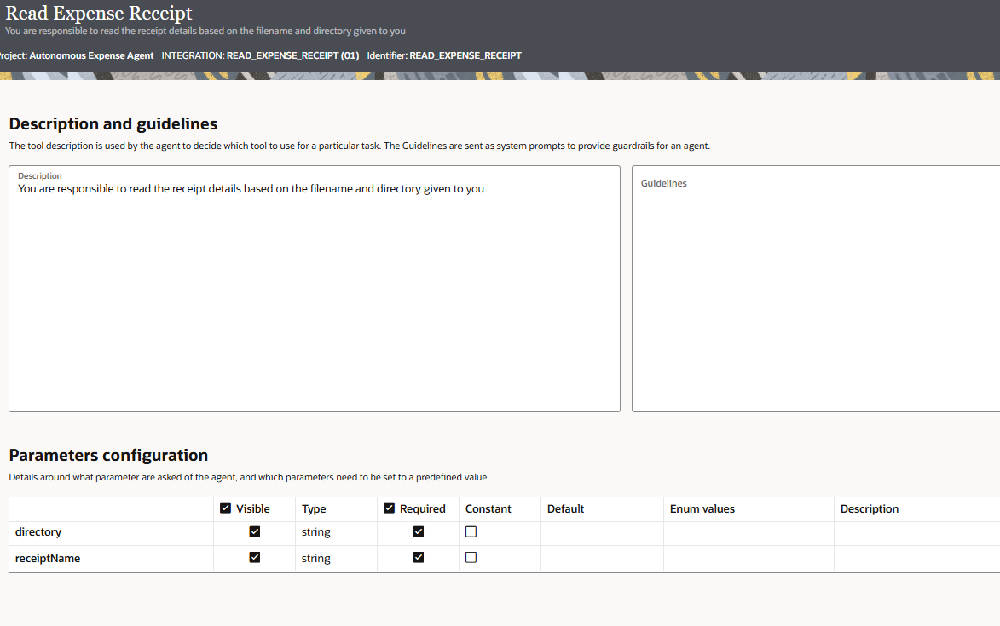

# Register an Integration as an Agentic AI Tool

## Introduction

Now that you have successfully imported the project and configured all necessary connections and integrations in the previous Section, you are ready to register each integration as an agentic AI tool.
When an integration is registered as an agentic AI tool, it becomes available for your AI agent to invoke intelligently. Each tool must have clear descriptions and parameter guidelines so that the Large Language Model (LLM) can understand when and how to use it.

Estimated Time: 15 minutes

### Objectives

In this lab, you will:

1. Register all the four integrations as agentic AI tools from the AI Agents page
2. Configure tool descriptions, identifiers, and parameter guidelines for each tool
3. Verify that all tools are properly configured and ready for agent use

### Prerequisites and Tool Overview

This lab assumes you have:

- Completed all the previous labs

**Integration Requirements Met**

All the integrations have been pre-configured and meet the Agentic AI tool requirements:

| Requirement | Status | Notes |
|-------------|--------|-------|
| Part of a project | ✓ | Imported in Previous Section |
| Integration is Active | ✓ | Activated in Previous Section |
| First connection is REST trigger with REST Adapter | ✓ | Configured in Previous Section |
| REST trigger configured with OAuth Auth, JSON payload, POST verb | ✓ | Configured in Previous Section |
{: title="Integrations Requirement"}

## Task 1: Access AI Agents and Tools Section

1. In the OIC navigation pane, click **Projects**

2. Select the **Autonomous Expense Agent** project

3. In the left navigation pane, click **AI Agents**

4. On the AI Agents page, locate the **Tools** card section

## Task 2: Register *Read Expense Receipt* as an Agentic AI Tool

### Step 1: Create New Tool from Tools Card

1. On the AI Agents page, in the **Tools** section, click **Add** or **+**
2. Create tool dialog appears

### Step 2: Enter Tool Information

In the Create Tool dialog , fill in the following fields as shown in the table:

| Field | Value | Notes |
|-------|-------|-------|
| **Type** | Integration |  |
| **Project** | Autonomous Expense Agent |  |
| **Integration** | Read Expense Receipt |  |
| **Name** | Read Expense Receipt | Auto-populated from integration name |
| **Identifier** | Auto-populated | Sent to LLM; uniquely identifies the tool |
| **Description** | You are responsible to read the receipt details based on the filename and directory given to you. | Clear, concise description of what the tool does |
{: title="Read Expense Receipt Tool Properties"}

Click on **Create**

### Step 3: Configure Parameters

In the **Parameters configuration** section:

| Parameter | Visible | Required | Description |
|-----------|---------|----------|-------------|
| directory | ✓ | ✓ | The directory name where you copy your expense images |
| receiptName | ✓ | ✓ | Name of the image file |
{: title="Read Expense Receipt Parameter Configuration"}

### Step 4: Configure Guidelines (Optional)

- Ideally we need to add any specific guidelines or constraints for LLM use (as applicable). For now, shall leave it blank.

### Step 5: Save Tool

1. Click **Save** to register the tool
2. Navigate back to the AI Agents page.

## Task 3: Register *Approval Required* as an Agentic AI Tool

### Step 1: Create New Tool from Tools Card

1. On the AI Agents page, in the **Tools** section, click **Add** or **+**
2. Create tool dialog appears

### Step 2: Enter Tool Information

In the Create Tool dialog , fill in the following fields as shown in the table:

| Field | Value | Notes |
|-------|-------|-------|
| **Type** | Integration |  |
| **Project** | Autonomous Expense Agent |  |
| **Integration** | Approval Required |  |
| **Name** | Approval Required | Auto-populated from integration name |
| **Identifier** | Auto-populated | Sent to LLM; uniquely identifies the tool |
| **Description** | You are responsible to check if approval required or not from the provided receipt details. | Clear, concise description of what the tool does |
{: title="Approval Required Tool Properties"}

Click on **Create**

### Step 3: Configure Parameters

In the **Parameters configuration** section, keep default values.

### Step 4: Configure Guidelines (Optional)

- Ideally we need to add any specific guidelines or constraints for LLM use (as applicable). For now, shall leave it blank.

### Step 5: Save Tool

1. Click **Save** to register the tool
2. Navigate back to the AI Agents page.

## Task 4: Register *HITL-Raise Approval Request* as an Agentic AI Tool

### Step 1: Create New Tool from Tools Card

1. On the AI Agents page, in the **Tools** section, click **Add** or **+**
2. Create tool dialog appears

### Step 2: Enter Tool Information

In the Create Tool dialog , fill in the following fields as shown in the table:

| Field | Value | Notes |
|-------|-------|-------|
| **Type** | Integration |  |
| **Project** | Autonomous Expense Agent |  |
| **Integration** | HITL-Raise Approval Request |  |
| **Name** | HITL-Raise Approval Request | Auto-populated from integration name |
| **Identifier** | Auto-populated | Sent to LLM; uniquely identifies the tool |
| **Description** |You are responsible to raise HITL workflow for expense approval. | Clear, concise description of what the tool does |
{: title="HITL-Raise Approval Request Tool Properties"}

Click on **Create**

### Step 3: Configure Parameters

In the **Parameters configuration** section, keep default values.

### Step 4: Configure Guidelines (Optional)

- Ideally we need to add any specific guidelines or constraints for LLM use (as applicable). For now, shall leave it blank.

### Step 5: Save Tool

1. Click **Save** to register the tool
2. Navigate back to the AI Agents page.

## Task 5: Register *Create Expense Oracle HCM* as an Agentic AI Tool

### Step 1: Create New Tool from Tools Card

1. On the AI Agents page, in the **Tools** section, click **Add** or **+**
2. Create tool dialog appears

### Step 2: Enter Tool Information

In the Create Tool dialog , fill in the following fields as shown in the table:

| Field | Value | Notes |
|-------|-------|-------|
| **Type** | Integration |  |
| **Project** | Autonomous Expense Agent |  |
| **Integration** | Create Expense Oracle HCM |  |
| **Name** | Create Expense Oracle HCM | Auto-populated from integration name |
| **Identifier** | Auto-populated | Sent to LLM; uniquely identifies the tool |
| **Description** | You are required to create Expense in Oracle based on the data passed. | Clear, concise description of what the tool does |
{: title="Create Expense Oracle HCM Tool Properties"}

Click on **Create**

### Step 3: Configure Parameters

In the **Parameters configuration** section, keep default values.

### Step 4: Configure Guidelines (Optional)

- Ideally we need to add any specific guidelines or constraints for LLM use (as applicable). For now, shall leave it blank.

### Step 5: Save Tool

1. Click **Save** to register the tool
2. Navigate back to the AI Agents page.

## Task 7: Verify All Tools are Registered

1. Navigate to **AI Agents** page in the project
2. Verify all five tools appear in the **Tools** section:
   - ✓ Read Expense Receipt
   - ✓ Approval Required
   - ✓ HITL — Raise Approval Request
   - ✓ Create Expense Oracle HCM

You may now **proceed to the next lab**.

## Learn More

- [Register Integration as Tools](https://docs.oracle.com/en/cloud/paas/application-integration/aiagents/register-integration-agentic-ai-tool1.html)

## Acknowledgements

- **Author** - Subhani Italapuram, Technical Director, Partner Enablement, Oracle Integration
- **Last Updated By/Date** - Subhani Italapuram, Feb 2026
