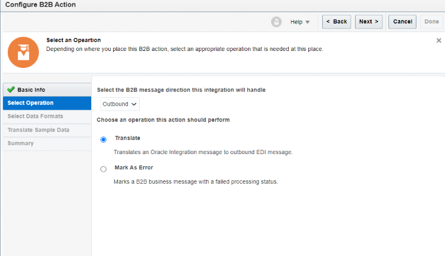

# Understand B2B Integration Action

## Introduction

This lab walks you through the concepts of the B2B Integration Action and its usage in B2B Inbound and Outbound Message Processing.

Estimated Time: 10 minutes

### Objectives

In this lab, you will:

* Understand the B2B Integration Action.
* Usage of B2B Integration Action in Inbound and Outbound message processing.

### Prerequisites

This lab assumes you have:

* All previous labs successfully completed.
* Completed [B2B Concepts](../workshops/tenancy/?lab=gettingStartedB2B) Lab which explains B2B concepts at a high level.

## Task	1: B2B Integration Action Trading Partner Mode

- The function of the B2B Integration Action is to work with schemas that adhere to B2B standards like X12. The B2B Integration Action works for both Inbound and Outbound messages. The B2B Integration Action supports a Standalone mode and a B2B Trading Partner mode. This section describes the operations of the B2B Trading Partner mode.

  The B2B Integration Action can be added to an Integration flow from the Integration canvas Actions tab.

  

  The operations available in the B2B Integration Action depend on whether you are processing and Inbound or Outbound message. When using the automatically generated Transport Integrations, you will only need to use some of these operations (**highlighted** below). The other operations are used by the automatically generated Transport Integrations or if you want to created your own custom Transport Integrations.

- Inbound

  For an Inbound message scenario, the Backend Integration would receive an EDI payload (X12 or EDIFACT type documents) which would already have gone through a Translate operation in the Transport Integration. From here the Backend Integration would use the Fetch Message operation create a B2B canonical XML format which can then be mapped to the backend application format like ERP Cloud, NetSuite, etc.
  

  Below are the operations supported in Inbound scenario.
  

  | Operation         | Used By                                | Purpose |
  |------------------ |----------------------------------------| ------- |
  | **Fetch Message** | Inbound backend integration            | This operation retrieves an already processed B2B business message from the Oracle Integration persistence store. It outputs the B2B canonical XML format for a business message, given b2b-message-reference as input. The canonical XML format is represented by the edi-xml-document element. It is accessible inside an inbound backend integration. You use the mapper to transform it into a backend application format. You must select a specific B2B document during design time when you configure this operation. At runtime, it only retrieves a compatible document. If this operation is given a b2b-message-reference for a different B2B document, an error occurs (for example, if the fetch message is configured for a purchase order and at runtime it was asked to retrieve an invoice). |
  | Translate        | B2B integration for receiving messages  | The B2B integration for receiving messages uses this operation for parsing and debatching an inbound EDI message into B2B canonical XML format, represented by the edi-xml-document element. One inbound EDI message may produce multiple B2B business messages (each one having a separate canonical XML document). The action outputs a collection of repeating b2b-message-reference elements, each containing an internal message ID of one business message. The canonical XML format is accessible inside the integration with the fetch message operation. |
  | **Mark As Error** | Inbound backend integration            | This operation provides for more robust error handling, in case of failures. This operation updates a B2B business message and reflects the failure to process this message by the backend integration, if an error occurs. |

- Outbound

  In the Outbound message scenario, once the application format messages are mapped over to a EDI XML format, the EDI translate actually creates the X12 or EDIFACT or other payloads (example X12). Those transactions can then be transmitted and sent to your trading partners. The essential function for B2B function is to produce schemas that adhere to B2B standards like X12.
  

  Below are the operations supported in Outbound scenario.
  

  | Operation     | Used By | Purpose  |
  | ------------- | ------- | -------- |
  | **Translate** | Outbound backend integration | You must use this action directly within your outbound backend integrations. An outbound backend integration uses this operation to translate from a B2B canonical XML format to an EDI format. The EDI format cannot be accessed inside the integration directly. Instead, an internal message ID is assigned that is returned in the element b2b-message-reference. You can view or download the EDI-formatted payload from Monitoring > B2B Tracking > Business Message or by using the [B2B Monitoring REST APIs.](https://docs.oracle.com/en/cloud/paas/integration-cloud/rest-api/api-b2b-monitoring.html) |
  | Mark As Error | B2B integrations for sending messages | This operation provides for more robust error handling, in case of failures. This operation updates a B2B wire message and reflects the failure to process this message by the B2B integration for sending messages. For example, for the FTP sending messages integration, if the file write operation fails, this operation updates the wire message as failed. There is also a similar error condition that can occur while sending back a functional acknowledgment in the B2B integration for receiving. |

You may now **proceed to the next lab**.

## Learn More

* [Use B2B Action](https://docs.oracle.com/en/cloud/paas/application-integration/integration-b2b/introduction-b2b-oracle-integration.html#GUID-11EFFD48-3E63-4C60-8771-DE789FF90909)

## Acknowledgements

* **Author** - Kishore Katta, Technical Director, Oracle Integration Product Management
* **Contributors** -  Subhani Italapuram, Technical Director, Oracle Integration Product Management
* **Last Updated By/Date** - Oracle Integration team, December 2021
