# A B2B Inbound Scenario

## Introduction

Trading Partner (Dell Inc) sends an 810 Invoice EDI document to Host ACME. ACME Corp had configured Oracle Integration B2B message exchange agreement to receive Invoice EDI document and process the EDI document to create Receivables Invoice in ex: ERP/Netsuite Application. In this lab we will log the invoice details to simplify the usecase.

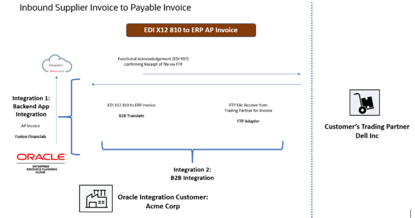

|      Step     |      Description |
|---------------|-------------------|
|     1         |     Your (ACME Corp) backend   application has a requirement to receive a business transaction (810 Invoice)   from an external trading partner (Dell Inc). A scheduled integration- B2B   Receive polls for a configured file pattern of Invoice document. A B2B action   translates an Inbound Invoice EDI Message to Oracle Integration Message. If   it is a valid Business Message invokes a Backend Integration which is   configured in the Trading Partner Inbound Agreement    |
|     2         |     You will design an ACME Corp   backend application which receives a business transaction (810 Invoice) from   an external trading partner (Dell Inc). Triggers your Inbound backend integration   with a defined REST interface.|
|     3         |     Your backend integration instance   receives the Invoice 810 EDI message. Using a B2B Translation activity, the Invoice   810 EDI (X12 or EDIFACT) message is translated into a B2B canonical XML   format. |
|     4         |     Further, down the line integration processes   the invoices for ex: maybe you want to create a payables invoice in the   ERP/Netsuite for the Purchase Order raised. In this exercise you will create   a log activity to capture some important fields from the translated EDI   Invoice message.|

Estimated Time: 60 minutes

### Objectives

In this lab, you will:

* Create B2B Document based on X12 standard to process Inbound Invoice
* Configure Trading Partner transport agreement for Inbound Processing
* Create Backend Integration to translate Inbound Invoice document
* Import an Integration to simulate Supplier Invoice
* Monitor the B2B Messages at runtime

### Prerequisites
> **Note** : 1. This Lab assumes you have completed all the previous labs. Importantly, [Lab5:B2B Schemas and Documents](../workshops/tenancy/?lab=b2b-documents-schemas) & [Lab6: B2B Trading Partner Manager](../workshops/tenancy/?lab=b2b-trading-partner-manager)
2.[Download Lab Artifacts](https://objectstorage.us-phoenix-1.oraclecloud.com/p/BoaluNGQEwbsB8_mv5JWSB5TI4FSMwRCkfyNdDwC8KXKgqYGmcHVSUIUS3E0dB-9/n/oicpm/b/oiclivelabs/o/oic3/b2b/b2b-getting-started.zip) if, not done in previous sections

### *Create B2B Document*

1. Navigate to **Home > B2B > Documents**. ***Create*** a **B2B Document** and name it as **Invoice Document 810 4030** and select ***Document Standard*** as **X12**, ***Document Version*** as **4030** and ***Document Type*** as **810 (Invoice)** and click on ***Create***. Select ***Document Schema*** as **Standard** and click on ***Save***


### *Verify Host Profile*

| Identifier Type | Value |
| --- | --- |
| EDI Interchange ID  |ACMEOICB2B|
| EDI Interchange ID Qualifier |ZZ|
| EDI Group ID |Acme|

### *Verify Trading Partner Configuration (Dell Inc)*

1. If the Trading Partner (Dell Inc) is already created in the Trading Partner Manager Lab. Navigate to **Trading Partners**. ***Edit*** **Dell Inc**. Verify if the B2B Identifiers is configured per below

| Identifier Type | Value |
| --- | --- |
| EDI Interchange ID | Dell Inc.  |
|EDI Interchange ID Qualifier | ZZ|
|EDI Group ID | Dell Inc.|
|EDI Group ID Qualifier | 01|
|Application Partner ID | Dell Inc.|

### *Configure Transport & Inbound Agreements*

1.Click ***Transports & Agreements*** tab. In the Transports section, edit the **FTP** Transport and Configure per below and **Save**.

|     Name                                    |     FTP                                 |
|---------------------------------------------|-----------------------------------------|
|     Type                                    |     FTP                                 |
|     Trading   partner's connection          |     FTP Connection (File Server)    |
|     Input   Directory                       |     **/B2BTPDELLIn**           |
|     Input File                              |     Invoice-%SEQ%.edi            |
|     Output   Directory                      |     **/B2BTPDELLOut**         |
|     Output   File Name                      |     Out997-%SEQ%.edi             |

2.Select ***Action Menu*** and ***Redeploy*** if already Deployed

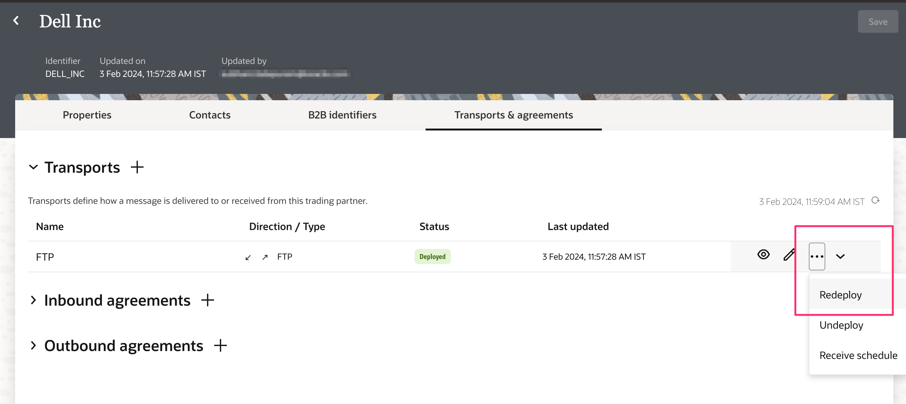

**Check Point:** Go to the Integrations page and note that both integrations are activated

3.In the **Inbound Agreements** section, click ***+*** to add a new Inbound Agreement. Enter the details per the below and click on ***Add***.

| Field Name                   | Value                                                  |
|------------------------------|--------------------------------------------------------|
| Name                         | InAgreement                                            |
| Select a Document            | Invoice Document 810 4030                              |
| Select a Backend Integration | <We Will configure this later. Leave blank for now>    |
| Configure Agreement Settings | Select **Enable Validations and Generate functional acknowledgement** |

The backend integration is yet to be defined. So, we will deploy the Inbound Agreement after creating the Backend Integration Flow

### *Design Backend Integration*

## Task 1: Create an Integration

Let's create a basic, Inbound backend integration flow that receives an XML document through a REST request, converts  EDI X12 format to B2B XML Canonical Message, and logs a few elements in the Invoice EDI document.

1. In the **Navigation pane**, click ***Integrations***
2. On the **Integrations page**, click ***Create***
3. Select **Application** as the style to use.

    enter the Name of the integration per the value given below and then click on ***Create***

    ```
    <copy>Process Inbound Vendor Invoices</copy>
    ```

4. Click on **Save** and Change Layout to **Horizontal**

## Task 2: Configure the REST Adapter Trigger Connection

On the integration canvas, click the ***start node*** and select ***REST Interface*** as the trigger connection.
The Adapter Endpoint Configuration Wizard opens

1. On the **Basic Info** page,
     * for the **What do you want to call your endpoint?** element, enter ***Receive-Vendor-Invoice-Msg***
     * Click ***Continue***.
2. From the **Resource Configuration** page,
    * for the **What is the endpoint's relative resource URI?**, enter ***/***
    * for the **What action do you want to perform on the endpoint?**, enter ***POST***
    * Select ***Configure a request payload for this endpoint*** checkbox
    * Click ***Continue***
    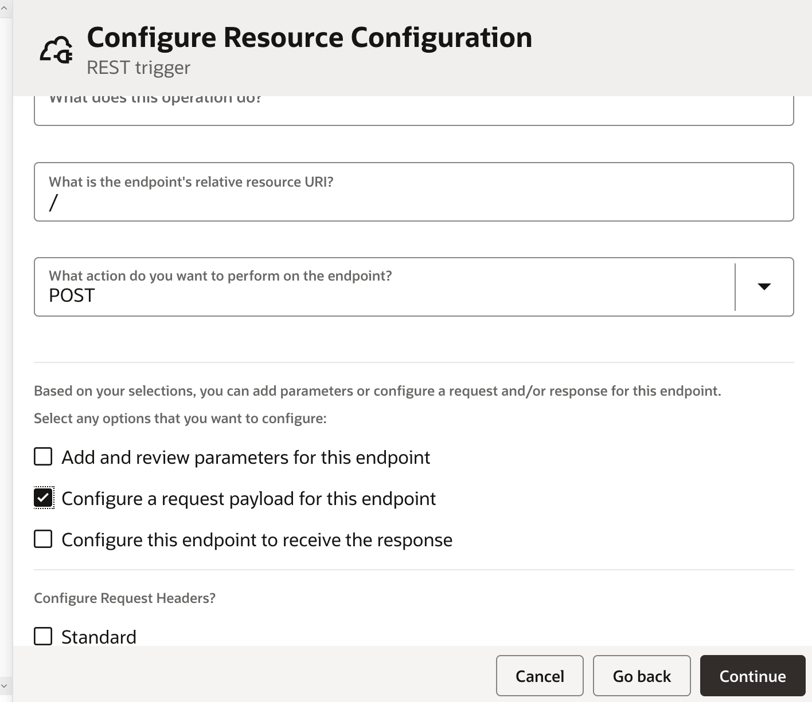
3. From the **Request Parameters** page.
    * Select ***JSON Sample*** in the **Select the request payload** format field and provide the below json sample selecting **inline**, click ***Continue***, click ***Finish*** to complete the REST Adapter configuration and finally, Click ***Save*** to persist changes.

    ```
    <copy>
      {
       "type" : "PO",
       "id" : "12345",
       "direction" : "INBOUND",
       "trading-partner" : "Acme",
       "document-definition" : "PO_850",
       "connectivity-properties-code" : "BACKENDINTG",
       "connectivity-properties-version" : "01.00.0000",
       "message" : [ {
         "b2b-message-reference" : "0AC400D117503A8246000000347849EB"
       }, {
         "b2b-message-reference" : "0AC400D117503A8246000000347849EA"
       } ]
     }
   </copy>
   ```

## Task 3: Configure For-Each Action

1. Add ***For Each*** Action. Enter the details given below in the configure screen
2. Click on ***Main canvas*** and Click ***Save*** to persist changes.

   |     Field Name                    |    Value            |
   |-----------------------------|---------------------------------------------|
   |     Name                    |     Each-B2B-Doc                                                                         |
   |     Repeating Element       |     Drag and drop ‘message’ repeating element from the path execute   > request-wrapper    |
   |     Current Element Name    |     B2B-Doc-Message |

   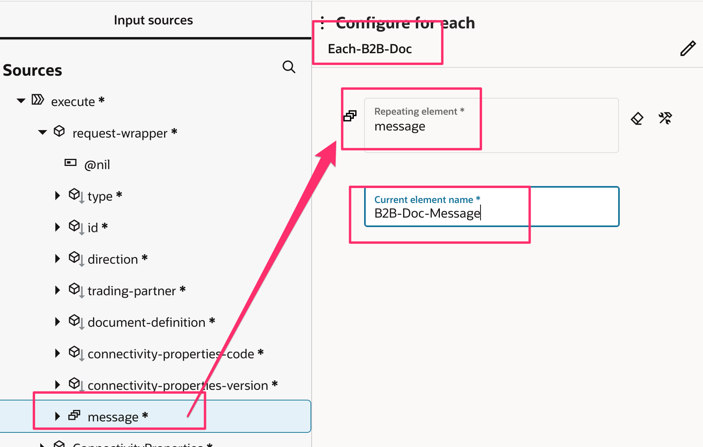

## Task 4: Configure Current Message as Tracking Variable

1. Add an ***Assign*** activity within the **For Each** and name it as **Assign-Current-Msg**
2. Select the ***+*** action and configure **tracking\_var\_2** (select the variable from the drop-down list)
3. In the **Value** field and drag and drop **b2b-message-reference** from **B2B-Doc-Message > message**.
4. Click on ***Main canvas*** and Click ***Save*** to persist changes.
    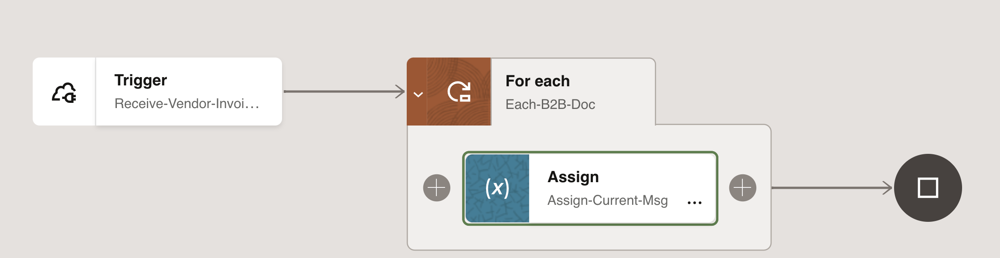

## Task 5: Configure the B2B Translate Action

1. On the right side of the canvas, click ***Actions***  , drag & drop ***B2B*** action on the designer after the **Assign-Current-Msg** element.
The **Configure B2B Action** wizard opens
2. On the **Basic Info** page
    * for the **What do you want to call this B2B action?** element, enter ***Fetch-Message***
    * select a mode as ***B2B Trading Partner mode***, and click ***Continue***.
    * Select ***Select the B2B message direction this integration will handle*** as **Inbound** and choose the Operation ***FetchMessage*** and click **Continue**
    * Select ***Document Definition*** as **Invoice Document 810 4030** (You must have created this as part of B2B activities) and click on ***Continue***
    * Review the ***Summary page***, click on ***Finish*** to complete the configuration.
    * Click ***Save*** to persist changes.

## Task 6: Configure Mapping Actions

1. Configure data mappings for the **Fetch-Message** action and **B2B-Doc-Message** element to pass B2B EDI message.
    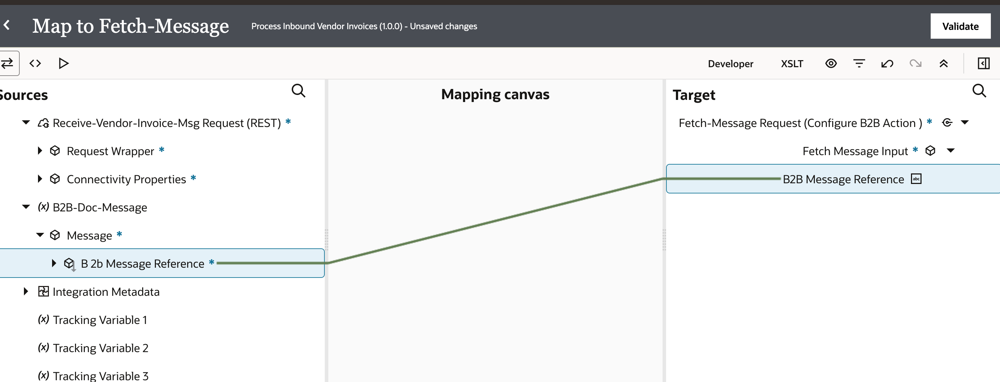
2. Click ***Validate*** and Click ***&lt; (Go back)***
4. Click ***Save*** to persist changes.

## Task 7: Configure Log Activity to print Invoice Details from EDI Message

**Knowledge Point**: The Fetch-Message Response (B2B Action) provides you with a B2B canonical XML from which to map. Its edi-xml-document is the key element that contains the canonical form of the inbound EDI document.

1. Drag and drop a ***Logger*** activity after **B2B Fetch-Message** and name the Action as **Log-Invoice-Message**
2. Select Log option as **When tracing level is set to Audit**
3. Select the ***Pencil*** to open the Expression Builder to log 3 fields namely, Invoice Number, Purchase Order Number and Invoice Amount.
4. Drag and drop a **concat** function from String functions category
5. Construct the concat message as below:
    * concat( "Received an Invoice:", BIG02, ", for the Purchase Order: ", BIG04, ". The invoice amount is: ", integer( TDS01) div 100.0, "")
    > Note: It is easy to search for any field element by selecting the Source Message elements. Search for BIG02,BIG04,TDS01 from $Fetch-Message Element and formulate the above concat expression.

    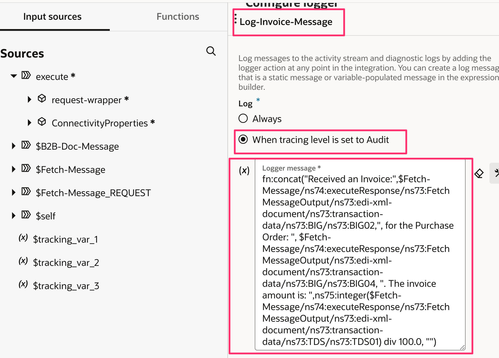

6. Click on ***Main canvas*** and Click ***Save*** to persist changes.
7. Final integration flow should look like the below diagram.
    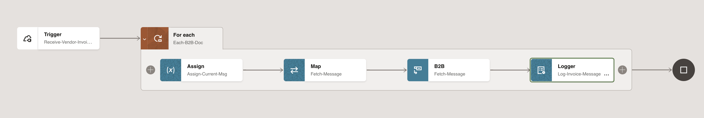

## Task 8: Add Tracking Identifiers for Integration Tracking

* Add **trading partner** as one of the tracking field from the execute > Request-Wrapper

## Task 9: Activate the Integration

1. On the **Integrations** page, click on the ***Activate*** icon of **PO Backend** Integration.
2. On the **Activate Integration** dialog, select **a tracing level** to ***Audit***
3. Click ***Activate***.

## Task 10: Go to B2B, Trading Partners and Deploy Inbound Agreement

1. Navigate to **Trading Partner (Dell Inc)**. Select ***Transport and Agreements*** tab. Edit ***Inbound Agreement*** and select the Backend Integration **Process Inbound Vendor Invoices**.  (Alternatively You can copy the identifier and version which you can find from the respective Integration details.  After pasting the Identifier and the version should look like. PROCESS\_INBOUND\_VENDOR\_INVOICES|01.00.0000)

   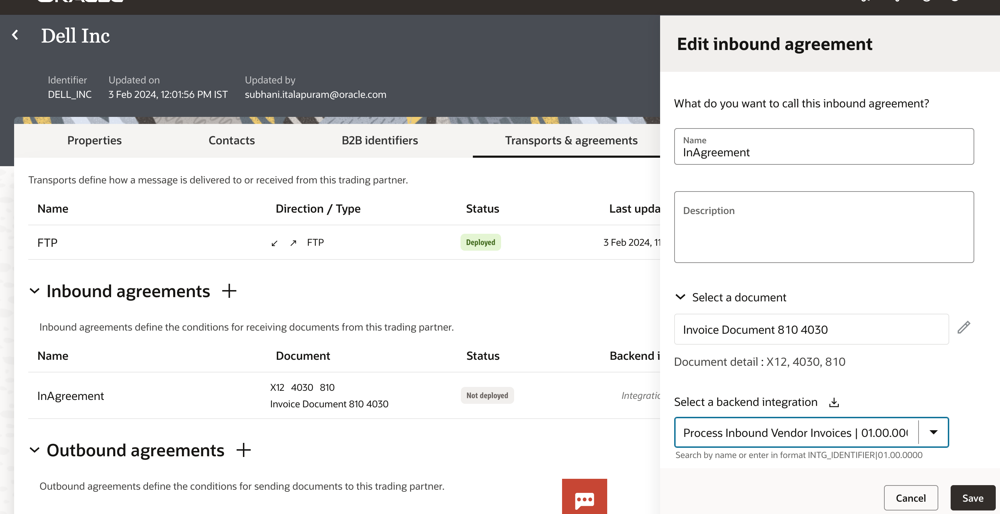

2. From the **Action** Menu, deploy the **Inbound Agreement**

> Note: Deploy Transport and Transport agreements. You can deploy in any sequence and if you modify anything, you can just deploy the corresponding section. For example, if you modify outbound transport agreement then you can deploy (or redeploy) only outbound transport agreement

## Task 11: Import and Activate the Supplier (Dell Inc) Integration

We will Import and Activate an Integration Flow which Simulates a Supplier (Dell Inc) Trading Partner to send an Invoice (810) document to a defined FTP location so that host (Acme Corp) can process the Inbound Invoice document. This integration accepts an Invoice XML and pushes and 810 Invoice EDI message into a specific directory provided in the xml payload. In a real world scenario typically an ERP application (ex. ERP Cloud or NetSuite) generates the Receivables Invoice and sends the Invoice document to Acme Corp

1. From the Lab Artifacts **b2b-getting-started\b2b-inbound-x12-ftp** folder, Import the **OUTBOUND\_XTP_DELL\_INC\_01.00.0001.iar** (Dell Inc Simulator Integration) and ***Activate*** the Integration with Tracing Enabled.

## Task 12: Testing the B2B Inbound Integration Scenario

1. Navigate to **Integrations** page. Select the **OutboundEDI-XTP-Dell-Inc** integration flow. Select ***Run*** and click on ***Test*** which will open an Integration Test Console

    * Let's use Oracle Integration Test Console to simulate a 810 Invoice EDI message from **Dell Inc** Supplier.
    * From the Lab Artifacts **b2b-getting-started\b2b-inbound-x12-ftp** folder, Copy the **DellIncInvoice.xml** data and paste it in the body of the request console. Before Selecting Test modify the below elements in the supplied XML payload

    * InvoiceNumber – ex: XX-INV-DE-0299 (where 'XX' is any numeric for uniqueness)
    * XTP\_FTP\_DIR - /B2BTPDELLIn
    * XTP\_FTP\_FILENAME - Invoice-1.edi (Note: The file pattern should be similar to the configuration  in the **Dell Inc** Trading Partner Setup for **FTP** Transport Input File value
    * You should see a response which is base64encoded
        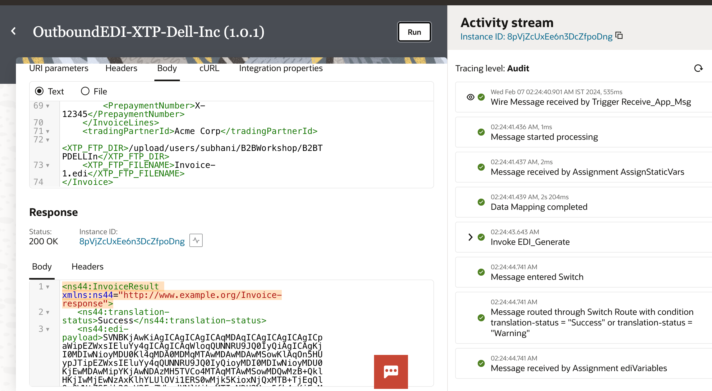
    * Copy paste the base64 encoded data in any online base64 decoder we should see an Invoice EDI message. Here is the representational invoice equivalent to EDI message
        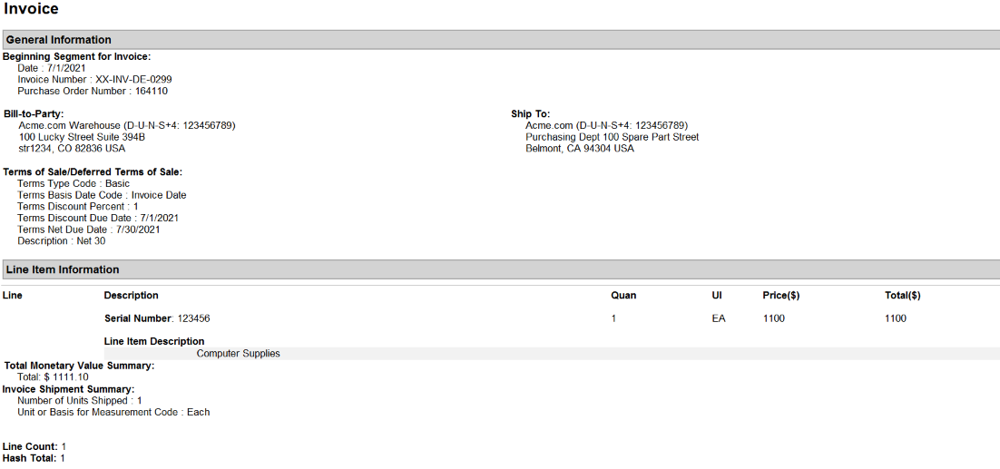
    * Navigate to the  **Settings > File Server > Folders** and check the  **/B2BWorkshop/B2BTPDELLIn** directory. You should see an edi file (Invoice-XX.edi ) generated by the external Trading Partner

2. Navigate to **Integrations** page. Search for the B2B Integration – **Dell FTP Receive** integration flow and Click on ***Run*** and click on ***Run*** again

    * Navigate to the **File server** and check the  /B2BWorkshop/B2BTPDELLIn directory. You should see an edi file is moved to **/B2BTPDELLIn\_backup** renamed as **\_processed**. Indicating that the B2B integration had successfully handed over the edi document to Backend Integration
    * Now, Check the **/B2BTPDELLOut** folder and we should see a 997 Functional Ack generated

    Here is the representational format of Functional Acknowledgement which is generated.

    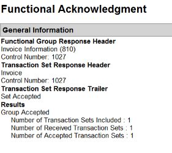

    **Knowledge Point**: A separate Functional Ack will be generated for every Transaction set

3. Navigate to ***Observability*** and ***B2B tracking*** page. You should see 2 Business Messages under the Business Messages Tab for your specific Trading Partner.

    Tip:  Select the **Filter** to search based on Trading Partner Name

    The first message is an Inbound Invoice document received by B2B Integration (Receive Integration) and the second message is a Functional Ack generated by B2B which is based on Trading Partner Inbound Agreement configuration.

    Click on the **View** icon and inspect Message Logs, Payload

    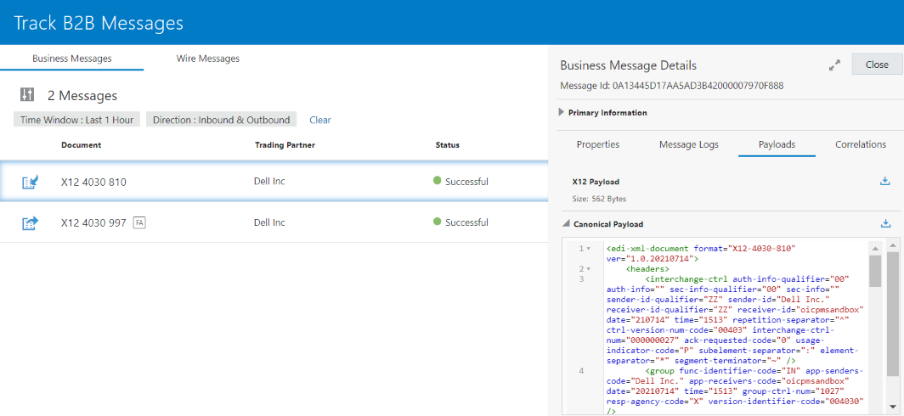

4. Inspect the **Wire Messages**

    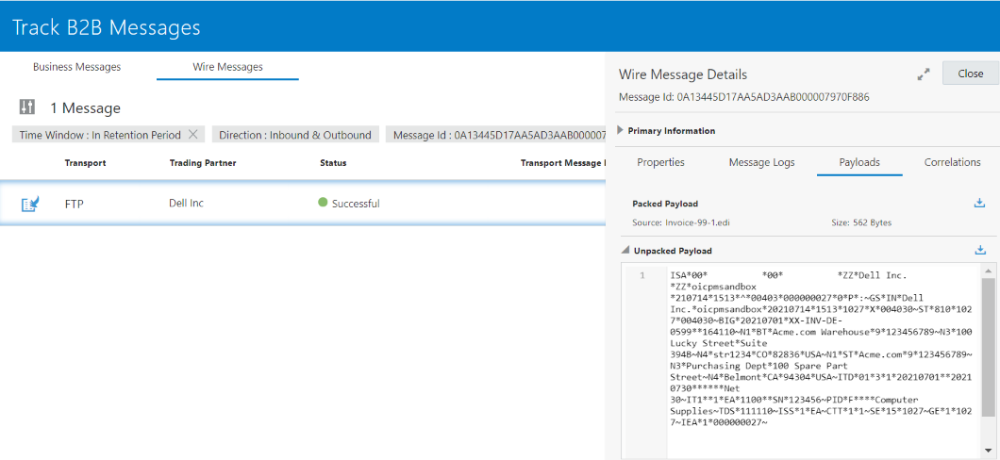

In conclusion, you can use Oracle Integration B2B feature to automatically generate the B2B integration for receiving and the B2B integration for sending. Both integrations are front-end integrations because they directly interface with the external trading partner. These integrations are at the heart of the transport for its runtime functioning which allows the Integration developer to focus on creating the backend Integrations to process the business messages.

## Learn More

* [Develop flows in Oracle Integration 3 B2B](https://docs.oracle.com/en/cloud/paas/application-integration/integration-b2b/introduction-b2b-oracle-integration.html#GUID-11EFFD48-3E63-4C60-8771-DE789FF90909)
* [B2B Tracking](https://docs.oracle.com/en/cloud/paas/application-integration/integration-b2b/overview.html#GUID-5EF1150E-26D3-4273-8149-D3FAF97710E9)

## Acknowledgements

* **Author** - Kishore Katta, Technical Director, Oracle Integration Product Management
* **Contributors** -  Subhani Italapuram, Technical Director, Oracle Integration Product Management
* **Last Updated By/Date** - Mar 2024
