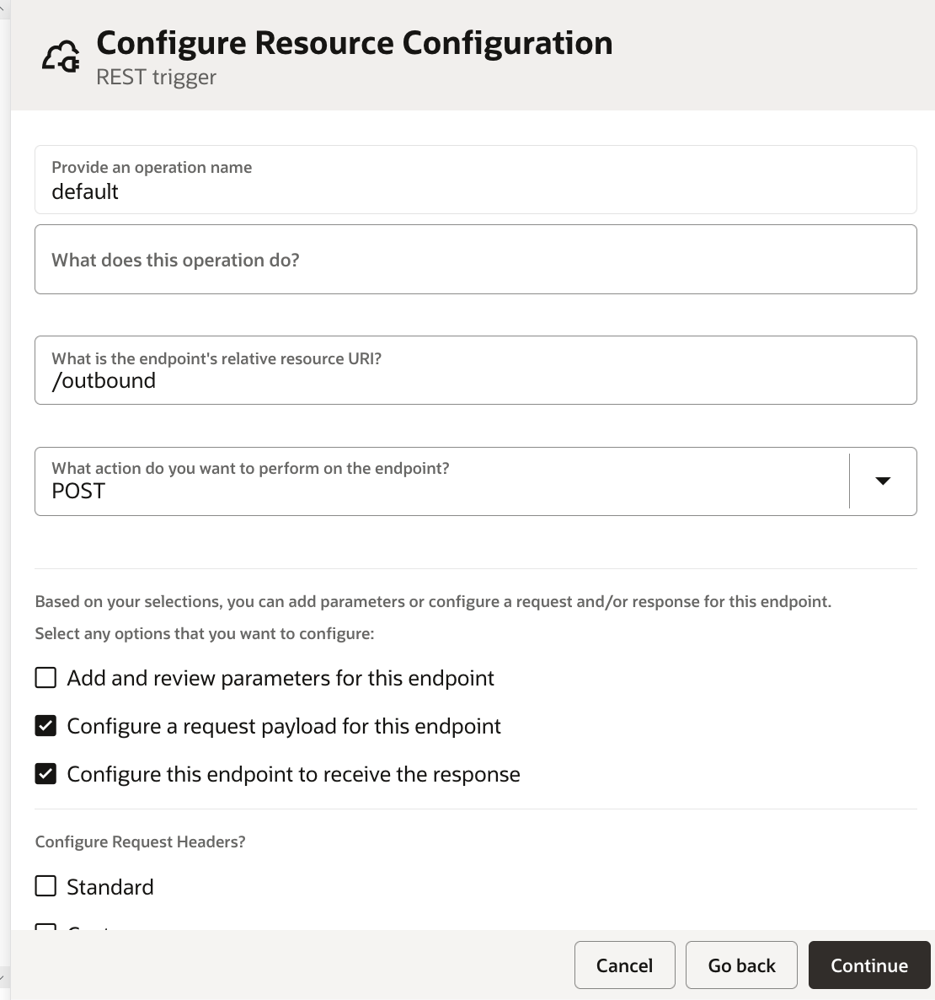
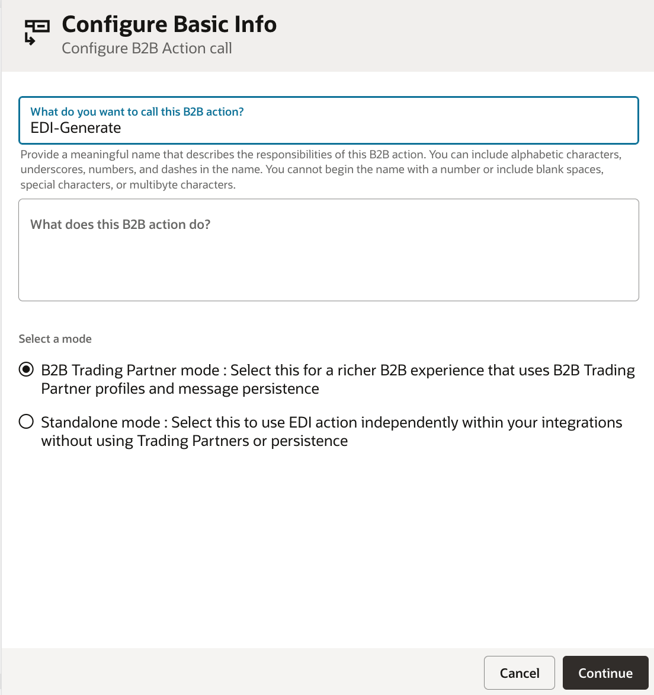
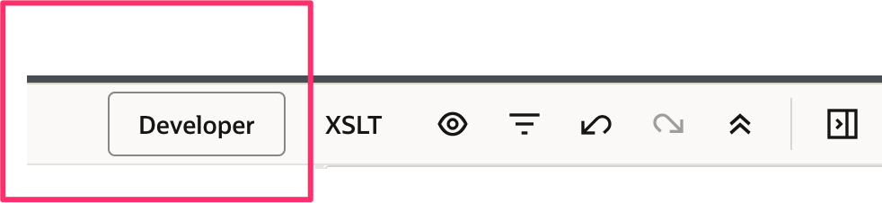
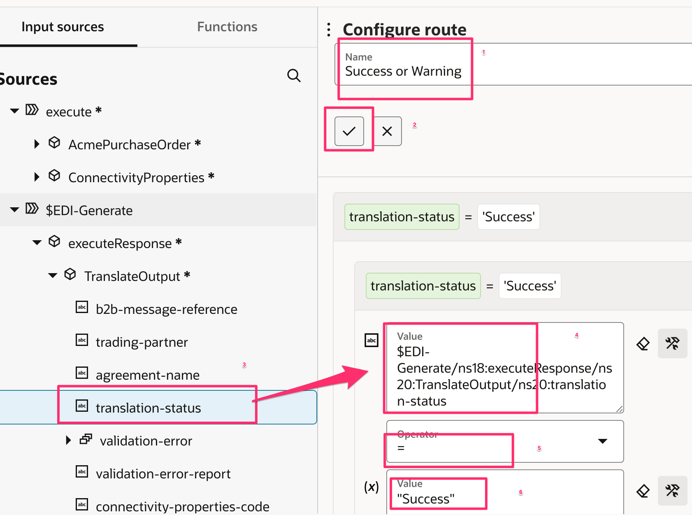
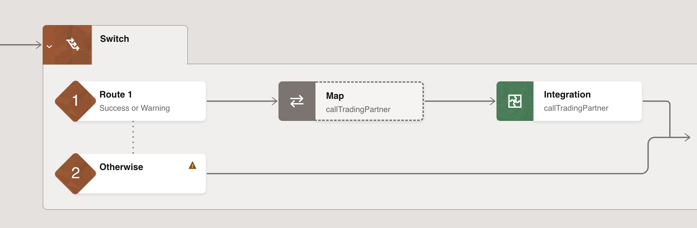
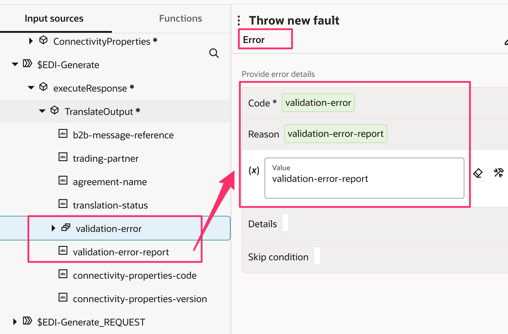
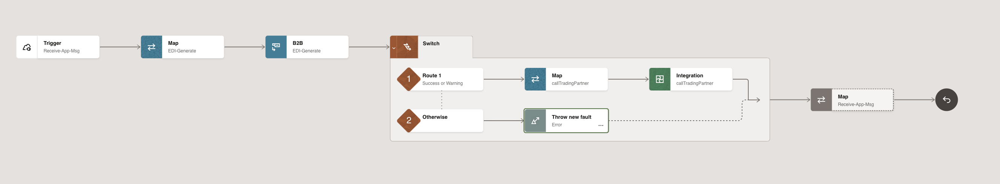
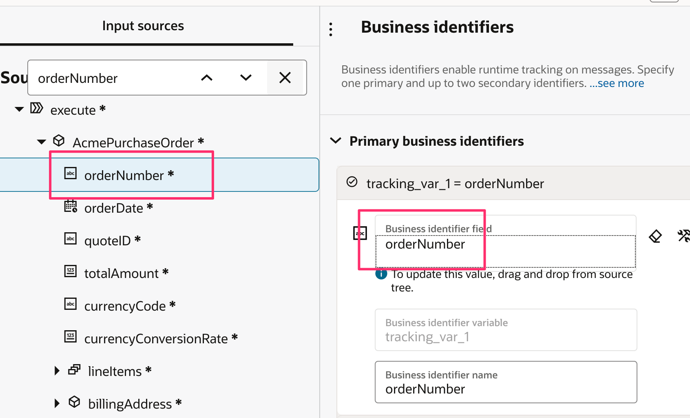
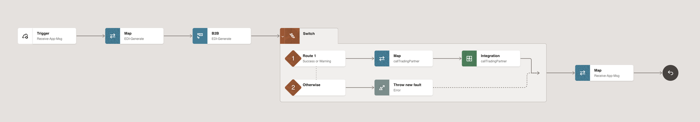

# A B2B Outbound Scenario

## Introduction

ACME Corp sends an 850 Purchase Order EDI document to Trading Partner Dell Inc. ACME Corp had configured OIC B2B message exchange agreement to send Purchase Order EDI document to External Trading Partner.

This integration takes the input as XML from a Rest Client. In a real world use case you would have the XML originating from a Source System like ERP Cloud or NetSuite. A Backend App Integration transforms XML into EDI X12 format using EDI Translate functionality and sends the EDI document to B2B Integration to send across to External Trading Partner (Dell Inc)


High level steps of the Integration:
| Step | Description |
| --- | --- |
| 1 | Your backend application has a requirement to send a business transaction to an external trading partner. It triggers your outbound backend integration by sending it as a notification message.|
| 2 |Your backend integration instance receives the notification that includes the application message in the backend application message format|
| 3 |Using a mapper, the backend application message is transformed into a B2B canonical XML format.|
| 4 |The canonical XML message is provided to a B2B action for outbound translation (the action named EDI-Generate above). A trading partner is specified as an input to the B2B action. The B2B action translates the canonical XML message to a native EDI format (X12 or EDIFACT) and persists it in the Oracle Integration persistence store. A unique ID is assigned to it.|
| 5 |Based on the target trading partner, the current document type, and the outbound agreements defined for the trading partner, an appropriate B2B integration for sending messages is triggered. The message ID is handed to it.|
| 6 |The B2B integration for sending messages instance starts and receives the message ID at its REST Adapter trigger endpoint.|
| 7 |The B2B integration for sending messages instance uses an adapter (AS2 or FTP) to pack the message and then transmit it to the external trading partner through the AS2 or FTP protocol.|

Estimated Time: 60 minutes

### Objectives

In this lab, you will create a basic integration flow to process the EDI document and send it to the Trading partner.
* Create an Application driven Integration flow to receive an XML document
* Configure EDI Translate Action to convert XML to EDI X12 format
* Define relevant mappings to send an Outbound Message
* Monitor Business Messages, Backend Integration and Trading partners.
* Verify Dynamic routing for multiple trading partners
* Verify success and failure paths

### Prerequisites
> **Note** : 1. This Lab assumes you have completed all the previous labs. Importantly, [Lab5:B2B Schemas and Documents](../workshops/tenancy/?lab=b2b-documents-schemas) & [Lab6: B2B Trading Partner Manager](../workshops/tenancy/?lab=b2b-trading-partner-manager)
2.[Download Lab Artifacts](https://objectstorage.us-phoenix-1.oraclecloud.com/p/BoaluNGQEwbsB8_mv5JWSB5TI4FSMwRCkfyNdDwC8KXKgqYGmcHVSUIUS3E0dB-9/n/oicpm/b/oiclivelabs/o/oic3/b2b/b2b-getting-started.zip) if, not done in previous sections

## Task 1: Create an Integration

Let's create a basic, outbound integration flow that receives an XML document through a REST request, converts it to EDI X12 format, and invokes corresponding trading partner.

> **Note**: This integration flow uses REST for simplicity. You can substitute the REST Adapter trigger connection with any other adapter, such as the FTP Adapter, NetSuite Adapter, ERP Cloud Adapter, available in Oracle Integration

1. In the **Navigation pane**, click ***Integrations***

2. On the **Integrations page**, click ***Create***

3. Select **Application** as the style to use.

    enter the Name of the integration per the value given below and then click on ***Create***
    ```
    <copy>PO Backend</copy>
    ```

4. Change Layout to **Horizontal** and Click on **Save**.

## Task 2: Configure the REST Adapter Trigger Connection

On the integration canvas, click the ***start node*** and select ***REST Interface*** as the trigger connection.
The Adapter Endpoint Configuration Wizard opens

1. On the **Basic Info** page,
     * for the **What do you want to call your endpoint?** element, enter ***Receive-App-Msg***
     * Click ***Continue***.
2. From the **Resource Configuration** page,
    * for the **What is the endpoint's relative resource URI?**, enter ***/outbound***
    * for the **What action do you want to perform on the endpoint?**, enter ***POST***
    * Select ***Configure a request payload for this endpoint*** checkbox
    * Select ***Configure this endpoint to receive the response*** checkbox
    * Click ***Continue***
    
3. From the **Request Parameters** page.
    * Select ***XML Schema*** in the **Select the request payload** format field.
    * Click on ***Drag and Drop*** and upload the file **AcmePurchaseOrder.xsd** from the lab artifacts folder **b2b-getting-started\b2b-outbound-x12-ftp** and click on ***Continue***
    
4. On the **Response** Page
    * Select ***XML Schema*** in the response payload format field
    * Click on ***Drag and Drop*** and upload the file **PurchaseOrderResult.xsd** from the lab artifacts folder **b2b-getting-started\b2b-outbound-x12-ftp**
    * Click ***Continue***, and on the Summary page, click ***Finish*** to complete the REST Adapter configuration.
    
    * Click ***Save*** to persist changes.

## Task 3: Configure the EDI Translate Action

Add an EDI translate action to the flow to translate XML document to an EDI document
1. On the right side of the canvas, click ***Actions***  , drag & drop ***B2B*** action on the designer after the first **Receive-App-Msg** element.
The **Configure B2B Action** wizard opens
2. On the **Basic Info** page
    * for the **What do you want to call this B2B action?** element, enter ***EDI-Generate***
    * select a mode as ***B2B Trading Partner mode***, and click **Continue**
    
    * Select ***Select the B2B message direction this integration will handle*** as **Outbound** and click **Continue**
    * Select ***Document Definition*** as **PurchaseOrder4010Document** (You must have created this as part of B2B activities) and click on ***Continue***
    * Review the ***Summary page***, click on ***Finish*** to complete the configuration.
    * Click ***Save*** to persist changes.

## Task 4: Configure Mapping Actions

Configure data mappings for the EDI-Generate action and Receive-App-Msg action in order to successfully parse the incoming XML message and translate it to EDI message.

1. Click the ***Map to EDI-Generate*** action and select ***Edit***
2. Click on ***Developer*** mode
   
3. From Source, expand the ***root element***, expand ***AcmePurchaseOrder*** and From Target, expand the ***root element***, expand ***TranslateInput***, expand ***edi-xml-document***, expand ***transaction-data*** and **map** all the mandatory elements given below.
> **Note**: You can search for the element to find it quickly

| Source | Target |
| --- | --- |
| “00” | BEG01 |
| “NE” | BEG02 |
| Order Number | BEG03 |
| drag and drop format-dateTime function from the Components onto the BEG05 and create a string as given here: xp20:format-dateTime (/nssrcmpr:execute/tns:AcmePurchaseOrder/tns:orderDate, "[Y0001][M01][D01]" )| BEG05 |
|  count (/nssrcmpr:execute/tns:AcmePurchaseOrder/tns:lineItems )  | CTT01 |
| Total Amount | CTT02 |
| “2L” | CUR01 |
| Currency Code | CUR02 |
| Currency Conversion Rate | CUR03 |
| Line Items | Loop-PO1 |
| Line Items > SKU | PO101 |
| Line Items > Quantity | PO102 |
| Line Items > Unit Of Measure | PO103 |
| Line Items > Price | PO104 |
| Trading Partner Id | Application Partner ID (This element is there under Translate Input Node) |

4. Click on ***Validate***
  * A confirmation message appears.
5. Click ***&lt; (Go back)***
6. Click ***Save*** to persist changes.

## Task 5: Switch action after EDI-Generate activity

1. Add a ***Switch*** action after the **EDI-Generate** activity
    * For the **Route 1**, Enter the Expression Name as **Success or Warning** and click on **Apply**
    * Then search for **translation-status** element under *Input sources* (or look at the screenshot given below to find out the element) and drag and drop in the right side as per the screenshot given below and define value as **"Success"**
    * Click on ***Main canvas*** and Click ***Save*** to persist changes.
    

    * In the success route: Add ***Integration*** Action. Enter name as **callTradingPartner** and select **DELL FTP Send** (OR any other outbound B2B integration which you have created) and click on ***Continue***.
    * Select **POST** operation and Click on ***Continue***. Click on ***Finish*** and ***Save*** your integration flow
      
    * Edit **Map callTradingPartner** > Select **Developer mode** and From Source, expand **EDI-Generate Response > executeResponse > Translate Output**
| Source | Target |
| --- | --- |
| B2B Message Reference | Components Schemas Request Wrapper > Messages > B2B Message Reference |
| Trading Partner Name | Components Schemas Request Wrapper > Trading Partner |
| Connectivity Properties Code | Connectivity Properties > Localintegration > Integration Code |
| Connectivity Properties Version | Connectivity Properties > Localintegration > Integration Version |

    * Click on ***Validate*** and Click ***&lt; (Go back)*** and Click ***Save*** to persist changes.
    * In Otherwise route: Add ***Throw new fault*** Action. Enter name as **Error**. Map the below elements

      $EDI-Generate/nsmpr7:executeResponse/nsmpr10:TranslateOutput/nsmpr10:validation-error to Code
      AND
      $EDI-Generate/nsmpr7:executeResponse/nsmpr10:TranslateOutput/nsmpr10:validation-error-report to Reason
      
    * Click on ***Main canvas*** and Click ***Save*** to persist changes.
      

## Task 6: After Switch activity

1. Edit ***Map Receive-App-Msg*** activity.
2. From Source, expand **EDI-Generate Response > executeResponse> TranslateOutput** and From Target, expand **Purchase Order Result** and map the following elements per the table given below.
| Source | Target |
| --- | --- |
| Translation Status | Translation Status |
| Validation Error Report | Validation Error Report |

3. Click on ***Validate*** and Click ***&lt; (Go back)*** and Click ***Save*** to persist changes.

## Task 7: Define Tracking Fields

Manage business identifiers that enable you to track fields in messages during runtime.

1. Click on the ***(I) Business Identifiers*** menu on the top right.
2. From the **Source** section, seach for  ***orderNumber***. Drag the ***orderNumber*** field to the right side section:

3. Click on the ***(I) Business Identifiers*** menu on the top right again to close Business Identifier section
4. Click on ***Main canvas*** and Click ***Save*** to persist changes.
5. Final integration flow should look like the below diagram.


## Task 8: Activate the Integration

1. On the **Integrations** page, click on the ***Activate*** icon of **PO Backend** Integration.
2. On the **Activate Integration** dialog, select **a tracing level** to ***Audit***
3. Click ***Activate***.

## Task 9: Run the Integration

1. Select **PO Backend**,  Click on **...(Actions)** menu and Click on ***Run***
2. Open the file **DellIncPO.xml** (from the lab artifacts folder **b2b-getting-started\b2b-outbound-x12-ftp**) and copy the data and paste it in the **Body** of the request console.
  
3. Click ***Run*** (in the upper right of the page).
4. You can track by clicking on ***Home***, ***Observability*** and ***Instances***. Cross check your backend integration and trading partner integration ran successfully.
5. If you have FTP Client installed on your machine, you can login using the FTP details provided to you and cross check your EDI file created under folder **/B2BTPDELLOut**
6. In conclusion, you can use Oracle Integration to accept XML message and convert it into EDI format and send it to the trading partners dynamically.

This feature will very much useful when we have more than one trading partner. We just define the trading partner on the user interface, integrations will be created automatically and files will be processed with the existing Backend Integration.

## Task 10: Monitoring

1. Navigate to ***Home***, ***Observability*** and ***B2B tracking*** page. You should see Business Messages under the Business Messages Tab for your specific Trading Partner.

Tip:  Select the Filter to search based on Trading Partner Name

2. Click on the ***View*** icon and inspect **Message Logs, Payload**

## Task 11: Exercise(Optional)

In this exercise, you would be creating a new trading partner(US Gas and Electric) and pre-requisites required for integrating with this trading partner.
1. Create two folders **B2BTPUSGEIn** and **B2BTPUSGEOut** under B2BWorkshop folder in the File Server and provide permissions.

Follow the instructions from Step5 to Step9 given under [Setup the Environment](../workshops/tenancy/?lab=setup#Task1:ConfigureFileServer)

2. Create a trading partner and corresponding agreements with the details given below. You can refer [Lab: B2B Trading Partner Manager-Task2 and Task3](../workshops/tenancy/?lab=b2b-trading-partner-manager)

| Identifier Name | Identifier Value |
| --- | --- |
| Trading Partner Name | US Gas and Electric |
|Email|**Use your email id**|
|EDI Interchange ID Qualifier|SS|
|EDI Interchange ID|US Gas and Electric|
|EDI Group ID|02|
|EDI Group ID Qualifier|US Gas and Electric|
|Application Partner ID|US Gas and Electric|
|Input Directory|/B2BTPUSGEIn|
|Output Directory|/B2BTPUSGEOut|
|Output File Name|Order-%SEQ%.edi|
|Integration name prefix|USGE|
3. ***Deploy*** the **Transport and Agreements** if not deployed.
4. Copy&Paste the payload from **USGEPO.xml** (from the lab artifacts folder **b2b-getting-started\b2b-outbound-x12-ftp**)
5. Go back to Integrations and test using the new trading partner as you did for DellInc
[Refer previous task "Test the integration"](../workshops/tenancy/?lab=b2b-outbound-x12-ftp#Task9:Testtheintegration)
6. Monitor the trading partner and backend integrations.

You may now **proceed to the next lab**.

## Learn More

* [Develop flows in Oracle Integration B2B](https://docs.oracle.com/en/cloud/paas/application-integration/integration-b2b/introduction-b2b-oracle-integration.html#GUID-11EFFD48-3E63-4C60-8771-DE789FF90909)
* [What's New](https://docs.oracle.com/en/cloud/paas/application-integration/whats-new/#GUID-53597C32-075F-4AEB-90DD-D8F8DBBEBD4D)

## Acknowledgements

* **Author** - Subhani Italapuram, Technical Director, Oracle Integration Product Management
* **Contributors** -  Kishore Katta, Technical Director, Oracle Integration Product Management
