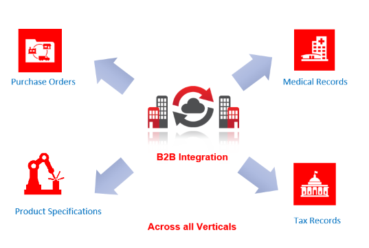

# Introduction

## About this Workshop

This workshop shows you how to design and develop a B2B Integration in Oracle Integration 3 that helps an Integration developer to onboard Trading Partners and exchange documents (example: Purchase Order, Invoices etc) in a secured way using protocols like AS2 and FTP.

Estimated Time: 3 hours

### What is Oracle Integration 3?

With Oracle Integration 3 (OIC), you have the power to *integrate* your cloud and on-premises applications, *automate* business processes, *gain insight* into your business processes, visually *develop* web and mobile applications, use an SFTP-compliant file server to *store* and *retrieve* files, and *exchange* business documents with a B2B trading partner—all in one place.

### What Is Oracle Integration 3 B2B

B2B stands for business-to-business integration. This is essentially multiple companies or vendors or enterprises communicating with each other or with their trading partner community with predefined and mutually agreed upon standards. The trading partner community could be a company, your vendors, your suppliers, your business partners, or whoever you need to exchange information and data. The common sets of practices you would use to communicate with them would include essentially a document format and a transport protocol, which together combine to form a common language that you mutually agree upon with your partner. The document formats could be standards like EDI X12 or UN/EDIFACT. The transport protocol layer will be the additional aspect here, where you will establish a connectivity with your trading partner using business protocols like AS2, sFTP, or other B2B protocols.
Once you have this connectivity established, you now have B2B integration with your business partners.

We can exchange and automate any type of information, including purchase orders, medical records, product specifications, tax records, tenders, invoices, shipment notices, acknowledgments, etc. Any of these data can be securely exchanged with your business partners in different verticals, depending on the business process and the transaction types that you're using. B2B integration enables customers and companies to eliminate manual processes they have in place today and automate them to reduce operational costs and adhere to compliance requirements they may have as part of their business practices.

Oracle Integration 3 provides support for B2B e-commerce with Oracle Integration 3 B2B.

Oracle Integration 3 B2B represents a collective set of features inside Oracle Integration 3 to support processing, including:

* A trading partner management interface.
* An EDI schema editor for creating custom schemas.
* A specialized B2B tracking user interface for viewing messages exchanged with trading partners.
* Adapters to support B2B protocols such as AS2 and FTP. See [Transport Protocols Supported in Oracle Integration 3 B2B](https://docs.oracle.com/en/cloud/paas/application-integration/integration-b2b/transport-protocols-supported-oracle-b2b.html#GUID-A200BA30-65F0-486A-BBBA-BAA1D84D131A).
* Actions you place within your integrations for EDI processing. See [Business Protocols Supported in Oracle Integration 3 B2B](https://docs.oracle.com/en/cloud/paas/application-integration/integration-b2b/business-protocols-supported-oracle-b2b.html#GUID-CBAF3DC2-0A64-4AC4-BD2D-4F940223DC9A).

## Task 1: Take a look at this B2B Overview Video

[B2B Overview Video](https://videohub.oracle.com/media/B2B%20in%20Oracle%20Integration%203/1_l80kjw3v/214384793)

### What Will You Learn?

In this workshop, you will learn how to:

* Provision Oracle Integration 3 in Oracle Cloud Infrastructure.
* Learn several B2B specific concepts.
* Work with B2B Trading Partner Manager.
* Customizing B2B Documents and Schemas.
* Use a B2B Action to translate EDI/EDIFACT documents.
* Design B2B Inbound/Outbound Scenarios.

### What Do You Need?

* An Oracle Free Tier or Paid Cloud Account.
* A Chrome browser.

You may now **proceed to the next lab**.

## Learn More

* [Oracle Integration 3 B2B](https://docs.oracle.com/en/cloud/paas/application-integration/integration-b2b/introduction-b2b-oracle-integration.html#GUID-11EFFD48-3E63-4C60-8771-DE789FF90909)

## Acknowledgements

* **Author** - Kishore Katta, Technical Director, Oracle Integration Product Management
* **Contributors** - Subhani Italapuram, Technical Director, Oracle Integration Product Management
* **Last Updated By/Date** - Oracle Integration team, Mar 2024
