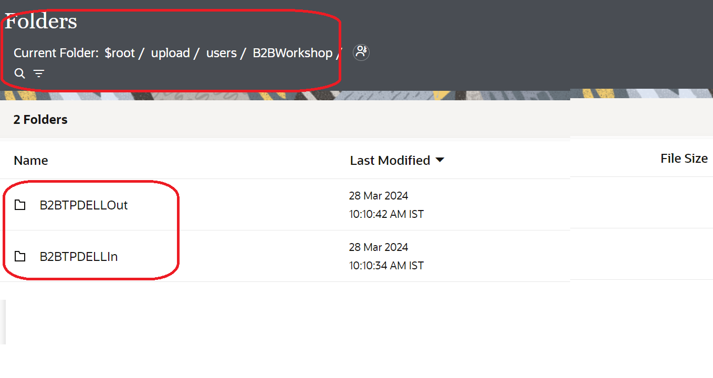
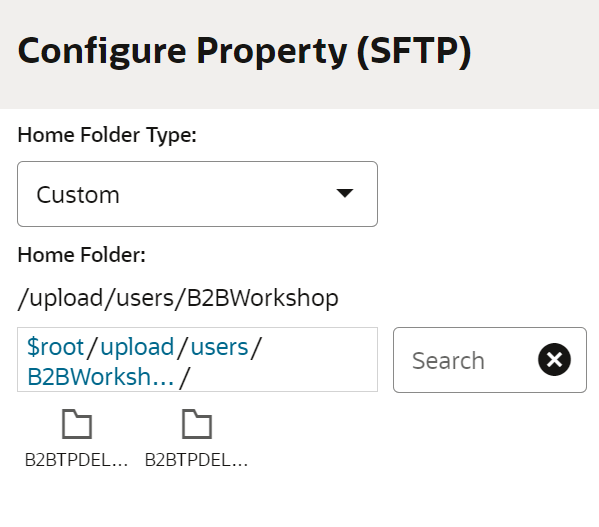
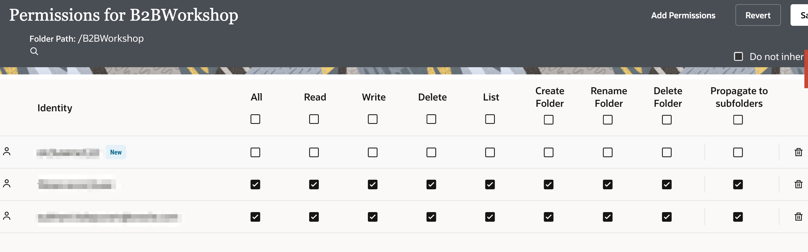

# Setup

## Introduction

This lab walks you through the steps to setup the workshop prerequisites.

Estimated Time: 5 minutes

### Objectives

In this lab, you will:

* Create the required File Server Folders and configure User and Folder permissions.
* Connect an FTP Client to the Oracle Integration File Server.
* Create a Connection to the File Server.
* Create a REST based API Connection.

### Prerequisites

This lab assumes you have:

* Successfully provisioned an Oracle Integration Instance and are able to access the home page.
* Successfully enabled Oracle Integration File Server.
* All instructions assume you are starting from the Oracle Integration Home page.

## Task 1: Configure File Server

Configure File Server settings.

1. Starting at the Oracle Integration **Home** page, select ***Settings***, then ***File Server*** from the left Navigation pane.
2. Select ***Settings*** from left Navigation pane to open the File Server Settings page and review the File Server status and configurations.Make a note of IP and port number by expanding the General tab.
  
**Note**: Ensure the **Authentication Type** is set to ***Password or Key***.
3. Select Users from left Navigation pane, search for your User Name and click on Configure.

4. Click on Switch to enable and click on Save.
5. Select ***Folders*** from left Navigation pane.
  
6. Click *Create* to create a folder named **upload** and then click on upload folder and again click on Create button to create a new folder named **users**, then enter into the users folder and hit the create button to create the folder named ***B2BWorkshop***. Your final folder structure should look as follows **upload &gt; users &gt; B2BWorkshop**
7. Select the ***B2BWorkshop*** Folder and create two additional Folders named ***B2BTPDELLIn*** and ***B2BTPDELLOut***.
  
**Note**: You will be using the above Folder structure in next labs.
8. Select ***Users*** from left Navigation pane. Find and select the user you are currently logged in as.  
If your user has not yet been configured to use File Server, click ***Select*** to configure your user.  
Otherwise, click ***Edit Configuration*** for your user.
9. Configure your user as follows:
    * Select **Home Folder Type** as ***Custom***.
    * Select **Home Folder** as ***upload &gt; users &gt; B2BWorkshop***, click on ***Save*** and click on ***Close***
    
9. Select ***Folders*** from left Navigation pane. Click ***Permissions*** on the **B2BWorkshop** folder.
  
10. Click ***Add Permissions*** and select your user. Click ***Add***.
  
11. Select ***All*** and ***Propagate to subfolders***. All of the permission check boxes should be checked. Click ***Save*** and exit the Permissions page.
  

## Task 2: Connect to File Server with FTP Client

To access files on the File Server you will need to use an FTP Client. You will need to configure your FTP Client with the following:

* File Server IP Address.
* File Server Port.
* Your Oracle Integration username.
* Your Oracle Integration password.

1. To obtain the File Server IP Address and Port, select **Settings** from left Navigation pane. The IP and Port are located in the **IP and Port Information** section of the **Settings** page.
2. Using your FTP Client choice, connect to the File Server using the SFTP - SSH File Transfer Protocol.  
  
A example configuration using FileZilla FTP Client.  
If the permissions are configured correctly, you should be able to list, read, and write files on the **B2BWorkshop**, **B2BTPDELLIn**, and **B2BTPDELLOut** Folders.
  

## Task 3: Create Connection with File Server

To access the File Server from an Integration, you will need to create an FTP Connection.  

1. In the left Navigation pane, click ***Projects***, click on the project which you have created.
    You can please skip this step if you are already in the project.
2. In the **Connections** section, click ***Add*** to create a new connection.

3. Select the **FTP** Adapter.
4. From the *Create Connection* dialog, *Name* your connection as **File Server** and select *Role* as **Invoke** and leave the rest of the configurations as default. Click **Create**
    > **Note:** If you are a Bootcamp user then execute step 5 only and skip other steps.
    If you are a non Bootcamp user then skip step 5 and continue with other steps..

5. Search for **File**, Please note that the connection with the name **File Server** is already created by the instructors, configured and shared with other projects.
Do not get confused with the same name, both the connections are in the different projects so, we are good with it. And click on **File Server** and click on **Save**. Exit the connection canvas by clicking the back button on the top left side of the screen.

    .

6. Enter the following configurations in the *FTP Connection* with the information you previously gathered from the File Server Settings page.  

    | Field                   | Value                                                 |
    |-------------------------|-------------------------------------------------------|
    | FTP Server Host Address | From File Server Settings - IP and Port Information   |
    | FPT Server Port         | From File Server Settings - IP and Port Information   |
    | SFTP Connection         | Yes                                                   |
    | Security                | FTP Server Access Policy                              |
    | Username                | Your Oracle Integration username                      |
    | Password                | Your Oracle Integration password                      |

7. Confirm your Connection by clicking **Test**, then **Diagnose & Test**. You should see the *Connection File Server was tested successfully* confirmation message. Click **Save** and exit the Connection editor.

## Task	4: Create Connection using REST adapter
  
Create a connection with the REST Adapter.

1. In the left Navigation pane, click ***Projects***, click on the project which you have created.
    You can please skip this step if you are already in the project. In the **Connections** section, click ***Add*** to create a new connection.
2. In the *Create Connection* dialog, select the **REST** adapter. To find the adapter, enter `REST` in the search field. Click on the highlighted adapter.
3. In the *Create Connection* dialog, enter the following information and click on ***Create***:

    | **Field**        | **Value**          |       
    | --- | ----------- |
    | Name         | REST Interface     |
    | Role         | Trigger       |
    | Description  | REST Interface Connection for OIC LiveLabs |

    Keep all other values as default.

4. In the *Configuration* page, enter the following information:

    | **Field**  | **Values** |
    |---|---|
    |Security Policy | OAuth 2.0 Or Basic Authentication |

5. Click on ***Test***  and wait until you receive a confirmation box that the test was successful.
6. Click ***Save*** and wait for the confirmation box. Exit the connection canvas by clicking the back button on the top left side of the screen.

## Task 5: Download Lab Artifacts

[Download the lab artifacts](https://objectstorage.us-phoenix-1.oraclecloud.com/p/iVG3apykbBPW5_DlEgKU_3ww6gzYw1EifLHDXxluloz1YQ76kdAbFbkgxi__m5Pm/n/oicpm/b/oiclivelabs/o/oic3/b2b-getting-started2.0.zip) and unzip in a folder **b2b-getting-started**

You may now **proceed to the next lab**.

## Learn More

* [Using the FTP Adapter with Oracle Integration 3](https://docs.oracle.com/en/cloud/paas/application-integration/ftp-adapter/ftp-adapter-capabilities.html)
* [Using the REST Adapter with Oracle Integration 3](https://docs.oracle.com/en/cloud/paas/application-integration/rest-adapter/index.html)

## Acknowledgements

* **Author** - Kishore Katta, Technical Director, Oracle Integration Product Management
* **Contributors** - Subhani Italapuram, Technical Director, Oracle Integration Product Management
* **Last Updated By/Date** - Subhani Italapuram, Oct 2025
