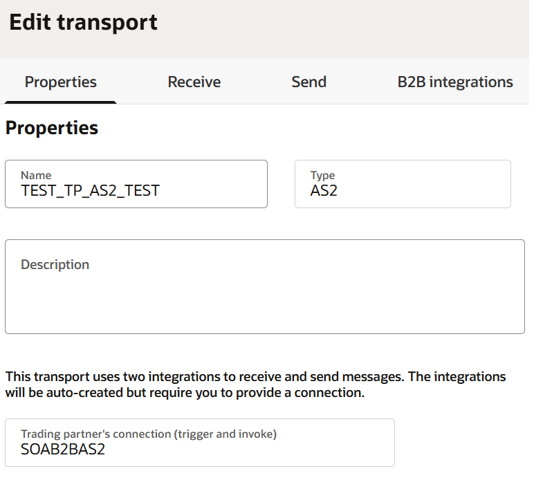
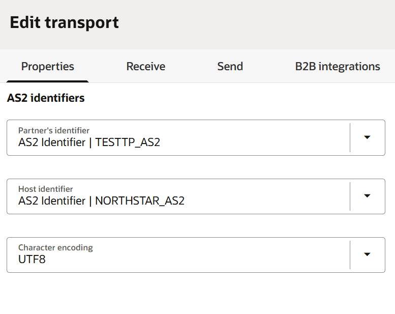
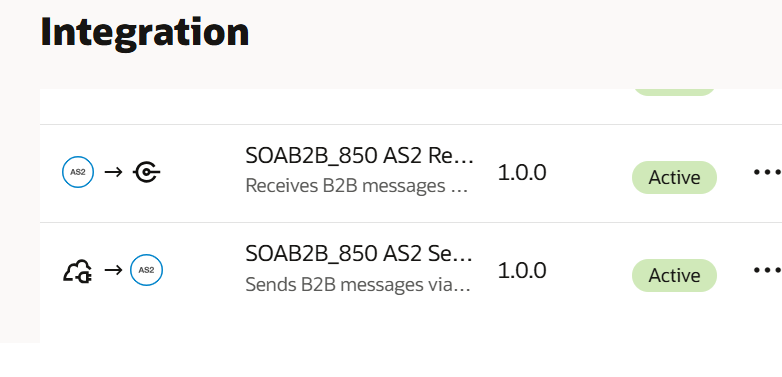

# Configure AS2 Transport and Trading Partner Agreement in OIC B2B

## Introduction

In this task, you create an AS2 Adapter connection and associate it with the pilot trading partner's B2B agreement. The connection uses a dummy endpoint for the workshop so that the transport configuration can be validated without connecting to a real trading partner.

The trading partner, agreement, document definitions, and schemas must already have been imported into the Oracle Integration project.

Estimated Time: 10 minutes

### Objective

Configure an AS2 transport for the pilot trading partner agreement using an Oracle Integration project connection. The transport is used by Oracle Integration B2B to send and receive the partner's B2B documents.

### Before You Begin

Confirm that you have:

- Opened the Oracle Integration project created for this workshop.
- Imported the pilot trading partner from the global B2B area into the project.
- Confirmed that the agreement, document definition, and schema are available in the project.
- Approved non-production test credentials and AS2 identifiers, if required by your environment.

## Task 1: Create the AS2 Adapter Connection

1. Open the Oracle Integration project.
2. Open the project's **Connections** area.
3. Click **Create** or the **+** icon.
4. Select the **AS2 Adapter**.
5. Enter a clear connection name, for example, `SOAB2BAS2`.
6. Configure the endpoint URL as `https://postman-echo.com/post`.
7. Select the security policy **AS2 Basic Policy**.
8. Enter only approved non-production test credentials and AS2 identifiers if the adapter configuration requires them.
9. Save the connection.
10. Test the connection if the connection wizard provides a test option.

## Task 2: Associate the Connection with the Trading Partner Agreement

1. In the project, open the **B2B** tab.
2. In the **Trading partners** section, open the pilot trading partner.
3. Open the **Transports & agreements** section.
4. Locate the imported agreement and review its direction, document type, sender identifier, and receiver identifier.
5. Create a new transport or edit the imported transport placeholder, as appropriate for the migrated agreement.
6. Select **AS2** as the transport protocol.
7. Select `SOAB2BAS2` as the transport connection.
8. Configure the transport properties required by the agreement, including:
   - Sender AS2 identifier
   - Receiver AS2 identifier
   - Receive and Send settings
   - Signing, encryption, and certificate settings, when applicable
   - Any agreement-specific transport values
   - Integration name prefix, for example: SOAB2B_850
     
     
9. Save the transport configuration.
10. In the **Transports & agreements** section, use the **Actions** menu for the transport and select **Deploy**.
11. Confirm that the transport deployment completes successfully.
12. After transport deployment, it now explains that Oracle Integration automatically creates:
    - A receive integration for inbound messages
    - A send integration for outbound messages
    The validation section now includes checking both generated integrations.
    

## Task 3: Validate the Configuration

1. Confirm that the agreement references the AS2 transport and the correct project connection.
2. Confirm that the document definition and schema remain associated with the agreement.
3. Confirm that the transport is deployed.
4. Review the configuration for missing identifiers, credentials, or certificates.
5. Record the agreement name, transport name, connection name, and test endpoint for the next workshop tasks.

## Expected Result

The pilot trading partner agreement is configured with a deployed AS2 transport that uses the `SOAB2BAS2` connection. The agreement is ready to be used in the inbound and outbound hybrid B2B flows.

## Important Notes

- `https://postman-echo.com/post` is a dummy endpoint intended only for lab testing.
- Before a real partner test or production deployment, replace the dummy endpoint with the approved partner endpoint and configure the required credentials, certificates, keys, and AS2 identifiers.
- Do not store production credentials, private keys, or certificates in workshop files or shared Postman collections.

    You may now **proceed to the next lab**.

## Learn More

- [Getting Started with Oracle Integration 3](https://docs.oracle.com/en/cloud/paas/application-integration/index.html)

- [Modernizing Oracle SOA B2B with a Hybrid Transition Approach](https://blogs.oracle.com/integration/oracle-soa-b2b-to-oracle-integration-b2b-a-practical-modernization-path).

## Acknowledgements

* **Author** - Subhani Italapuram, Product Management, Oracle Integration
* **Contributors** - Subhani Italapuram, Product Management, Oracle Integration
* **Last Updated By/Date** - Subhani Italapuram, Sep 2026
