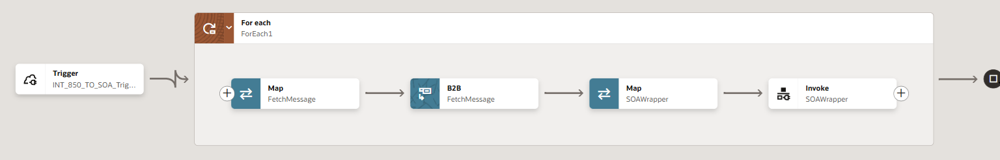
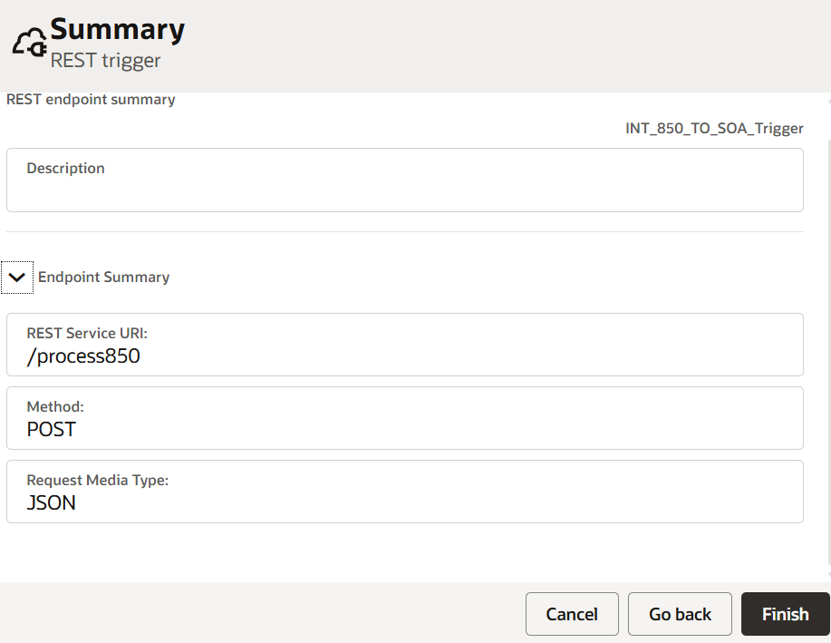
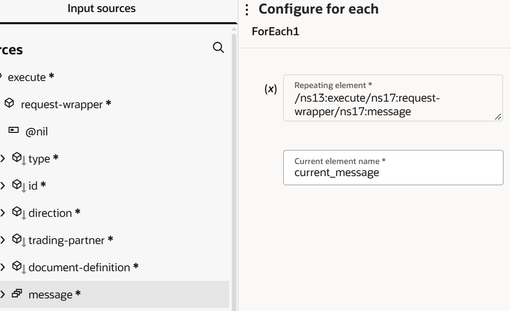
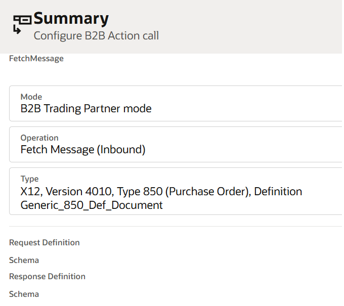
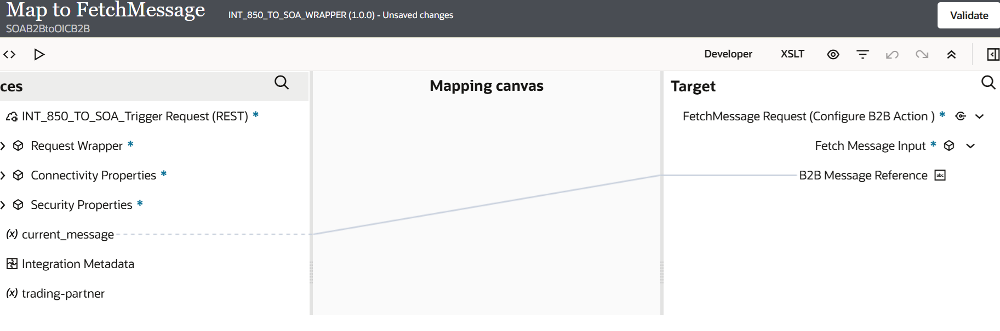
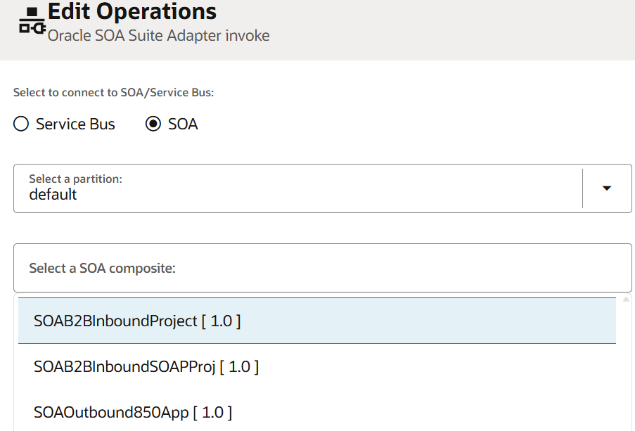
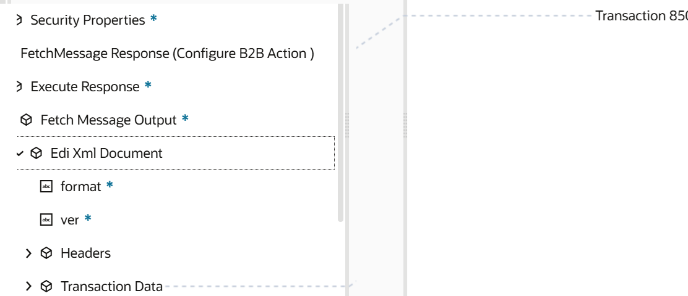

# Create the Inbound SOA B2B to OIC B2B Hybrid Flow

## Introduction

This task moves inbound partner-facing B2B processing to Oracle Integration B2B while keeping the existing SOA business implementation unchanged. Oracle Integration B2B receives, validates, resolves the agreement for, translates, and tracks the partner document. A lightweight Oracle Integration backend integration then passes the translated XML to a new BPEL gateway, which invokes the existing SOA composite.

```text
Trading Partner -> Oracle Integration B2B -> OIC Backend Integration -> BPEL Gateway -> Existing SOA Composite -> Backend Application
```

Estimated Time: 20 minutes

### What Changes in the Hybrid Transition

In a typical SOA B2B inbound implementation, the partner-facing B2B entry point is handled by **SOA B2B**, which delivers the document to the SOA composite through the B2B Adapter or an internal JMS queue.

In this hybrid pattern, replace that SOA B2B entry point with **Oracle Integration B2B**. Oracle Integration B2B receives and translates the partner document, then invokes the Oracle Integration backend integration named `INT_850_TO_SOA_WRAPPER`. That integration calls the lightweight `SOAWrapper` BPEL gateway, which invokes the unchanged SOA business composite.

```text
Before
Trading Partner -> SOA B2B -> B2B Adapter / JMS -> Existing SOA Composite

After
Trading Partner -> Oracle Integration B2B -> INT_850_TO_SOA_WRAPPER -> SOAWrapper BPEL Gateway -> Existing SOA Composite
```

The change is limited to the B2B entry layer. Do not replace or rewrite the existing SOA business transformation, orchestration, rules, routing, or backend calls.

The following example shows the Oracle Integration portion of the inbound flow. The B2B **FetchMessage** action retrieves the B2B-translated document, which is mapped to the SOA wrapper payload before the BPEL gateway is invoked



### Objective

Create and validate an inbound hybrid flow for the pilot trading partner. The flow uses the existing SOA input schema and preserves all existing SOA transformations, orchestration, business rules, routing, and backend processing.

### Before You Begin

Confirm that you have completed the following tasks:

- Migrated the pilot trading partner, agreement, documents, and schemas into Oracle Integration.
- Imported the required B2B artifacts into the workshop project.
- Configured and deployed the AS2 transport and confirmed that the generated receive integration is available.
- Identified the existing SOA composite that processes the inbound business document.
- Obtained the existing SOA input WSDL and XSD, plus access to deploy a new BPEL composite.
- Prepared a valid test X12 850 Purchase Order, or the agreed pilot inbound document.

## Task 1: Create a Lightweight BPEL Gateway Service

### Overview

In a traditional SOA B2B implementation, inbound documents commonly reach the SOA composite through the B2B Adapter and an internal B2B/JMS queue. This internal queue should not be used as the long-term entry point for the hybrid architecture.

Create a new, lightweight BPEL gateway that Oracle Integration can call through a SOAP or REST endpoint. The gateway decouples the existing SOA business implementation from the SOA B2B runtime and provides a stable service entry point for the hybrid pattern.

### Example

For this workshop, the pilot partner sends an **X12 850 Purchase Order**. The existing SOA composite expects a `PurchaseOrder` root element. Create a BPEL gateway service named `SOAWrapper` that accepts the same `PurchaseOrder` schema and invokes the existing `ProcessPurchaseOrder` composite. If the incoming root element differs, the gateway maps it to `PurchaseOrder`; it does not repeat the existing business transformation or routing.


### Create the Gateway Composite

1. In JDeveloper, create a new SOA application and SOA project for the gateway service.
2. Create a synchronous BPEL process.
3. Use the same input schema used by the existing inbound SOA composite.
4. Expose the BPEL process as a SOAP service. Use REST only when the existing SOA environment and the Oracle Integration design require it.
5. Add a reference to the existing SOA composite or service that currently performs the business processing.
6. Configure the reference with the existing composite's WSDL and endpoint details.

### Configure Minimal Mediation

1. In the BPEL process, receive the request from Oracle Integration.
2. Add an **Assign** activity or mapper only if required to map the incoming root element to the root element expected by the existing SOA composite.
3. Invoke the existing SOA composite through the configured reference.
4. Return the required response or acknowledgment from the existing SOA process.
5. Do not move or recreate the existing transformations, business rules, routing, orchestration, or backend calls in the BPEL gateway.
6. Deploy the gateway composite to the non-production SOA environment.
7. Record the gateway service WSDL and endpoint URL.

### Verify the Gateway

1. Invoke the BPEL gateway directly with a valid XML payload that conforms to the existing SOA input schema.
2. Confirm that the gateway calls the existing SOA composite.
3. Confirm that the existing composite completes its normal backend processing.
4. Resolve any WSDL, schema, security, or endpoint issue before creating the Oracle Integration backend integration.

## Task 2: Build the Oracle Integration Backend Integration

### Overview

Oracle Integration B2B performs partner-facing processing: agreement resolution, document validation, EDI-to-XML translation, and B2B tracking. The backend integration is intentionally lightweight. Its responsibility is to map the B2B-generated XML to the schema required by the BPEL gateway and invoke that gateway.

### Example

Create an inbound integration named `INT_850_TO_SOA_WRAPPER`. In the design shown above, the flow performs the following actions:

1. The **Trigger** receives the inbound B2B event.
2. Inside the **For Each** scope, the first **Map** prepares the message reference for `FetchMessage`.
3. The **B2B FetchMessage** action retrieves the translated X12 850 XML document.
4. The second **Map**, named `SOAWrapper`, maps the translated XML to the `PurchaseOrder` structure expected by the BPEL gateway.
5. The **Invoke SOAWrapper** action calls the `SOAB2B` connection.


### Create the SOA Adapter Connection

1. In the Oracle Integration project, open **Connections**.
2. Create a new connection using the **SOA Adapter**.
3. Enter a clear name, for example, `SOAB2B`.
4. Configure the BPEL gateway WSDL or endpoint URL recorded in Task 1.
5. Configure the approved non-production security policy and credentials required by the SOA environment.
6. Save and test the connection.

### Create the Backend Integration

1. Open the Oracle Integration project and click **Integrations**, then click **Create** or the **+** icon.
2. Select **Application integration**.
3. Enter `INT_850_TO_SOA_WRAPPER` as the integration name. Optionally add the description *Retrieves the inbound X12 850 message and invokes the SOA BPEL gateway*.
4. Click **Create** to open the integration canvas.
5. Add a **REST Adapter** trigger as the first action.
6. Configure the REST trigger:
   1. Select **POST** as the request method.
   2. Enter an operation name, for example, `INT_850_TO_SOA_Trigger`.
   3. Configure the request payload to receive the B2B message reference or event passed from the generated B2B receive integration.
   4. Complete the REST trigger wizard and save the endpoint configuration.
        

7. Add a **For Each** action after the REST trigger and name it `ForEach1`.
8. Configure the For Each expression to iterate through the inbound B2B message reference collection received by the trigger.
    
9. Inside `ForEach1`, add a **B2B** action and name it `FetchMessage`.
10. Configure the B2B action to retrieve the full translated XML document for the current inbound X12 850 message.
    
11. When the B2B action is added, Oracle Integration automatically creates the required input **Map** action immediately before it. Open that map and map the current message reference from the REST trigger to the B2B `FetchMessage` input.
    
12. call `SOAB2B` connection after the B2B action and name the invoke `SOAWrapper`.
13. Select the `SOAB2BInboundProject` from the Oracle SOA Suite Adapter connection wizard and select the service.

    
14. When the SOA invoke is added, Oracle Integration automatically creates the required input **Map** action immediately before it. Open that map and map the B2B `FetchMessage` XML output to the BPEL gateway input schema. Map the translated purchase-order data to the `PurchaseOrder` root element expected by the existing SOA composite.
    

15. Add business identifiers for purchase-order number, trading partner, document type, and B2B control number where available.
16. Save the integration, then click **Activate**.
    
17. Configure the generated B2B receive integration `SOAB2B_850 AS2 Receive`
 to invoke the activated `INT_850_TO_SOA_WRAPPER` REST endpoint.

## Task 3: Validate the End-to-End Inbound Flow

### Example

Use a valid sample X12 850 document for the pilot partner. For example, use a purchase order with a unique control number such as `PO-10001`. The expected business result is that the existing SOA composite creates or updates the purchase order in the configured backend test system. Use `PO-10001` as the business identifier to trace the same transaction in Oracle Integration B2B tracking, Oracle Integration monitoring, the BPEL gateway audit trail, and the existing SOA composite instance.

1. Send the valid pilot inbound document, such as an X12 850 Purchase Order, through the configured test AS2 channel.
2. In Oracle Integration B2B, confirm that the message:
   - Is received from the pilot trading partner.
   - Resolves to the expected agreement.
   - Passes validation.
   - Is translated from the B2B document to XML.
   - Has a B2B tracking record.
3. In Oracle Integration monitoring, confirm that the backend integration is triggered and completes successfully.
4. In the SOA Enterprise Manager console, confirm that the BPEL gateway receives the message.
5. Confirm that the BPEL gateway invokes the existing SOA composite.
6. Confirm that the existing SOA composite completes its normal processing in the backend application.
7. Compare the outcome with the expected result for the sample X12 850 document.

## Expected Result

The selected partner document is received and validated by Oracle Integration B2B, translated to XML, passed through the Oracle Integration backend integration, and processed by the unchanged SOA composite and backend application.

## Troubleshooting Checkpoints

- **No B2B transaction:** Verify the AS2 transport, partner identifiers, agreement, and channel configuration.
- **B2B validation failure:** Review the document definition, schema, agreement, and test payload.
- **Mapping failure:** Compare the Oracle Integration B2B XML payload with the BPEL gateway input schema.
- **Gateway invocation failure:** Verify the SOA Adapter connection, WSDL, endpoint, security policy, and network access.
- **SOA processing failure:** Review the BPEL gateway audit trail and the existing SOA composite instance.

## Key Design Principle

   Oracle Integration B2B owns the B2B edge; the BPEL gateway only bridges to the existing SOA business implementation. This keeps the modernization scope controlled and reduces migration risk.

## Learn More

This flow follows Oracle's Hybrid Transition guidance: [Modernizing Oracle SOA B2B with a Hybrid Transition Approach](https://blogs.oracle.com/integration/oracle-soa-b2b-to-oracle-integration-b2b-a-practical-modernization-path).

- [Getting Started with Oracle Integration 3](https://docs.oracle.com/en/cloud/paas/application-integration/index.html)

- [Modernizing Oracle SOA B2B with a Hybrid Transition Approach](https://blogs.oracle.com/integration/oracle-soa-b2b-to-oracle-integration-b2b-a-practical-modernization-path).

## Acknowledgements

* **Author** - Subhani Italapuram, Product Management, Oracle Integration
* **Contributors** - Subhani Italapuram, Product Management, Oracle Integration
* **Last Updated By/Date** - Subhani Italapuram, Sep 2026