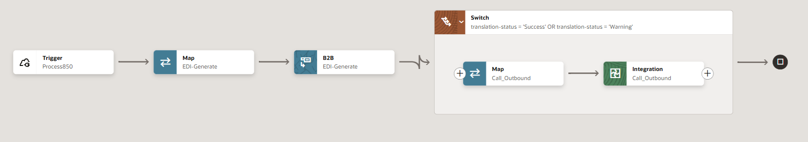
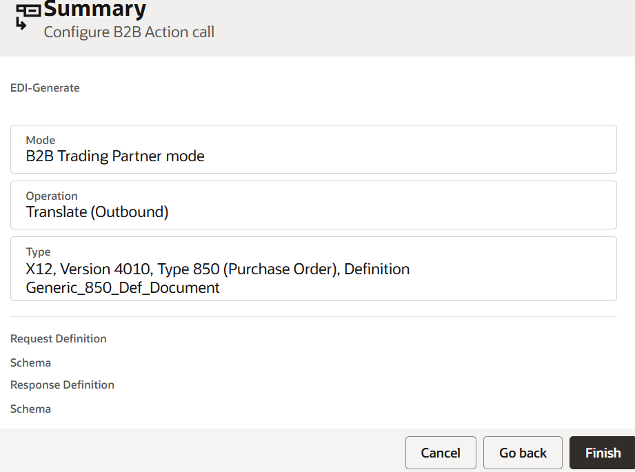
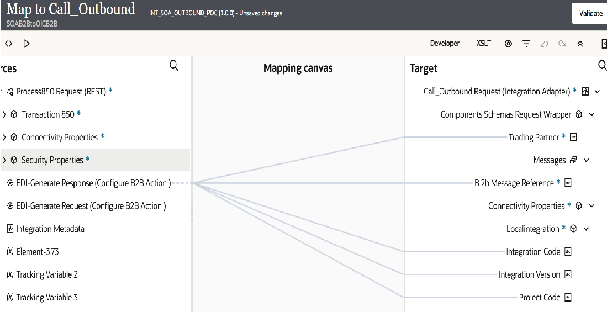

# Create the Outbound SOA B2B to OIC B2B Hybrid Flow

## Introduction

This task moves outbound partner-facing B2B processing from SOA B2B to Oracle Integration B2B. The existing SOA composite continues to prepare the business document using its current schema, transformation, orchestration, business rules, and backend logic. The only change is the outbound destination.

```text
Existing SOA Composite -> OIC Outbound Integration -> Oracle Integration B2B -> Trading Partner
```

Estimated Time: 20 minutes

### What Changes in the Hybrid Transition

```text
Before
Existing SOA Composite -> SOA B2B -> Trading Partner

After
Existing SOA Composite -> INT_SOA_OUTBOUND_POC -> Oracle Integration B2B -> Trading Partner
```

In the updated flow, the existing SOA composite invokes the lightweight Oracle Integration outbound integration named `INT_SOA_OUTBOUND_POC` instead of SOA B2B. Oracle Integration B2B then applies the trading partner agreement, converts the SOA business document to the required B2B format, and delivers it through the configured transport.

The following example shows the outbound Oracle Integration flow used in this workshop.



### Objective

Create and validate an outbound hybrid flow that accepts the existing SOA business document without requiring additional transformation in SOA, then translates and delivers the message through Oracle Integration B2B.

### Before You Begin

Confirm that you have completed the following tasks:

- Migrated and imported the pilot trading partner, agreement, document definitions, and schemas into the Oracle Integration project.
- Configured and deployed the AS2 transport.
- Confirmed that the automatically generated B2B send integration is available.
- Identified the existing SOA composite and outbound target that currently invokes SOA B2B.
- Obtained the WSDL/XSD for the business document currently sent from SOA to SOA B2B.
- Prepared an approved outbound test document, such as an X12 850 Purchase Order.

## Task 1: Create the Oracle Integration Outbound Integration

### Overview

Create a lightweight Oracle Integration outbound integration that SOA can invoke. Its input must use the same schema that the existing SOA composite currently sends to SOA B2B. This enables the existing SOA process to remain unchanged.

### Example

For this workshop, the existing SOA composite generates a purchase order using the `Process850` business-document schema. Create an Oracle Integration integration named `INT_SOA_OUTBOUND_POC` that accepts the same payload. The B2B action then translates the XML purchase order into the pilot partner's required X12 850 format and sends it through the configured AS2 transport.

The illustrated flow performs these actions:

1. **Trigger – Process850:** receives the existing SOA business document.
2. **Map – EDI-Generate:** maps the SOA payload to the B2B document input.
3. **B2B – EDI-Generate:** performs agreement resolution and creates the outbound B2B document.
4. **Switch:** continues when `translation-status` is `Success` or `Warning`.
5. **Map – Call_Outbound:** maps the generated B2B result to the downstream outbound request.
6. **Integration – Call_Outbound:** invokes the configured outbound delivery integration.

### Create the Integration

1. Open the Oracle Integration project.
2. Click **Integrations**, then click **Create** or the **+** icon.
3. Select **Application integration**.
4. Enter `INT_SOA_OUTBOUND_POC` as the integration name. Optionally add a description such as *Receives the SOA purchase order and sends it through Oracle Integration B2B*.
5. Click **Create** to open the integration canvas.
6. Add **REST** trigger. Select the trigger type that the existing SOA composite can invoke. Reuse the existing SOA outbound contract wherever possible.

7. Configure the trigger:
   1. Enter an operation name, for example, `Process850`.
   2. Configure the request input using the same WSDL/XSD and business-document schema currently sent from SOA to SOA B2B.
   3. Complete the trigger wizard and save the endpoint configuration.
8. Add a **B2B** action after the trigger and name it `EDI-Generate`.
9. Configure the B2B action:
    1. Select the pilot trading partner.
    2. Select the appropriate outbound agreement.
    3. Select the outbound X12 850 document definition and confirm the outbound direction.
        
    4. Confirm that the agreement uses the deployed AS2 transport.
    5. Map the incoming `Process850` business document to the B2B action input. If the schemas are the same, use a direct mapping and do not add a new business transformation.

10. Add a **Switch** action after the B2B action.
11. Configure a branch with the following condition:

    ```text
    translation-status = 'Success' OR translation-status = 'Warning'
    ```

12. Inside the success-or-warning branch, add a **Map** action named `Call_Outbound`.
13. Add an **Integration** invoke after the `Call_Outbound` map.
14. Select the generated AS2 send integration, or the approved outbound delivery integration, and name the invoke `Call_Outbound`.
15. Map the B2B action output to the input required by the generated or configured outbound delivery integration.
    
16. Complete the invoke wizard and verify that it uses the deployed AS2 transport.
17. Add business identifiers, such as invoice number, purchase-order number, trading partner, and document type.
18. Activate the Oracle Integration outbound integration and record its endpoint URL and WSDL.
    

## Task 2: Update the SOA Outbound Configuration

### Overview

Update the existing SOA composite so that it invokes the Oracle Integration outbound integration instead of SOA B2B. Do not change the existing SOA business logic; replace only the partner-facing B2B target.

### Example

If the existing SOA composite invokes a SOA B2B reference named `B2B_PO_Out`, add a new reference named `OIC_B2B_PO_Out`. Configure it to invoke `INT_SOA_OUTBOUND_POC`, then redirect the existing outbound invoke to the new reference. The `Process850` payload and existing SOA mapping remain unchanged.

### Update the SOA Composite

1. Open the existing outbound SOA composite in JDeveloper.
2. Identify the reference, partner link, or target that currently sends the transaction to SOA B2B.
3. Add a new SOAP or REST reference for the `INT_SOA_OUTBOUND_POC` endpoint.
4. Configure the reference using the Oracle Integration endpoint URL or WSDL recorded in Task 1.
5. Configure the required Oracle Integration security policy and non-production credentials.
6. Map the existing SOA outbound business document to the new reference input. Retain the existing schema and mapping wherever possible.
7. Replace the existing SOA B2B invoke with the new Oracle Integration invoke.
8. Keep the existing SOA transformations, orchestration, business rules, routing, and backend logic unchanged.
9. Deploy the updated SOA composite to the non-production environment.

## Task 3: Test and Validate the Outbound Flow

### Example

Trigger the SOA process to generate an X12 850 Purchase Order with purchase-order number `PO-10001`. Use `PO-10001` as the business identifier to trace the transaction in the SOA composite, Oracle Integration monitoring, Oracle Integration B2B tracking, and the test AS2 destination.

### Validation Steps

1. Trigger the existing SOA business process with the approved outbound test data.
2. Confirm that the SOA composite creates its normal business document.
3. Confirm that the SOA composite invokes `INT_SOA_OUTBOUND_POC` instead of SOA B2B.
4. In Oracle Integration monitoring, confirm that the outbound integration receives the message and completes its B2B action.
5. In Oracle Integration B2B, confirm that the message:
   - Resolves to the expected trading partner and agreement.
   - Is translated from XML into the required outbound B2B format.
   - Uses the deployed AS2 transport.
   - Has a B2B tracking record.
6. Confirm that the document is delivered to the test partner endpoint and that any expected acknowledgment is received.
7. Compare the delivered document and outcome with the expected X12 850 result.

## Expected Result

The existing SOA composite produces its normal business document and invokes Oracle Integration instead of SOA B2B. Oracle Integration B2B applies the partner agreement, translates the document, and delivers it successfully through the configured AS2 transport.

## Troubleshooting Checkpoints

- **SOA cannot invoke Oracle Integration:** Verify the new SOA reference, OIC endpoint, WSDL, security policy, credentials, and network connectivity.
- **B2B agreement is not found:** Verify partner identifiers, document type, direction, and agreement configuration.
- **Translation failure:** Verify the source XML schema, B2B document definition, agreement parameters, and B2B action mapping.
- **Delivery failure:** Verify AS2 endpoint, AS2 identifiers, security policy, credentials, certificates, and transport deployment.
- **No business tracking:** Verify that business identifiers are mapped and the B2B action completes.

## Key Design Principle

The SOA composite remains responsible for business processing. Oracle Integration B2B becomes responsible for B2B agreement resolution, translation, transport, delivery, and tracking.

## Learn More

This flow follows Oracle's Hybrid Transition guidance: [Modernizing Oracle SOA B2B with a Hybrid Transition Approach](https://blogs.oracle.com/integration/oracle-soa-b2b-to-oracle-integration-b2b-a-practical-modernization-path).

## Acknowledgements

* **Author** - Subhani Italapuram, Product Management, Oracle Integration
* **Contributors** - Subhani Italapuram, Product Management, Oracle Integration
* **Last Updated By/Date** - Subhani Italapuram, Sep 2026