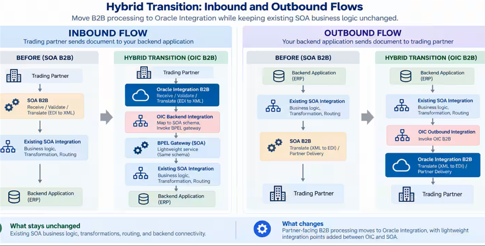

# SOA B2B to OIC B2B Hybrid Transition

## Introduction

Many organizations rely on Oracle SOA Suite B2B to exchange business documents with trading partners. As they modernize their integration landscape, they need a practical way to adopt Oracle Integration B2B without disrupting the proven SOA business processes that already support critical operations.

This LiveLab demonstrates a **hybrid transition** approach. Oracle Integration takes responsibility for B2B document processing at the edge, while the existing SOA business logic, transformations, routing, and backend integrations remain unchanged.

In this approach, Oracle Integration B2B manages trading partners, agreements, document validation, format translation, transport, and B2B tracking. A lightweight integration then passes the translated business document to the existing SOA process. For outbound transactions, SOA sends its existing business document to Oracle Integration, which transforms and delivers it to the appropriate trading partner.

Estimated Workshop Time: 90 minutes

### What You Will Build

You will implement and validate these two flows:

```text
Inbound
Trading Partner -> Oracle Integration B2B -> Oracle Integration -> SOA Gateway -> Existing SOA Business Logic -> Backend System

Outbound
Existing SOA Business Logic -> Oracle Integration -> Oracle Integration B2B -> Trading Partner
```



### Target Architecture

```text
Inbound

Trading Partner
      |
      v
Oracle Integration B2B
Agreement resolution | validation | B2B-to-XML translation | tracking
      |
      v
Oracle Integration Backend Integration
Map OIC XML to the SOA gateway schema
      |
      v
Lightweight SOA BPEL Gateway
Minimal mediation only
      |
      v
Existing SOA Composite
Existing transforms | rules | orchestration | routing
      |
      v
Backend Application

Outbound

Existing SOA Composite
      |
      v
Oracle Integration Outbound Integration
Accept the existing SOA business document
      |
      v
Oracle Integration B2B
Agreement resolution | XML-to-B2B translation | delivery | tracking
      |
      v
Trading Partner
```

### Objectives

By the end of this LiveLab, you will be able to:

- Migrate selected Oracle SOA B2B partner and agreement configuration to Oracle Integration B2B.
- Configure an Oracle Integration B2B channel for a trading partner.
- Route an inbound B2B document from Oracle Integration to an existing SOA process.
- Route an outbound business document from SOA through Oracle Integration B2B to a trading partner.
- Validate document processing, tracking, delivery, and error handling in Oracle Integration.
- Plan an incremental, partner-by-partner B2B modernization rollout.

### Scope

This lab intentionally keeps the SOA business logic unchanged. The focus is the B2B processing layer: partner management, agreements, validation, transformation, transport, and monitoring.

The lab uses one pilot trading partner and sample business documents. In a production migration, repeat the same pattern in phases for the remaining partners.

### Intended Audience

This LiveLab is intended for integration developers, solution architects, B2B administrators, and technical teams responsible for Oracle SOA Suite and Oracle Integration.

### Lab Sequence

1. Prepare the source SOA B2B configuration and test assets.
2. Configure the trading partner and agreement in Oracle Integration B2B.
3. Build and test the inbound hybrid flow.
4. Build and test the outbound hybrid flow.
5. Validate monitoring, errors, replay, and rollout readiness.

### Success Criteria

The lab is complete when a test document is processed through Oracle Integration B2B and successfully reaches the unchanged SOA business process, and when an outbound SOA document is delivered through Oracle Integration B2B to the selected trading partner.

### Prerequisites

Before starting this LiveLab, ensure that the following are available:

- Access to an Oracle Integration environment with Oracle Integration B2B enabled.
- Access to the source Oracle SOA Suite environment and the existing SOA B2B configuration.


## Task 1: Use Case: Oracle SOA B2B Hybrid Transition

> **Note:** All tasks under *Introduction* are *read-only*.

An organization exchanges purchase orders, invoices, and other business documents with trading partners through Oracle SOA Suite B2B. The organization wants to modernize its B2B processing by using Oracle Integration B2B, but it does not want to rewrite the SOA business processes that already perform validation, orchestration, transformations, and backend updates.

The hybrid transition moves B2B partner management, agreements, document validation, translation, transport, and tracking to Oracle Integration. The existing SOA business logic remains in place and is invoked through a lightweight gateway.

## Task 2: Business Challenge

The current SOA B2B environment is tightly connected to established business processes and partner integrations. Replacing the entire landscape in a single project creates unnecessary risk, testing effort, and business disruption.

The organization needs to modernize B2B capabilities while preserving:

- Existing SOA business rules, transformations, and orchestrations.
- Proven integrations with ERP and backend systems.
- Trading-partner service continuity.
- A controlled, partner-by-partner migration path.
- Visibility into document status, failures, and partner delivery.

## Task 3: The Oracle Integration Solution

Oracle Integration B2B becomes the modern B2B edge for receiving, validating, translating, tracking, and delivering partner documents. Oracle Integration invokes the existing SOA processes for inbound business processing and receives outbound business documents from SOA for partner delivery.

This approach separates B2B processing from the existing business logic and enables incremental modernization without a full SOA rewrite.

## Task 4: About this Workshop

In this workshop, you will configure a pilot trading partner and implement inbound and outbound hybrid B2B flows. You will use a lightweight SOA gateway to connect Oracle Integration B2B with an existing SOA business process.

The workshop uses non-production configuration and sample documents. It focuses on the technical pattern and validation steps needed to prepare a real migration.

## Task 5: Technology Stack

- Oracle Integration 3
- Oracle Integration B2B
- Oracle SOA Suite and SOA B2B
- Oracle SOA Adapter
- BPEL gateway service and existing SOA composite
- AS2 or SFTP transport channel
- X12, EDIFACT, XML, or another supported B2B document format
- Oracle Integration Connectivity Agent, when the SOA environment is privately hosted

## Task 6: Workshop Flow

1. Review the existing SOA B2B partner, agreement, and document configuration.
2. Prepare or migrate the pilot B2B configuration into Oracle Integration B2B.
3. Configure partner identifiers and the AS2 or SFTP delivery channel.
4. Create and test the inbound Oracle Integration-to-SOA flow.
5. Create and test the outbound SOA-to-Oracle Integration flow.
6. Review tracking, failures, error recovery, and migration readiness.

## Task 7: High-Level Workflow of the Workshop

```text
Inbound document
Trading Partner -> Oracle Integration B2B -> Oracle Integration backend flow -> SOA Gateway -> Existing SOA process -> Backend system

Outbound document
Existing SOA process -> Oracle Integration outbound flow -> Oracle Integration B2B -> Trading Partner
```

## Task 8: Knowledge Outcomes

After completing this workshop, you will be able to:

- Explain the SOA B2B hybrid-transition architecture.
- Configure a pilot B2B trading partner and agreement in Oracle Integration B2B.
- Connect Oracle Integration B2B to existing SOA business logic without redesigning that logic.
- Implement and test inbound and outbound hybrid B2B flows.
- Use Oracle Integration tracking to validate document processing and troubleshoot failures.
- Define a phased, low-risk migration approach for additional trading partners.

    You may now **proceed to the next lab**.

## Learn More

* [Oracle Integration 3 Documentation](https://docs.oracle.com/en/cloud/paas/application-integration/index.html)

## Acknowledgements

* **Author** - Prady, Subhani Italapuram, Product Management, Oracle Integration
* **Last Updated By/Date** - Subhani Italapuram, Sep 2026
