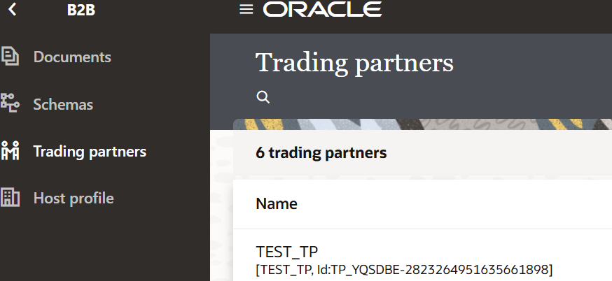
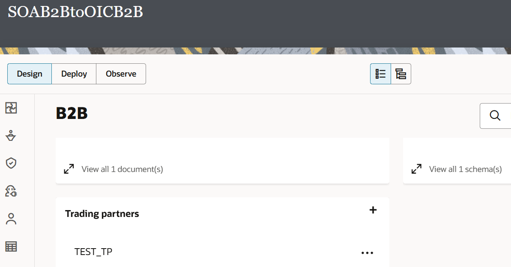

# Migrate B2B Artifacts from SOA B2B to OIC B2B

## Introduction

This task migrates the B2B configuration for a pilot trading partner from Oracle SOA B2B to Oracle Integration B2B. The current process uses a provided Postman collection to upload the SOA B2B export ZIP file to the Oracle Integration migration API.

At present, this import creates B2B artifacts in the global Oracle Integration B2B area. After validating the import, you must import or associate the required artifacts with the Oracle Integration project in which the hybrid integrations will be developed. This temporary Postman-based approach will be replaced when project-level import capability is available in Oracle Integration.

Estimated Time: 20 minutes

### Objective

Migrate the core B2B configuration for a pilot trading partner from Oracle SOA B2B to Oracle Integration B2B. This establishes the partner, agreement, identifiers, document definitions, and transport-related configuration required before creating the inbound and outbound hybrid flows.

The migration moves the B2B processing layer to Oracle Integration. Existing SOA business logic, transformations, orchestration, routing, and backend integrations are not changed in this task.

### Prerequisites

This lab assumes you have:

- All previous labs completed.
- [Download](https://objectstorage.us-phoenix-1.oraclecloud.com/p/UrkKROO3M8fiP5l9MEfHBkRSo4s8NkprRfGIOqKaDG3-4oiim0y0AWwFmfiO6K97/n/oicpm/b/oiclivelabs/o/oic3/ExpenseCreationLabVer2.zip) the Lab artifacts and unzip on your local computer. The lab artifacts contains a .car file (OIC Project) and .jpeg files which will act as data source for this usecase.

## Migration Steps

1. Select one non-production pilot trading partner and one document type, such as an X12 850 Purchase Order.
2. Sign in to the SOA B2B console and Export the required SOA B2B artifacts from the source SOA B2B Console:
    1. In the Oracle B2B Console, click **Administrator**.
    2. Select **Active Agreements**.
    3. Select the active agreement for the pilot trading partner.
    4. Click **Export**.
    5. Save the generated ZIP file to a secure local location. This file contains the selected active agreement and its associated B2B design-time artifacts.
    6. Record the ZIP file name and the selected agreement name for use during the Oracle Integration import.

3. Import the provided Oracle Integration B2B migration collection into Postman:
    1. Open **Postman**.
    2. Click **Import**.
    3. Select the provided Postman collection file, then click **Import**.
    4. Confirm that the imported collection appears in the **Collections** panel.
4. Open the **B2BImport-OIC3Dev** request in the imported collection.
5. Update the request for the target Oracle Integration environment:
    1. Update the Oracle Integration URL to the target OIC environment URL. Just replace the hostname.
    2. Review and update any request parameters required by the supplied collection.
    3. Open the **Authorization** tab and select the authentication method required by the provided collection and target environment:
        - **Basic Auth:** Enter the approved target-environment username and password.
        - **OAuth 2.0:** Enter the client ID, client secret, scope, and access-token URL; then request or refresh the access token and confirm it is applied to the request.
    4. Do not save usernames, passwords, client secrets, or access tokens in the exported collection.

6. Attach the SOA B2B export ZIP file to the request body:
    1. Open the **Body** tab.
    2. Select **form-data**.
    3. Change the field type from **Text** to **File**, if required.
    4. Click **Select Files** and select the ZIP file exported from the SOA B2B Console.
    5. Confirm that the ZIP file name is displayed in the value column.
7. Click **Send** to import the B2B artifacts into Oracle Integration.
8. Review the response and confirm that the import request completed successfully. Record any warnings or errors before continuing.
9. Sign in to the target Oracle Integration environment.
10. Review the imported configuration in Oracle Integration B2B:
    - Go to Home --> B2B
    - Confirm the trading partner was created.
    - Confirm the agreement is present and associated with the correct documents.
    - Confirm sender and receiver identifiers are correct.
    - Confirm the document definitions and schemas are available.

      

11. Import or associate the required global B2B artifacts with the applicable Oracle Integration project. The current Postman import creates the B2B artifacts globally; it does not import them directly into an Oracle Integration project.
    - Create an Oracle Integration project for the hybrid-transition lab, or open the existing lab project.
    - In the project, open the **B2B** tab.
    - In the **Trading partners** section, click the **+** icon.
    - Click **Import**.
    - Select the trading partner that was imported into the global B2B space in the earlier Postman migration step.
    - Complete the import into the project.

      The project import brings the selected trading partner and its associated document definitions and schemas into the project. Review the imported resources before using them in the inbound or outbound integrations.

      

12. Complete the target-environment channel configuration, as applicable:
    - AS2 or SFTP endpoint
    - User credentials
    - Certificates and private keys
    - Partner transport settings
13. Save the configuration and validate that the agreement is ready for the selected test document.

## Expected Result

The pilot trading partner and its core B2B configuration are available in Oracle Integration B2B and ready to be used by the inbound and outbound hybrid flows.

## Important Notes

- Use only approved non-production endpoints, credentials, certificates, and test data.
- Review all imported settings before activation; transport endpoints and security information commonly differ between environments.
- The Postman-based import is a temporary approach. It creates B2B artifacts globally in Oracle Integration; move or associate the required artifacts with the relevant project before building project-based integrations.
- Do not share, commit, or export Postman files containing client secrets, access tokens, or environment credentials.
- Do not deactivate or remove the existing SOA B2B configuration until the Oracle Integration pilot has passed end-to-end validation.

    You may now **proceed to the next lab**.

## Learn More

- [Getting Started with Oracle Integration 3](https://docs.oracle.com/en/cloud/paas/application-integration/index.html)
- [Modernizing Oracle SOA B2B with a Hybrid Transition Approach](https://blogs.oracle.com/integration/oracle-soa-b2b-to-oracle-integration-b2b-a-practical-modernization-path).
- [Migrate B2B Artifacts from Oracle SOA Suite to Oracle Integration](https://docs.oracle.com/en/cloud/paas/application-integration/integration-b2b/migrate-b2b-artifacts-from-oracle-soa-suite-oracle-integration1.html)

## Acknowledgements

* **Author** - Subhani Italapuram, Product Management, Oracle Integration
* **Contributors** - Subhani Italapuram, Product Management, Oracle Integration
* **Last Updated By/Date** - Subhani Italapuram, Sep 2026
