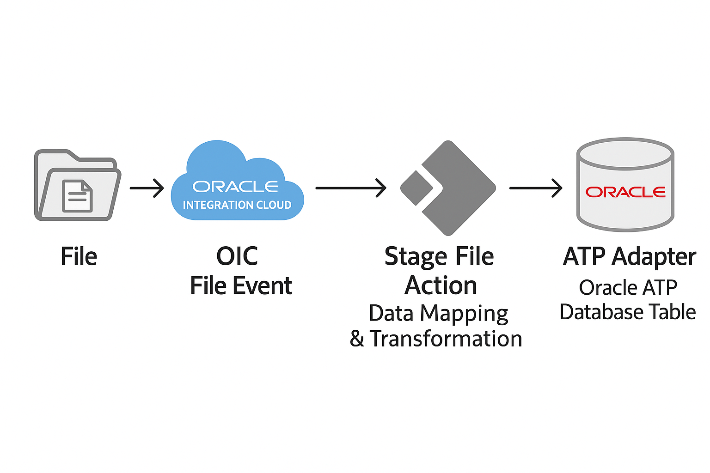
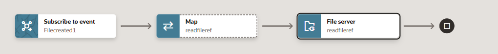
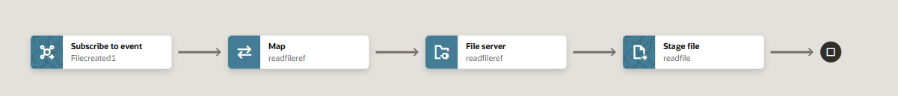
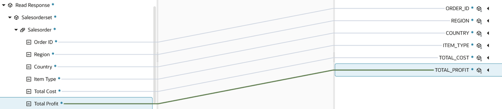

# Create an Integration flow

## Introduction

This lab will walk you through the steps to create an end-to-end integration of reading a file from the File Server and inserting the data set in an Oracle Autonomous (ADW) Table.



In this use case, an Event pattern in OIC is used to automate the transfer and processing of sales order data. The process begins by creating a sales orders file in an SFTP server. Once the file is created, file event triggers the integration process, use stage file action to read the file and it goes through necessary transformations or validations in OIC to prepare the data for database insertion.

The Oracle Autonomous Transaction Processing adapter in OIC simplifies inserting the data into the database. Here’s how it works:

# Components Involved

    1.Oracle Integration Cloud (OIC):

    Acts as the central platform for orchestrating the integration flow.

    2.OIC Embedded SFTP Server:

    Files are securely created or uploaded here as the source input.

    3.File Event Trigger (OIC):

    Monitors the embedded SFTP server and triggers the integration process when a new file arrives.

    4.Stage File Action (Read File Content):

    Reads the contents of the incoming file for further processing.

    5.Data Mapping & Transformation:

    Transforms and maps the raw file data into a structure suitable for ADW.

    6.Oracle ATP Connection (via ATP Adapter):

    Establishes a secure connection from OIC to Oracle ATP using the ATP adapter.

    7.Oracle ATP Database Table:

    The transformed data is inserted into the target database table in ATP

Estimated Time: 20 minutes

### Objectives

In this lab, you will execute the following:

- Create an event based integration flow
- Add the Stage File action
- Add the ATP invoke activity
- Map data between Source File structure and ATP invoke
- Define Tracking Fields
- Activate the integration

### Prerequisites

This lab assumes you have:

- Completed all the previous labs.

## Task 1: Create an event based integration flow

We will start by creating a new integration and adding some basic info.

1. In the left Navigation pane, click ***Projects***, click on the project which you have created.
    You can please skip this step if you are already in the project.
2. In the **Integrations** section, click ***Add***.
3. On the *Add integration* dialog, click ***Create***.
4. On the *Create integration* dialog, Click on ***Event***
5. In the *Create integration* dialog, enter the following information:

    | **Element**        | **Value**          |
    | --- | ----------- |
    | Name         | `File Event to ATP`       |
    | Description  | `Live Lab to Read File and Insert Sales Orders to ATP` |
    {: title="Create integration"}

    Accept all other default values.

6. Click **Create**.
7. Click **System** on the *Choose event* dialog, expand **File Server**, select **File created**, click **Choose** and click on **Add Filter**  and provide the sample json given below. You need to modify the file name and path as per your use case. 

> **Note:**  Path given below is not a real path, it is just a syntax, you need to modify it as per your use case.

    <copy>
        {"type":"jq_filter","filter-def":".data.path==\"/upload/users/your oic usernumber\" and (.data.name | endswith(\".csv\")) "}
    </copy>
    

8. Click **Validate**, Click **&lt;(Back)**,  Click **Finish**.
9. Optional, Select Layout to ***Horizontal*** and click **Save** to apply changes.

## Task 2: Get the file reference using File server native action

1. Hover over the outgoing arrow for the **Filecreated1** activity and Click the ***+*** sign in the integration canvas.
Search for the **File server** activity and click on it. This invokes  the Configuration Wizard.
2. On the **Basic Info** page,
    - for the **What do you want to call your endpoint?** element, enter ***readfileref***
    - for the **Select resource** element, select ***File***
    - for the **Select operation** element, select ***Get File Reference***
    - for the **Input Directory** element, enter ***/***
    - for the **File Name** element, select ***temp.csv***
    - Click ***Continue***.
3. Review the summary and click ***Finish***
4. Click ***Save*** to persist changes
    

## Task 3: Define the Data Mapping

1. Select the action **Map readfileref** and click on **...** and click on **Edit**
2. In the Source section, expand **FileCREATED1 Request**, expand **Request Wrapper**
3. In the Target section, expand the **readfileref Request**, expand **Query Parameters**
   - Map the following fields from the Sources section to the fields in the Target section
  | **Field**        | **Value**|
  | --- | ----------- |
  | Path         | Directory|
  | Name         | File Name|

- Click on ***Validate***.
  - A confirmation message appears.
- Click ***&lt; (Go back)***
- Click ***Save*** to persist changes.

## Task 4: Read the file using Stage File action

1. Hover over the outgoing arrow for the **File server readfileref** activity and Click the ***+*** sign in the integration canvas.
Search for the **Stage File** action and click on it. This invokes Stage File Configuration Wizard.
2. On the **Basic Info** page,
    - for the **What do you want to call your endpoint?** element, enter ***readfile***
    - Click ***Continue***.
3. On the **Configure Operation** page,
    - for the **Choose Stage File Operation** element, select ***Read Entire File***
    - for the **Configure File Reference** element, select ***"yes"***
    - for the **Specify the File Reference** element, click ***Switch to Developer View***, drag and drop ***fileReference*** from the ***readfileref***
    - Click ***Continue***.
4. On the **Schema Options** page,
      - Click ***Continue***.
5. On the **Format Definition** page,
      - click ***Drag and Drop*** and download the [sales.csv](../files/sales.csv?download=1) file and upload here
      - for the **Enter Record Name**, enter ***salesorder***
      - for the **Enter Record Name**, enter ***salesorderset***
      - Click ***Continue***.
6. Review the summary and click ***Finish***
7. Click ***Save*** to persist changes


## Task 5: Add the ATP invoke activity

Add the Oracle ATP Adapter invoke to the integration canvas.

1. Hover your cursor over the outgoing arrow of *Stage file readfile* activity in the integration canvas to display the ***+*** sign and select the ATP connection created in the previous lab.

    This invokes the Oracle ATP Wizard.

2. On the *Basic Info* page, select the following values:

    | **Element**        | **Value**          |
    | --- | ----------- |
    | What do you want to call your endpoint? | **insertSalesOrders**       |
    | What operation do you want to perform? | **Run a SQL Statement** |
    
    - Click **Continue**
    - Enter the query given below and click on **Validate SQL Query**

    ```
<copy>

        INSERT INTO events_sales_orders (
        order_id,
        region,
        country,
        item_type,
        total_cost,
        total_profit
        ) VALUES (?,?,?,?,?,?)
</copy>
    ```

 - If *Status* is *Success!* then Click **Continue**, otherwise *fix the query*
3. On the Summary page, review the configuration and click **Finish**.
4. Click **Save** to apply changes.

## Task 6: Map data between Stage File activity and ATP Invoke

1. Hover your cursor over the *Map insertSalesOrders* icon, click on **...** and click on **Edit**
2. Use the mapper to drag element nodes in the source readfile Response structure to element nodes in the target insertSalesOrder Request.

    Expand the **Source** node:

        readfile Response > Read Response > Salesorderset > Salesorder

    Expand the **Target** node:

    insertSalesOrder Request

    Map all the elements from source to target, can find the image given below for the reference

   

3. Click **Validate**, then wait for the confirmation message.
4. Click **&lt; (Go back)**
5. Click **Save** to persist changes.

## Task 7: Define Tracking Fields

1. Manage business identifiers that enable you to track fields in messages during runtime.

2. Click the **Business Identifiers icon** on the top right.
3. From the *Source* section, expand **execute**, expand **request-wrapper**. Drag the **name** field from source and drop into the *Business Identifier Field* section:
4. Click **Business Identifiers icon** to hide the dialog.
5. Click on **Save** to apply your changes.
6. On the Integration canvas, click **&lt; (Go back) button** to go back to the list of integrations page.

## Task 8: Activate the integration

1. In the **Integrations** section, activate your integration flow
2. In the *Activate Integration* dialog, select the tracing level.
3. Click **Activate**.


You may now **proceed to the next lab**.

## Learn More

- [Getting Started with Oracle Integration](https://docs.oracle.com/en/cloud/paas/application-integration/index.html)

## Acknowledgements

- **Author** - Subhani Italapuram, Oracle Integration Product Management
- **Last Updated By/Date** - Subhani Italapuram, Sep 2025
