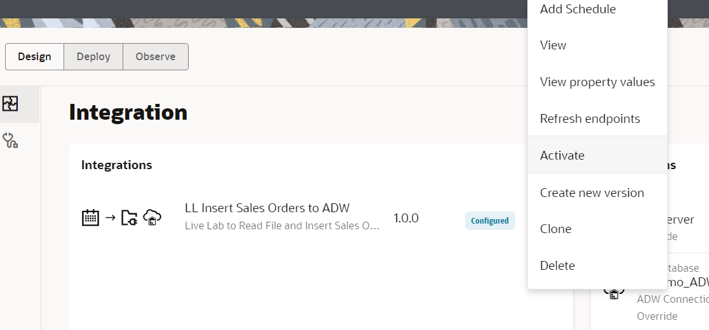

# Create an Integration flow

## Introduction

This lab will walk you through the steps to create an end-to-end integration of reading a file from the File Server and inserting the data set in an Oracle Autonomous (ADW) Table.


In this use case, an Event pattern in OIC is used to automate the transfer and processing of sales order data. The process begins by creating a sales orders file in an SFTP server. Once the file is created, file event triggers the integration process, use stage file action to read the file and it goes through necessary transformations or validations in OIC to prepare the data for database insertion.

The Oracle Autonomous Transaction Processing adapter in OIC simplifies inserting the data into the database. Here’s how it works:

## Components Involved

1.Oracle Integration Cloud (OIC):

Acts as the central platform for orchestrating the integration flow.

2.OIC Embedded SFTP Server:

Files are securely created or uploaded here as the source input.

3.File Event Trigger (OIC):

Monitors the embedded SFTP server and triggers the integration process when a new file arrives.

4.Stage File Action (Read File Content):

Reads the contents of the incoming file for further processing.

5.Data Mapping & Transformation:

Transforms and maps the raw file data into a structure suitable for ADW.

6.Oracle ATP Connection (via ATP Adapter):

Establishes a secure connection from OIC to Oracle ATP using the ATP adapter.

7.Oracle ATP Database Table:

The transformed data is inserted into the target database table in ATP

Estimated Time: 15 minutes

### Objectives

In this lab, you will execute the following:

- Create an event based integration flow
- Add the Stage File action
- Add the ATP invoke activity
- Map data between Source File structure and ATP invoke
- Define Tracking Fields
- Activate the integration

### Prerequisites

This lab assumes you have:

- Completed all the previous labs.

## Task 1: Create an event based integration flow

We will start by creating a new integration and adding some basic info.

1. In the left Navigation pane, click ***Projects***, click on the project which you have created.
    You can please skip this step if you are already in the project.
2. In the **Integrations** section, click ***Add***.
3. On the *Add integration* dialog, click ***Create***.
4. On the *Create integration* dialog, Click on ***Event***
5. In the *Create integration* dialog, enter the following information:

    | **Element**        | **Value**          |
    | --- | ----------- |
    | Name         | `File Event to ATP`       |
    | Description  | `Live Lab to Read File and Insert Sales Orders to ATP` |
    {: title="Create integration"}

    Accept all other default values.

6. Click **Create**.
7. Click **System** on the *Choose event* dialog, expand **File Server**, select **File created**, click **Choose** and click on **Add Filter**  and provide the sample json given below. You may modify the file name and path as per your use case.

    ```
<copy>
    {"type":"jq_filter","filter-def":".data.path==\"/upload/users/your oic usernumber\" and (.data.name | endswith(\".json\")) "}
</copy>
    ```

8. Click **Validate**, Click **<(Back)**,  Click **Finish**.
7. Optional, Select Layout to ***Horizontal*** and click **Save** to apply changes.

## Task 2: Get the file reference using File server native action

1. Hover over the outgoing arrow for the **Filecreated1** activity and Click the ***+*** sign in the integration canvas.
Search for the **File server** activity and click on it. This invokes  the Configuration Wizard.
2. On the **Basic Info** page,
    - for the **What do you want to call your endpoint?** element, enter ***readfileref***
    - for the **Select resource** element, select ***File***
    - for the **Select operation** element, select ***Get File Reference***
    - for the **Input Directory** element, enter ***"/"***
    - for the **File Name** element, select ***"temp.csv"***
    - Click ***Continue***.
3. Review the summary and click ***Finish***
4. Click ***Save*** to persist changes
    

## Task 3: Define the Data Mapping

1. Select the action **Map readfileref** and click on **...** and click on **Edit**
2. In the Source section, expand **FileCREATED1 Request**, expand **Request Wrapper**
3. In the Target section, expand the **readfileref Request**, expand **Query Parameters**
   - Map the following fields from the Sources section to the fields in the Target section
  | **Field**        | **Value**|
  | --- | ----------- |
  | Path         | Directory|
  | Name         | File Name|

  - Click on ***Validate***.
     - A confirmation message appears.
  - Click ***&lt; (Go back)***
  - Click ***Save*** to persist changes.

## Task 4: Read the file from Stage
1. Hover over the outgoing arrow for the **File Server readfileref** activity and Click the ***+*** sign in the integration canvas.
Search for the **Stage File** activity and click on it. This invokes Stage File Configuration Wizard.
2. On the **Basic Info** page,
    - for the **What do you want to call your endpoint?** element, enter ***readfile***
    - Click ***Continue***.
3. On the **Configure Operation** page,
    - for the **Choose Stage File Operation** element, select ***Read Entire File***
    - for the **Configure File Reference** element, select ***"yes"***
    - for the **Specify the File Reference** element, click ***Switch to Developer View***, drag and drop ***fileReference*** from the ***readfileref***
    - Click ***Continue***.
4. On the **Schema Options** page,
      - Click ***Continue***.
5. On the **Format Definition** page,
      - click ***Drag and Drop*** and select the ***sales.csv*** which you have downloaded
      - for the **Enter Record Name**, enter ***salesorder***
      - for the **Enter Record Name**, enter ***SalesOrderSet***
      - Click ***Continue***.
6. Review the summary and click ***Finish***
7. Click ***Save*** to persist changes 


## Task 3: Add the ADW invoke activity

Add the Oracle Autonomous Data Warehouse Adapter invoke to the integration canvas.

1. Hover your cursor over the outgoing arrow of *downloadSalesOrders* activity in the integration canvas to display the ***+*** sign. Click the **+** sign and select the ADW connection created in the previous lab.

    

    This invokes the Oracle Autonomous Data Warehouse Endpoint Configuration Wizard.

2. On the *Basic Info* page, select the following values:

    | **Element**        | **Value**          |
    | --- | ----------- |
    | What do you want to call your endpoint? | **insertSalesOrders**       |
    | What operation do you want to perform? | **Perform Bulk Data Import Operation** |
    {: title="ADW Basic Info"}

    - Click **Continue**

3. On the *Bulk load from Object Storage to ATP table* page, select the following values:

    | **Element**        | **Value**          |
    | --- | ----------- |
    | Select Bucket | **bulk-orders** (Select the Object Storage bucket that was created in previous lab)  |
    | Delete file from object store after operation completion | **Deselect** |
    | Select Schema | **ADMIN** |
    | Select Table | Select **V\_SALES\_ORDERS**|
    | Table columns | Click on  to move all the fields to the *Selected* box|
    {: title="Object Storage Info"}

    

    > **Note:** The order of the columns should match the input sales_order.csv data

4. Click on **Edit**, in the *Bulk load from Object storage to ATP table* page in the section *Review and specify the copy_data format options*.

    

    In the *copy_data format Options* page Provide the following values:

    | **Element**        | **Value**          |
    | --- | ----------- |
    | Delimiter | **Comma** |
    | Skip Headers | **1** |
    {: title="Data format"}

    

    Leave the rest of the values as default and Select **Ok**.

5. Click **Continue**

6. On the Summary page, review the configuration and click **Finish**.

    

7. Click **Save** to apply changes.

## Task 4: Map data between FTP Invoke and ADW invoke

Use the mapper to drag fields from the source structure (downloadSalesOrders Response)  to the target structure (insertSalesOrders) to map elements between the two.

When we added the ADW invoke to the integration, a map icon was automatically added.

1. Hover your cursor over the *Map insertSalesOrders* **Mapper** icon, click once, then select **Edit**.
   

2. Use the mapper to drag element nodes in the source FTP Invoke Response structure to element nodes in the target Oracle ADW structure.

    Expand the **Source** node:

        downloadSalesOrders Response(FTP) > Download File To ICS Response > Download Response > ICSFiles > ICSFile

    Expand the **Target** node:

    insertSalesOrders Request

    Complete the mapping as below:

    | **Source** *(downloadSalesOrders Response FTP)*        | **Target** *(insertSalesOrdersRequest Oracle ADW)* |
    | --- | ----------- |
    | FileReference | FileReference |
    {: title="Map"}

   

3. Click **Validate**, then wait for the confirmation message *Map to insertSalesOrders successfully validated.*

4. Click **&lt; (Go back)**
    

5. Click **Save** to persist changes.

## Task 5: Define Tracking Fields

1. Manage business identifiers that enable you to track fields in messages during runtime.

    > **Note:** If you have not yet configured at least one business identifier **Tracking Field** in your integration, then an error icon is displayed in the design canvas.
    

2. Click the **Business Identifiers icon** on the top right.
    

3. From the *Source* section, expand **schedule**. Drag the **startTime** field from source and drop into the *Business Identifier Field* section:

    

4. Click **Business Identifiers icon** to hide the dialog.
5. Click on **Save** to apply your changes.
6. On the Integration canvas, click **&lt; (Go back) button** to go back to the list of integrations page.
    

## Task 6: Activate the integration

1. In the **Integrations** section, Click on **...** of the Integration and click the **Activate** icon
    

2. In the *Activate Integration* dialog, select **Debug** as tracing level.

3. Click **Activate**.

    The activation will be complete in a few seconds. Once activation is successful, the status of the integration changes to *Active* OR try to refresh the page so that you could see the updated status.

You may now **proceed to the next lab**.

## Learn More

- [Getting Started with Oracle Integration](https://docs.oracle.com/en/cloud/paas/application-integration/index.html)

## Acknowledgements

- **Author** - Kishore Katta, Product Management - Oracle Integration
- **Author** - Subhani Italapuram, Oracle Integration Product Management
- **Last Updated By/Date** - Subhani Italapuram, November 2024
