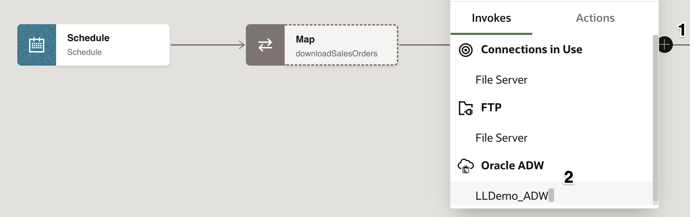
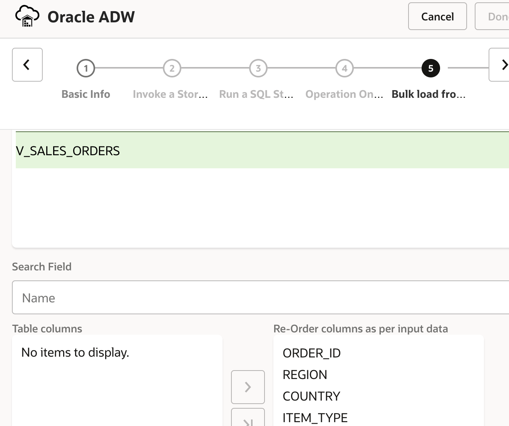
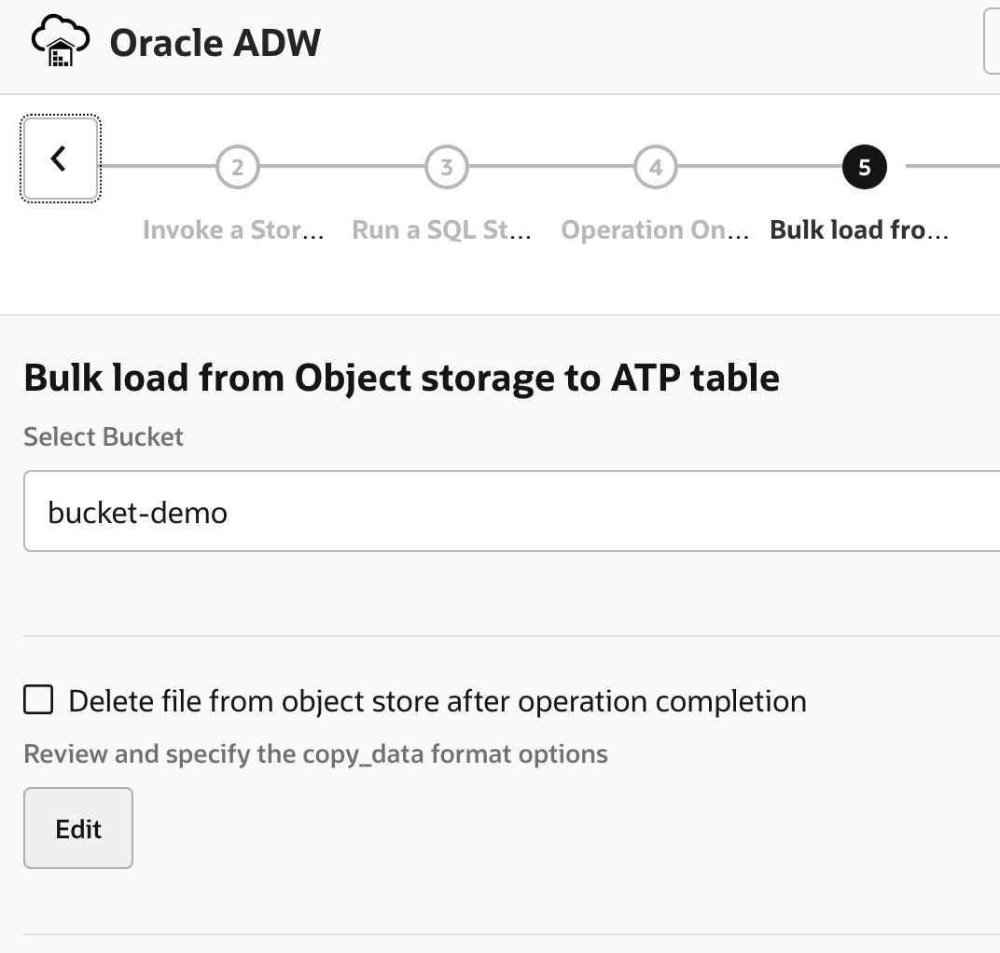
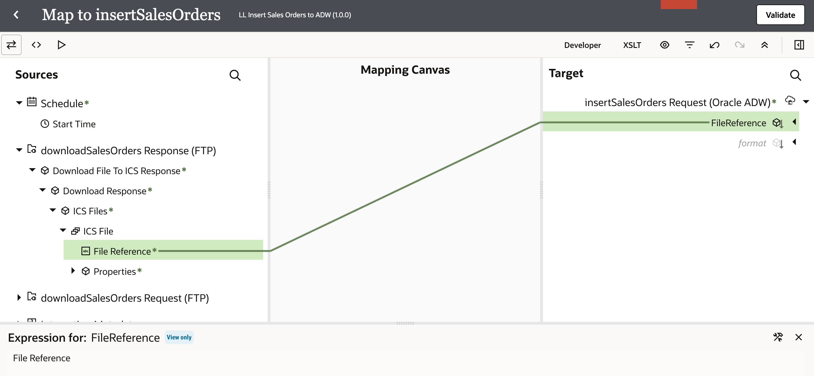
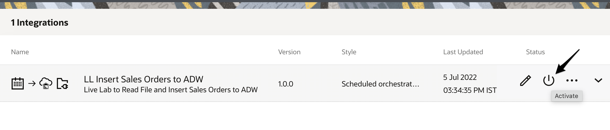

# Create an Integration flow

## Introduction

This lab will walk you through the steps to create an end-to-end integration of reading a file from the File Server and inserting the data set in an Oracle Autonomous (ADW) Table.


In this use case, a scheduled orchestration pattern in OIC is used to automate the transfer and processing of sales order data. The process begins by reading a sales orders file from an SFTP server at scheduled intervals. Once the file is retrieved, it goes through necessary transformations or validations in OIC to prepare the data for database insertion.

The Oracle Autonomous Database adapter in OIC simplifies bulk data loading by leveraging an Object Storage staging area. Here’s how it works:

1. **File Staging**: Instead of directly inserting each record individually, the adapter stages the processed file in an Oracle Object Storage location. This staging reduces the overhead on the database by pre-loading the data into a format suited for bulk operations.

2. **Bulk Data Import**: Using the pre-configured object storage location, the adapter then performs a bulk import into the Autonomous Database. This approach optimizes performance, making it highly efficient for large volumes of sales order data.

3. **Database Insertion**: Once staged, the sales order data is inserted into the appropriate tables in the Oracle Autonomous Database, making the data readily available for further analysis, reporting, or business applications.

This integration approach ensures efficient and scalable handling of large data volumes, minimizes manual intervention, and enables reliable data transfer between systems. It is especially useful for organizations that need to frequently process and analyze sales order data from various sources.

Estimated Time: 15 minutes

### Objectives

In this lab, you will execute the following:

- Initiate a Scheduled integration flow
- Configure FTP Adapter
- Add the ADW invoke activity
- Map data between Source File structure and ADW invoke
- Define Tracking Fields
- Activate the integration

### Prerequisites

This lab assumes you have:

- Completed all the previous labs.

## Task 1: Initiate a Scheduled Integration Flow

We will start by creating a new integration and adding some basic info.

1. In the left Navigation pane, click ***Projects***, click on the project which you have created.
    You can please skip this step if you are already in the project.
2. In the **Integrations** section, click ***Add***.
3. On the *Add integration* dialog, click ***Create***.
4. On the *Create integration* dialog, Click on ***Schedule***
5. In the *Create integration* dialog, enter the following information:

    | **Element**        | **Value**          |
    | --- | ----------- |
    | Name         | `LL Insert Sales Orders to ADW`       |
    | Description  | `Live Lab to Read File and Insert Sales Orders to ADW` |
    {: title="Create integration"}

    Accept all other default values.

6. Click **Create**.
7. Optional, Select Layout to ***Horizontal*** and click **Save** to apply changes.
    

## Task 2: Define FTP Invoke Activity

Add FTP Invoke to integration canvas.

1. Hover over the outgoing arrow from the *Scheduled* activity and Click the **+** sign in the integration canvas.

2. Select the configured FTP Adapter connection which is created in the previous lab. This invokes the FTP Adapter  Configuration Wizard.

3. On the *Basic Info* page,
    - for *What do you want to call the endpoint?* element, enter **downloadSalesOrders**. Leave the rest as defaults.
    - Click **Continue**

4. On the *Operations* page, Select the following values:

    | **Element**        | **Value**          |
    | --- | ----------- |
    | Select Operation        | **Download File**       |
    | Select a Transfer Mode  | **Binary** |
    | Input Directory | ***/upload/users/```<<your oic usernumber>>```*** |
    | File Name | **sales_orders.csv** |
    | Download Directory | **/tmp/stage** |
    {: title="File Server Operations"}

    

    - Click **Continue**

5. On the *Summary* page, review the configuration and click **Finish**.

6. Click on **Save** to apply your changes.

    

## Task 3: Add the ADW invoke activity

Add the Oracle Autonomous Data Warehouse Adapter invoke to the integration canvas.

1. Hover your cursor over the outgoing arrow of *downloadSalesOrders* activity in the integration canvas to display the ***+*** sign. Click the **+** sign and select the ADW connection created in the previous lab.

    

    This invokes the Oracle Autonomous Data Warehouse Endpoint Configuration Wizard.

2. On the *Basic Info* page, select the following values:

    | **Element**        | **Value**          |
    | --- | ----------- |
    | What do you want to call your endpoint? | **insertSalesOrders**       |
    | What operation do you want to perform? | **Perform Bulk Data Import Operation** |
    {: title="ADW Basic Info"}

    - Click **Continue**

3. On the *Bulk load from Object Storage to ATP table* page, select the following values:

    | **Element**        | **Value**          |
    | --- | ----------- |
    | Select Bucket | **bulk-orders** (Select the Object Storage bucket that was created in previous lab)  |
    | Delete file from object store after operation completion | **Deselect** |
    | Select Schema | **ADMIN** |
    | Select Table | Select **V\_SALES\_ORDERS**|
    | Table columns | Click on  to move all the fields to the *Selected* box|
    {: title="Object Storage Info"}

    

    > **Note:** The order of the columns should match the input sales_order.csv data

4. Click on **Edit**, in the *Bulk load from Object storage to ATP table* page in the section *Review and specify the copy_data format options*.

    

    In the *copy_data format Options* page Provide the following values:

    | **Element**        | **Value**          |
    | --- | ----------- |
    | Delimiter | **Comma** |
    | Skip Headers | **1** |
    {: title="Data format"}

    

    Leave the rest of the values as default and Select **Ok**.

5. Click **Continue**

6. On the Summary page, review the configuration and click **Finish**.

    

7. Click **Save** to apply changes.

## Task 4: Map data between FTP Invoke and ADW invoke

Use the mapper to drag fields from the source structure (downloadSalesOrders Response)  to the target structure (insertSalesOrders) to map elements between the two.

When we added the ADW invoke to the integration, a map icon was automatically added.

1. Hover your cursor over the *Map insertSalesOrders* **Mapper** icon, click once, then select **Edit**.
   

2. Use the mapper to drag element nodes in the source FTP Invoke Response structure to element nodes in the target Oracle ADW structure.

    Expand the **Source** node:

        downloadSalesOrders Response(FTP) > Download File To ICS Response > Download Response > ICSFiles > ICSFile

    Expand the **Target** node:

    insertSalesOrders Request

    Complete the mapping as below:

    | **Source** *(downloadSalesOrders Response FTP)*        | **Target** *(insertSalesOrdersRequest Oracle ADW)* |
    | --- | ----------- |
    | FileReference | FileReference |
    {: title="Map"}

   

3. Click **Validate**, then wait for the confirmation message *Map to insertSalesOrders successfully validated.*

4. Click **&lt; (Go back)**
    

5. Click **Save** to persist changes.

## Task 5: Define Tracking Fields

1. Manage business identifiers that enable you to track fields in messages during runtime.

    > **Note:** If you have not yet configured at least one business identifier **Tracking Field** in your integration, then an error icon is displayed in the design canvas.
    

2. Click the **Business Identifiers icon** on the top right.
    

3. From the *Source* section, expand **schedule**. Drag the **startTime** field from source and drop into the *Business Identifier Field* section:

    

4. Click **Business Identifiers icon** to hide the dialog.
5. Click on **Save** to apply your changes.
6. On the Integration canvas, click **&lt; (Go back) button** to go back to the list of integrations page.
    

## Task 6: Activate the integration

1. In the **Integrations** section, Click on **...** of the Integration and click the **Activate** icon
    

2. In the *Activate Integration* dialog, select **Debug** as tracing level.

3. Click **Activate**.

    The activation will be complete in a few seconds. Once activation is successful, the status of the integration changes to *Active* OR try to refresh the page so that you could see the updated status.

You may now **proceed to the next lab**.

## Learn More

- [Getting Started with Oracle Integration](https://docs.oracle.com/en/cloud/paas/application-integration/index.html)

## Acknowledgements

- **Author** - Kishore Katta, Product Management - Oracle Integration
- **Author** - Subhani Italapuram, Oracle Integration Product Management
- **Last Updated By/Date** - Subhani Italapuram, Sep 2025
