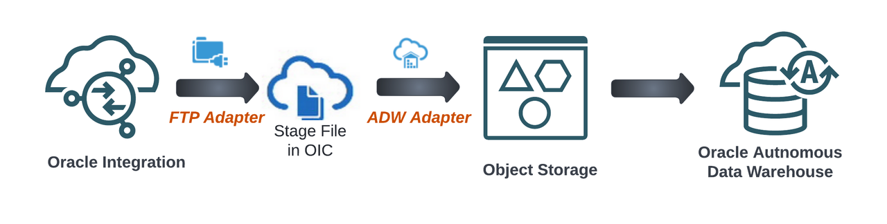

# Introduction

## About this Workshop

In this workshop, we shall talk about provisioning Oracle Integration 3 instance, enabling File Server, provisioning Oracle Autonomous Database and then how to create  connections for File Server and Oracle Autonomous Database using Oracle Integration.

This workshop will walk you through the steps to create an end-to-end integration of reading a file from the File Server and inserting the data set in an Oracle Autonomous Date Warehouse(ADW) Table leveraging out of the box adapters.

Estimated Time: 50 minutes

### What is Oracle Integration 3?

Integration is a fundamental part of your digital business development. It involves connecting on-premises applications and cloud applications and services. Oracle Integration makes it easy to connect your applications and automate end-to-end processes such as procure to pay, inquiry to order, and hire to retire.

[First Glimpse - Oracle Integration 3](youtube:yW3TEBWkFbg)

Critical business processes, such as those related to human capital management (HCM), customer experience (CX), and enterprise resource planning (ERP), are frequently slow and inflexible. For example, a multi-step process such as Lead to Opportunity to Quote to Order can involve four or more applications and require human exception management at every step of the process. In this scenario, the lack of integration between departments as well as the delays caused by human-based problem resolution can result in lost revenue, frustrated customers, and high costs.

Oracle Integration changes all that. It empowers you to:

- Establish connectivity between the many applications and people that are part of the entire business process life cycle.

- Assemble existing technologies into new business services to better align with the changing pace of new business demands.

- Deliver new business innovations faster by rapidly connecting diverse applications and key business roles.

- Gain 360-degree views across your entire business. Easily monitor and analyze every application, integration, and workflow spanning the business process life cycle.

### Objectives

In this workshop, you will learn how to:

- Provision Oracle Integration 3 in Oracle Cloud Infrastructure
- How to enable the File Server in Oracle Integration 3 instance.
- Provision Oracle Autonomous Database in Oracle Cloud Infrastructure
- Learn several Integrations specific concepts
- Creating a Project
- Creating Connections
- Design a Scheduled Integration Flow
- Test and Monitor Integration Flow

### Prerequisites

- An Oracle Free Tier or Paid Cloud Account.
- A Chrome browser.

You may now **proceed to the next lab**.

## Learn More

- [Getting Started with Oracle Integration 3](https://docs.oracle.com/en/cloud/paas/application-integration/index.html)

## Acknowledgements

- **Author** - Kishore Katta, Technical Director, Oracle Integration Product Management
- **Author** - Subhani Italapuram, Technical Director, Oracle Integration Product Management
- **Last Updated By/Date** - Subhani Italapuram, Sep 2024
