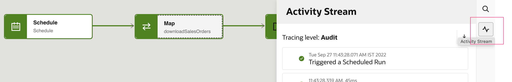
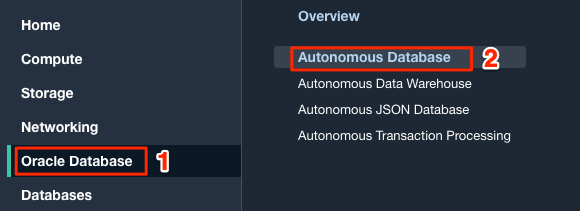
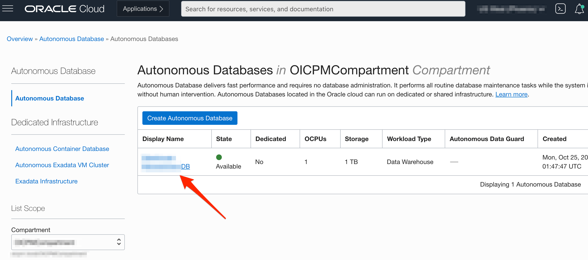
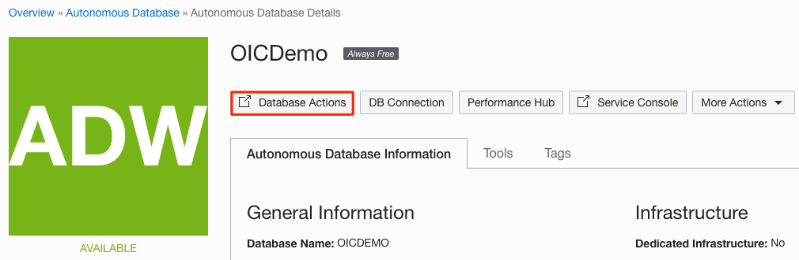
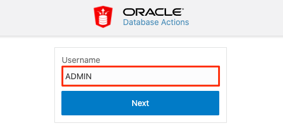
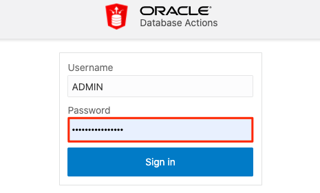
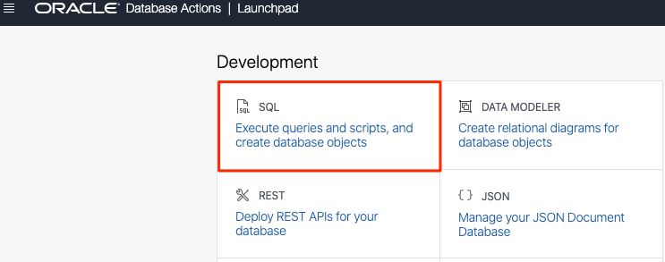

# Run end-to-end Integration Flow

## Introduction
This lab will walk you through the steps to run the integration flow.

Estimated Time: 10 minutes

### Objectives
In this lab, you will:
- Create a file in the File Server
- Execute an adhoc run of Scheduled Integration Flow
- Track message flow triggered
- Verify the sales orders records in ADW Table
- Verify the sales orders file in Object Storage

### Prerequisites
This lab assumes you have:
- Completed all previous labs successfully


## Task 1: Create a sales order file in the File Server

1.  Copy the below data set in a file **sales_orders.csv** and save it to your desktop.

    ```
    <copy>
    Order ID,Region,Country,Item Type,Sales Channel,Order Priority,Order Date,Ship Date,Units Sold,Unit Price,Unit Cost,Total Revenue,Total Cost,Total Profit
    66000001,Australia and Oceania,Tuvalu,Baby Food,Offline,H,28-May-2010,27-Jun-2010,9925,255.28,159.42,2533654,1582243.5,951410.5
    66000002,Central America and the Caribbean,Grenada,Cereal,Online,C,22-Aug-2012,15-Sep-2012,2804,205.7,117.11,576782.8,328376.44,248406.36
    66000003,Europe,Russia,Office Supplies,Offline,L,2-May-2014,8-May-2014,1779,651.21,524.96,1158502.59,933903.84,224598.75
    66000004,Sub-Saharan Africa,Sao Tome and Principe,Fruits,Online,C,20-Jun-2014,5-Jul-2014,8102,9.33,6.92,75591.66,56065.84,19525.82
    66000005,Sub-Saharan Africa,Rwanda,Office Supplies,Offline,L,1-Feb-2013,6-Feb-2013,5062,651.21,524.96,3296425.02,2657347.52,639077.5
    </copy>
    ```

2.  Connect with File Server using any FTP Client example: FileZilla. Place the *sales_orders.csv* file in the folder **/home/users/`<your-folder-name>`/Output**

## Task 2: Run the Scheduled Integration Flow

Submit an adhoc run of Scheduled Integration Flow

1. From the *Integrations* page, hover over the Integration Flow, click on **...** (Actions) menu, click on **Run** and again click on **Run**.

    


2. Click on **Instance id** in the Confirmation Window which will Navigate to the **Tracking** page.

    

    > **Note:**  Alternatively, in the Integration navigation pane, Go to **Home page &gt; Observability &gt; Instances**

3.  From the *Instances* page, Click on the Integration Flow.

    

    The flow ran successfully if it is displayed with a green line.


4. In the *Activity Stream* window, click on the Messages which has **View Payload** icon to review the request and response messages of each and every activity.

5. Click on the **Activity Stream** again to close the activity stream.

    

## Task 3: Verify sales orders records in ADW Table
Follow these steps to view the sales orders record in the designated DB table.

1. If you are not already logged in to Oracle Cloud Console, log in and select **Autonomous Data Warehouse** from the navigation menu.

    

    > **Note:**  You can also directly access your Autonomous Data Warehouse or Autonomous Transaction Processing service in the **Quick Actions** section of the dashboard.

2. Navigate into your demo database by clicking on the instance link.

    

    > **Note:**  Similar steps apply to either Autonomous Data Warehouse or Autonomous Transaction Processing.

3. In your ADW Database Details page, click the **Database Actions** button.

    

4. Sign in with your database instance's default administrator account, Username = `ADMIN` and click **Next**.

   

5.  Enter the **ADMIN** password and click **Sign in**.

    

6. The Database Actions page opens. In the *Development* box, click **SQL** or right click on **SQL** and click on **Open Link in New Tab**.

    


7. The SQL Worksheet appears. In the *Navigator* on the left, select the **V\_SALES\_ORDERS** table, then right-click on **Open**.
    

    This opens the *ADMIN.V\_SALES\_ORDERS* table window.

8. Click on **Data** in the left menu to display the table data. Verify your inserted Sales Orders records.
   

## Task 4: Verify sales orders file in Object Storage

Verify sales orders file archived in OCI Object storage

1.  Navigate to *Oracle Cloud Console* Click the **Navigation Menu** in the upper left, navigate to **Storage**, and select **Buckets**.
    

2.  Select the **Compartment** and Click on the Bucket example: *bucket-demo* created earlier.

3.  In the list of *Objects* notice **sales_orders.csv** file uploaded. The object storage is used as intermediary storage to import data set in ADW. From the adapter configuration page, you can always select to delete the file after the operation if required.

    

**Congratulations!** You have learned how to download a file from File Server and bulk import data into ADW leveraging Out of the box ADW adapter capabilities. Thank you!

## Learn More

* [Activate Integration](https://docs.oracle.com/en/cloud/paas/application-integration/integrations-user/activate-and-deactivate-integrations.html)

* [Monitor Integration](https://docs.oracle.com/en/cloud/paas/application-integration/integrations-user/track-integration-instances.html#GUID-46A7C0A0-CBE4-4F1B-9B45-62A5AFA89D74)

## Acknowledgements
* **Author** - Kishore Katta, Product Management - Oracle Integration
* **Author** - Subhani Italapuram, Product Management - Oracle Integration
* **Last Updated By/Date** - Subhani Italapuram, Sep 2022
