# Lab Setup

## Introduction

This lab walks you through the setup required to complete the workshop.

Estimated Time: 15 minutes

### Objectives
In this lab, you will:
- Obtain Database Connection details
- Create Database Table using a SQL script
- Create OCI Object Storage Bucket
- Configure File Server
- Connect to File Server using FTP Client


### Prerequisites
This lab assumes you have:
- Completed all the previous labs.


## Task 1: Create a database table using a SQL script
Follow these steps to create a DB table which will be used as part of this workshop.

1.  If you are not already logged in to SQL Worksheet, on your ADW Database Details page, click the **Database Actions** button.

    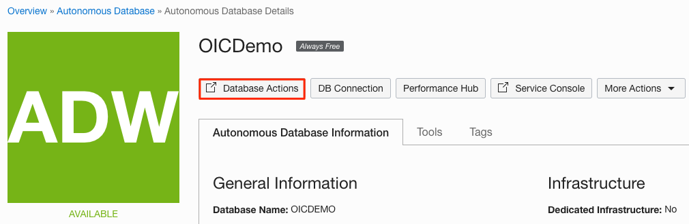

    > **Note:** If you are redirected to the Database Actions page, then skip to Step 4. Otherwise, follow the next step to log in manually.  

2. A sign-in page opens for Database Actions. For this lab, simply use your database instance's default administrator account `ADMIN` and click **Next**.

   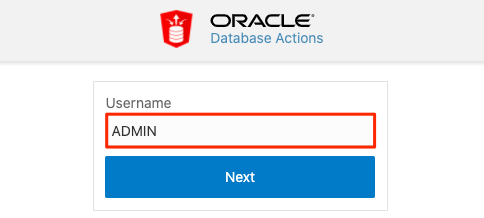

3.  Enter the **ADMIN** password you specified when creating the database and click **Sign in**.

    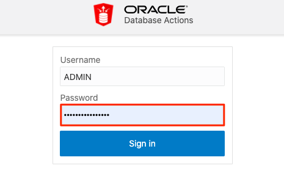

4. The Database Actions page opens. In the *Development* box, click **SQL**.

    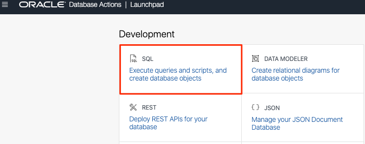

    > **Note:** If this is the very first time you open the SQL Action, then a click-demo will be displayed. Just hit the **X** button to proceed.

5. The SQL Worksheet appears. Before you proceed with the SQL Worksheet, copy below code snippet:
    ```
    <copy>
    CREATE TABLE v_sales_orders
    (
       order_id       INTEGER NOT NULL PRIMARY KEY,
       region         VARCHAR(33),
       country        VARCHAR(21),
       item_type      VARCHAR(15),
       sales_channel  VARCHAR(7),
       order_priority VARCHAR(1),
       order_date     DATE,
       ship_date      DATE,
       units_sold     INTEGER,
       unit_price     NUMERIC(6, 2),
       unit_cost      NUMERIC(6, 2),
       total_revenue  NUMERIC(10, 2),
       total_cost     NUMERIC(10, 2),
       total_profit   NUMERIC(10, 2)
    );
    </copy>
    ```

6. Paste the script in the SQL Worksheet, then click **Run It** button. This will create the **V\_SALES\_ORDERS** table. The table is created successfully when you see the notification in the *Script Output* window.

    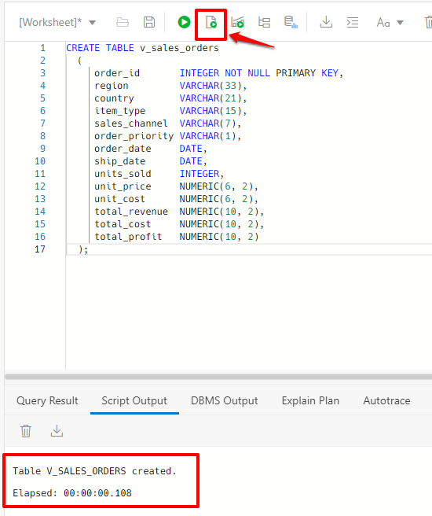

Now you have an external table which will be used in the Integration flow.

## Task 2: Create Object Storage Bucket

1.  Navigate to *Oracle Cloud Console* Click the **Navigation Menu** in the upper left, navigate to **Storage**, and select **Buckets**.
    

2.  Select the compartment that you want to create your bucket in.
    Click **Create Bucket**

3.  Fill out the dialog box:
      - Bucket Name: Provide a name
      - Default Storage Tier: Standard

4.  Click **Create**
    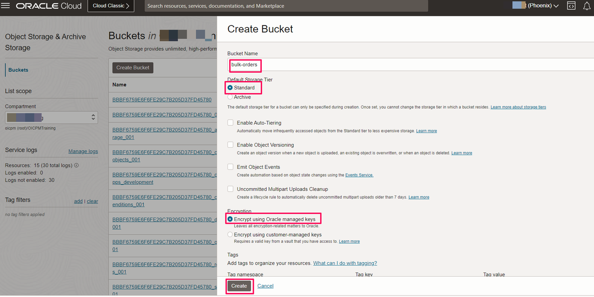

## Task 3: Obtain Database Connection details
1. If you are not already logged in to Oracle Cloud Console, log in and select **Autonomous Database** from the navigation menu under Oracle Database.

    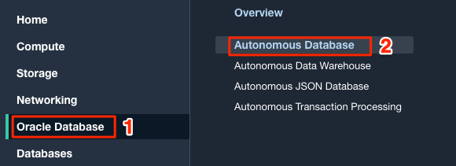

    > **Note:** You can also directly access your Autonomous Data Warehouse or Autonomous Transaction Processing service in the **Quick Actions** section of the dashboard.

2. Navigate into your demo database by clicking on the instance link.

    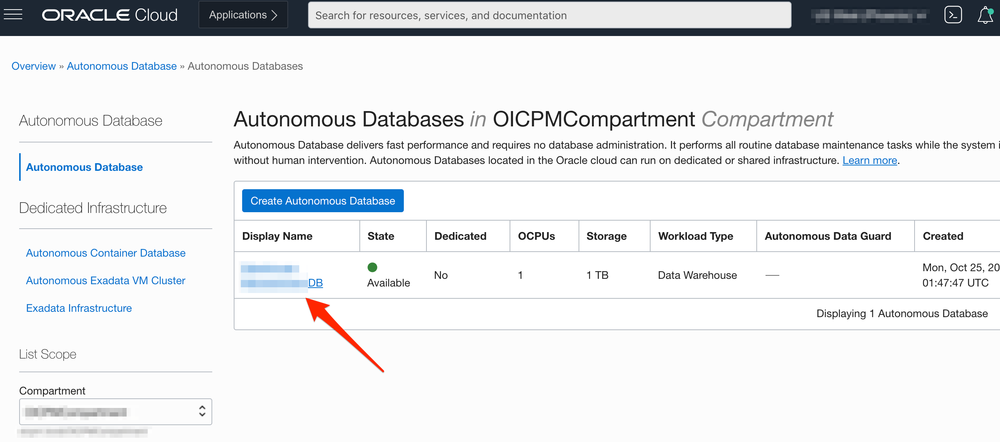

    > **Note:** Similar steps apply to both Autonomous Data Warehouse and Autonomous Transaction Processing.

3.  On your Autonomous Database Details page, click the **DB Connection** button.

    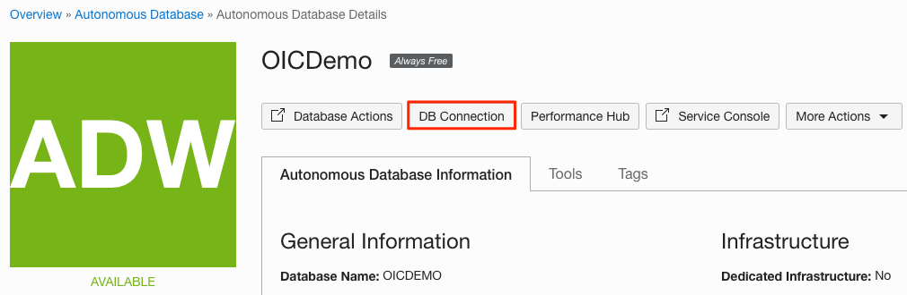

4. In the displayed *Database Connection* dialog, click **Download Wallet**.

5. Provide a Wallet password, then click **Download**. Save the wallet file (ZIP) on your local machine. This file will be used later when creating the Autonomous Database connection in Oracle Integration.

6. Under *Connection Strings*, select one of the *TNS Name* entries and write it down. This value will be used later when creating the Autonomous Database connection in Oracle Integration.

    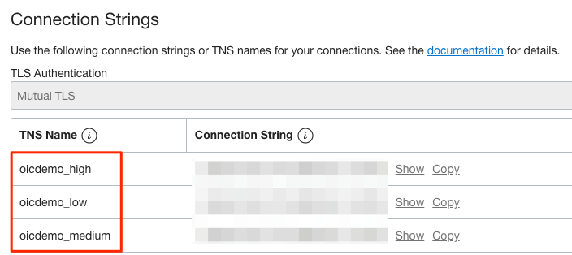

7. Click **Close**.

8.  We need Object Storage Region. In Oracle Cloud Console Navigate to **Regions** from the Top Banner. Select **Manage Regions**. Make a note of the **Region Identifier** (example: us-ashburn-1) where the Object Storage Bucket is created.

    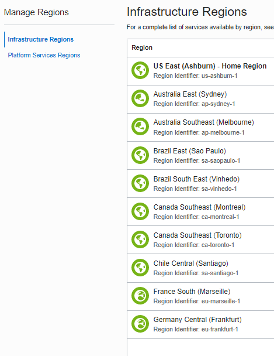

9.  We need *Object Storage Tenancy OCID*. In Oracle Cloud Console Navigate to **Profile** at the Right Top Corner. Select **Tenancy:<your-tenant-id>** . On the Tenancy Details page make a note of *OCID*. We need this to Create Autonomous Database connection in Oracle Integration

10.  We need *Object Storage Compartment OCID*. In Oracle Cloud Console Navigate to **Identity & Security > Compartments**. Select the Compartment in which Object Storage bucket is created in the previous task. On the Compartment Details page make a note of *OCID*.

11. We need one more detail which is *Object Storage User OCID*. In Oracle Cloud Console Navigate to **Profile** at the Right Top Corner. Select your **username**. On the User details page make a note of *OCID*.

12. In the *User Details* page from the *Resources* sections Select **API Keys**. Click on **Add API Key**.

13. In the *Add API Key Page* Select **Generate API Key Pair** and Click on **Download Private Key**. This downloads the RSA Key pair in PEM format. Select **Add**. We need the Private key file for Database Connection later.

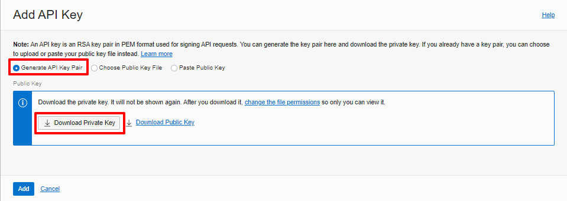

14. The *API Key* is added to the List of API Keys. Make a note of **Fingerprint**

## Task 4: Configure File Server

Configure File Server settings. This is required as you are using Embedded File Serve of Oracle Integration and using File Server as a target application in your integration flow.

1. Starting at the Oracle Integration *Home* page, select **Settings**, then **File Server** from the left Navigation pane.
2. Select **Settings** from the left Navigation pane to open the File Server Settings page and review the File Server status and configurations. Make a note of IP and port number.
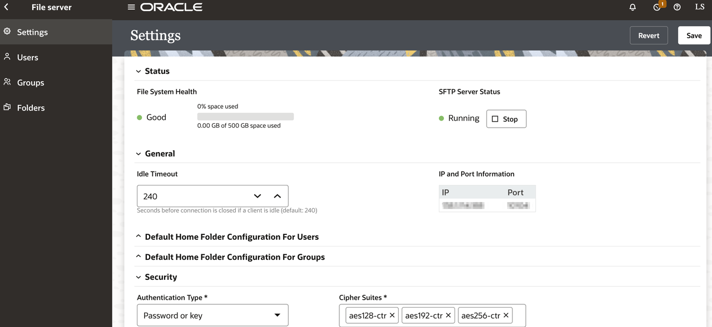
**Note**: Ensure the *Authentication Type* is set to **Password or Key**.
3. Select **Files** from left Navigation pane.

4. Click on **home**, click on **users**, click on your username and from the top right click **Create** and create a Folder named **Output**.
5. Click on **Permissions** on the **Output** Folder
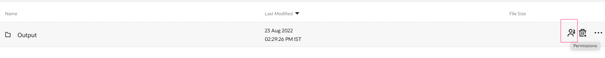
**Note**: You will be using the above Folder structure in the lab.
10. Click **Add Permissions** and select your user. Click **Add**.
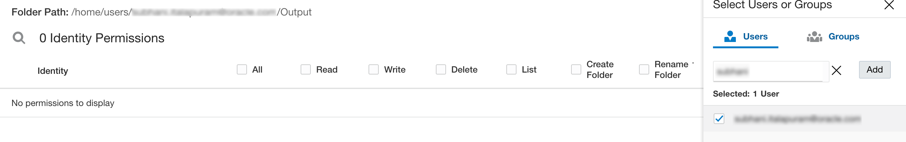
11. Select **All** and **Propagate to subfolders**. All of the permission checkboxes should be checked. Click **Save** and exit the Permissions page.
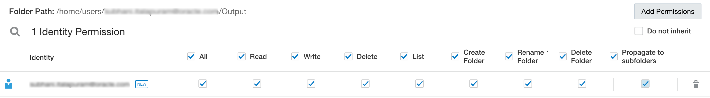

## Task 5: Connect to File Server with FTP Client

To access files on the File Server you will need to use an FTP Client. You will need to configure your FTP Client with the following:

* File Server IP Address.
* File Server Port.
* Your Oracle Integration username.
* Your Oracle Integration password.

1. To obtain the File Server IP Address and Port, select **Settings** from the left Navigation pane. The IP and Port are located in the *IP and Port Information* section of the *Settings* page.
2. Using your FTP Client choice, connect to the File Server using the SFTP - SSH File Transfer Protocol.  

An example configuration using FileZilla FTP Client.  
If the permissions are configured correctly, you should be able to list, read, and write files on the *Output* folder.


You may now **proceed to the next lab**.


## Acknowledgements
* **Author** - Kishore Katta, Product Management - Oracle Integration
* **Last Updated By/Date** - Kishore Katta, May 2022
