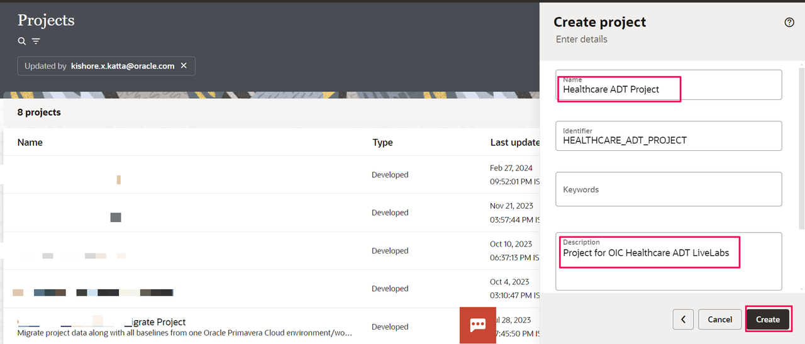
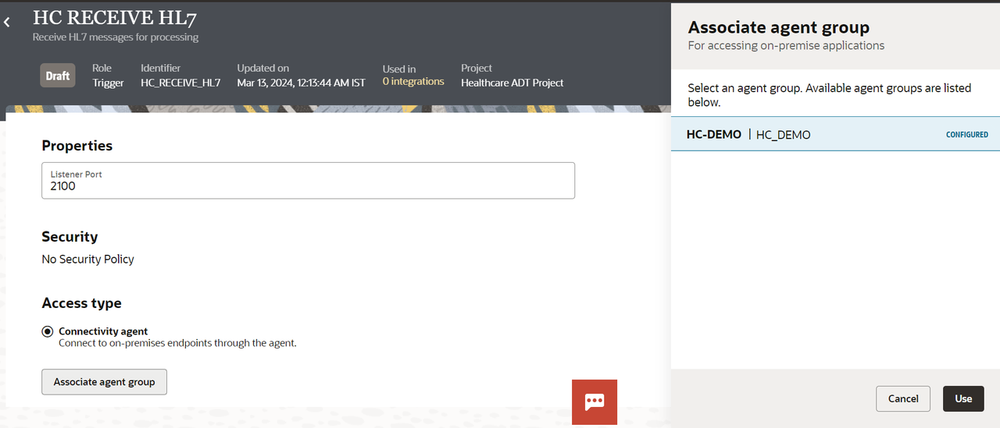
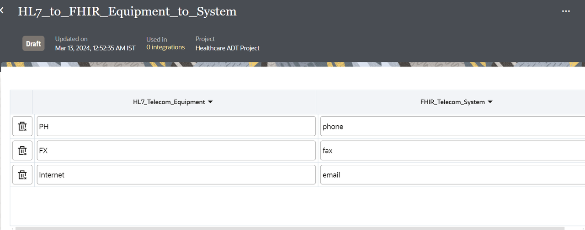
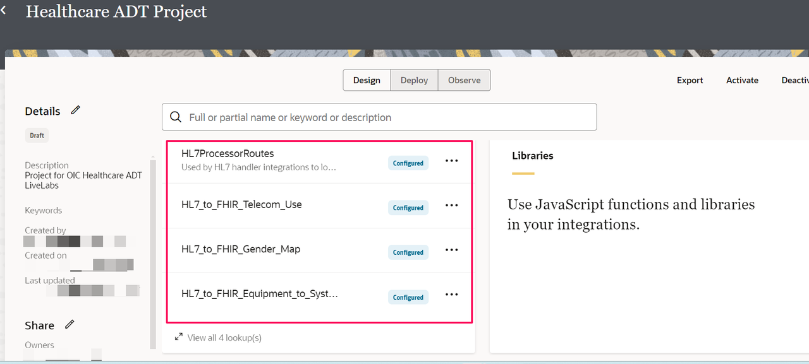

# Create Connections

## Introduction

This Lab will walk you through the steps to create an MLLP Adapter connection and REST adapter connection.

Estimated Time: 60 minutes

### Objectives
In this lab, you will:
- Create an MLLP Adapter Connection to Receive from HL7 EMR system and Send Messages to Pathology systems
- Create a REST Adapter connection  to invoke a FHIR Test Server available in public repository
- Create lookups to map telecom use, gender, equipment to system and processor routes
- Create Documents based on Standard HL7 2.3.1 and 2.5 schema

### Prerequisites
This lab assumes you have:
- Completed all the previous labs.

## Task 1: Create Healthcare Project
Create a Project which provides a single unified workspace for all stakeholders to design, manage, and monitor integrations. Additionally, projects provide robust life-cycle management.

1. In the left Navigation pane of OIC, Click *Projects* and Click *Add*, then *Create*

2. In the **Create Project** dialog, enter the following information and click on *Create*:

| **Field**        | **Value**          |       
| --- | ----------- |
| Name         | Healthcare ADT Project     |
| Identifier         | Generated automatically       |
| Description  | Project for OIC Healthcare ADT LiveLabs |
{: title="Create Project"}

## Task 2: Create MLLP Trigger Connection
Create a connection using MLLP Adapter. The MLLP Adapter provides the following capabilities:
- Works in conjunction with the healthcare action to provide the following integration support
  - Incoming (trigger) - For scenarios in which the healthcare action translates an HL7 formatted-message to an XML message understood by Oracle Integration
  - Outgoing (invoke) - For scenarios in which the healthcare action translates an XML message to an HL7-formatted message understood by the HL7 application.

Runs directly in the connectivity agent to support connectivity to remote healthcare applications such as emergency medical records (EMRs), hospital management systems, laboratory information systems, and others.

1. In the **Project** page, select *Add* from the **Connections** tile.

2.  From the List of Adapters, search for **MLLP** and Select *MLLP* adapter.

3. In the **Create Connection** page provide below and click *Create*

| **Field**        | **Value**          |       
| --- | ----------- |
| Name         | HC RECEIVE HL7     |
| Identifier         | Generated automatically       |
| Role         | Trigger      |
| Description  | Receive HL7 messages for processing |
{: title="Create Connection"}

5. In the Connection Configuration page provide below information

| **Field**        | **Value**          |       
| --- | ----------- |
| Listener Port         | 2100      |
| Role         | Trigger      |
| Connectivity Agent  | Select *Associate agent group* and the Select Agent Group configured in the previous section. Click *Use* |
{: title="MLLP Trigger Connection Configuration"}

6. Click *Save* and *Test* the connection. Exit the connection canvas by clicking the back button on the top left side of the screen.

## Task 3: Create MLLP Invoke Connection
Create a connection using MLLP Adapter.

1. In the **Project** page, select *Add* from the **Connections** tile.

2.  From the List of Adapters, search for **MLLP** and Select *MLLP* adapter.

3. In the **Create Connection** page provide below and click *Create*

| **Field**        | **Value**          |       
| --- | ----------- |
| Name         | HC SEND HL7     |
| Identifier         | Generated automatically       |
| Role         | Invoke      |
| Description  | Send HL7 messages to Pathology system |
{: title="Create Connection"}

5. In the Connection Configuration page provide below information

| **Field**        | **Value**          |       
| --- | ----------- |
| Client IP         | 127.0.0.1   |
| Client Port         | 2500      |
| Connectivity Agent  | Select *Associate agent group* and the Select Agent Group configured in the previous section. Click *Use* |
{: title="MLLP Invoke Connection Configuration"}

6. Click *Save* and *Test* the connection. Exit the connection canvas by clicking the back button on the top left side of the screen.

## Task 4: Create Processor REST Interface Trigger
Create a connection using REST Adapter to Interface Processor Child Integration.

1. In the **Project** page created previously, select *Add* from the **Connections** tile.

2.  From the List of Adapters, search for **REST** and Select *REST* adapter.

3. In the **Create Connection** page provide below and click *Create*

    | **Field**        | **Value**          |       
    | --- | ----------- |
    | Name         | Processor REST Interface     |
    | Role         | Trigger       |
    | Description  | Processor REST Interface Connection for Child Integration |
    {: title="Rest Interface Connection"}

    Keep all other values as default.

4. In the *Configuration* page, enter the following information:

    | **Field**  | **Values** |
    |---|---|
    |Security Policy | OAuth 2.0 Or Basic Authentication |
    {: title="Rest Interface Connection Properties"}

5. Click on *Test*  and wait until you receive a confirmation box that the test was successful.

6. Click *Save* and wait for the confirmation box. Exit the connection canvas by clicking the back button on the top left side of the screen.

## Task 5: Create REST Connection to invoke FHIR API
Create a connection using REST Adapter to invoke FHIR API

1. In the **Project** page created previously, select *Add* from the **Connections** tile.

2.  From the List of Adapters, search for **REST** and Select *REST* adapter.

3. In the **Create Connection** page provide below and click *Create*

    | **Field**        | **Value**          |       
    | --- | ----------- |
    | Name         | HAPI FHIR Test Server   |
    | Role         | Invoke       |
    | Description  | REST Connection for FHIR Test Server |
    {: title="Rest Connection"}

    Keep all other values as default.

4.  In the *Configuration* page, enter the following information:

    | **Field**  | **Values** |
    |---|---|
    |Connection Type | REST API Base URL |
    |Connection URL | https://hapi.fhir.org/baseR4 |
    |Security Policy |  No Security Policy |
    {: title="Rest Connection Properties"}

5. Click on *Test*  and wait until you receive a confirmation box that the test was successful.

6. Click *Save* and wait for the confirmation box. Exit the connection canvas by clicking the back button on the top left side of the screen.

## Task 6: Create Lookups

1.  In the **Project** page, select *Add* from the **Lookups** tile and Click *Create*.

2.  In the Create Lookup dialog provide **Name** as *HL7\_to\_FHIR\_Equipment\_to\_System* and click *Create*

3.  Change the name of the domain\_name\_1 to **HL7\_Telecom\_Equipment**. Similarly, edit the name of the domain\_name\_2 to **FHIR\_Telecom\_System**.
Provide the values below and *Save* the lookup.

4.  Refer to the [downloaded](https://objectstorage.us-phoenix-1.oraclecloud.com/p/WxPypgKK3_4DOtQHJFDhya1hFvbzNqds9Y4MZ1YL84X_o4wexeny3UctLb7UIiL1/n/oicpm/b/oiclivelabs/o/oic3/get-started-oic-hc/get-started-hc-lab-artifacts.zip) artifacts. In the unzipped folder refer the **lookups**  folder for csv files. Use each of csv to create separate lookups by importing the same from the lookups section in the Project.
- HL7\_to\_FHIR\_Gender\_Map.csv
- HL7\_to\_FHIR\_Telecom\_Use.csv
- HL7ProcessorRoutes.csv

5.  Finally, four lookups are created.

## Task 7: Create Healthcare Documents

1.  Click on *Navigator* &gt; *Healthcare*, Select *Documents*

2.  Create 2 documents with Standard as HL7 2.3.1 and 2.5

3.  Select *Create* and provide the below values and *Save* the document

| **Field**        | **Value**          |       
| --- | ----------- |
| Name         | A08\_PATIENT\_UPDATE\_2\_3\_1   |
| Document Standard         | HL7V2      |
| Document Version  | 2.3.1 |
| Document Type  | ADT_A08 (Update patient information) |
{: title="HL7 V 2.3.1 Document"}

4.  Similarly, create another document with below values

| **Field**        | **Value**          |       
| --- | ----------- |
| Name         | A08\_PATIENT\_UPDATE\_2\_5   |
| Document Standard         | HL7V2      |
| Document Version  | 2.5 |
| Document Type  | ADT_A08 (Update patient information) |
{: title="HL7 V 2.5 Document"}

Note: You can also create Document based on Customized Schema and use the same in Healthcare action.

You may now **proceed to the next lab**.

## Learn More

* [MLLP Adapter Capabilities](https://docs.oracle.com/en/cloud/paas/application-integration/mllp-adapter/mllp-adapter-capabilities.html)
* [Create Healthcare Document](https://docs.oracle.com/en/cloud/paas/application-integration/integration-healthcare/create-custom-healthcare-document-definition.html)

## Acknowledgements
* **Author** - Kishore Katta, Director Product Management - Oracle Integration & OPA
* **Last Updated By/Date** - Kishore Katta, March 2024
