# Create Integration Flow with a Healthcare Action

## Introduction

This lab walks you through the steps to create an Integration flow as per the below Integration Architecture.

This use case describes how to use Oracle Integration to consume FHIR REST API and use configure MLLP connection to send and receive hl7 messages.
   - Create a Parent handler Integration flow to receive HL7 messages from HL7 Inspector (ex. EMR application) and translate HL7 formatted messages to a mappable (XML) format
     -  Use Healthcare action to match and translate inbound document
     -  Route to the respective Child processor integrations
   - Create Child processor Integration to process HL7 2.5 messages
     -  Create insert/update patient information in FHIR repository
     -  Convert to HL7 2.3.1 and deliver to HL7 Inspector (ex. Pathology System)
   - Create another child processor integration to process HL7 2.3.1 messages if the sender sends V 2.3.1 messages (Progressive Thoughts :) )

 The following diagram shows the interaction between the systems involved in this use case.
    

Estimated Time: 100 minutes

### Objectives

In this lab, you will:

* Use Healthcare Action
* Use MLLP adapter connection to receive and send HL7 messages

### Prerequisites

This lab assumes you have:

* All previous labs completed.


## Task 1: Create the Parent handler Integration

Create a Parent handler Integration flow to receive HL7 messages from HL7 Inspector (ex. EMR application) and translate HL7 formatted messages to a mappable (XML) format

1. In the Navigation pane, click *Projects* and select the project created in the previous section

2. In the *Integrations tile*, click *Add*, then *Create*

3. On the *Create integration* dialog, select and click on **Application**.

4. In the *Create integration* dialog, enter the following information:

    | **Element**          | **Value**          |       
    | --- | ----------- |
    |Name | Handle Inbound Healthcare Messages |
    |Description | Parent handler Integration flow to receive HL7 messages from HL7 Inspector (ex. EMR application) and translate HL7 formatted messages to a mappable (XML) format |
    {: title="Create Integration Flow"}

    Accept all other default values.

5.  Select **HC RECEIVE HL7** Connection as trigger

    

6.   On the *Configure Welcome* page,
     - for the *What do you want to call your endpoint?* element, enter **receiveHL7Message**
     - Click *Continue*.
     - Click *Finish*

7.   Click on *Horizontal* to change the layout to Horizontal and *Save*

8.  Hover over the outgoing arrow for the *trigger* activity (after first activity) and Click the *+* sign in the  integration canvas.

9.  From **Actions** search for **Healthcare** action and Select

10. In the Healthcare action **Configure** page provide as per below
    - for the **Name**, enter *translate hl7*
    - for the Operation Select the **operation** select *Match and translate inbound message*
    - for the Choose Documents shuttle the available documents to **Selected** section
    - Click *Finish*
    

    

    Note: Understand **HL7 Action** Operations

    - *Match and translate inbound document*: Use this operation to identify the incoming message type and version. It returns a reference to a translated message as well as metadata needed to route the integration flow to an appropriate child integration to process the message. When you call the operation, you need to specify a list of HL7 definitions with which you want to match

    - *Convert message reference to document*: Use this operation to identify the incoming message type and version. This operation returns a reference to a translated message and metadata needed to route the integration to an appropriate child integration to process the message. When you call the operation, you need to specify a list of HL7 documents with which you want to match

    - *Translate to outbound message*: Use this operation to convert an XML payload message to an outbound HL7 message.


11. *Edit* the *Map to translatehl7* map activity
    The message that you receive from an MLLP adapter trigger connection is now a Healthare Message Reference. You can take this reference and pass it directly into the Healthcare Action

    In the mapper canvas expand the **MLLPAdapter Request >MLLP Inbound Message** in the sources section , on the target side expand the **translatehl7 Request > Translate Input**

    - Map the following fields from the Sources section to the fields in the Target section

      | **Sources**        | **Target**|       
      | --- | ----------- |
      | Healthcare Message Reference         |  Healthcare Message Reference |
      {: title="Map to translate HL7"}

12.  *Validate* and *Save* the Integration. Navigate back to list of Integrations. We will have to route the messages to the child integration for processing. Let's resume this Integration flow once Child Integrations are designed and activated.

## Task 2: Create Child Processor Integration flow

Create Child processor Integration to process HL7 V2.5 messages

1. In the Navigation pane, click *Projects* and select the project created in the previous section

2. In the *Integrations tile*, click *Add*, then *Create*

3. On the *Create integration* dialog, select and click on **Application**.

4. In the *Create integration* dialog, enter the following information:

  | **Element**          | **Value**          |       
  | --- | ----------- |
  |Name | Process ADT HL7 V25 Messages |
  |Description | Child Processor Integration to process HL7 V2.5 messages |
  {: title="Create Integration Flow"}

    Accept all other default values.

**Configure Trigger Connection**

1. In the OIC canvas mapper, Search for the *Processor REST Interface* connection which was created in the previous Lab and click on it. This invokes the REST  Adapter Configuration Wizard.

2. On the **Basic Info** page,
     - for the *What do you want to call your endpoint?* element, enter **receiveMessage**
     - for the *What does this endpoint do?* element, enter *This endpoint defines the Processor REST interface which is invoked from parent handler integration.*
     - Click *Continue*.

3. In the **Resource Configuration** page,
    - for the *What is the endpoint's relative resource URI?*, enter **/**
    - for the *What action do you want to perform on the endpoint?*, select *POST*
    - Select *Configure a request payload for this endpoint* checkbox
    - Click *Continue*.

4. On the **Request** Page
    - Select the *request payload format* to **JSON Sample**
    - Click the *&lt&lt&ltinline&gt&gt&gt* link.
    - Provide the below JSON and Click *Continue*

        ```
        <copy>
        {
            "document-standard": "HL7V2",
            "document-version": "2.5",
            "document-type": "ADT_A08",
            "document-definition": "HL7V2_ADT_A08",
            "message": [
              {
                "healthcare-message-reference": "clm:base64_meta.base64_payload1",
                "message-tracking-id": "123"
              },
              {
                "healthcare-message-reference": "clm:base64_meta.base64_payload2",
                "message-tracking-id": "abc"
              }
            ]
          }
        </copy>
        ```

5. Click *Continue*

6. Review the summary and click *Finish*.

7. Click *Save* to persist changes.

**Initialize Assign Variables**

1.  Hover over the outgoing arrow of the **receiveMessage** activity, Click on *+* sign in the integration canvas. Choose *assign* action and Name it as **setVars**. Create below Variables

| **Variable**          | **Value**          |       
| --- | ----------- |
|patientExists | "" |
|FHIR_ID | "" |
|queryString | "" |
{: title="Configure assignment variables"}

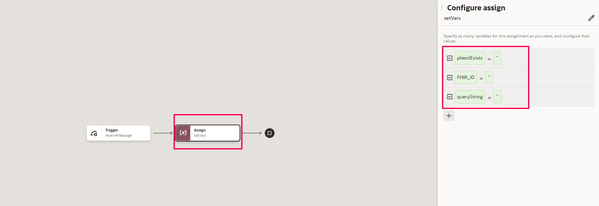

**Healthcare Action**

1.  *Add* **Healthcare** action after the Assign Variables activity

2.  In the **Configure** page provide details as below

| **Property Name**          | **Value**          |       
| --- | ----------- |
|Name | ConvertMessage |
|Operation | Convert message reference to document |
|Document | A08\_PATIENT\_UPDATE\_2\_5 |
{: title="Configure Healthcare Action"}


**Map to Convert Message**

1.  *Edit* the **Map to ConvertMessage** activity

2.  Map the following values

| **Source**          | **Target**          |       
| --- | ----------- |
|**Expand** ReceiveMessage Request &gt; Request Wrapper &gt; Message &gt; **Healthcare Message Reference** | ConvertMessage Request &gt; Convert Message Input &gt; **Healthcare Message Reference** |
{: title="Map to ConvertMessage Mapping elements"}

**Switch Action to check FHIR ID**

1.  *Add* a **Switch** action Which creates Route1 and Otherwise. Provide **Name** for Route1 as **hasFHIR_ID**

2.  In **Route1** *Add* an  **Assign** action and Name it as **assignID**.

3. *Add* a variable and name it as **queryString** and construct logic to concat('/', C-PID.4-CX-01). Use developer view.


4.  *Add* another variable and name it as **patientExists** and assign **true**


5.  Define **Route1** condition as **string-length(C-PID.4-CX-01) &gt; 0**


6.  *Save* your work.

7.  In **Otherwise** route *Add* an  **Assign** action and Name it as **setupSearchTerms** and create variables and assignments as below and *Save*your work.


| **Variables Names**          | **Values**          |       
| --- | ----------- |
|queryFamily |C-PID.5-XPN-01 (search for the element in $ConvertMessage element from Input Sources)|
|queryGiven |C-PID.5-XPN-02 (search for the element in $ConvertMessage element from Input Sources)|
|queryPhone |C-PID.13-XTN-01 (search for the element in $ConvertMessage element from Input Sources)|
|queryBirthdate |C-PID.7-TS-01 (search for the element in $ConvertMessage element from Input Sources)|
|patientExists |false|
|queryString |concat('?family=', queryFamily, '&given=', queryGiven, '&birthdate=', queryBirthdate, '&phone=', queryPhone)|
{: title="Create Variables"}

The Integration flow designed so far


**Parallel Action to upsert patient and translate to HL7 V2.3.1**

In this section create logic for two branches in parallel action.
  - Branch1 - Find patient and accordingly insert or update Patient in FHIR Test server
  - Branch2 - Translate HL7 V2.5 to V2.3.1

***Branch1***

1.  *Add* **Parallel** action after the Switch activity. Two branches namely Branch1 and Branch2 are created.

2.  Configure the name of **Branch1** as *save\_to\_FHIR\_Repo* and mention the description as "This branch contains logic to find patient in FHIR Repo. Accordingly insert or update the Patient info."

3.  Click the *+* sign in the Branch1 integration canvas. Search for **HAPI FHIR Test Server**. This invokes the REST  Adapter Configuration Wizard.

4.  On the **Basic Info** page,
    - for the *What do you want to call your endpoint?* property, enter **findPatient**
    - for the *What is the endpoint's relative resource URI* property, enter **/Patient{query-string}**
    - for the *What action do you want to perform on the endpoint?*, enter **GET**
    - under the **request/response for this endpoint** *Select* the checkbox for
      - **Add and review parameters for this endpoint**
      - **Configure this endpoint to receive the response**
    - Click **Continue**.
5.  On the **Request Parameters** leave the defaults. Make sure **query-string** parameter is of **string** type.

6.  On the **Configure Response** page
    - Select the *request payload format* to **JSON Sample**
    - Click the *&lt&lt&ltinline&gt&gt&gt* link.
    - Provide the below JSON and Click *Continue* and *Finish*

    ```
    <copy>
            {
        "resourceType": "Patient",
        "id": "739",
        "meta": {
          "versionId": "5",
          "lastUpdated": "2020-10-23T10:07:19.612+00:00",
          "source": "#etFDLlsh073P8Ysa"
        },
        "text": {
          "status": "generated",
          "div": "<div xmlns=\"http://www.w3.org/1999/xhtml\">\n      <table> \n        <tbody> \n          <tr> \n            <td> Name</td> \n            <td> Ken James \n              <b> Chalmers</b>  (&quot;Jim&quot;)\n            </td> \n          </tr> \n          <tr> \n            <td> Address</td> \n            <td> 534 Erewhon, Pleasantville, Vic, 3999</td> \n          </tr> \n          <tr> \n            <td> Contacts</td> \n            <td> Home: 111-111-4444. Work: unknown</td> \n          </tr> \n          <tr> \n            <td> Id</td> \n            <td> MRN: NCC-1111</td> \n          </tr> \n        </tbody> \n      </table> \n    </div>"
        },
        "identifier": [
          {
            "use": "official",
            "system": "https://testingfhir.ufp/fhir/NamingSystem/patient-identifier",
            "value": "NCC-1111"
          }
        ],
        "name": [
          {
            "family": "James",
            "given": [
              "Ken"
            ]
          }
        ],
        "telecom": [
          {
            "system": "phone",
            "value": "111-111-4444",
            "use": "home"
          },
          {
            "system": "email",
            "value": "jmes@vsa.vc",
            "use": "home"
          }
        ],
        "gender": "female",
        "birthDate": "1980-10-24",
        "address": [
          {
            "use": "home",
            "text": "123 mikly way, ",
            "line": [
              "123 milky way"
            ],
            "city": "Spock",
            "postalCode": "76297",
            "country": "Germany"
          }
        ],
        "maritalStatus": {
          "coding": [
            {
              "system": "http://terminology.hl7.org/CodeSystem/v3-MaritalStatus",
              "code": "U",
              "display": "unmarried"
            }
          ]
        },
        "contact": [
          {
            "relationship": [
              {
                "coding": [
                  {
                    "system": "http://terminology.hl7.org/CodeSystem/v2-0131",
                    "code": "N"
                  },
                  {
                    "system": "http://terminology.hl7.org/CodeSystem/v3-RoleCode",
                    "code": "WIFE"
                  }
                ]
              }
            ],
            "name": {
              "use": "usual",
              "text": "Sarek"
            },
            "telecom": [
              {
                "system": "email",
                "value": "sarek@vsa.vc",
                "use": "home"
              }
            ]
          }
        ]
        }
    </copy>
    ```

7.  *Edit* the **Map to Patient**. And provide the mapping as per below and *Click* on **Validate** and Navigate back to the canvas

| **Source**          | **Target**          |       
| --- | ----------- |
|**queryString** | findPatient Request &gt; Template Parameters &gt; **Query String** |
{: title="Map to findPatient elements"}

8.  *Add* **Switch** action after **Invoke findPatient**. Create conditional logic for three routes.
    - Route1 - Insert New Patient info
    - Route2- Update Patient info
    - Otherwise - Logger

Add another route and Integration flow should look like below


9.  In the **Route1 - Insert New Patient** Click the **+** sign in the integration canvas. Search for **HAPI FHIR Test Server**. This invokes the REST  Adapter Configuration Wizard.

Set the condition for Route1 as **patientExists = "false"**

10.  On the **Basic Info** page,
    - for the *What do you want to call your endpoint?* property, enter **SaveToHAPIServer**
    - for the *What is the endpoint's relative resource URI* property, enter **/Patient**
    - for the *What action do you want to perform on the endpoint?*, enter **POST**
    - under the **request/response for this endpoint** *Select* the checkbox for
      - **Configure a request payload for this endpoint**
      - **Configure this endpoint to receive the response**
    - Click **Continue**.

11.  On the **Configure Request** page
    - Select the *request payload format* to **JSON Sample**
    - Click the *&lt&lt&ltinline&gt&gt&gt* link.
    - Provide the below JSON and Click *Continue*.

    ```
    <copy>
    {
      "resourceType": "Patient",
      "id": "10692114",
      "meta": {
        "versionId": "3",
        "lastUpdated": "2023-06-06T08:22:06.130+00:00",
        "source": "#ATxjpM6LI7WJ3JcP"
      },
      "text": {
        "status": "generated"
      },
      "identifier": [
        {
          "use": "usual",
          "type": {
            "coding": [
              {
                "system": "http://terminology.hl7.org/CodeSystem/v2-0203",
                "code": "MR"
              }
            ]
          },
          "system": "urn:oid:1.2.36.146.595.217.0.1",
          "value": "12345",
          "period": {
            "start": "2001-05-06"
          },
          "assigner": {
            "display": "Acme Healthcare"
          }
        }
      ],
      "active": true,
      "name": [
        {
          "use": "official",
          "family": "Clarkson",
          "given": [
            "Jeremy",
            "James"
          ]
        },
        {
          "use": "usual",
          "given": [
            "Jim"
          ]
        },
        {
          "use": "maiden",
          "family": "Windsor",
          "given": [
            "Peter",
            "James"
          ],
          "period": {
            "end": "2002"
          }
        }
      ],
      "telecom": [
        {
          "use": "home"
        },
        {
          "system": "phone",
          "value": "33424434",
          "use": "work",
          "rank": 1
        },
        {
          "system": "phone",
          "value": "334244556777",
          "use": "mobile",
          "rank": 2
        },
        {
          "system": "phone",
          "value": "3456543454",
          "use": "old",
          "period": {
            "end": "2014"
          }
        },
        {
          "system": "email",
          "value": "jeremy@thefarm.com",
          "use": "home"
        }
      ],
      "gender": "unknown",
      "birthDate": "1974-12-25",
      "_birthDate": {
        "extension": [
          {
            "url": "http://hl7.org/fhir/StructureDefinition/patient-birthTime",
            "valueDateTime": "1974-12-25T14:35:45-05:00"
          }
        ]
      },
      "deceasedBoolean": false,
      "address": [
        {
          "use": "home",
          "type": "both",
          "text": "534 Erewhon St PeasantVille, Rainbow, Vic  3999",
          "line": [
            "534 Erewhon St"
          ],
          "city": "PleasantVille",
          "district": "Rainbow",
          "state": "Vic",
          "postalCode": "3999",
          "period": {
            "start": "1974-12-25"
          }
        }
      ],
      "contact": [
        {
          "relationship": [
            {
              "coding": [
                {
                  "system": "http://terminology.hl7.org/CodeSystem/v2-0131",
                  "code": "N"
                }
              ]
            }
          ],
          "name": {
            "family": "du Marché",
            "_family": {
              "extension": [
                {
                  "url": "http://hl7.org/fhir/StructureDefinition/humanname-own-prefix",
                  "valueString": "VV"
                }
              ]
            },
            "given": [
              "Bénédicte"
            ]
          },
          "telecom": [
            {
              "system": "phone",
              "value": "+33 (237) 998327"
            }
          ],
          "address": {
            "use": "home",
            "type": "both",
            "line": [
              "534 Erewhon St"
            ],
            "city": "PleasantVille",
            "district": "Rainbow",
            "state": "Vic",
            "postalCode": "3999",
            "country": "Australia",
            "period": {
              "start": "1974-12-25"
            }
          },
          "gender": "female",
          "period": {
            "start": "2012"
          }
        }
      ]
    }
    </copy>
    ```

12.  On the **Configure Response** page
    - Select the *response payload format* to **JSON Sample**
    - Click the *&lt&lt&ltinline&gt&gt&gt* link.
    - Provide the below JSON and Click *Continue* and then *Finish*.

        ```
        <copy>
                  {
            "resourceType": "Patient",
            "id": "10692114",
            "meta": {
              "versionId": "3",
              "lastUpdated": "2023-06-06T08:22:06.130+00:00",
              "source": "#ATxjpM6LI7WJ3JcP"
            },
            "text": {
              "status": "generated"
            },
            "identifier": [
              {
                "use": "usual",
                "type": {
                  "coding": [
                    {
                      "system": "http://terminology.hl7.org/CodeSystem/v2-0203",
                      "code": "MR"
                    }
                  ]
                },
                "system": "urn:oid:1.2.36.146.595.217.0.1",
                "value": "12345",
                "period": {
                  "start": "2001-05-06"
                },
                "assigner": {
                  "display": "Acme Healthcare"
                }
              }
            ],
            "active": true,
            "name": [
              {
                "use": "official",
                "family": "Clarkson",
                "given": [
                  "Jeremy",
                  "James"
                ]
              },
              {
                "use": "usual",
                "given": [
                  "Jim"
                ]
              },
              {
                "use": "maiden",
                "family": "Windsor",
                "given": [
                  "Peter",
                  "James"
                ],
                "period": {
                  "end": "2002"
                }
              }
            ],
            "telecom": [
              {
                "use": "home"
              },
              {
                "system": "phone",
                "value": "33424434",
                "use": "work",
                "rank": 1
              },
              {
                "system": "phone",
                "value": "334244556777",
                "use": "mobile",
                "rank": 2
              },
              {
                "system": "phone",
                "value": "3456543454",
                "use": "old",
                "period": {
                  "end": "2014"
                }
              },
              {
                "system": "email",
                "value": "jeremy@thefarm.com",
                "use": "home"
              }
            ],
            "gender": "unknown",
            "birthDate": "1974-12-25",
            "_birthDate": {
              "extension": [
                {
                  "url": "http://hl7.org/fhir/StructureDefinition/patient-birthTime",
                  "valueDateTime": "1974-12-25T14:35:45-05:00"
                }
              ]
            },
            "deceasedBoolean": false,
            "address": [
              {
                "use": "home",
                "type": "both",
                "text": "534 Erewhon St PeasantVille, Rainbow, Vic  3999",
                "line": [
                  "534 Erewhon St"
                ],
                "city": "PleasantVille",
                "district": "Rainbow",
                "state": "Vic",
                "postalCode": "3999",
                "period": {
                  "start": "1974-12-25"
                }
              }
            ],
            "contact": [
              {
                "relationship": [
                  {
                    "coding": [
                      {
                        "system": "http://terminology.hl7.org/CodeSystem/v2-0131",
                        "code": "N"
                      }
                    ]
                  }
                ],
                "name": {
                  "family": "du Marché",
                  "_family": {
                    "extension": [
                      {
                        "url": "http://hl7.org/fhir/StructureDefinition/humanname-own-prefix",
                        "valueString": "VV"
                      }
                    ]
                  },
                  "given": [
                    "Bénédicte"
                  ]
                },
                "telecom": [
                  {
                    "system": "phone",
                    "value": "+33 (237) 998327"
                  }
                ],
                "address": {
                  "use": "home",
                  "type": "both",
                  "line": [
                    "534 Erewhon St"
                  ],
                  "city": "PleasantVille",
                  "district": "Rainbow",
                  "state": "Vic",
                  "postalCode": "3999",
                  "country": "Australia",
                  "period": {
                    "start": "1974-12-25"
                  }
                },
                "gender": "female",
                "period": {
                  "start": "2012"
                }
              }
            ]
          }
        </copy>
        ```
12.  *Edit* the **Map to SaveToHAPIServer** activity and perform the below mapping

On the Sources Section *Expand* Convert Messsage Reponse &gt; Execute Response &gt; Convert Message Output &gt; Healthcare XML Document &gt; Transaction Data &gt; PIX:PID &gt;

On the Target mapping Section *Expand* SaveToHAPIServer Request &gt; Request Wrapper

Note: Highlight the root element and search for the element to find it easily.

Note: Wherever lookupValue function is used in the below table expand the mapper drawer at right corner. Under Integration Cloud use lookValue function by drag and drop in the expression box. Do not use the value in the table as it as the actual XPath may vary. Construct the lookupValue function expression based on the values indicated by going through the wizard.

Note: Static values are mentioned in quotes. For others use the element name and search in the healthcare xml document

| **Source**| **Target**|       
| --- | ----------- |
|"Patient"| Resource Type |
|"generated"| Status |
|"http://example.org"| Identifier &gt; System |
|"001"| Identifier &gt; Value |
|"official"| Name &gt; Use |
|SC-XPN.1-FN-01| Name &gt; Family |
|C-PID.6-XPN-02| Name &gt; Given |
|lookupValue( "HL7\_to\_FHIR\_Telecom\_Use", "HL7\_Telecom\_Use", C-PID.13-XTN-02: Telecommunication Use Code, "FHIR\_Telecom\_Use", "home")| Telecom &gt; Use |
|lookupValue( "HL7\_to\_FHIR\_Telecom\_Use", "HL7\_Telecom\_Use", C-PID.13-XTN-03: Telecommunication Equipment Type, "FHIR\_Telecom\_Use", "phone")| Telecom &gt; System |
|C-PID.13-XTN-07| Telecom &gt; Value |
|lookupValue( "HL7\_to\_FHIR\_Gender\_Map", "HL7", PID08: Administrative Sex, "FHIR", "unknown")| Gender |
|home| Address &gt; Use |
|PID11:Patient Address &gt;C-PID.11-XAD-01 &gt; SC-XAD.1-SAD-01: Street or Mailing Address| Address &gt; Text |
|PID11:Patient Address &gt; C-PID.11-XAD-08: Other Geographic Designation| Address &gt; Line |
|PID11:Patient Address &gt; C-PID.11-XAD-03: City| Address &gt; City |
|PID11:Patient Address &gt; C-PID.11-XAD-04: State or Province| Address &gt; State |
|PID11:Patient Address &gt; C-PID.11-XAD-05: Zip or Postal Code| Address &gt; Postal Code |
{: title="Map to SaveToHAPIServer elements"}

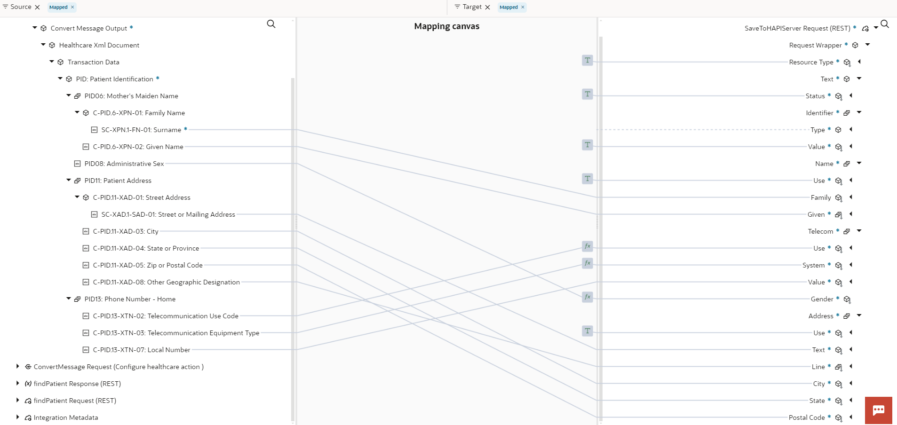

13. In the **Route2 - Update Existing Patient** Click the **+** sign in the integration canvas. Search for **HAPI FHIR Test Server**. This invokes the REST  Adapter Configuration Wizard.

Set the condition for Route2 as **http.response.status ='200' and resourceType='Patient'**


14.  On the **Basic Info** page,
    - for the *What do you want to call your endpoint?* property, enter **updateHAPIServer**
    - for the *What is the endpoint's relative resource URI* property, enter **/Patient{query_string}**
    - for the *What action do you want to perform on the endpoint?*, enter **PUT**
    - under the **request/response for this endpoint** *Select* the checkbox for
      - **Add and review parameters for this endpoint**
      - **Configure a request payload for this endpoint**
      - **Configure this endpoint to receive the response**
    - Click **Continue**.

15. On the **Request parameters** page
    - Select **string** type for parameter **query_string** and Click *Continue*

16.  On the **Configure Request** page
    - Select the *request payload format* to **JSON Sample**
    - Click the *&lt&lt&ltinline&gt&gt&gt* link.
    - Provide the below JSON and Click *Continue*.

      ```
      <copy>
      {
      "resourceType": "Patient",
      "id": "10692114",
      "meta": {
      "versionId": "10",
      "lastUpdated": "2022-10-12T18:48:30.653+00:00",
      "source": "#pabxeuAjcww9xXtH"
      },
      "text": {
      "status": "generated"
      },
      "identifier": [
      {
        "use": "usual",
        "type": {
          "coding": [
            {
              "system": "http://terminology.hl7.org/CodeSystem/v2-0203",
              "code": "MR"
            }
          ]
        },
        "system": "urn:oid:1.2.36.146.595.217.0.1",
        "value": "12345",
        "period": {
          "start": "2001-05-06"
        },
        "assigner": {
          "display": "Acme Healthcare"
        }
      }
      ],
      "active": true,
      "name": [
      {
        "use": "official",
        "family": "Clarkson",
        "given": [
          "Jeremy",
          "James"
        ]
      },
      {
        "use": "usual",
        "given": [
          "Jim"
        ]
      },
      {
        "use": "maiden",
        "family": "Windsor",
        "given": [
          "Peter",
          "James"
        ],
        "period": {
          "end": "2002"
        }
      }
      ],
      "telecom": [
      {
        "use": "home"
      },
      {
        "system": "phone",
        "value": "33424434",
        "use": "work",
        "rank": 1
      },
      {
        "system": "phone",
        "value": "334244556777",
        "use": "mobile",
        "rank": 2
      },
      {
        "system": "phone",
        "value": "3456543454",
        "use": "old",
        "period": {
          "end": "2014"
        }
      },
      {
        "system": "email",
        "value": "jeremy@thefarm.com",
        "use": "home"
      }
      ],
      "gender": "unknown",
      "birthDate": "1974-12-25",
      "_birthDate": {
      "extension": [
        {
          "url": "http://hl7.org/fhir/StructureDefinition/patient-birthTime",
          "valueDateTime": "1974-12-25T14:35:45-05:00"
        }
      ]
      },
      "deceasedBoolean": false,
      "address": [
      {
        "use": "home",
        "type": "both",
        "text": "534 Erewhon St PeasantVille, Rainbow, Vic  3999",
        "line": [
          "534 Erewhon St"
        ],
        "city": "PleasantVille",
        "district": "Rainbow",
        "state": "Vic",
        "postalCode": "3999",
        "period": {
          "start": "1974-12-25"
        }
      }
      ],
      "contact": [
      {
        "relationship": [
          {
            "coding": [
              {
                "system": "http://terminology.hl7.org/CodeSystem/v2-0131",
                "code": "N"
              }
            ]
          }
        ],
        "name": {
          "family": "du Marché",
          "_family": {
            "extension": [
              {
                "url": "http://hl7.org/fhir/StructureDefinition/humanname-own-prefix",
                "valueString": "VV"
              }
            ]
          },
          "given": [
            "Bénédicte"
          ]
        },
        "telecom": [
          {
            "system": "phone",
            "value": "+33 (237) 998327"
          }
        ],
        "address": {
          "use": "home",
          "type": "both",
          "line": [
            "534 Erewhon St"
          ],
          "city": "PleasantVille",
          "district": "Rainbow",
          "state": "Vic",
          "postalCode": "3999",
          "period": {
            "start": "1974-12-25"
          }
        },
        "gender": "female",
        "period": {
          "start": "2012"
        }
      }
      ]
      }
      </copy>
      ```

17.  On the **Configure Response** page
          - Select the *response payload format* to **JSON Sample**
          - Click the *&lt&lt&ltinline&gt&gt&gt* link.
          - Provide the below JSON and Click *Continue* and then *Finish*.

      ```
      <copy>
      {
      "resourceType": "Patient",
      "id": "10692114",
      "meta": {
      "versionId": "2",
      "lastUpdated": "2023-06-06T07:28:35.398+00:00",
      "source": "#vBeH2FQfzwn6U1ao"
      },
      "text": {
      "status": "generated"
      },
      "identifier": [
      {
        "use": "usual",
        "type": {
          "coding": [
            {
              "system": "http://terminology.hl7.org/CodeSystem/v2-0203",
              "code": "MR"
            }
          ]
        },
        "system": "urn:oid:1.2.36.146.595.217.0.1",
        "value": "12345",
        "period": {
          "start": "2001-05-06"
        },
        "assigner": {
          "display": "Acme Healthcare"
        }
      }
      ],
      "active": true,
      "name": [
      {
        "use": "official",
        "family": "Clarkson",
        "given": [
          "Jeremy",
          "James"
        ]
      },
      {
        "use": "usual",
        "given": [
          "Jim"
        ]
      },
      {
        "use": "maiden",
        "family": "Windsor",
        "given": [
          "Peter",
          "James"
        ],
        "period": {
          "end": "2002"
        }
      }
      ],
      "telecom": [
      {
        "use": "home"
      },
      {
        "system": "phone",
        "value": "33424434",
        "use": "work",
        "rank": 1
      },
      {
        "system": "phone",
        "value": "334244556777",
        "use": "mobile",
        "rank": 2
      },
      {
        "system": "phone",
        "value": "3456543454",
        "use": "old",
        "period": {
          "end": "2014"
        }
      },
      {
        "system": "email",
        "value": "jeremy@thefarm.com",
        "use": "home"
      }
      ],
      "gender": "unknown",
      "birthDate": "1974-12-25",
      "_birthDate": {
      "extension": [
        {
          "url": "http://hl7.org/fhir/StructureDefinition/patient-birthTime",
          "valueDateTime": "1974-12-25T14:35:45-05:00"
        }
      ]
      },
      "deceasedBoolean": false,
      "address": [
      {
        "use": "home",
        "type": "both",
        "text": "534 Erewhon St PeasantVille, Rainbow, Vic  3999",
        "line": [
          "534 Erewhon St"
        ],
        "city": "PleasantVille",
        "district": "Rainbow",
        "state": "Vic",
        "postalCode": "3999",
        "period": {
          "start": "1974-12-25"
        }
      }
      ],
      "contact": [
      {
        "relationship": [
          {
            "coding": [
              {
                "system": "http://terminology.hl7.org/CodeSystem/v2-0131",
                "code": "N"
              }
            ]
          }
        ],
        "name": {
          "family": "du Marché",
          "_family": {
            "extension": [
              {
                "url": "http://hl7.org/fhir/StructureDefinition/humanname-own-prefix",
                "valueString": "VV"
              }
            ]
          },
          "given": [
            "Bénédicte"
          ]
        },
        "telecom": [
          {
            "system": "phone",
            "value": "+33 (237) 998327"
          }
        ],
        "address": {
          "use": "home",
          "type": "both",
          "line": [
            "534 Erewhon St"
          ],
          "city": "PleasantVille",
          "district": "Rainbow",
          "state": "Vic",
          "postalCode": "3999",
          "period": {
            "start": "1974-12-25"
          }
        },
        "gender": "female",
        "period": {
          "start": "2012"
        }
      }
      ]
      }
      </copy>
      ```

18.   Save your integration flow

19.  *Edit* the **Map to updateHAPIServer** activity and perform the below mapping

On the Sources Section *Expand* Convert Messsage Reponse &gt; Execute Response &gt; Convert Message Output &gt; Healthcare XML Document &gt; Transaction Data &gt; PID:PID &gt;

On the Target mapping Section *Expand* updateHAPIServer Request &gt; Request Wrapper

Note: Highlight the root element and search for the element to find it easily.

Note: Wherever lookupValue function is used in the below table expand the mapper drawer at right corner. Under Integration Cloud use lookValue function by drag and drop in the expression box. Do not use the value in the table as it as the actual XPath may vary. Construct the lookupValue function expression based on the values indicated by going through the wizard.

Note: Static values are mentioned in quotes. For others use the element name and search in the healthcare xml document

| **Source**| **Target**|       
| --- | ----------- |
|"Patient"| Resource Type |
|PID04 &gt; C-PID.4-CX-01 | Id |
|"true"| Active |
|"official"| Name &gt; Use |
|SC-XPN.1-FN-01| Name &gt; Family |
|C-PID.6-XPN-02| Name &gt; Given |
|lookupValue( "HL7\_to\_FHIR\_Telecom\_Use", "HL7\_Telecom\_Use", C-PID.13-XTN-02: Telecommunication Use Code, "FHIR\_Telecom\_Use", "home")| Telecom &gt; Use |
|lookupValue( "HL7\_to\_FHIR\_Telecom\_Use", "HL7\_Telecom\_Use", C-PID.13-XTN-03: Telecommunication Equipment Type, "FHIR\_Telecom\_Use", "phone")| Telecom &gt; System |
|C-PID.13-XTN-01| Telecom &gt; Value |
|lookupValue( "HL7\_to\_FHIR\_Gender\_Map", "HL7", PID08: Administrative Sex, "FHIR", "unknown")| Gender |
|queryString| Template Parameters &gt; Query String |
{: title="Map to updateHAPIServer elements"}

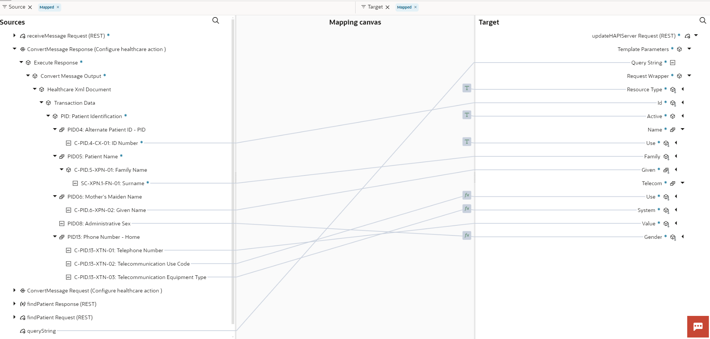

*Validate* the mapping and *Save* your work.

20. In the **Otherwise** block add a **logger** action with message "Did Nothing"

Integration so far...


21. Collapse **Branch1** of Parallel action. Expand **Branch2**

***Branch2***

1.  In **Branch 2** of **Parallel** action Click the **+** sign in the integration canvas and *Add* the **Healthcare** action

2.  Name the Healthcare Action as **Translate2NativeHL7** and Select the action *Translate to outbound message* and Document as *A08\_PATIENT\_UPDATE\_2\_3\_1*

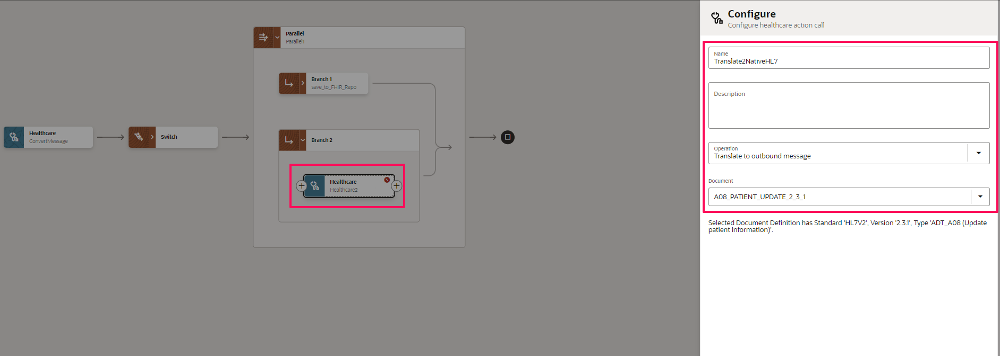

3.  *Edit* the map activity of Healthcare action. Perform the mapping as per below

On the Sources Section *Expand* Convert Messsage Reponse &gt; Execute Response &gt; Convert Message Output &gt; Healthcare XML Document &gt; Transaction Data &gt

On the Target mapping Section *Expand* Translate2NativeHL7 Request &gt; Translate Input &gt; Healthcare XML Document &gt; Transaction Data

On Source Side Map all Simple nodes and Child elements of Complex nodes of MSH01 through MSH11 segments to the respective Target nodes. See below

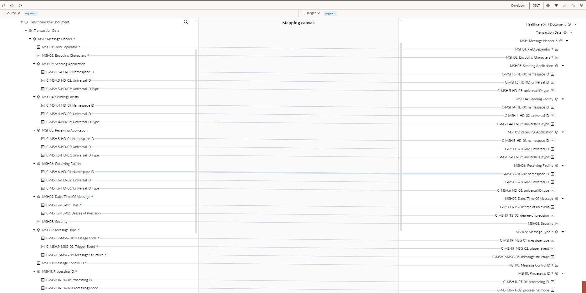

Complete the rest of the nodes mapping using below table.

| **Source**| **Target**|       
| --- | ----------- |
| "2.3.1" | MSH12 &gt; C-MSH.12-VID-01 |
|MSH13: Sequence Number | MSH13: Sequence Number |
|MSH14: Continuation Pointer| MSH14: Continuation Pointer |
|MSH15: Accept Acknowledgment Type| MSH15: Accept Acknowledgment Type |
|MSH16: Application Acknowledgment Type| MSH16: Application Acknowledgment Type |
|MSH17: Country Code| MSH17: Country Code |
|MSH18: Character Set| MSH18: Character Set |
{: title="Map to translate2NativeHL7 elements"}

We need to map each and every element of EVN and PID segment from source to the target. We can use XSLT function copy-of to do the same instead of mapping each element one by one. The function is helpful in the context where all source elements needs to be mapped to the target elements provided the names of the elements match each other.

In the Mapper Select *XSLT* at top of the banner. Click the drawer at the right hand side corner and expand the XSL Constructors pane &gt; Output.

In the Targets section search for the element **EVN**, right click and **create a target node**. Drag and drop the *copy-of* function from the **XSL Constructors &gt; Output category** on to the *EVN* segment in the target.

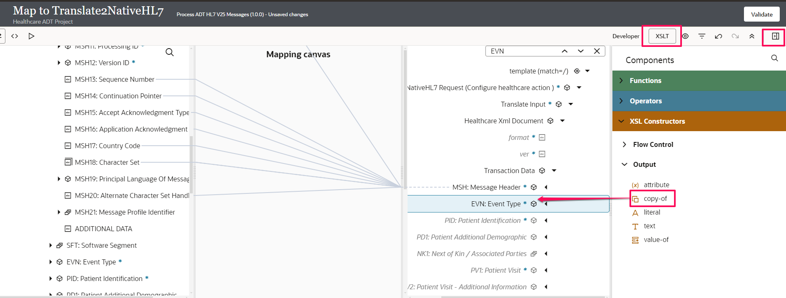

Finally, Map the **EVN** segment from the source to copy-of node in the Target.

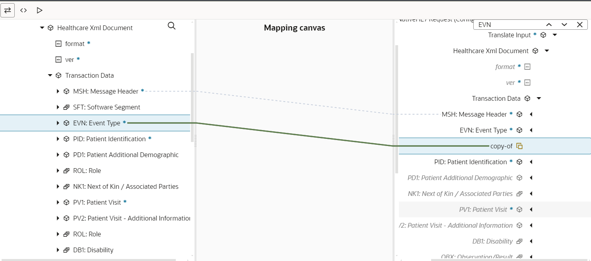

Similarly, use copy-of function for PID Segment.

Final, mapping should look like below. *Validate* and *Save* your work.

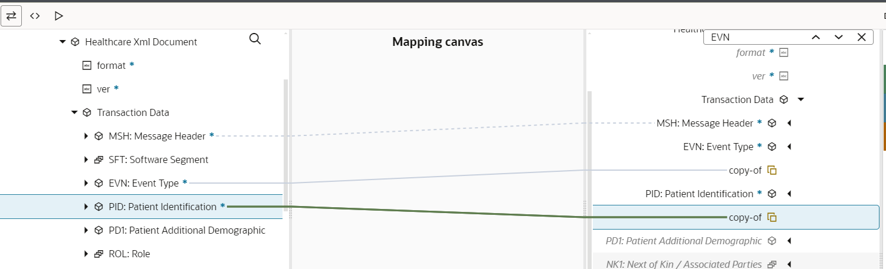

4.  *Add* logger action after the **Healthcare** action Translate2NativeHL7. Log the HL7 V2.3.1 translated **Healthcare Reference Message*

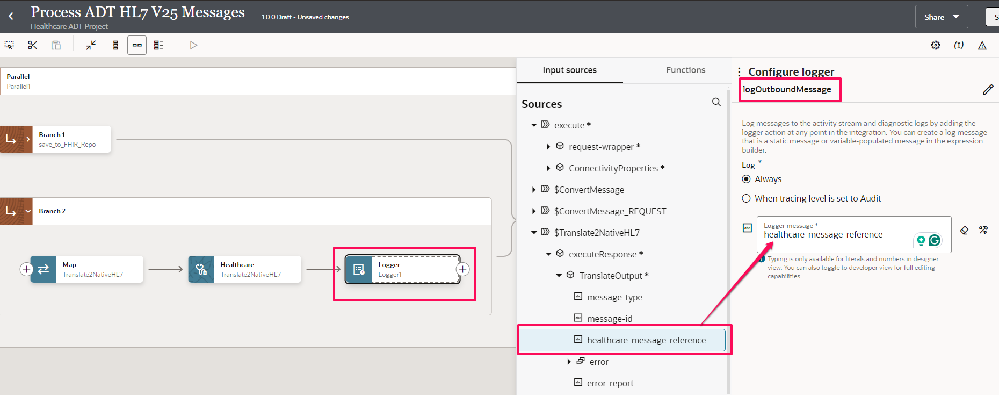

5.  Click the **+** sign in the integration canvas next to the Logger action. Search for **HC SEND HL7**. This invokes the MLLP  Adapter Configuration Wizard.

6.  On the **Welcome** page,
    - for the *What do you want to call your endpoint?* property, enter **MLLPAdapter_Outbound**

    Click *Continue* and *Finish* the wizard. The port and host specified during Connection configuration is automatically taken by default.

7.  *Edit* the **Map to MLLPAdapter\_Outbound** perform the following mapping.
On the Source section side *Expand* the Translate2NativeHL7Response &gt; Execute Response &gt; Translate Output.
On the Target section side *Expand* the MLLPAdapter\_Outbound Request &gt; MLLP Outbound Message

Map the **Healthcare Message Reference** from the Sources to the **Healthcare Message Reference** on the Target side.


*Validate* and *Save* the Integration Flow.

8.  *Add* an **Assign** action after the **Parallel** action. Set tracking variable 2 (Name) and tracking variable 3 (FHIR ID) to use as Business Identifiers.

9.  Create a new assignment variable by using the existing **tracking\_var\_2** and value as *concat(C-PID.5-XPN-02, ' ', SC-XPN.1-FN-01)*

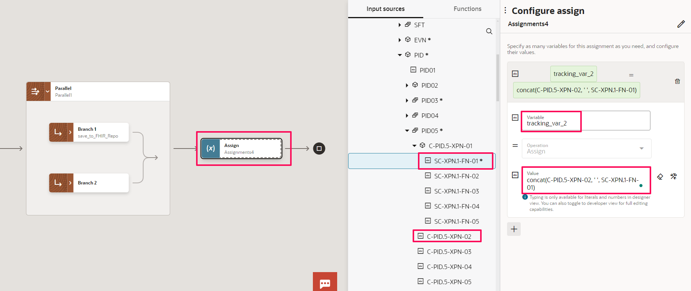

10. Create a new assignment variable by using the existing **tracking\_var\_3** and value as *C-PID.4-CX-01*


Final Integration Flow


11. *Add* business identifier **execute** &gt; **request-wrapper** &gt; **message** &gt; **message-tracking-id** for tracking\_var\_1


12. Navigate back to the Project and *Activate* the Processor Integration Flow **Process ADT HL7 V25 Messages**

## Task 3: Invoke Processor Integration from Handler

1.  Open the Handler Integration to continue with the rest of the design.

2.  *Add* an **Assign** action and set tracking variables as per below
    - Use variable tracking\_var\_2 and assign **translateHL7 &gt; executeResponse &gt; TranslateOutput &gt; msg-group &gt; document-type**
    - Use variable tracking\_var\_3 and assign **translateHL7 &gt; executeResponse &gt; TranslateOutput &gt; msg-group &gt; document-version**

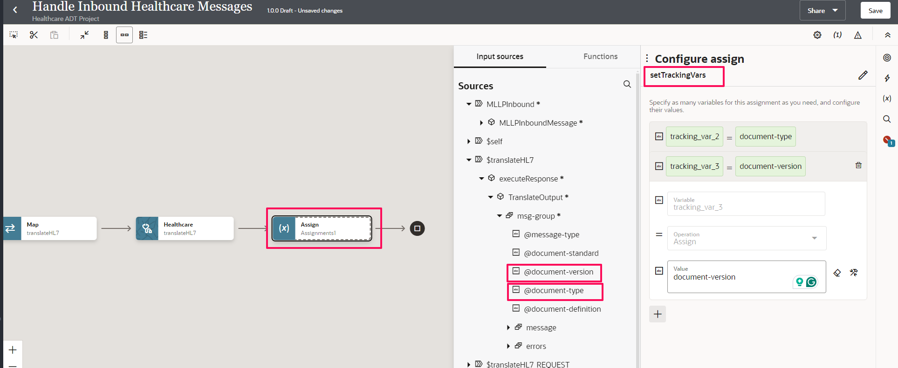

3.  *Add* an **Integration** action next to the Assign activity. This will bring up the local integration invoke configuration wizard.
    - In the *Basic Info* page, enter as per below and Click *Continue*
      - for *What do you want to call your local integration invocation?* property, enter **invokeProcessor**
    - In the *Select Integration* page gives ability invoke another integration in same project or different project. Configure as per below and Click *Continue*
      - for *Select Integration Context*, enter as **Project**
      - for *Healthcare ADT Project*, Select **Healthcare ADT Project**
      - for *Integration*, Select Processor Integration
    - In the *Select Operation* page, Select **POST** operation and Click *Continue* and *Finish* the wizard. Save your work.

4.  *Edit* the map activity **invokeProcessor** and perform the mapping below:

Note: Highlight the root element and search for the element to find it easily.

Note: Wherever lookupValue function is used in the below table expand the mapper drawer at right corner. Under Integration Cloud use lookValue function by drag and drop in the expression box. Do not use the value in the table as it as the actual XPath may vary. Construct the lookupValue function expression based on the values indicated by going through the wizard.

| **Source**| **Target**|       
| --- | ----------- |
| $translateHL7 &gt; executeResponse &gt; TranslateOutput &gt; msg-group &gt; **@document-standard** | invokeProcesor Request &gt; request-wrapper &gt; **document-standard** |
| $translateHL7 &gt; executeResponse &gt; TranslateOutput &gt; msg-group &gt; **@document-version** | invokeProcesor Request &gt; request-wrapper &gt; **document-version** |
| $translateHL7 &gt; executeResponse &gt; TranslateOutput &gt; msg-group &gt; **@document-type** | invokeProcesor Request &gt; request-wrapper &gt; **document-type** |
| $translateHL7 &gt; executeResponse &gt; TranslateOutput &gt; msg-group &gt; **@document-definition** | invokeProcesor Request &gt; request-wrapper &gt; **document-definition** |
| $translateHL7 &gt; executeResponse &gt; TranslateOutput &gt; msg-group &gt; Message &gt; **healthcare-message-reference** | invokeProcesor Request &gt; request-wrapper &gt; Message &gt;  **Healthcare Message Reference** |
| $translateHL7 &gt; executeResponse &gt; TranslateOutput &gt; msg-group &gt; Message &gt; **Message Tracking Id** | invokeProcesor Request &gt; request-wrapper &gt; Message &gt;  **Healthcare Message Reference** |
|lookupValue( "HL7ProcessorRoutes", "DocumentDefinition", @document-definition, "ChildProcessorIdentifer", "")| Connectivity Properties &gt; Localintegration &gt; Integration Code|
|lookupValue( "HL7ProcessorRoutes", "DocumentDefinition", @document-definition, "ChildProcessorVersion", "")| Connectivity Properties &gt; Localintegration &gt; Integration Version|
|Copy your Project Identifier and map static text example: |Connectivity Properties &gt; Localintegration &gt; Project Code|
{: title="Map to invokeProcessor elements"}


5.  Validate the mapping and Save the Integration flow.

6.  Configure Business Identifier field as **message-control-id** for tracking\_var\_1 variable


7.  *Activate* the Integration flow.


## Task 4: Congratulations

Congratulations! You have successfully designed handler and processor integration flows.


You may now **proceed to the next lab**.

## Learn More

* [Getting Started with Oracle Integration 3](https://docs.oracle.com/en/cloud/paas/application-integration/index.html)

* [Introduction to Oracle Integration for Healthcare](https://docs.oracle.com/en/cloud/paas/application-integration/integration-healthcare/introduction-healthcare.html)

* [About Projects](https://docs.oracle.com/en/cloud/paas/application-integration/integrations-user/integration-projects.html)

* [Using the REST Adapter with Oracle Integration 3](https://docs.oracle.com/en/cloud/paas/application-integration/rest-adapter/index.html)

* [Understand MLLP Adapter](https://docs.oracle.com/en/cloud/paas/application-integration/mllp-adapter/understand-mllp-adapter.html)

* [Activate Integration](https://docs.oracle.com/en/cloud/paas/application-integration/integrations-user/activate-and-deactivate-integrations.html)

* [Monitor Integration](https://docs.oracle.com/en/cloud/paas/application-integration/integrations-user/track-integration-instances.html#GUID-46A7C0A0-CBE4-4F1B-9B45-62A5AFA89D74)

* [Download and Install Connectivity Agent](https://docs.oracle.com/en/cloud/paas/application-integration/integrations-user/downloading-and-running-premises-agent-installer.html)

## Acknowledgements

* **Author** - Kishore Katta, Director Product Management, Oracle Integration & OPA
* **Last Updated By/Date** - Kishore Katta, March 2024
