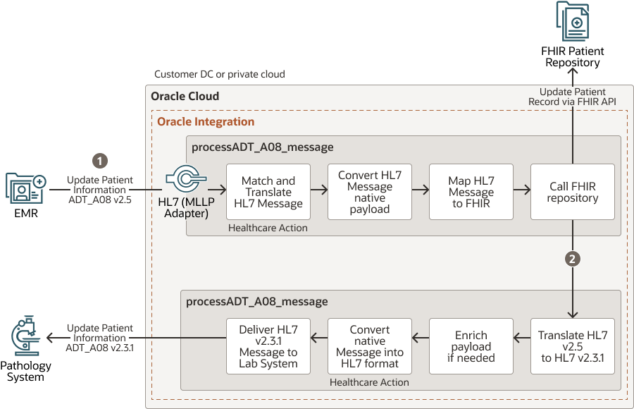
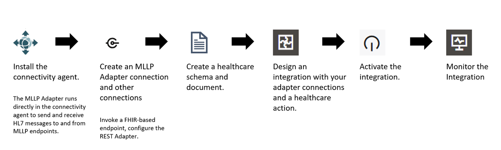

# Introduction to Healthcare Scenarios and Use Cases for HL7 Exchange

In the healthcare industry, the effective exchange of clinical data and information is crucial for delivering high-quality patient care and ensuring seamless collaboration among healthcare providers. The Health Level 7 (HL7) standard has emerged as a widely adopted protocol for facilitating the secure and standardized exchange of healthcare data between various systems and applications.

HL7 exchange is particularly important in scenarios where patient information needs to be shared across different healthcare facilities, departments, or specialized systems. Some common use cases for HL7 exchange include:

1.  Admission, Discharge, and Transfer (ADT) Messaging: ADT messages are used to communicate patient admission, discharge, and transfer events between healthcare systems, such as Electronic Medical Records (EMRs), Patient Administration Systems (PAS), and billing systems. This ensures that patient information is updated and synchronized across different departments and facilities, enabling better coordination of care.

2.  Order Entry and Result Reporting: HL7 messages are extensively used for transmitting orders for laboratory tests, radiology procedures, and other diagnostic services, as well as for reporting the results of these orders back to the ordering system or healthcare provider.

3.  Medication Management: HL7 messaging plays a crucial role in medication management by facilitating the exchange of medication orders, dispensing records, and administration events between healthcare systems, such as EMRs, pharmacy information systems, and medication administration records (MARs).

4.  Clinical Documentation: HL7 standards support the exchange of clinical documents, such as discharge summaries, progress notes, and consultation reports, enabling healthcare providers to access comprehensive patient information from various sources.

5.  Public Health Reporting: HL7 messaging is utilized for reporting infectious diseases, immunizations, and other public health data to government agencies and public health organizations, contributing to effective disease surveillance and population health management.

These are just a few examples of the many use cases where HL7 exchange is essential for enabling interoperability and seamless data sharing in the healthcare ecosystem.

## About this Workshop

This use case demonstrates the power of Oracle Integration in handling inbound HL7 messages from an EMR application and synchronizing patient information across various healthcare systems. You will design 2 Integrations.

*Handle Inbound Healthcare Messages:* A parent integration that receives inbound HL7 messages from an EMR application. In this example, the EMR sends ADT_A08 (update patient information) messages.

*Process ADT HL7 V25 Messages:* A child integration called by **Process ADT HL7 V25 Messages** to process the inbound HL7 message and synchronize a FHIR patient repository and pathology system with the same patient updates.

Note: You will install HL7 Inspector application to simulate EMR and Pathology systems.

Here is the high level architecture reference of the tutorial

Estimated Time: 3 hours 40 minutes

### Objectives

Here are some high-level objectives for the workshop on Oracle Integration for Healthcare and HL7 messaging:

1.  Understand the importance of data integration in healthcare
    - Highlight the challenges of siloed systems and the need for seamless data exchange
    - Explain the role of integration in enabling interoperability and coordinated care
2.  Introduce HL7 standards and messaging
    - Provide an overview of the Health Level 7 (HL7) standards and protocols
    - Discuss the different HL7 message types and their use cases (e.g., ADT, ORM, ORU)
3.  Explain the structure and components of HL7 messages
    - Explore Oracle Integration capabilities for healthcare
    - Introduce Oracle Integration as a powerful platform for healthcare integration
    - Highlight the pre-built adapters and connectors for HL7, FHIR, and other healthcare standards
    - Discuss Oracle Integration's mapping, transformation, and orchestration capabilities
4.  Demonstrate HL7 message processing with Oracle Integration
    - Walk through a practical use case involving inbound HL7 message handling
    - Showcase the **Handle Inbound Healthcare Messages** and **Process ADT HL7 V25 Messages** integrations for inbound and outbound processing of HL7 messages
    - Explain the design time and runtime aspects of these integrations
    - Highlight the seamless synchronization with FHIR patient repositories and pathology systems
5.  Discuss best practices and real-world scenarios
    - Share best practices for implementing and maintaining healthcare integrations
    - Address common challenges and solutions in HL7 message processing
6.  Hands-on activities and exercises
    - Provide hands-on exercises to practice HL7 message handling
    - Guide through the development of simple healthcare integrations
    - Encourage to explore additional features and customizations

**High level workflow of the usecase design**

### Prerequisites

This lab assumes you have the following:
* Oracle Cloud Account with credits to provision services.

You may now **proceed to the next lab**.

## Learn More

* [Oracle Integration 3 Documentation](https://docs.oracle.com/en/cloud/paas/application-integration/integration-healthcare/introduction-healthcare.html)
* [Oracle Integration 3 healthcare blogs](https://blogs.oracle.com/integration/post/oracle-integration-for-healthcare)

## Acknowledgements
* **Author** - Kishore Katta, Oracle Integration Product Management
* **Last Updated By/Date** - Kishore Katta, February 2024
