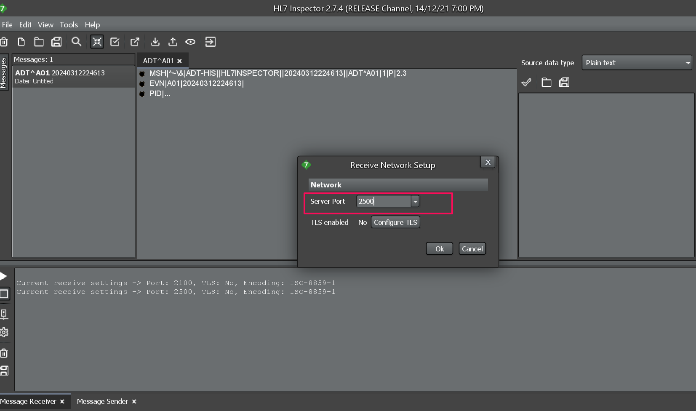

# Setup

## Introduction

This lab walks you through the pre requisite setup required to complete the workshop.

Estimated Time: 45 minutes

### Objectives
In this lab, you will:
- Create an Agent Group
- Install Connectivity Agent
- Install HL7 Inspector to simulate EMR and Pathology systems as described in the Introduction section
- Download Lab Artifacts

### Prerequisites
This lab assumes you have:
- Completed all the previous labs.


## Task 1: Create an Agent Group
You must create an agent group in Oracle Integration before you can run the connectivity agent installer. Creating the agent group automatically creates an OAuth client application in Oracle Identity Cloud Service. This enables the connectivity agent to use OAuth 2.0 token-based authentication when invoking Oracle Integration endpoints. Follow these steps to create an agent group.

1.  In the navigation pane, click *Design*, then *Agents*

2.  Click *Create*. The Create agent group panel opens.

3. Enter the following information, then click *Create*

| **Element**          | **Value**          |       
| --- | ----------- |
|Name | HC-DEMO |
|Identifier | Accept the default Identifier |
|Description | Agent group for HL7 communication |
{: title="Create Agent Group"}

This action automatically creates an OAuth client application in Oracle Identity Cloud Service. The application name takes the following form: **agent\_group\_name-instance\_IDCS\_name**


## Task 2: Install Connectivity Agent

1.  Make sure JDK 17 is installed

2.  Set JAVA\_HOME and PATH to JDK17. From command line or terminal window verify the PATH and JAVA\_HOME set properly

    Note: Set the JAVA\_HOME property to the location of the JDK installation. Set the PATH property to **JAVA\_HOME/bin** as per the operating system you have installed.

3.  Click *Design*, then *Agents*. Select *Download*, then *Connectivity Agent*. This will download the connectivity agent installer to install agent in your local environment.

4.  Download the connectivity agent to a directory on your on-premises host.

5.  Extract oic_conn_agent_installer.zip.

6.  Hover over the agent group. Click *Actions...*, then select *Download config*.
This step downloads a preconfigured InstallerProfile.cfg file to use during installation. The following message is displayed.

**Bootstrap configuration downloaded for Agent Group agent\_group\_name. Replace the file in agent install location before proceeding with agent setup.**

7.  Run the connectivity agent installer from the command prompt.

```
<copy>
java –jar connectivityagent.jar
</copy>
```

8.  Wait for a successful installation message to appear and start listening to messages.

9. Navigate to *Observability*, then *Agents*. Expand the Agent Group created and agent status is **green** indicates the agent is running and able to process messages.

## Task 3: Install HL7 Simulator

1.  [Download](https://bitbucket.org/crambow/hl7inspector/wiki/Home) and Install HL7 Inspector

2.  Launch the HL7 Simulator application

3.  Select the send/receive icons from the top panel as highlighted. Message Receiver and Message Sender panes will be visible at the bottom of the application window.


4.  In the **Message Receiver** window at the bottom, Select the *Setup Server* available in the left hand side tasks. Enter the server port as **2500** and select *Ok*. Message receiver is simulating the Pathology systems to HL7 V2.3 messages.


5.  In the left hand side tasks Click on the *Start Receiving Message Service*. Confirmation log says **Listening on port 2500**


6.  In the **Message Sender** Window, Select *Setup Send..* icon. In the hostname:port enter **localhost:2100**. Message Sender is simulating the EMR systems to send HL7 V2.5 messages.


## Task 4: Download Lab Artifacts

1.  [Download](https://objectstorage.us-phoenix-1.oraclecloud.com/p/WxPypgKK3_4DOtQHJFDhya1hFvbzNqds9Y4MZ1YL84X_o4wexeny3UctLb7UIiL1/n/oicpm/b/oiclivelabs/o/oic3/get-started-oic-hc/get-started-hc-lab-artifacts.zip) the lab artifacts and unzip.

2. The unzipped folder will contain three folders. These artifacts will be referred to in the next sections.

You may now **proceed to the next lab**.

## Learn More

* [Download and Install Connectivity Agent](https://docs.oracle.com/en/cloud/paas/application-integration/integrations-user/downloading-and-running-premises-agent-installer.html)
* [Create Document](https://docs.oracle.com/en/cloud/paas/application-integration/integration-healthcare/create-custom-healthcare-document-definition.html)

## Acknowledgements
* **Author** - Kishore Katta, Director Product Management - Oracle Integration & OPA
* **Last Updated By/Date** - Kishore Katta - March 2024
