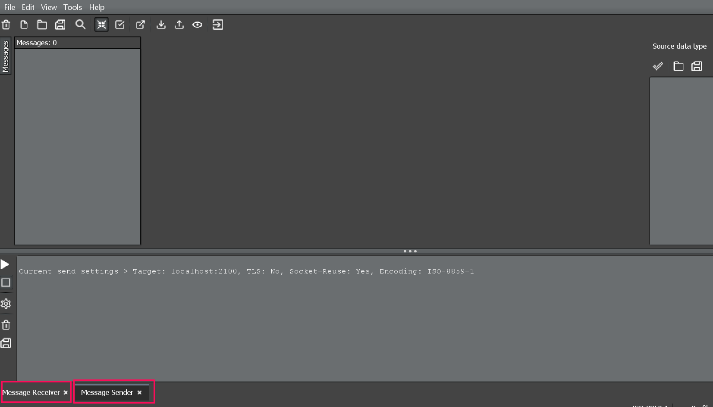
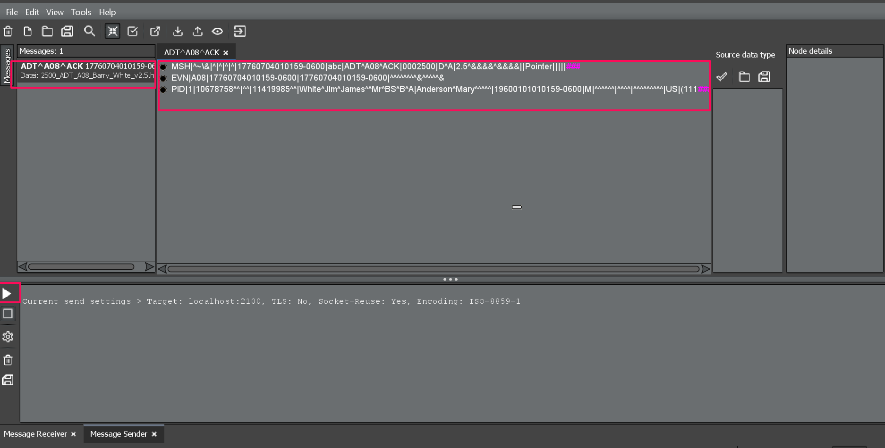
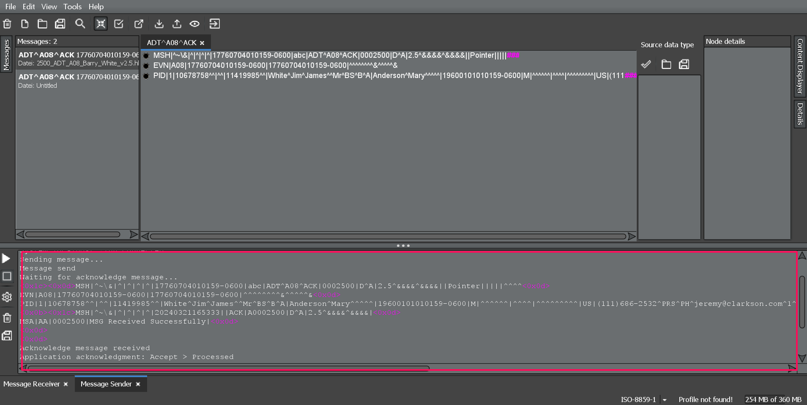
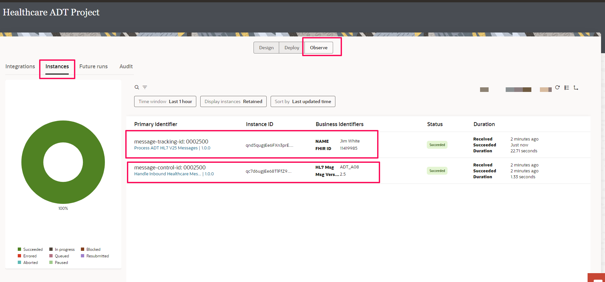

# Test The End to End Flow using HL7 Inspector

## Introduction
This lab will walk you through the steps to send HL7 messages using HL7 inspector as simulator. The messages will be received by Handler Integration which then routes the messages to Processor Integration. Based on the Patient info record is either inserted or updated in FHIR Server. Also, you should notice an HL7 V2.3.2 converted message on the HL7 Simulator receiver port.

Estimated Time: 20 minutes

### Objectives
In this lab, you will:
- Send an ADT message from HL7 Inspector
- Receive converted HL7 message
- Invoke HAPI FHIR API using Rest Adapter
- Monitor integrations in a Project

### Prerequisites
This lab assumes you have:
- Completed all previous labs successfully
- Connectivity Agent is up and running
- HL7 Inspector is installed and running

## Task 1: Send HL7 V2.5 ADT message

In this section, you will send an HL7 2.5 message which will trigger the handler integration and then processor integration

Note: Make sure the Message Receiver and Sender is Open. Receiver is listening to port 2500 and Sender is sending to port 2100.

1.  Open the HL7 Inspector, Select **File** &gt; **File Open** and browse the 2500\_ADT\_A08\_Barry\_White\_v2.5.hl7 from the [downloaded](https://objectstorage.us-phoenix-1.oraclecloud.com/p/WxPypgKK3_4DOtQHJFDhya1hFvbzNqds9Y4MZ1YL84X_o4wexeny3UctLb7UIiL1/n/oicpm/b/oiclivelabs/o/oic3/get-started-oic-hc/get-started-hc-lab-artifacts.zip) artifacts in **hl7 messages** folder. In the **Import Options** window leave the defaults and Click *OK*.

2.  Click on *Send Selected Message* in the Send Message window at the bottom. This will send the selected HL7 ADT 2.5 message.

3.  An Acknowledgement message is received in the **Sender Message** window.

4.  Navigate to the **Receiver Message** as highlighted below. Notice the converted HL7 V2.3.1 message, wherein one of the branch in the processor integration flow was able to convert V2.5 to V2.3.1 and delivered the message to HL7 Inspector using MLLP adapter host:port configured.

5.  You can track instances and monitor errors in a project from a single workspace during runtime. You can also access and view the activity stream that shows details about the movement of messages through integrations.

Navigate to the Project **Healthcare ADT Project**. Click on *Observe* tab and Select *Instances*. Notice that 2 Instances are created (Handler and Processor integrations are triggered).

6.  Explore the Activity Stream of Processor Integration **Branch1** in parallel action. Notice that one of the routes (Create Patient / Update Patient) is executed based on the patient data available in the HAPI FHIR Test Server. Explore the FHIR API response in the Activity stream.

## Task 2: Troubleshooting Tips

1.  Processor integration is not triggered: Verify if the processor integration identifier provided is same as in the HL7ProcessorRoutes lookup

2.  Handler Integration is not triggered: Verify the port provided in the HL7 Simulator application Send Message configuration provided is same as in the HC RECEIVE HL7 connection in OIC

3.  Processor Integration not sending converted HL7 V2.3.1 message to HL7 Inspector: Check the port configured in the HL7 Inspector application **Message Receiver** is same as in the HC SEND HL7 Connection in OIC

##  Congratulations! 🎉

You've successfully completed the tutorial on leveraging the new healthcare integration capabilities in Oracle Integration Cloud (OIC). Throughout this tutorial, you gained hands-on experience with several key features:

**HL7 Schema Editor**
You defined custom HL7 message schemas using the intuitive HL7 schema editor within the OIC web interface. This allowed you to easily model HL7 messages for use in your integrations.

**MLLP Adapter**
You configured the new MLLP adapter to enable sending and receiving HL7 messages over the Minimal Lower Layer Protocol (MLLP). This adapter facilitates seamless communication with healthcare systems that rely on the MLLP transport protocol.

**Healthcare Action**
You utilized the powerful "Healthcare" action from the OIC developer palette. This action empowered you to convert inbound HL7 messages into a standardized payload and vice versa, streamlining the integration process.

During the tutorial, you built a complete end-to-end integration that demonstrated the following capabilities:

1. Receiving HL7 messages via the MLLP adapter
2. Converting the HL7 message to OIC mappable interface using the Healthcare action
3. Mapping and routing the HL7 payload to a backend healthcare system
4. Sending the converted HL7 2.3.1 ADT message to the backend system

By completing this tutorial, you've gained valuable insights into how OIC can simplify and accelerate healthcare integrations, enabling interoperability across diverse healthcare systems and standards.

Feel free to explore more advanced use cases, such as batch processing, HL7 version translation, integration with FHIR APIs, and orchestrating complex healthcare workflows using OIC's powerful capabilities.

Congratulations once again on your achievement!

## Learn More

* [Getting Started with Oracle Integration 3](https://docs.oracle.com/en/cloud/paas/application-integration/index.html)

* [Introduction to Oracle Integration for Healthcare](https://docs.oracle.com/en/cloud/paas/application-integration/integration-healthcare/introduction-healthcare.html)

* [About Projects](https://docs.oracle.com/en/cloud/paas/application-integration/integrations-user/integration-projects.html)

* [Using the REST Adapter with Oracle Integration 3](https://docs.oracle.com/en/cloud/paas/application-integration/rest-adapter/index.html)

* [Understand MLLP Adapter](https://docs.oracle.com/en/cloud/paas/application-integration/mllp-adapter/understand-mllp-adapter.html)

* [Activate Integration](https://docs.oracle.com/en/cloud/paas/application-integration/integrations-user/activate-and-deactivate-integrations.html)

* [Monitor Integration](https://docs.oracle.com/en/cloud/paas/application-integration/integrations-user/track-integration-instances.html#GUID-46A7C0A0-CBE4-4F1B-9B45-62A5AFA89D74)

* [Download and Install Connectivity Agent](https://docs.oracle.com/en/cloud/paas/application-integration/integrations-user/downloading-and-running-premises-agent-installer.html)

## Acknowledgements
* **Author** - Kishore Katta, Director Product Management, Oracle Integration & OPA
* **Last Updated By/Date** - Kishore Katta, March 2024
