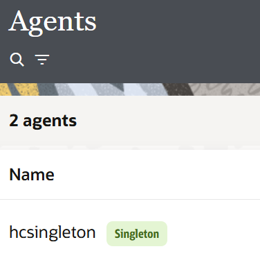
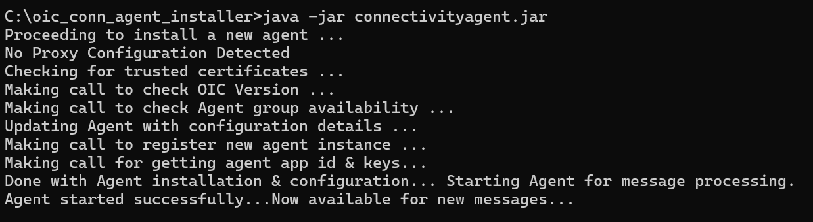

# Create an Agent Group and Install Connectivity Agent

## Introduction

Before configuring the healthcare integration recipe, you must set up the Oracle Integration Connectivity Agent infrastructure. The Connectivity Agent enables Oracle Integration to securely communicate with on-premises and locally hosted applications through a designated agent runtime installed within your network environment.

In this section, you will first create an Agent Group in Oracle Integration, which acts as a logical container for managing one or more connectivity agents. Creating the agent group also generates the OAuth client credentials required for secure authentication between Oracle Integration and the installed agent.

After creating the agent group, you will download, install, and configure the Connectivity Agent on your local machine or server. Once installed, the agent will register with Oracle Integration and allow the MLLP adapter to listen for incoming HL7 messages from the Oracle Health EHR simulator.

By completing this setup, you will establish the secure communication channel required for the healthcare integration flow.

At the end of this lab, you will have:
- Created an Agent Group in Oracle Integration
- Installed and configured the Oracle Integration Connectivity Agent

Estimated Time: 15 minutes

### Objectives

By the end of this lab, you will be able to:

- Create an Agent Group in Oracle Integration
- Install and configure the Connectivity Agent

### Prerequisites

This lab assumes you have:

- All previous labs completed.

## Task 1: Create an Agent Group

1. Login into Oracle Integration console.
2. Navigate to *Home → Design → Agents*
3. Click **Create**, enter the details given below and Click **Create**.

    | Field    | Value                                                 |
    |----------------|-------------------------------------------------------|
    | Name | hcsingleton   |
    | Description | agent group for health care use cases |
    | Use only one agent at a time | Check this option | 
    {: title="Oracle Integration Agent Group creation"}

    > **Note:** Creating the agent group automatically creates an OAuth client application used by the connectivity agent
    > **Note:** If you select Use only one agent at a time and then associate only one connectivity agent with the agent group, the agent group works as if you never selected the option. You must associate a second agent with that agent group to achieve active-passive agent functionality.  
    > **Note:** If you enabled Use only one agent at a time, the label Singleton appears next to the agent group name.
    
    

## Task 2: Download and Install Connectivity Agent

1. Login into Oracle Integration console
2. Navigate to *Home → Design → Agents*
3. Click *Download*, then *Connectivity Agent*
4. Download the connectivity agent installer to a directory (e.g.,: C:\oic\_conn\_agent\_installer) on your on-premises host
5. Extract *oic\_conn\_agent\_installer.zip* into the directory

    > **Note:** Do not install the agent in a directory path that includes /tmp.

6. Go back to the OIC Console and Hover over the *agent group* created in Task 1
7. Click Actions *...*icon, then select *Download config*
8. Replace the existing InstallerProfile.cfg template file in the oic\_conn\_agent\_installer directory that was created when you extracted the agent installation file in Step 5 with the preconfigured InstallerProfile.cfg file you downloaded

    > **Note:** The preconfigured InstallerProfile.cfg file automatically includes values for all required parameters such as oic\_URL and agent\_GROUP\_IDENTIFIER and OAuth 2.0 token-based authentication parameters such as client ID, client secret, and scope. This eliminates the need to manually specify values for these parameters
9. Set the JAVA_HOME property to the location of the JDK installation
10. Set the PATH property as *setenv PATH = $JAVA_HOME/bin:$PATH*
11. Run the connectivity agent installer (java –jar connectivityagent.jar) from the command prompt
12. Wait for a successful installation message to appear.
    

    You may now **proceed to the next lab**.

## Learn More

* [Getting Started with Oracle Integration 3](https://docs.oracle.com/en/cloud/paas/application-integration/index.html)

* [Install and Manage the Connectivity Agent](https://docs.oracle.com/en/cloud/paas/application-integration/integrations-user/manage-agent-group-and-premises-connectivity-agent.html#GUID-337458EC-38A0-4998-BE9D-04B9BF11AEB7)

## Acknowledgements

* **Author** - Subhani Italapuram, Product Management, Oracle Integration
* **Last Updated By/Date** - Subhani Italapuram, Apr 2026
