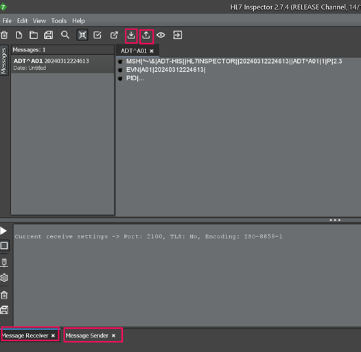
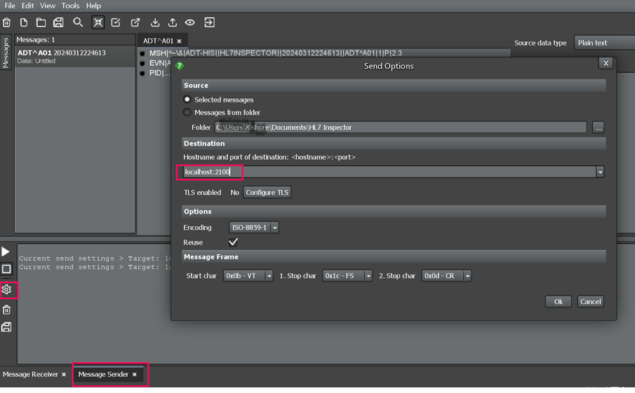

# Download and Install HL7 Inspector

## Introduction

HL7 Inspector is a lightweight HL7 message simulation and testing tool used to send and receive HL7 healthcare messages during development and testing. In this lab, HL7 Inspector will simulate the Oracle Health EHR system by generating and sending HL7 ORM/OMR messages to Oracle Integration through the configured MLLP listener.

By installing and configuring HL7 Inspector, you can emulate real-world healthcare message transmission and validate that Oracle Integration correctly receives and processes incoming HL7 messages.

Estimated Time: 10 minutes

### Objectives

By the end of this lab, you will be able to:

- Download and install the HL7 Inspector application
- Launch the HL7 Inspector tool
- Enable the Message Sender and Message Receiver panes
- Configure the Message Sender to connect to the Oracle Integration MLLP listener on localhost:2100
- Prepare the tool to simulate sending HL7 messages to Oracle Integration

### Prerequisites

This lab assumes you have:

- All previous labs completed.

## Task 1: Download the HL7 Inspector Application

1. Click on [Download](https://bitbucket.org/crambow/hl7inspector/wiki/Home) to download HL7 Inspector
2. Navigate to the HL7 Inspector download page.
3. Download the latest version of the HL7 Inspector installer appropriate for your operating system.
4. Save the installer file to your local machine.

## Task 2: Install the HL7 Inspector Application

1. Locate the downloaded installer file.
2. Double-click the installer to begin installation.
3. Follow the installation wizard prompts.
4. Accept the license agreement if prompted.
5. Choose the installation directory.
6. Click Install.
7. Once installation completes, click Finish.

## Task 3: Launch HL7 Inspector

1. Open the HL7 Inspector application from your desktop or start menu.
2. Wait for the application window to load completely.

## Task 4:  Enable Message Sender and Message Receiver Panes

1. In the HL7 Inspector toolbar, locate the Send/Receive icons.
2. Click the Message Sender icon and click the Message Receiver icon.
    
3. Verify that both panes appear at the bottom of the application window.

    > **Note:** These panes allow you to simulate sending and receiving HL7 messages.

## Task 5: Configure the Message Sender

1. In the Message Sender pane, click the Setup Send icon.
2. In the setup window, locate the Hostname:Port field.
3. Enter the following value *localhost:2100*
    

4. Click OK to save the configuration.

    > **Note:** Port 2100 corresponds to the MLLP Listener Port configured in Oracle Integration.

## Task 6: Verify HL7 Simulator Setup

1. Confirm that the Message Sender is configured to send to localhost:2100.
2. Ensure the Message Receiver pane remains open.
3. Verify both sender and receiver panes are active.

    You are now ready to use HL7 Inspector to simulate sending HL7 messages to Oracle Integration.

    You may now **proceed to the next lab**.

## Learn More

* [HL7 Inspector](https://bitbucket.org/crambow/hl7inspector/wiki/Home#markdown-header-downloads)

## Acknowledgements

* **Author** - Subhani Italapuram, Product Management, Oracle Integration
* **Last Updated By/Date** - Subhani Italapuram, Apr 2026
