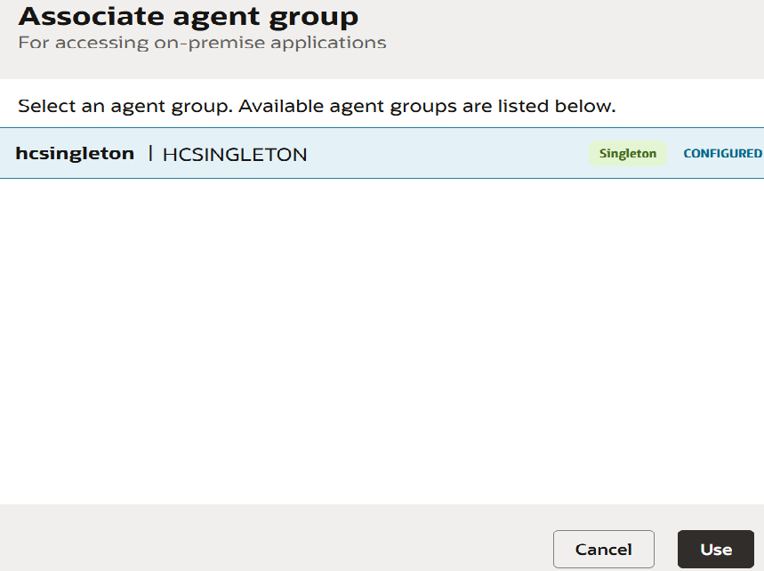
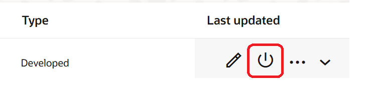

# Install and Configure the Recipe

## Introduction

In this section, you will install and configure the Oracle Integration recipe that automates the creation of Care Requests in Oracle Fusion when an HL7 order message is received from Oracle Health EHR. Oracle Integration recipes provide prebuilt integration templates that accelerate implementation by including predefined connections, mappings, and orchestration logic for common business scenarios.

After installing the recipe from the Oracle Integration Store, you will configure the required connections and resources, including the MLLP receiving connection for inbound HL7 messages and the Oracle Sales Cloud connection for creating Care Requests in Oracle Fusion. Proper configuration of these resources ensures that the integration can successfully receive, process, and route healthcare messages between systems.

Estimated Time: 15 minutes

### Objectives

By the end of this lab, you will be able to:

- Browse and install the healthcare integration recipe from the Oracle Integration Store
- Open the recipe configuration workspace
- Review the resources included in the installed recipe
- Configure the required connections and integration resources
- Prepare the recipe for activation and execution

### Prerequisites

This lab assumes you have:

- All previous labs completed.

## Task 1: Install the recipe

1. Login into Oracle Integration console.
2. On the Oracle Integration Home page, under the Get Started section, click Browse Store.
3. Search for the required recipe (e.g., Oracle Health EHR to Fusion Cloud – Create Care Request), then click *Get* to install it. If it is already installed, you will not see the *Get* button.
A confirmation message will appear, and the recipe card status will change to In *Use*.

## Task 2: Explore the Installed Recipe

1. Once inside the project, you should see the Project Overview page showing:

    - Project Name: Oracle Healthcare to Oracle Fusion Create Care Req
    - Review the components available in the recipe, including:
        - Integrations
        - Connections
    - Navigate to the Integrations section and examine the available integration flows, such as:
        - Get Hl7 message
        - Create Care Request
    - Click on **Learn about the Integration** to understand the details of the integration flow.
    

## Task 3: Configure Connections

All the connections are in draft state. We will configure the connections used by the integration flows.

> **Note:** If you are a Bootcamp user then select the corresponding shared connections.

1. Configure REST Connection
    - Edit the REST Connection.
    - Configure the Security Policy as **OAuth 2.0**
    - Click on **Test** and *Save* the connection.

2. Configure MLLP Connection
    - Edit the MLLP Connection.
    - Configure Listener Port as **2100**
    - Under Access Type, select *Connectivity Agent*
    - Click on *Associate agent group*
    - Select the Agent Group which you have created and click on *Use*
    
    - Click on **Test** and *Save* the connection.
3. Configure Oracle Sales Cloud Connection
    - Under Connections, select the *Oracle Sales Cloud* Connection.
    - Enter Oracle Fusion URL, Example: https://your-instance.fa.oraclecloud.com
    - Configure Security:
    | Field    | Value                                                 |
    |----------------|-------------------------------------------------------|
    | Security policy | Username Password Token   |
    | Username | crm_impl |
    | Password | Enter the Oracle Sales Cloud password |
    {: title="Oracle Sales Cloud security"}

    - Click on **Test** and *Save* the connection.

## Task 4: Edit all the integration and understand the design and flow logic

1. Select an integration flow (for example, Create Care Request) and click Edit to open the integration designer.
2. Review the overall integration structure, including:
    - Trigger (REST endpoint)
    - Healthcare action
    - Invoke (Oracle Sales Cloud call)
3. Repeat the above steps for other integration flow:
    - Get Hl7 message
4. Save and close the integration after review (no changes required unless customization is needed)

## Task 5: Activate All Integrations

1. In the left navigation pane, select **Projects**.
2. Select the **Oracle Healthcare to Oracle Fusion Create Care Req** project that you created, click Activate.
    
3. In the Activate Project panel:
    - Select the default deployment settings
    - Select an appropriate tracing option
    - Click Activate again.
4. Wait for the confirmation message indicating that the integration has been successfully activated.
5. Refresh the page to verify the updated status.

    You may now **proceed to the next lab**.

## Learn More

- [Getting Started with Oracle Integration 3](https://docs.oracle.com/en/cloud/paas/application-integration/index.html)

- [About Projects](https://docs.oracle.com/en/cloud/paas/application-integration/integrations-user/integration-projects.html)

- [Activate or Deactivate a Project](https://docs.oracle.com/en/cloud/paas/application-integration/integrations-user/activate-and-deactivate-project.html#GUID-61035125-0E47-49F3-A3ED-9EFEA03BDDDE)

- [Oracle Integration 3 MLLP Adapter](https://docs.oracle.com/en/cloud/paas/application-integration/mllp-adapter/understand-mllp-adapter.html)

- [Oracle Integration 3 Oracle CX Sales and B2B Service Adapter Adapter](https://docs.oracle.com/en/cloud/paas/application-integration/sales-adapter/oracle-sales-cloud-capabilities.html#GUID-05D2AFAE-911E-4F1D-B745-A97FA92B2AD2)

## Acknowledgements

- **Author** - Subhani Italapuram, Product Management, Oracle Integration
- **Last Updated By/Date** - Subhani Italapuram, Apr 2026
