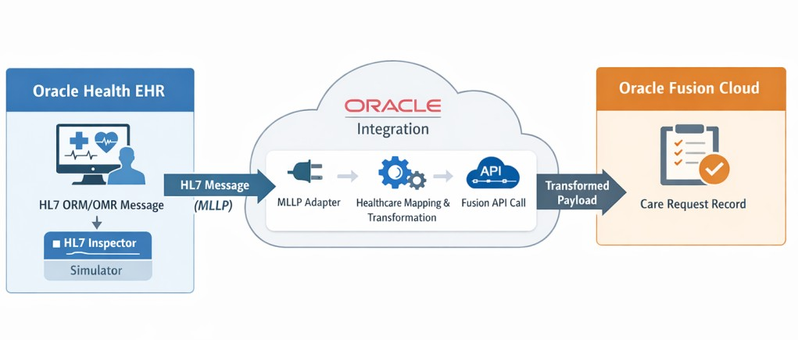
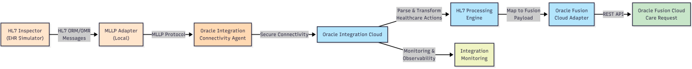

# Oracle Health EHR to Oracle Fusion – Create Care Request

## Introduction

Healthcare organizations often require seamless integration between Electronic Health Record (EHR) systems and enterprise applications to streamline patient care workflows and improve operational efficiency. 

In this Live Lab, you will learn how to use Oracle Integration to integrate Oracle Health EHR with Oracle Fusion Cloud for automated Care Request creation.

As part of this lab, you will use HL7 Inspector to simulate the Oracle Health EHR system by sending HL7 healthcare messages to Oracle Integration. The lab demonstrates how to receive an HL7 order message (ORM/OMR) through the MLLP Adapter, process and transform the healthcare message using Oracle Integration Healthcare actions, and create a Care Request in Oracle Fusion.

By completing this lab, you will gain hands-on experience building a real-world healthcare interoperability use case and understand how Oracle Integration simplifies healthcare messaging, testing, and enterprise application connectivity



Estimated Workshop Time: 1 hour

### Objectives

By the end of this Live Lab, you will be able to:

* Create an Agent Group in Oracle Integration
* Install and configure the Connectivity Agent
* Install and configure HL7 Inspector
* Configure MLLP Receiving Connection
* Configure Oracle Sales Cloud Connection
* Activate the integration recipe
* Test the integration using HL7 Inspector
* Verify Care Request creation in Oracle Fusion

### Prerequisites

Ensure the following are available before starting:

* Oracle Integration 3 instance
* Oracle Fusion Cloud application access
* Oracle Integration for Healthcare Support for HL7
* Oracle Sales Cloud credentials
* Local machine access for Connectivity Agent installation
* Ensure that either the *Healthcare edition* is enabled or the feature flag *oic.healthcare.settings.enable*

## Task 1: Business Scenario

Healthcare providers often rely on multiple systems to manage patient care, clinical workflows, and operational processes. Electronic Health Record (EHR) systems capture patient and clinical order information, while enterprise applications such as Oracle Fusion manage downstream business and service operations.

In many healthcare environments, when a clinical order is created in the EHR system, administrative or operational teams must manually create corresponding care requests in enterprise applications. This manual process can introduce delays, errors, and inefficiencies.

To improve workflow automation and operational efficiency, healthcare organizations require a seamless integration between Oracle Health EHR and Oracle Fusion that can automatically process healthcare messages and create care requests in real time.

## Task 2: Challenges

Organizations may face several challenges when integrating healthcare systems with enterprise applications:

* Manual data entry between systems increases the risk of human error
* Delayed care request creation impacts operational efficiency
* Healthcare HL7 messages require specialized parsing and transformation logic
* Traditional integrations may struggle to process healthcare-specific formats such as HL7
* Lack of real-time integration can delay downstream workflows and decision-making
* Maintaining secure and reliable communication between on-premises and cloud systems can be complex

## Task 3: Solution

Oracle Integration provides healthcare-specific capabilities to simplify HL7-based integrations and automate healthcare workflows.

Using Oracle Integration, organizations can:

* Receive HL7 order messages from Oracle Health EHR using the MLLP Adapter
* Parse and transform HL7 messages using built-in Healthcare Actions
* Map healthcare data into Oracle Fusion-compatible payloads
* Automatically create Care Requests in Oracle Fusion using REST APIs
* Monitor and manage integration execution in real time
* Enable secure connectivity through the Oracle Integration Connectivity Agent

## Task 4: Use Cases

This integration pattern can be applied to several healthcare and enterprise automation scenarios, including:

* Automatically creating care/service requests when new patient orders are received
* Synchronizing laboratory or radiology orders with enterprise service systems
* Triggering downstream workflows from healthcare clinical events
* Integrating hospital systems with CRM/service management platforms
* Automating case/ticket creation for patient support or follow-up teams
* Enabling interoperability between Oracle Health EHR and Oracle enterprise applications

## Task 5: Lab Architecture Overview

This lab demonstrates the end-to-end integration architecture between Oracle Health EHR and Oracle Fusion using Oracle Integration.

The solution architecture includes:

* HL7 Inspector acting as the Oracle Health EHR simulator to send HL7 ORM/OMR messages
* Oracle Integration Connectivity Agent enabling local connectivity for the MLLP Adapter
* MLLP Adapter listening for inbound HL7 healthcare messages
* Healthcare Actions parsing and transforming the HL7 message into structured data
* Oracle Fusion Cloud Adapter/API creating the Care Request in Oracle Fusion
* Oracle Integration Monitoring for observing and troubleshooting the integration flow

**Architecture Diagram:**


```
┌──────────────────┐
│  HL7 Inspector   │
│  (EHR Simulator) │
└────────┬─────────┘
         │HL7 ORM/OMR
         │Messages
         ▼
┌──────────────────────┐       ┌─────────────────────┐
│   MLLP Adapter       │ MLLP  │  Connectivity Agent │
│     (Local)          │◄─────►│   (On-Premises)     │
└──────────────────────┘       └──────────┬──────────┘
                                          │
                                   Secure Connectivity
                                          ▼
          ┌─────────────────────────────────────────────────────┐
          │         Oracle Integration Cloud                    │
          │                                                     │
          │  ┌──────────────────────────────────────────────┐   │
          │  │  HL7 Processing Engine                       │   │
          │  │  - Parse & Transform HL7 Messages            │   │
          │  │  - Healthcare Actions                        │   │
          │  └──────────────────────────────────────────────┘   │
          │                    │                                │
          │            Map to Fusion Payload                    │
          │                    ▼                                │
          │  ┌──────────────────────────────────────────────┐   │
          │   │  Oracle Fusion Cloud Adapter                │   │
          │  └──────────────────────────────────────────────┘   │
          │                                                     │
          │  ┌──────────────────────────────────────────────┐   │
          │  │  Integration Monitoring & Observability      │   │
          │  └──────────────────────────────────────────────┘   │
          └─────────────────────────────────────────────────────┘
                           │
                    REST API (HTTPS)
                           ▼
          ┌──────────────────────────────┐
          │  Oracle Fusion Cloud         │
          │  Care Request Created        │
          └──────────────────────────────┘
```
You may now **proceed to the next lab**.

## Learn More

* [Oracle Integration 3 Documentation](https://docs.oracle.com/en/cloud/paas/application-integration/index.html)
* [Oracle Integration 3 MLLP Adapter](https://docs.oracle.com/en/cloud/paas/application-integration/mllp-adapter/understand-mllp-adapter.html)

* [Oracle Integration 3 Oracle CX Sales and B2B Service Adapter Adapter](https://docs.oracle.com/en/cloud/paas/application-integration/sales-adapter/oracle-sales-cloud-capabilities.html#GUID-05D2AFAE-911E-4F1D-B745-A97FA92B2AD2)

## Acknowledgements

* **Author** - Subhani Italapuram, Product Management, Oracle Integration
* **Last Updated By/Date** - Subhani Italapuram, Apr 2026
