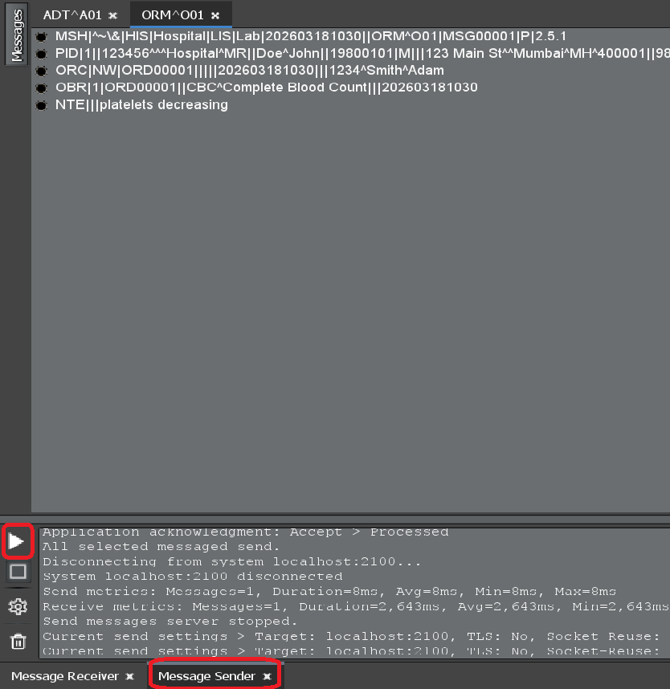

# Test the Recipe

## Introduction

After configuring and activating the Oracle Integration recipe, the next step is to test the end-to-end integration flow by simulating an HL7 healthcare message using HL7 Inspector. HL7 Inspector acts as a healthcare message simulator that enables you to send HL7 messages to the Oracle Integration MLLP listener, mimicking how an Oracle Health EHR system would transmit real-time order messages in a production environment.

In this section, you will use HL7 Inspector to load and send a sample HL7 ORM/OMR message to Oracle Integration. Once the message is sent, Oracle Integration processes the incoming HL7 payload, transforms it into a readable format using Healthcare actions, and creates a Care Request in Oracle Fusion.

Estimated Time: 5 minutes

### Objectives

In this lab you will learn:

- Verify that HL7 Inspector is properly configured to communicate with Oracle Integration
- Review the HL7 ORM 2.5.1 message payload before transmission
- Load the sample ORM_001.hl7 healthcare message file into HL7 Inspector
- Send the HL7 message to the Oracle Integration MLLP listener
- Receive and validate the acknowledgement (ACK) response from Oracle Integration
- Confirm that the integration flow is successfully triggered

### Prerequisites

- All the previous labs completed successfully.

## Task 1: Run the Recipe Using HL7 Inspector

Follow the steps below to send an HL7 message and trigger the Oracle Integration recipe.

1. Verify HL7 Inspector Setup. Ensure the following before sending the message:
    - The Message Receiver pane is open
    - The Message Sender is configured to send messages to port 2100

    > **Note:** Port 2100 should match the MLLP Listener Port configured in Oracle Integration.

2. Create a file named ORM_001.hl7 with the below data, and ensure that there are no additional extensions such as .txt.

    ```
        <copy>
MSH|^~\&|HIS|Hospital|LIS|Lab|202603181030||ORM^O01|MSG00001|P|2.5.1
PID|1||123456^^^Hospital^MR||Doe^John||19800101|M|||123 Main St^^Mumbai^MH^400001||9876543210
ORC|NW|ORD00001|||||202603181030|||1234^Smith^Adam
OBR|1|ORD00001||CBC^Complete Blood Count|||202603181030
NTE|||platelets decreasing|
    </copy>
    ```
3. Open the Sample HL7 Message File
    - Launch the HL7 Inspector application if it is not already open.
    - From the top menu, select File > File Open
    - Browse to the provided sample HL7 message file: ORM_001.hl7
    - In the Import Options window: Leave the default settings unchanged.Click OK.
4. Send the HL7 Message
    - In the Message Sender window, click Send Selected Message
    
    - This action sends the selected HL7 ORM 2.5.1 message to Oracle Integration.
5. Verify the Acknowledgement
    - After sending the message, review the Message Sender window.
    - Confirm that an Acknowledgement (ACK) message is received.

> **Note:** Receipt of the acknowledgement confirms that Oracle Integration successfully received the HL7 message.

## Task 2: Monitor Integration Execution

1. In the project workspace, click Observe.
2. Monitor the running integration instances.
3. Verify that each flow is triggered and completed successfully.

    You may now **proceed to the next lab**.

## Learn More

- [Getting Started with Oracle Integration 3](https://docs.oracle.com/en/cloud/paas/application-integration/index.html)

## Acknowledgements

- **Author** - Subhani Italapuram, Technical Director, Partner Enablement, Oracle Integration
- **Last Updated By/Date** - Subhani Italapuram, Apr 2026
