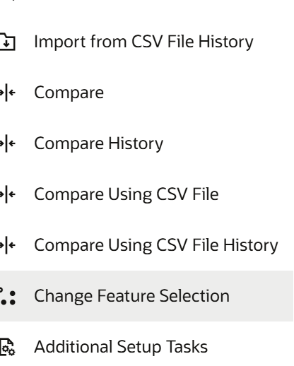
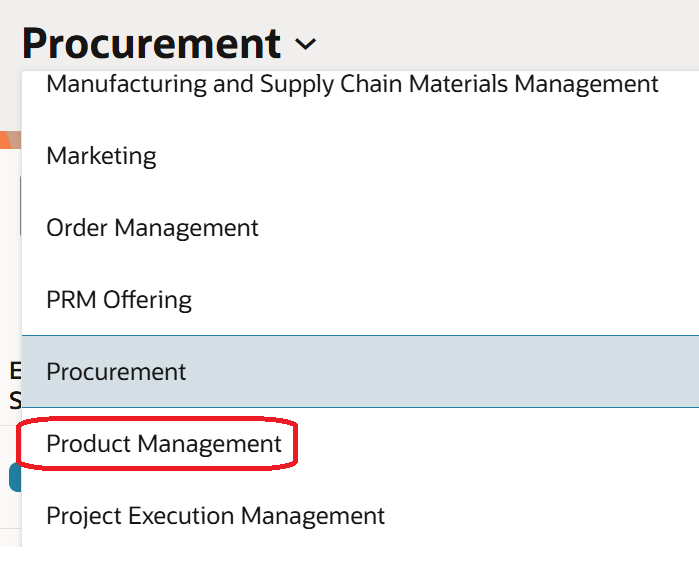
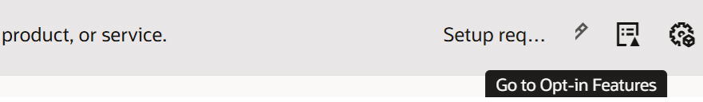
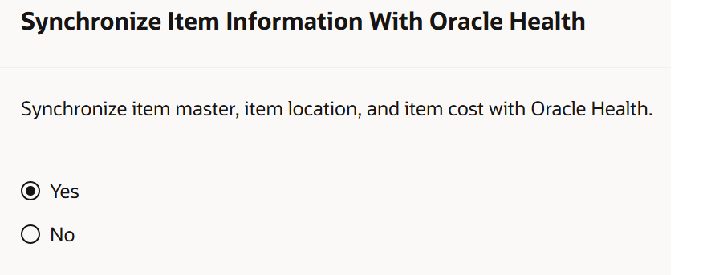
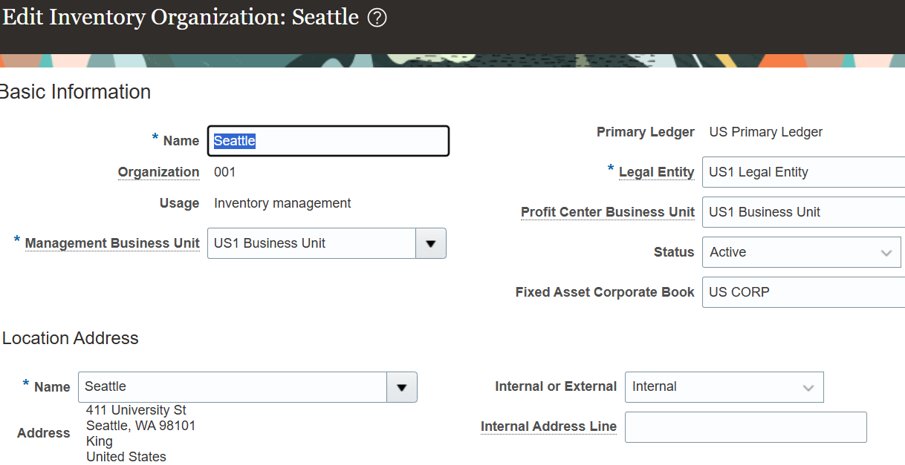
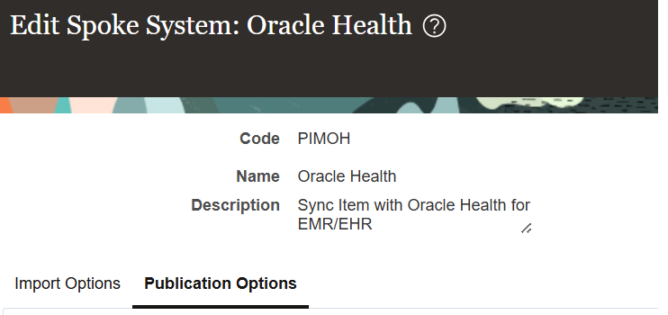
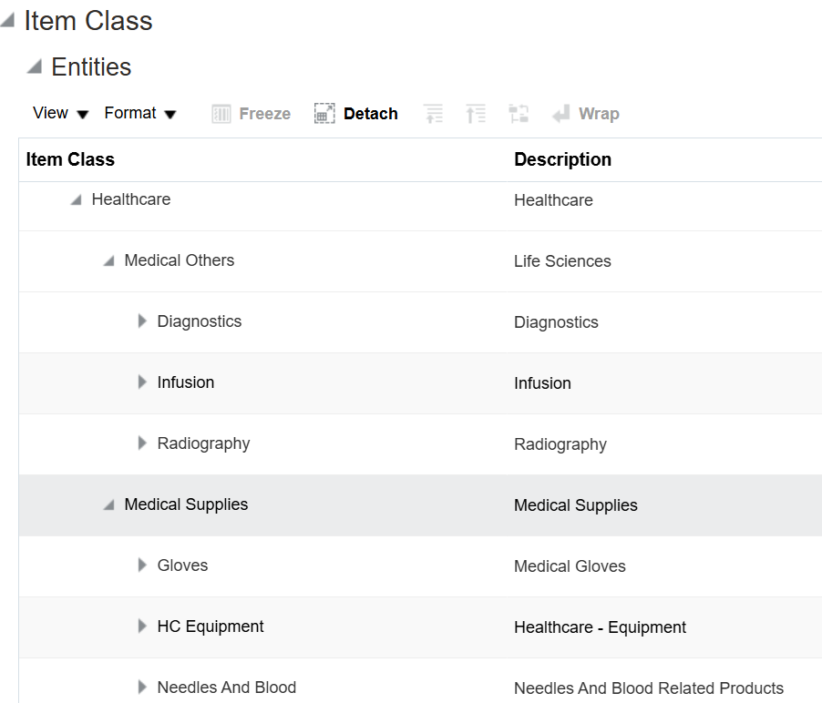
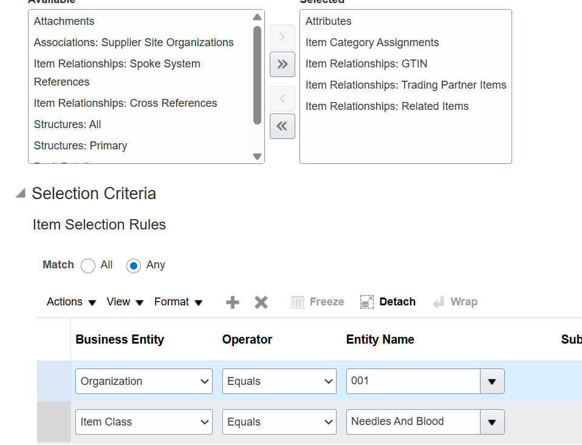
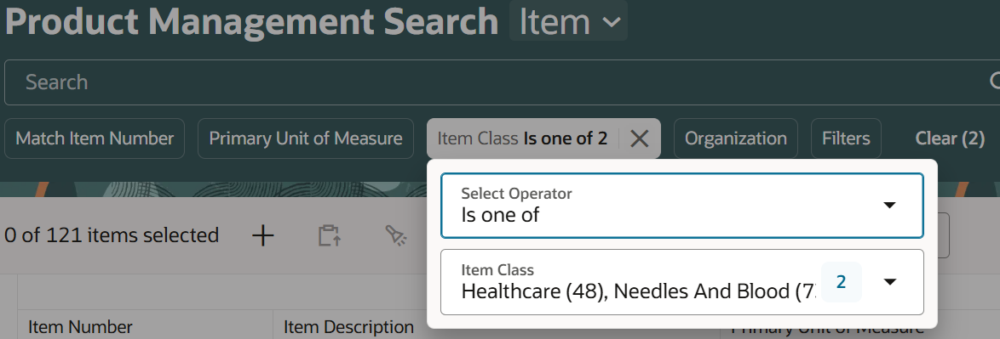
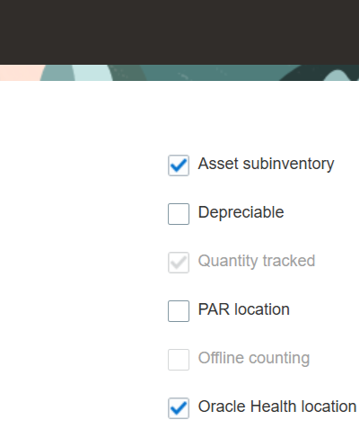

# Configure SCM

## Introduction

In this lab, you will configure Oracle Fusion Cloud SCM prerequisites required for Oracle Health EHR integration. You will enable the required opt-in feature, configure organizations and item publication settings, and validate the setup required for item synchronization.

Estimated Time: 20 minutes

### Objectives

In this lab, you will:

- Enable the Oracle Health integration opt-in feature
- Configure the Oracle Health spoke system
- Verify inventory organizations
- Configure item publication settings
- Configure scheduled processes for synchronization
- Validate SCM setup required for Oracle Health integration

### Prerequisites

Before starting this lab, ensure that:

- Oracle Fusion Cloud SCM access is available
- Required user roles are assigned

## Task 1: Sign In to Oracle Fusion Cloud SCM

1. Open Oracle Fusion Applications
2. Sign in to the Oracle Fusion Cloud instance as an administrator.
3. To access an Oracle Fusion Cloud Application from Oracle Integration and invoke notifications for events, you’ll require a separate user account on the Oracle Cloud Application.
4. Create a user account for Oracle Integration. Make a note of the user name and password you set for the account. You’ll use the credentials of this user account to connect to Oracle ERP Cloud from Oracle Integration
5. Assign the following roles to the user account:
    - Integration Specialist
    - Oracle ERP Cloud-specific data access to the integration user
6. Go to Learn More section for details.

## Task 2: Enable the Oracle Health Opt-In Feature

1. Navigate to **Setup and Maintenance**.
2. Click **...** (*More Actions*) and select **Change Feature Selection**.
    
    
3. Under **Setup**, select **Product Management**.
    
4. In the **Items** row, click **Go to Opt-In Features** under the **Actions** column.
    
5. Search for **Synchronize Item Information With Oracle Health**
6. Under the **Actions** column, click **Edit Enable Status**, set the value to **Yes**, and Click **Save and Close**.
    

## Task 3: Verify Inventory Organizations

1. Navigate to **Setup and Maintenance**.
2. Click **...** (*More Actions*) and select **Additional Setup Tasks**.
3. Click **Tasks**, and then click **Search**.
4. Search for **Manage Inventory Organizations** and open the task.
5. Verify the required inventory organizations exist.
6. Record the following information:
    - Inventory Organization Code
    - Organization Name
    - Business Unit
    - Location
7. For example, select the organization **Seattle** and click **Edit** to review the above information, as shown in the following screenshot.
    

    This information is required for lookup table mappings.

## Task 4: Configure the Oracle Health Spoke System

1. Navigate to **Setup and Maintenance**.
2. Click **...** (*More Actions*) and select **Additional Setup Tasks**.
3. Click **Tasks**, and then click **Search**.
4. Search for **Manage Spoke Systems** and open the task.
5. Search for **PIMOH** and Edit it and click *Publication Options*
    
6. Define the rules as per the below screenshot.
    
    
7. Review the following configuration details:
    - Spoke System Code
    - Spoke System Name
    - Publication Status
    - Publication Maps
    - Item Filters
    - Item Classes
    - Organization Assignments
8. Verify that the publication maps and filters required for Oracle Health integration are configured correctly.
9. Click Save and Close after reviewing the configuration.
10. Validation

    Verify that:
    - The Oracle Health spoke system exists.
    - Publication maps are assigned correctly.
    - Required item classes are included.
    - Filters are configured properly.
    - The spoke system is enabled for publication processing.

## Task 5: Verify the Oracle Health Spoke System Configuration

1. Navigate to the Oracle Fusion Applications **Home** page.
2. Select Product Management > Product Management > Items
3. In the Product Management work area, search for the item classes created for the Oracle Health integration. For example, *Healthcare*, *Needles And Blood*
    
4. Verify that the required item classes are available.
5. Open item class and review the configuration details.
6. Verify the following:
    - Item Class Name
    - Item Class Code
    - Attribute Groups
    - Item Attributes
    - Publication Settings
    - Organization Assignments
7. Confirm that the item classes are configured correctly for Oracle Health spoke system publication.
8. Validation

    Verify that:
    - Required item classes exist.
    - Attribute groups are configured correctly.
    - Required attributes are enabled.
    - Publication settings are configured properly.
    - Item classes are available for publication processing

## Task 6: Configure Subinventories and Assign Items for Oracle Health Integration

1. Navigate to **Setup and Maintenance**.
2. Under **Procurement**, click **...** (*More Actions*) and select **Additional Setup Tasks**.
3. Click **Search** from the right-side Tasks panel.
4. Search for *Manage Subinventories and Locators*
5. Open the task, Select the organization *Seattle*, click *OK*
6. Locate the Subinventory *Completed*, Select the Subinventory row and click Edit.
7. Enable the field:Oracle Health Location
    
8. Click Save and Close.
9. To assign items to the subinventory, click *Manage Item Subinventories* button
10. Search for the required items and Assign the items to the Completed subinventory.
11. Save the changes
12. Validation

Verify that:
    - The Completed subinventory is configured successfully.
    - The Oracle Health Location field is enabled.
    - Required items are assigned to the subinventory.
    - The organization and subinventory mappings are configured correctly for Oracle Health integration.

## Task 7: Verify or Create Items in Product Information Management

1. Navigate to the Oracle Fusion Applications **Home** page.
2. Select: Product Management > Product Information Management
3. In the *Product Information Management* work area, click Tasks and select: Manage Items
4. Search for the required items.
5. Verify whether the items already exist.
6. If the Items Exist, Open the item.
7. Verify the following information:
    - Item Number
    - Description
    - Item Class
    - Organization Assignment
    - Primary Unit of Measure
    - Lifecycle Phase
    - Item Status
8. Confirm that the item is enabled for publication and synchronization.
9. If the Items Do Not Exist
10. Create a New Item (click Tasks and select: Create Item)
11. Click: Create Item
12. Select: Organization, Item Class and Click OK.
13. Enter the required item details:

    | Field                   | Example Value        |
    | ----------------------- | -------------------- |
    | Item                    | TEST_ITEM_001        |
    | Description             | Test Healthcare Item |
    | Primary Unit of Measure | Each                 |
    | Lifecycle Phase         | Production           |
    | Item Status             | Active               |

14. Configure additional attributes as required.
15. Click Save.

## Task 8: Assign the Item to an Organization

1. Open the newly created item.
2. Navigate to: Associations > Organizations
3. Assign the required inventory organization.
4. Save the changes.

## Task 9: Verify Publication Eligibility

1. Verify the item belongs to the required item class.
2. Confirm publication attributes are enabled.
3. Verify organization assignment is configured correctly.
4. Validation

    Verify that:
    - The required item exists.
    - The item is assigned to the correct organization.
    - The item class is configured correctly.
    - The item is eligible for publication and synchronization with Oracle Health EHR.

## Task 10: Configure Trading Partner Items for Manufacturing

1. Navigate to the Oracle Fusion Applications **Home** page.
2. Select: Product Management > Product Information Management
3. Open the required item, Click Edit Item.
4. Navigate to: Manufacturing, Go to: Relationships > Trading Partner Items, Click: Add
5. Create or select the required Trading Partner (Manufacturer).
6. Enter the required manufacturer details.
7. Verify that the manufacturer name matches the manufacturer configured in Oracle Health EHR.
8. If the manufacturer does not exist:
    - Obtain the manufacturer information from the client or Oracle Health Consulting team.
    - Create the Trading Partner in Oracle Fusion Cloud SCM.
9. Configure the following details as required:
    - Trading Partner Type
    - Manufacturer Name
    - Manufacturer Item Number
    - Status
    - Effective Dates
10. Click Save and Close.
11. Validation

    Verify that:
    - The Trading Partner Item is configured successfully.
    - The manufacturer matches the Oracle Health EHR configuration.
    - The item relationship is active and valid.
    - The item is ready for Oracle Health synchronization processing

## Task 11: Configure Scheduled Processes

1. Navigate to: Tools > Scheduled Processes
2. Verify the following scheduled processes are available:
    - Scheduled Process
        - Product Hub Publication Job
        - Synchronize Items with Oracle Health

    You may now **proceed to the next lab**.

## Learn More

* [Configure the Accelerator](https://docs.oracle.com/en/cloud/saas/supply-chain-and-manufacturing/26b/fasih/configure-the-accelerator.html#u30252184)
* [Using the Oracle ERP Cloud Adapter with Oracle Integration](https://docs.oracle.com/en/cloud/paas/integration-cloud/erp-adapter/understand-oracle-erp-cloud-adapter.html#ICSER-GUID-F4D895BD-5234-4C38-B6B1-B7C5CA2F6B37)
* [Assign Required Roles to an Integration User](https://docs.oracle.com/en/cloud/paas/application-integration/erp-adapter/assign-required-roles-integration-user.html#ICSER-GUID-B861559A-DECE-4F7B-82CA-AA48263CA159)

## Acknowledgements

* **Author** - Subhani Italapuram, Product Management, Oracle Integration
* **Last Updated By/Date** - Subhani Italapuram, May 2026
