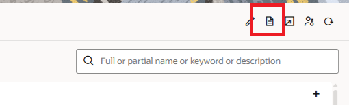

# Install and Configure the Accelerator

## Introduction

In this section, you install the Oracle Fusion Cloud SCM — Oracle Health EHR | Sync Items accelerator from Oracle Integration Store and configure the required connections, lookups, and supporting resources needed to synchronize item master, item location, and item cost information between Oracle Fusion Cloud SCM and Oracle Health EHR.

The accelerator includes prebuilt integrations, mappings, and orchestration flows that help automate healthcare inventory synchronization processes.

Estimated Time: 20 minutes

### Objectives

In this lab, you will:

- Install the accelerator package from Oracle Integration Store
- Review the imported integrations
- Configure Oracle ERP Cloud connection (ERP Cloud Adapter - Trigger & Invoke)
- Configure Oracle WebCenter Content connection (SOAP Adapter - Trigger & Invoke)
- Configure Oracle Health connection (Oracle Health Inventory Management Adapter - Invoke)
- Configure Oracle ERP Cloud REST connection (REST Adapter - Invoke)
- Configure Oracle Rest Trigger connection (REST Adapter - Trigger)
- Verify required lookups and libraries
- Activate the integrations

### Prerequisites

Before starting this lab, ensure that:

- You have access to Oracle Integration Healthcare Edition (Oracle Health EHR 2025.3 or later
)
- You have access to Oracle Fusion Cloud SCM (Oracle Fusion Cloud SCM Update 24D or later)
- The opt-in feature Synchronize Item Information With Oracle Health is enabled
- Required credentials are available for:
  - Oracle ERP Cloud (An account in Oracle ERP Cloud with the Administrator role)
  - Oracle Health (An account in Oracle Health EHR with the Administrator role)
  - Oracle WebCenter Content
- You have the necessary permissions to create and activate integrations

## Task 1: Install the accelerator

1. Login into Oracle Integration console.
2. On the Oracle Integration Home page, under the Get Started section, click Browse Store.
3. Search for the required accelerator (Oracle Fusion Cloud SCM — Oracle Health EHR | Sync Items), then click *Get* to install it. If it is already installed, you will not see the *Get* button.
A confirmation message will appear, and the accelerator card status will change to In *Use*.

## Task 2: Configure Connections

Before you activate and run the accelerator, you must configure its resources.
To configure the accelerator, on the accelerator card, click on *...* (Actions) --> click Configure.

1. Oracle ERP Cloud Connection
    - Enter ERP Cloud URL
    - Configure Security Policy as Username Password Token
    - Enter Username and Password
    - Click on **Test** and *Save* the connection.
2. Oracle ERP Cloud REST Connection Configuration
    - Enter REST endpoint URL
    - Enter Username and Password
    - Configure the Security Policy as **Basic Authentication**
    - Click on **Test** and *Save* the connection.

3. Oracle Health Connection

- Enter the following details and Click on **Test** and *Save* the connection.

    | Field                               |Information to Enter            |
    | ----------------------------------- | ------------------------------ |
    | Service Container URL          | Provide service container URL.      |
    | Environment | Select PRODUCTION or STAGING.                 |
    | Tenant Domain          | Enter the tenant domain.             |
    | Security Policy            | OAuth Client Credentials |
    | Access Token URI|Enter the access token URL for the Oracle Health.|
    |Client Id|Provide the client id for the Oracle Health.|
    |Client Secret|Provide the client secret for the Oracle Health.|
    |Scope |oraclehealth:millennium:inventory|

4. Oracle WebCenter Content Connection (Purpose:Reads item master, item location, and item cost files generated by SCM.)
    - Enter WSDL URL (WCC endpoint) For example, https://your\_domain\_name/idcws/GenericSoapPort?wsdl
    - Configure Security Policy as Username Password Token
    - Enter Username and Password
    - Click on **Test** and *Save* the connection.
5. Oracle REST Trigger Connection
    - Configure Security Policy as OAuth 2.0
    - Click on **Test** and *Save* the connection.

## Task 3: Configure the Lookup Tables - Read Only

The following lookup tables are used by the Oracle Fusion Cloud SCM — Oracle Health EHR accelerator to transform, map, and route item, organization, locator, transaction, and healthcare inventory data between Oracle Fusion Cloud SCM and Oracle Health EHR.

| Lookup Table Name                       | Description                                                                                      |
| --------------------------------------- | ------------------------------------------------------------------------------------------------ |
| OracleSCMOrganizationMapping            | Maps the Inventory Organizations in Oracle ERP Cloud and Organizations in Oracle Health EHR      |
| OracleSCMSubinventoriesMapping          | Maps the Item Subinventories in Oracle ERP Cloud and Locators in Oracle Health EHR               |
| OracleSCMLocatorsMapping                | Maps the item locators in Oracle ERP Cloud and locators in Oracle Health EHR                     |
| OracleUOMMapping                        | Maps the unit of measures in Oracle ERP Cloud and units of measure in Oracle Health EHR          |
| OracleSCM\_StandardFields                | Maps the XML tags for predefined attributes in Oracle ERP Cloud with Oracle Health EHR           |
| OracleSCM\_DynamicFields                 | Maps the XML tags for user-defined attribute mappings in Oracle ERP Cloud with Oracle Health EHR |
| OracleSCMTransactionMapping             | Maps the transaction types for item locations and locators for Oracle Health EHR                 |
| OracleLatexIndicatorMapping             | Maps the Latex indicator values between Oracle ERP Cloud and Oracle Health EHR                   |
| OracleSCMChargeableIndicatorMapping     | Maps the Chargeable indicator values between Oracle ERP Cloud and Oracle Health EHR              |
| OracleHealthEHR\_Dynamic\_FTPDetails      | Provides the folder locations for loading files into Oracle Health EHR                           |
| OracleSCMOracleHealthEHR\_EmailContacts  | Defines email contacts that are notified in case of integration failures                         |
| OracleHealthEHR\_Contants                | Maintains static attribute values used by Oracle Health EHR                                      |
| OracleHealthOracleINVTransactionMapping | Maps Oracle Health adjustment reasons with Oracle Inventory Cloud transaction types              |
| OracleHealthEHR\_NonStocLoc              | Maps Oracle ERP Organizations with Oracle Health Organizations and nonstock locations            |

## Task 4: Configure the Lookup Tables

Configure the following lookup tables used by the Oracle Fusion Cloud SCM — Oracle Health EHR accelerator.

In the **Lookups** section, click the lookup name to edit and update the required values.

| Lookup Table Name                       | Configuration Details                                                                                                                                                                                                                                                                                                                                                                                                                                                                                                                                                                                                                                                   |
| --------------------------------------- | ----------------------------------------------------------------------------------------------------------------------------------------------------------------------------------------------------------------------------------------------------------------------------------------------------------------------------------------------------------------------------------------------------------------------------------------------------------------------------------------------------------------------------------------------------------------------------------------------------------------------------------------------------------------------- |
| OracleSCMOrganizationMapping            | <ul><li>In the <b>SCMOrganization</b> column, enter the Inventory Organization code from Oracle ERP Cloud.</li><li>In the <b>OracleHealthEHROrganization</b> column, enter the Oracle Health EHR Organization.</li><li>In the <b>ERP\_Requisition\_BU</b> column, enter the Business Unit for the Oracle SCM Organization.</li><li>In the <b>ERP\_Currency\_Code</b> column, enter the Currency Code for the Oracle ERP Organization.</li><li>In the <b>ERP\_DeliverTo\_Location</b> column, enter the Oracle ERP Location Address name configured for the organization.</li><li>In the <b>SCMOrganization_Name</b> column, enter the Oracle ERP Organization name.</li></ul> |
| OracleSCMSubinventoriesMapping          | <ul><li>In the <b>SCMSubinventories</b> column, enter the Subinventory code from Oracle ERP Cloud.</li><li>In the <b>OracleHealthEHRLocation</b> column, enter the Oracle Health EHR Location.</li><li>In the <b>OracleHealthEHROrg_Loc</b> column, enter the Oracle Health EHR Organization and Location separated with a colon (:).</li></ul>                                                                                                                                                                                                                                                                                                                         |
| OracleSCMLocatorsMapping                | <ul><li>In the <b>SCMLocators</b> column, enter the Locator code from Oracle ERP Cloud.</li><li>In the <b>OracleHealthEHRLocator</b> column, enter the Oracle Health EHR Locator.</li><li>In the <b>OracleEHROrg\_Loc</b> column, enter the Oracle Health EHR Organization and Location separated with a colon (:).</li></ul>                                                                                                                                                                                                                                                                                                                                            |
| OracleUOMMapping                        | <ul><li>In the <b>OracleSCMValue</b> column, enter the Unit of Measure code from Oracle ERP Cloud.</li><li>In the <b>OracleHealthEHRValue</b> column, enter the Unit of Measure value used in Oracle Health EHR.</li></ul>                                                                                                                                                                                                                                                                                                                                                                                                                                              |
| OracleSCMTransactionMapping             | <ul><li>In the <b>OracleSCMValue</b> column, enter the Transaction Type from Oracle ERP Cloud.</li><li>In the <b>OracleHealthEHRValue</b> column, enter the Transaction Type used in Oracle Health EHR.</li></ul>                                                                                                                                                                                                                                                                                                                                                                                                                                                       |
| OracleLatexIndicatorMapping             | <ul><li>In the <b>OracleSCMValue</b> column, enter the Latex Indicator value from Oracle ERP Cloud.</li><li>In the <b>OracleHealthEHRValue</b> column, enter the Latex Indicator value used in Oracle Health EHR.</li><li>These fields are prepopulated for the standard integration.</li></ul>                                                                                                                                                                                                                                                                                                                                                                         |
| OracleSCMChargeableIndicatorMapping     | <ul><li>In the <b>OracleSCMValue</b> column, enter the Chargeable Indicator value from Oracle ERP Cloud.</li><li>In the <b>OracleHealthEHRValue</b> column, enter the Chargeable Indicator value used in Oracle Health EHR.</li><li>These fields are prepopulated for the standard integration.</li></ul>                                                                                                                                                                                                                                                                                                                                                               |
| OracleSCMOracleHealthEHR\_EmailContacts  | <ul><li>In the <b>Contact</b> column, enter the From and To values for error notification emails.</li><li>In the <b>EmailID</b> column, enter the email addresses for error notifications.</li><li>These fields are prepopulated for the standard integration.</li></ul>                                                                                                                                                                                                                                                                                                                                                                                                |
| OracleHealthEHR\_Contants                | <ul><li>In the <b>DataElementName</b> column, enter the Oracle Health EHR constant attribute name.</li><li>In the <b>DataElementValue</b> column, enter the constant attribute value used by Oracle Health EHR.</li><li>These fields are prepopulated for the standard integration.</li><li>For additional spoke systems, create a copy of the integration and update the <b>SpokeSystemCode</b> row value.</li></ul>                                                                                                                                                                                                                                                   |
| OracleSCM\_DynamicFields                 | <ul><li>In the <b>OracleHealthEHRField</b> column, enter the Oracle Health EHR attribute name.</li><li>In the <b>OracleSCM\_ItemClassName</b> column, enter the Item Class Code from the Oracle ERP Cloud publish payload.</li><li>In the <b>OracleSCM\_AttributeGroupNode</b> column, enter the Attribute Group name from the Oracle ERP Cloud publish payload.</li><li>In the <b>OracleSCM\_AttributeNode</b> column, enter the Attribute Name from the Oracle ERP Cloud publish payload.</li></ul>                                                                                                                                                                      |
| OracleHealthOracleINVTransactionMapping | <ul><li>In the <b>OracleINV</b> column, configure the mapping between Oracle Health adjustment types and Oracle ERP Inventory transaction types.</li></ul>                                                                                                                                                                                                                                                                                                                                                                                                                                                                                                              |
| OracleHealthEHR\_NonStocLoc              | <ul><li>In the <b>SCM\_ORG</b> column, enter the Oracle ERP Organization Code.</li><li>In the <b>NonStock\_Loc</b> column, enter the Oracle Health nonstock location.</li><li>In the <b>OracleHealthEHROrganization</b> column, enter the Oracle Health EHR Organization.</li></ul>                                                                                                                                                                                                                                                                                                                                                                                       |

## Task 5: Explore the Installed Accelerator

1. Once inside the project, you should see the Project Overview page showing:

    - Project Name: Oracle PLM Millenium Item Sync
    - Review the components available in the accelerator, including:
        - Integrations
        - Connections
    - Navigate to the Integrations section and examine the available integration flows, such as:

| Integration                         |Purpose                         |
| ----------------------------------- | ------------------------------ |
| Oracle PLM Millennium Sync          | Main orchestration flow        |
| Oracle PLM Millennium Item Sync API | API processing                 |
| Oracle PLM Item Event Stub          | Event trigger flow             |
| Get Transactions Summary            | Transaction summary processing |

- Click on **Learn about the Integration** to understand the details of the integration flow.
    

## Task 4: Edit all the integration and understand the design and flow logic

1. Select an integration flow (Oracle PLM Millennium Sync) and click Edit to open the integration designer.
2. Review the overall integration structure, including:
    - Trigger (REST endpoint)
    - Invoke (SOAP Adapter call)
    - Response mapping
    - Go through the complete integration flow
3. Repeat the above steps for other integration flows:
    - Oracle PLM Millennium Item Sync API
    - Oracle PLM Item Event Stub
    - Get Transactions Summary
4. Save and close the integration after review (no changes required unless customization is needed)

    You may now **proceed to the next lab**.

## Learn More

* [Configure the Accelerator](https://docs.oracle.com/en/cloud/saas/supply-chain-and-manufacturing/26b/fasih/configure-the-accelerator.html#u30252184)

* [About Projects](https://docs.oracle.com/en/cloud/paas/application-integration/integrations-user/integration-projects.html)

* [Activate or Deactivate a Project](https://docs.oracle.com/en/cloud/paas/application-integration/integrations-user/activate-and-deactivate-project.html#GUID-61035125-0E47-49F3-A3ED-9EFEA03BDDDE)

* [Monitor Integrations in a Project](https://docs.oracle.com/en/cloud/paas/application-integration/integrations-user/monitor-integrations-project.html)

* [Oracle Integration 3 FHIR Adapter](https://docs.oracle.com/en/cloud/paas/application-integration/fhir-adapter/index.html)

## Acknowledgements

* **Author** - Subhani Italapuram, Product Management, Oracle Integration
* **Last Updated By/Date** - Subhani Italapuram, May 2026
