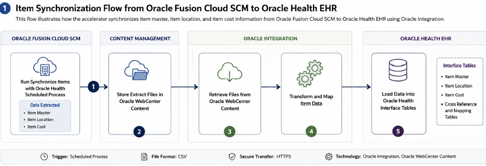
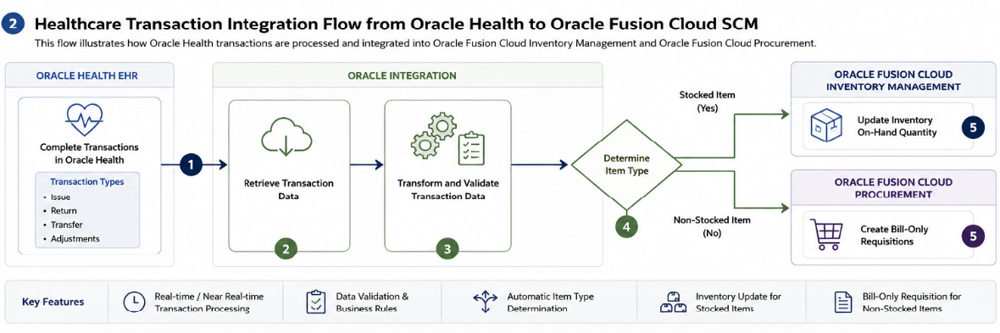

# Sync Items from SCM to EHR

## Introduction

This LiveLab demonstrates how to use the Oracle Fusion Cloud SCM — Oracle Health EHR | Sync Items accelerator to synchronize item master, item location, and item cost information from Oracle Fusion Cloud SCM with Oracle Health EHR.

The accelerator enables scheduled synchronization of SCM item data using Oracle Integration. The Synchronize Items with Oracle Health scheduled process extracts item data from Oracle WebCenter Content, transforms the data, and loads it into Oracle Health Interface Tables for further downstream processing within Oracle Health EHR.

This solution helps healthcare organizations streamline inventory management, automate item synchronization processes, and improve consistency between Oracle SCM and Oracle Health systems.

The integration solution orchestrates item synchronization and transaction processing between:

* Oracle Fusion Cloud SCM / ERP Cloud
* Oracle WebCenter Content
* Oracle Health

The accelerator automates healthcare inventory-related integrations and reduces manual processing effort.

This flow illustrates how the accelerator synchronizes item master, item location, and item cost information from Oracle Fusion Cloud SCM to Oracle Health EHR using Oracle Integration.
    

This flow illustrates how Oracle Health transactions are processed and integrated into Oracle Fusion Cloud Inventory Management and Oracle Fusion Cloud Procurement.
    

Estimated Workshop Time: 1 hour

### Objectives

In this LiveLab, you will learn how to:

* Install the accelerator
* Configure required connections
* Activate integrations
* Run synchronization processes
* Monitor integration execution
* Validate synchronized item data

### Prerequisites

Before starting this lab, ensure you have:

* Oracle Cloud Account with credits to provision services.
* Access to Oracle Integration Cloud (OIC) healthcare edition
* Access to Oracle Fusion SCM (Oracle Fusion Cloud SCM Update 24D or later)
* An account in Oracle ERP Cloud with the Administrator role
* Access to Oracle Health EHR (Oracle Health EHR 2025.3 or later)
* An account in Oracle Health EHR with the Administrator role
* Basic understanding of REST APIs
* Familiarity with healthcare data concepts (optional)

## Task 1: Business Benefits

Using this accelerator helps organizations:

* Streamline inventory synchronization
* Improve item data consistency
* Reduce manual intervention
* Automate healthcare supply chain operations
* Improve visibility across systems
* Enable efficient item event processing

## Task 2: Accelerator Components

The project contains the following integrations:

* Oracle PLM Millennium Sync
* Oracle PLM Millennium Item Sync API
* Oracle PLM Item Event Stub
* Get Transactions Summary

## Task 3: Connections Used

The accelerator uses these primary connections:

* Oracle ERP Cloud Connection
* Oracle ERP Cloud REST Connection
* Oracle Health Connection
* Oracle WebCenter Content Connection
* Oracle REST Trigger
* Native File Server

## Task 4: High-Level Flow

* Oracle Fusion Cloud SCM generates item data extracts.
* Files are stored in Oracle WebCenter Content.
* The scheduled synchronization process triggers Oracle Integration.
* Integration flows read item master, location, and cost files.
* Oracle Health EHR consumes the synchronized data

## Task 5: Solution Overview

You can use the actual integration names from the uploaded document:

| Integration                         | Purpose                       |
| ----------------------------------- | ----------------------------- |
| Oracle PLM Millennium Sync          | Main orchestration flow       |
| Oracle PLM Millennium Item Sync API | API interface                 |
| Oracle PLM Item Event Stub          | Event processing              |
| Get Transactions Summary            | Transaction summary retrieval |

## Task 6: Suggested Architecture Diagram Flow 1

        Oracle Fusion Cloud SCM
                │
                ▼
        Run Synchronize Items with Oracle Health Scheduled Process
                │
                ▼
        Store Extract Files in Oracle WebCenter Content
                │
                ▼
        Oracle Integration Retrieves Files
                │
                ▼
        Transform and Map Item Data
                │
                ▼
        Load Data into Oracle Health Interface Tables

## Task 7: Suggested Architecture Diagram Flow 2

            Oracle Health
                    │
                    ▼
            Complete Transactions in Oracle Health
                    │
                    ▼
            Oracle Integration Retrieves Transactions
                    │
                    ▼
            Transform and Validate Transaction Data
                    │
                    ▼
            Determine Item Type
            ┌─────────────────────┐
            │                     │
            ▼                     ▼
        Stocked Item      Non-Stocked Item
            │                     │
            ▼                     ▼
        Update Inventory   Create Bill-Only
        On-Hand Quantity   Requisitions

You may now **proceed to the next lab**.

## Learn More

* [Oracle Integration 3 Documentation](https://docs.oracle.com/en/cloud/paas/application-integration/index.html)
* [Get Started with Healthcare](https://docs.oracle.com/en/cloud/paas/application-integration/integration-healthcare/get-started-healthcare.html)

* [Sync Items From Oracle Fusion Cloud SCM to Oracle Health EHR](https://docs.oracle.com/en/cloud/saas/supply-chain-and-manufacturing/26b/fasih/index.html)

## Acknowledgements

* **Author** - Subhani Italapuram, Product Management, Oracle Integration
* **Last Updated By/Date** - Subhani Italapuram, May 2026
