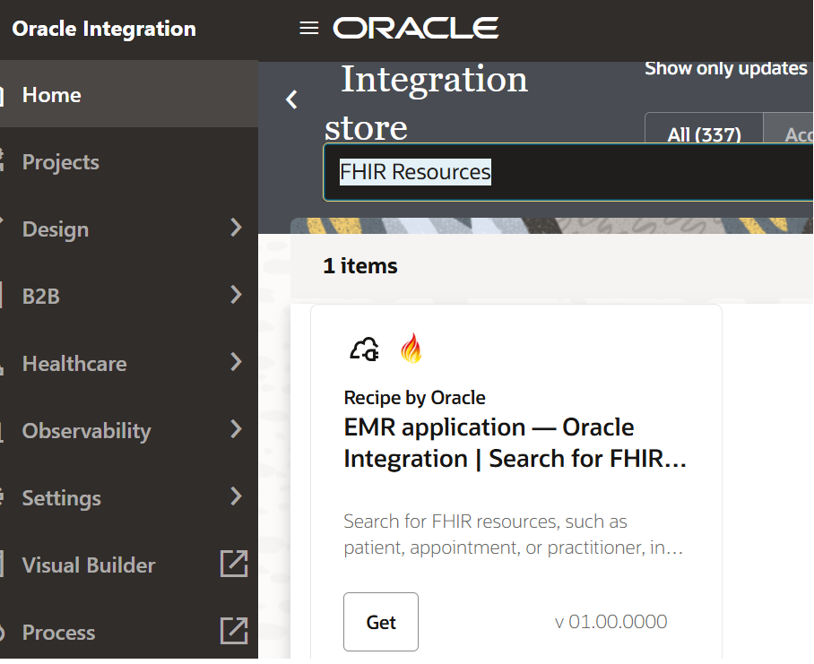

# Install and Configure the Recipe

## Introduction

In this lab, you will install and configure a prebuilt integration recipe in Oracle Integration Cloud that enables interaction with a FHIR-based EMR system. Recipes in Oracle Integration provide ready-to-use integration patterns that accelerate development and reduce implementation effort.

You will begin by installing the recipe from the Oracle Integration Store and then configuring the required resources to make the integration operational. This includes setting up connectivity to a FHIR server and validating the connection before activating the integration flows.

By completing this lab, you will gain hands-on experience in preparing an integration for execution, which is a critical step before running and testing healthcare use cases such as searching patient, appointment, and practitioner data.

During this lab, you will configure the following components:

- FHIR Connection
- Integration Resources

At the end of this lab, you will have:
- Successfully installed the integration recipe
- Configured the FHIR connection
- Prepared the integration flows for activation and execution

Estimated Time: 20 minutes

### Objectives

In this lab, you will:

- Install the recipe
- Configure the connections
- Configure the integrations and activate them

### Prerequisites

This lab assumes you have:

- All previous labs completed.

## Task 1: Install the recipe

1. Login into Oracle Integration console.
2. On the Oracle Integration Home page, under the Get Started section, click Browse Store.
3. Search for the required recipe (e.g.,FHIR Resources), then click *Get* to install it. If it is already installed, you will not see the *Get* button.
A confirmation message will appear, and the recipe card status will change to In *Use*.
    

## Task 2: Explore the Installed Recipe

1. Once inside the project, you should see the Project Overview page showing:

    - Project Name: Search FHIR Resources
    - Review the components available in the recipe, including:
        - Integrations
        - Connections
    - Navigate to the Integrations section and examine the available integration flows, such as:
        - Search Patient
        - Search Practitioner
        - Search Appointment
        - Search MedicationRequest
        - Search Coverage
    - Click on **Learn about the Integration** to understand the details of the integration flow.
    

## Task 3: Configure Connections

All the connections are in draft state. We will configure the connections used by the integration flows.

1. REST Connection Configuration
    - Edit the REST Connection.
    - Configure the Security Policy as **OAuth 2.0**
    - Click on **Test** and *Save* the connection.

2. FHIR Connection Configuration
    - Edit the FHIR Connection.
    - Configure Connection URL as **https://hapi.fhir.org/baseR4**
    - Configure the Security Policy as **No Security Policy**
    - Click on **Test** and *Save* the connection.

## Task 4: Edit all the integration and understand the design and flow logic

1. Select an integration flow (for example, Search Patient) and click Edit to open the integration designer.
2. Review the overall integration structure, including:
    - Trigger (REST endpoint)
    - Invoke (FHIR Adapter call)
    - Response mapping
3. Click on the Trigger element:
    - Examine the exposed REST endpoint
    - Review input parameters (URI/query parameters)
4. Click on the Invoke (FHIR Adapter) action:
    - Review the configured FHIR resource (e.g., Patient)
    - Check how search parameters are passed to the EMR system
5. Open the Mapper between Trigger and Invoke:
    - Analyze how input parameters are mapped to FHIR query parameters
    - Understand data transformation logic
6. Review the Response Mapper:
    - Examine how the FHIR response is mapped back to the output
    - Verify structure and fields returned to the client
7. Repeat the above steps for other integration flows:
    - Search Practitioner
    - Search Appointment
    - Search MedicationRequest
    - Search Coverage
8. Save and close the integration after review (no changes required unless customization is needed)

    You may now **proceed to the next lab**.

## Learn More

* [Getting Started with Oracle Integration 3](https://docs.oracle.com/en/cloud/paas/application-integration/index.html)

* [About Projects](https://docs.oracle.com/en/cloud/paas/application-integration/integrations-user/integration-projects.html)

* [Activate or Deactivate a Project](https://docs.oracle.com/en/cloud/paas/application-integration/integrations-user/activate-and-deactivate-project.html#GUID-61035125-0E47-49F3-A3ED-9EFEA03BDDDE)

* [Monitor Integrations in a Project](https://docs.oracle.com/en/cloud/paas/application-integration/integrations-user/monitor-integrations-project.html)

* [Oracle Integration 3 FHIR Adapter](https://docs.oracle.com/en/cloud/paas/application-integration/fhir-adapter/index.html)

## Acknowledgements

* **Author** - Subhani Italapuram, Product Management, Oracle Integration
* **Last Updated By/Date** - Subhani Italapuram, Apr 2026
