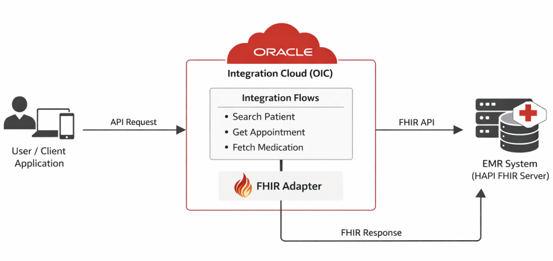
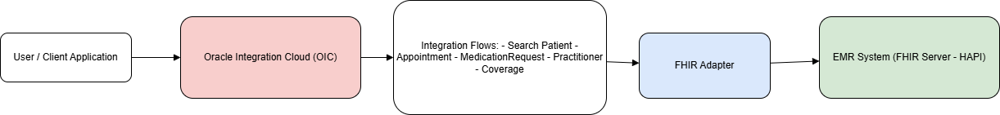

# Search FHIR Resources in EMR

## Introduction

Healthcare organizations rely on multiple systems such as Electronic Medical Records (EMR), insurance platforms, and clinical applications to manage patient data. However, integrating these systems and accessing healthcare data in a standardized way remains a significant challenge.

Fast Healthcare Interoperability Resources (FHIR) is a widely adopted standard that enables seamless exchange of healthcare information across systems. Leveraging FHIR APIs, organizations can efficiently retrieve and manage critical healthcare data such as patient records, appointments, medications, and practitioner details.

This Live Lab demonstrates how to use Oracle Integration Cloud (OIC) to connect to an EMR system and search FHIR resources using a prebuilt integration recipe. Participants will learn how to install, configure, and execute integrations that retrieve healthcare data in real time.

Estimated Workshop Time: 1 hour

### Objectives

By completing this live lab, you will:

* Understand FHIR standards in healthcare integration
* Configure and use the FHIR Adapter in Oracle Integration
* Execute integration flows to retrieve healthcare data
* Monitor and validate integration execution

### Prerequisites

Before starting this lab, ensure you have:

* Oracle Cloud Account with credits to provision services.
* Access to Oracle Integration Cloud (OIC) healthcare edition
* Basic understanding of REST APIs
* Familiarity with healthcare data concepts (optional)

## Task 1: Business Scenario

Healthcare organizations operate multiple systems such as EMRs, insurance platforms, and clinical applications. These systems often lack standardized interfaces, making it difficult to access and exchange patient data efficiently.

## Task 2: Challenges

1. **Fragmented healthcare systems:** Healthcare data is spread across multiple disconnected systems, making unified access difficult. This fragmentation leads to inefficiencies and incomplete patient information during care delivery.
2. **Lack of interoperability standards:** Different systems use varied data formats and protocols, limiting seamless data exchange. This lack of standardization increases integration effort and reduces data consistency.
3. **Complex integrations with EMR systems:** Integrating with EMR systems requires handling diverse APIs and data structures. This complexity increases development time and requires specialized expertise.
4. **Delays in accessing patient and clinical data:** Manual processes and disconnected systems slow down data retrieval. This delay impacts timely decision-making and overall patient care quality.

## Task 3: Solution

Oracle Integration Cloud (OIC) provides a FHIR Adapter that enables standardized and seamless integration with EMR systems using FHIR APIs. This live lab demonstrates how to search healthcare resources such as patients, appointments, medications, and practitioners.

## Task 4: Use Cases

The following use cases are covered in this lab:

1. **Search Patient details:** Retrieve patient information using identifiers or demographic parameters. Enables quick access to patient records for clinical and administrative purposes.
2. **Retrieve Appointment information:** Fetch appointment details based on date or patient criteria. Helps in managing schedules and tracking patient visits efficiently.
3. **Fetch Medication Requests:** Retrieve prescribed medication details for a specific patient.Provides visibility into patient treatment and prescription history.
4. **Search Practitioner details:** Search and retrieve healthcare provider information such as doctors or specialists. Supports identification of practitioners involved in patient care.
5. **Retrieve Coverage (insurance) information:** Fetch patient insurance and coverage details from the EMR system. Helps in validating eligibility and managing billing processes.

## Task 5: Lab Architecture Overview

Components:

1. **Oracle Integration Cloud(OIC):** Acts as the central integration platform to design, orchestrate, and manage integration flows. Enables seamless connectivity between applications and healthcare systems using prebuilt adapters.
2. **FHIR Adapter:** Provides standardized connectivity to interact with EMR systems using FHIR APIs. Simplifies the process of querying and retrieving healthcare resources.
3. **EMR System (HAPI FHIR Server):** Serves as the backend system hosting healthcare data in FHIR format. Acts as a sample EMR to simulate real-world healthcare data interactions.

    

    You may now **proceed to the next lab**.

## Learn More

* [Oracle Integration 3 Documentation](https://docs.oracle.com/en/cloud/paas/application-integration/index.html)
* [Oracle Integration 3 FHIR Adapter](https://docs.oracle.com/en/cloud/paas/application-integration/fhir-adapter/index.html)

## Acknowledgements

* **Author** - Subhani Italapuram, Product Management, Oracle Integration
* **Last Updated By/Date** - Subhani Italapuram, Apr 2026
