# Create Invoice Processing Decision Model

## Introduction

In this lab, you will create a comprehensive decision model for invoice processing that includes various OIC Decision components. The model will analyze extracted invoice data and determine appropriate approval routing based on sophisticated business rules.


Estimated Time: 45 minutes

### Objectives
In this lab, you will learn:

*Core Decision Modeling Skills*

  - Create a comprehensive decision model from scratch using the OIC Decision Model editor
  - Navigate between graph and list views to effectively design and manage decision components
  - Define complex input data types using nested structures to represent extracted invoice information
  - Implement multiple decision component types including if-then-else, expressions, contexts, lists, and decision tables

*Business Logic Implementation*

  - Model real-world business rules for invoice categorization, risk assessment, and approval routing
  - Create hierarchical decision structures where supporting decisions feed into main decisions
  - Apply conditional logic using FEEL (Friendly Enough Expression Language) expressions
  - Design decision tables with multiple input and output columns using appropriate hit policies

*Advanced Decision Components*

  - Build context components that aggregate multiple data points for comprehensive risk assessment
  - Implement list components for dynamic reviewer assignment based on risk levels
  - Configure decision table hit policies to ensure proper rule evaluation and conflict resolution
  - Create expression components for vendor recognition and data validation logic

*Testing and Validation*

  - Test decision models with multiple data scenarios to validate business logic
  - Interpret decision outcomes and verify that routing logic meets business requirements
  - Debug decision logic using the built-in testing capabilities
  - Validate data mappings between decision components to ensure proper data flow

*Service Creation and Deployment*

  - Create decision services to expose decision logic as callable endpoints
  - Configure service input and output parameters for integration with other systems
  - Understand decision model snapshots and their role in version management
  - Prepare decision models for activation and use in integration flows

*Integration Readiness*

  - Design decision models that align with extracted document data structures
  - Create reusable decision logic that can be applied to various invoice processing scenarios
  - Understand decision model deployment and lifecycle management
  - Prepare for integration with OCI Document Understanding outputs

### Prerequisites
This lab assumes you have:
- Completed all the previous labs
- Basic understanding of business decision modeling
- Sample invoice JSON data for testing (Provided in the lab)

### High Level Data Flow

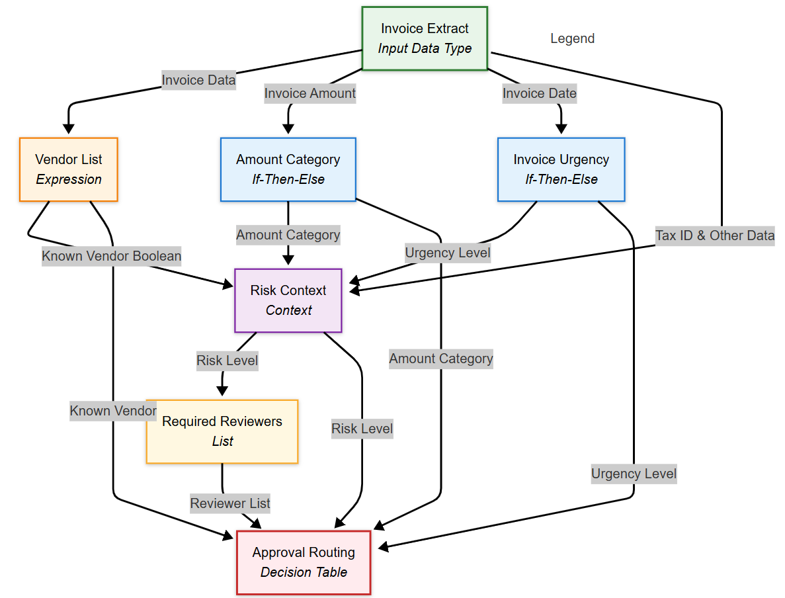

**Input Layer:**

  - Invoice Extract (Input Data Type) - Serves as the foundation, providing structured invoice data to all decision components

**Supporting Decision Layer:**

  - Vendor List (Expression) - Evaluates if vendor is in known vendor list
  - Amount Category (If-Then-Else) - Categorizes invoice amount as small/medium/large
  - Invoice Urgency (If-Then-Else) - Determines urgency based on invoice age

**Integration Layer:**

  - Risk Context (Context) - Aggregates outputs from supporting decisions and additional risk factors to calculate overall risk level

**Derived Decision Layer:**

  - Required Reviewers (List) - Determines reviewer list based on risk level from Risk Context

**Final Decision Layer:**

  - Approval Routing (Decision Table) - Makes final routing decision using inputs from all previous components

**Data Flow Logic:**

  1.  Invoice Extract feeds raw invoice data to three supporting decisions
  2.  Supporting decisions (Vendor List, Amount Category, Invoice Urgency) process specific aspects of the invoice
  3.  Risk Context combines all supporting decision outputs plus additional data to calculate risk level
  4.  Required Reviewers uses the risk level to determine appropriate reviewer list
  5.  Approval Routing receives inputs from all components to make the final routing decision

## Task 1: Create and Design Decision Model Flow

1.  In the Project workspace *Select* the tab **Decision**
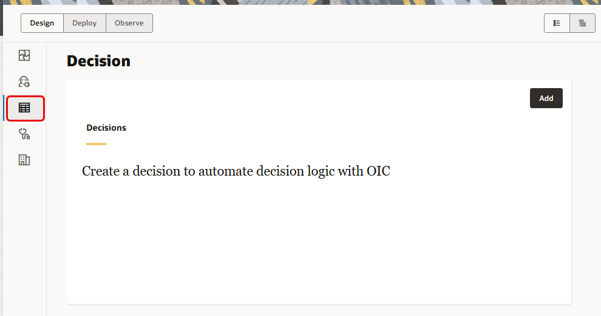

2.  Click *Add* button and Select *Create a Decision*
Enter the following details:

| **Field**        | **Value**          |       
| --- | ----------- |
| Name         | Invoice Processing Decision Model     |
| Identifier         | Generated automatically       |
| Description  | Decision model for automated invoice processing with business rules |
{: title="Create Decision"}

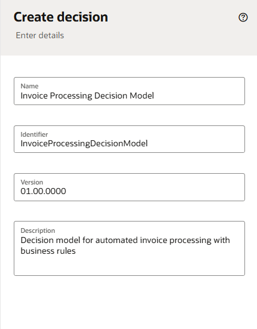

Click *Create*.
The decision model editor will open in graph view with an empty canvas.

##	Task 2:	Understand the Graph View and Decisions Palette (Read ONLY Section)

1.	Decisions are created in the graph view. In the graph view, you can create decision requirement diagrams (DRD), in accordance with DMN standards, to visually represent your decisions.

2.	The following table lists all the available DRD components, which you can use to create your decision.
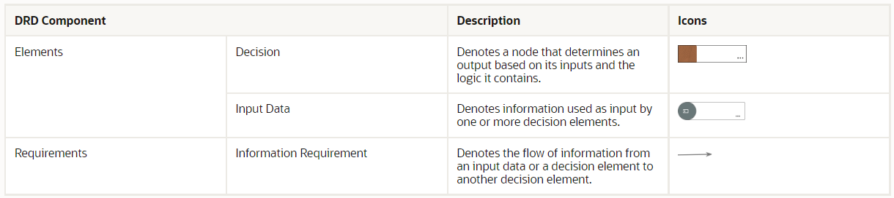

3.	The graph view is divided into the following areas:
    -	Toolbar : The decision toolbar provides quick access controls to manage the decision canvas.
    -	Canvas : The decision canvas is the central area where you can create a diagram that represents your decision, using the elements in the diagram palette. The zoom controls at the bottom of the canvas allow you to zoom in or fit the canvas in your browser.
    -	Diagram palette: From the diagram palette, drag and drop DRD components onto the canvas to use them in your diagram.
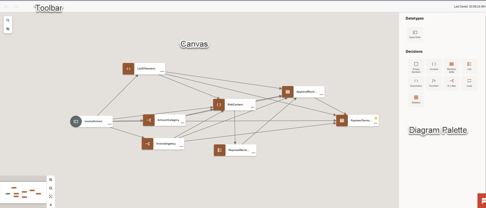

4.  Decision Components Brief Overview

  - **If-Then-Else Decisions**:

    Amount Category & Invoice Urgency Classifications: These conditional decisions evaluate specific criteria and return different outcomes based on logical tests. In our lab, if-then-else logic determines whether an invoice amount is "small," "medium," or "large," and assesses urgency levels based on invoice age, providing clear categorical outputs that feed into more complex decision tables.

  - **Expression Decisions**

    Vendor Recognition Logic: Expression decisions use FEEL language to perform calculations and evaluations that return single values. Our vendor recognition expression checks if vendor names contain known terms like "Tech" or "Office" using string functions, returning a boolean result that indicates vendor familiarity for downstream processing.

  - **Context Decisions**

    Risk Assessment Context: Context decisions create collections of related calculations and data points as key-value pairs with an optional result. Our risk context combines multiple factors like tax ID validity, line item matching, and vendor status to calculate a comprehensive risk score, demonstrating how contexts aggregate complex business logic into a single decision outcome.

  - **Decision Tables**

    Approval Routing & Payment Terms Tables: Decision tables provide a structured way to model complex business rules with multiple inputs and outputs in an easy-to-read tabular format. Our tables use hit policies to determine approval tracks and payment terms based on combinations of amount, risk level, urgency, and vendor status, showing how tabular logic handles multiple business scenarios efficiently.

  - **Functions (Referenced)**

    Reusable Calculation Logic: Functions encapsulate specific operations that can be invoked multiple times throughout the decision model. While not directly implemented in our core lab, functions would be useful for complex calculations like discount computations or date manipulations that need to be reused across different decisions in the model.

  - **Lists (Referenced)**

    Structured Data Collections: List decisions create ordered collections of elements where each element can contain different types of logic. In extended scenarios, lists could manage multiple vendor categories or approval levels, providing organized ways to handle sequential data processing within the decision framework.

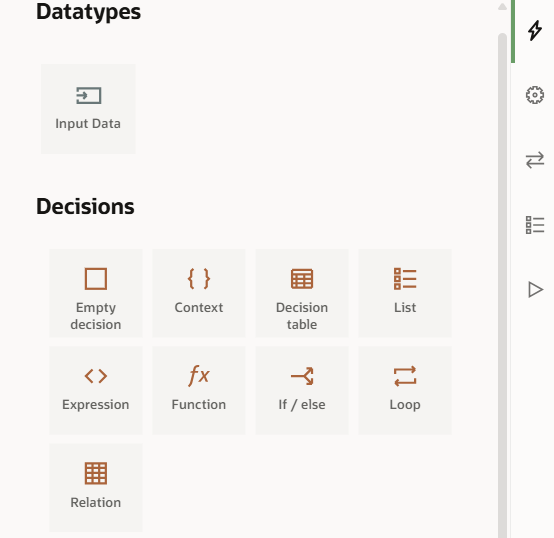

##	Task 3:	Create Input Data Type (invoiceExtract)

1.  In the graph canvas *Select* the **input data** component, and Click on *...* and Select **Edit**

2.  In the properties panel:

| **Field**        | **Value**          |       
| --- | ----------- |
| Name         | Change to "invoiceExtract"     |
| Mode  | Select Other Type |
{: title="Modify Input Type"}

In the Type Definition section *Select* **Show Type Definition List** to define a new Complex Type

3.  In the Types section, *Select* **Import from Sample**
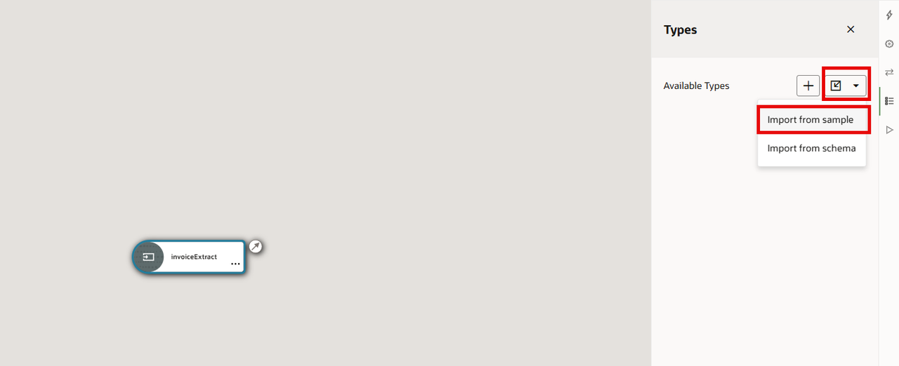

4.  In the **Create New Type** window provide *Name* as **InvoiceExtractType**. Provide the below JSON Sample

```
<copy>
{
  "invoiceExtract": {
      "invoice_data": {
          "invoice_id": "INV-2023789",
          "invoice_date": "2023-05-01T00:00:00.000Z",
          "due_date": "2023-05-01T00:00:00.000Z",
          "purchase_order": "PO-24680",
          "invoice_total": 38750.50,
          "tax_amount": 3199.50,
          "subtotal": 35551.00,
          "currency": "USD",
          "payment_terms": "Net 30",
          "status": "UNPAID"
      },
      "vendor_data": {
          "vendor_name": "TechSupplies International",
          "vendor_id": "TSI-13579",
          "tax_id": "45-6789012",
          "address": "789 Innovation Avenue, Boston, MA 02108, USA",
          "contact": {
              "name": "Accounts Receivable",
              "phone": "408-555-1357",
              "email": "ar@techsupplies.example.com"
          },
          "payment_details": {
              "bank_name": "Pacific Banking Corporation",
              "account_number": "XXXX2468",
              "routing_number": "XXXXX1357"
          }
      },
      "line_items": [
          {
              "item_number": "1",
              "description": "Enterprise Server Cluster - Hardware",
              "quantity": 3,
              "unit_price": "9500.00",
              "amount": "28500.00",
              "tax_rate": "8%",
              "tax_amount": "2351.25"
          },
          {
              "item_number": "2",
              "description": "Server Rack - 42U",
              "quantity": 1,
              "unit_price": "9500.00",
              "amount": "28500.00",
              "tax_rate": "8%",
              "tax_amount": "2351.25"
          }
      ]
  },
  "CurrentDateTime": "2023-05-20T14:30:00Z"
}
</copy>
```
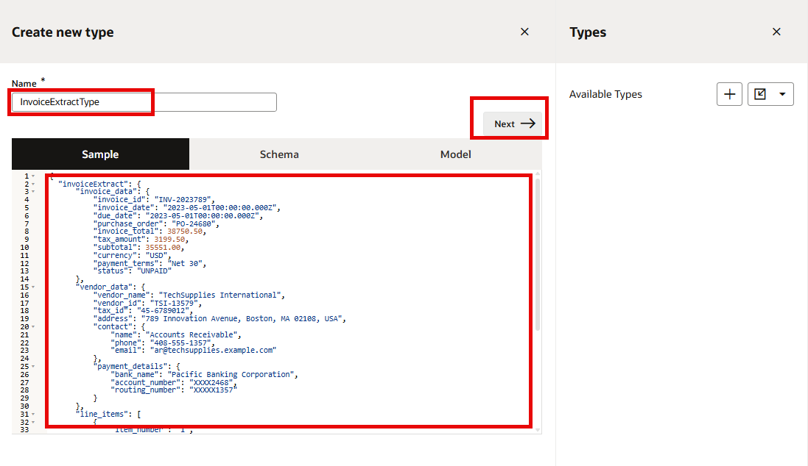

5.  Click *Next*, a Schema is generated Automatically, Finally *Select* **Create**. Invoice extract type is created. Close the *Create New Type* window and *Types* window. Now, Select *Edit* the **invoiceExtract** component once again and *Select* Type as **InvoiceExtractType**. Close the properties panel.


##	Task 4:	Create Amount Category (If-Then-Else) Component

1.  From the diagram palette, Drag **If-Then-Else** element onto the canvas after the input data

2.  Select the If-Then-Else element, and Click *Edit* to Open Properties. Provide per below

| **Field**        | **Value**          |       
| --- | ----------- |
| Name         | Change to **Amount Category**    |
| Description  | Categorizes invoice amount as small, medium, or large |
{: title="Amount Category Properties"}

3.  Select the *invoiceExtract* input data element. A connection arrow will appear. Drag to the **Amount Category** decision and release
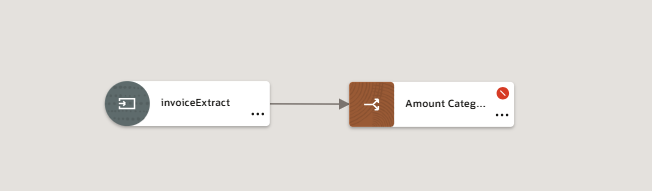

4.  Select the **Amount Category** element and *Edit* to Open Properties. Click Edit (✏️) next to the Name field

***Define If-Then-Else Logic***

1. In the decision Editor construct your logic as per below

  - **if:** invoiceExtract.invoiceExtract.invoice\_data.invoice\_total< 5000
  - **then:** "small"
  - **else if:** Click *Add Else If*
      - **else if:** invoiceExtract.invoiceExtract.invoice\_data.invoice\_total &gt;= 5000 and invoiceExtract.invoiceExtract.invoice\_data.invoice\_total &lt;= 25000
      - **then:** "medium"
  - **else:** "large"

Make sure there are no errors in the logic. *Close* the decision editor to return back to the Canvas
> Note: Copy paste the exact logic provided. If you have followed the naming convention provided in the steps you should be fine. Else you may have to adjust the logic as per your definition

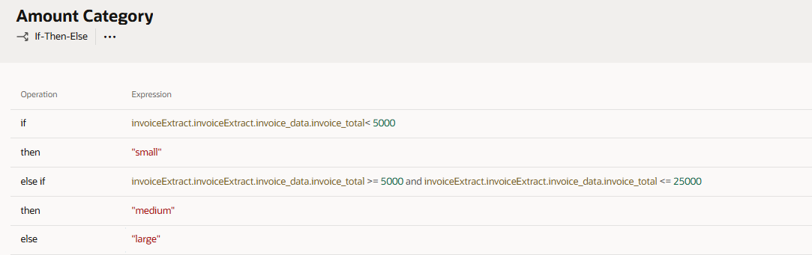

##	Task 5:	Create Invoice Urgency (If-Then-Else) Component

1.  From the diagram palette, Drag another **If-Then-Else** onto the canvas

2.  Select the If-Then-Else element, and Click *Edit* to Open Properties. Provide per below

| **Field**        | **Value**          |       
| --- | ----------- |
| Name         | Change to **Invoice Urgency**    |
| Description  | Determines urgency based on invoice age |
{: title="Invoice Urgency Properties"}

3.  Select the *invoiceExtract* input data element. A connection arrow will appear. Drag to the **Invoice Urgency** decision and release

4.  Select the **Invoice Urgency** element and *Edit* to Open Properties. Click Edit (✏️) next to the Name field

***Define If-Then-Else Logic***

1. In the decision Editor construct your logic as per below

  - **if:** date( invoiceExtract.invoiceExtract.invoice\_data.invoice\_date ) &lt;  date(invoiceExtract.CurrentDateTime ) - duration( "P30D" )
  - **then:** "urgent"
  - **else if:** Click *Add Else If*
      - **else if:** date(invoiceExtract.invoiceExtract.invoice\_data.invoice_date) &lt; date(invoiceExtract.CurrentDateTime ) - duration("P15D")
      - **then:** "high"
  - **else:** "normal"

Make sure there are no errors in the logic. *Close* the decision editor to return back to the Canvas

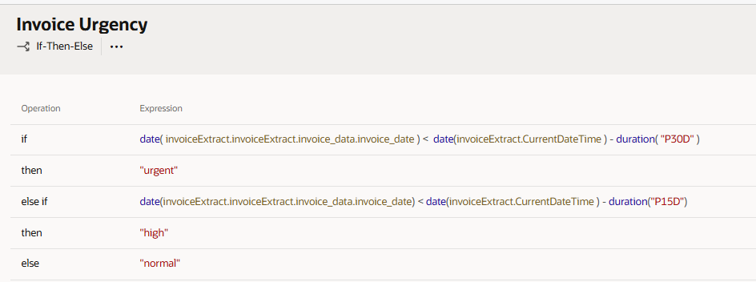


##	Task 6:	Create Vendor Recognition (Expression) Component

1.  From the diagram palette, drag **Expression** onto the canvas

2.  Select the Expression element. Click *Edit* to Open **Properties**

| **Field**        | **Value**          |       
| --- | ----------- |
| Name         | Change to **Vendor Recognition**    |
| Description  | Checks if vendor name contains known terms |
{: title="Vendor Recognition Properties"}

3.  Select the *invoiceExtract* input data element. A connection arrow will appear. Drag to the **Vendor Recognition** decision and release

4.  Select the **Vendor Recognition** element and *Edit* to Open Properties. Click Edit (✏️) next to the Name field

***Define Expression Logic***
1.  In the Expression field enter the below logic

```
<copy>
  list contains(
  [
    contains(upper case(invoiceExtract.invoiceExtract.vendor_data.vendor_name), "OFFICE"),
    contains(upper case(invoiceExtract.invoiceExtract.vendor_data.vendor_name), "TECH"),
    contains(upper case(invoiceExtract.invoiceExtract.vendor_data.vendor_name), "SUPPLIES"),
    contains(upper case(invoiceExtract.invoiceExtract.vendor_data.vendor_name), "SERVICES")
  ],
  true
  )
</copy>
```
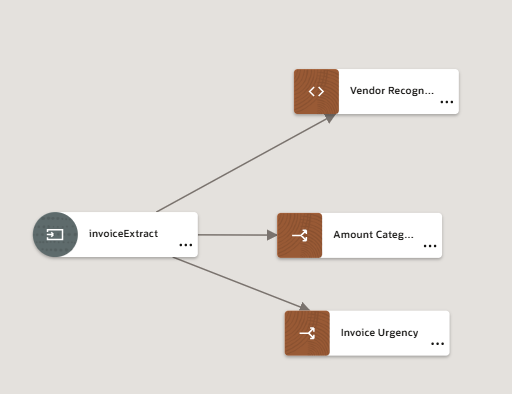

##	Task 7:	Create Risk Context (Context) Component

1.  From the diagram palette, drag **Context** onto the canvas

2.  Select the Context element, and Click *Edit* to Open Properties. Provide per below

| **Field**        | **Value**          |       
| --- | ----------- |
| Name         | Change to **Risk Context**    |
| Description  | Calculates overall risk assessment |
{: title="Risk Context Properties"}

3. Create connections from following decisions to **Risk Context**
    - invoiceExtract -> Risk Context
    - Vendor Recognition -> Risk context
    - Amount Category -> Risk context
    - Invoice Urgency -> Risk context
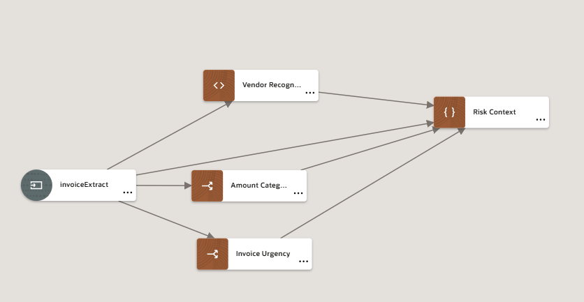

4.  Select the **Risk Context** element and *Edit* to Open Properties. Click Edit (✏️) next to the Name field

***Define Context Entries***

1.  Click **Add entry** to create the first context entry:
    - **Key:** amountCategory
    - **Value:** Amount Category (provides type along hints)

Similarly, add other entries per below:
| **Key**        | **Value**          |       
| --- | ----------- |
|   urgencyLevel       | Invoice Urgency    |
| knownVendor  | Vendor Recognition |
| hasValidTaxID  | string length(invoiceExtract.invoiceExtract.vendor\_data.tax_id ) >= 9 |
| riskScore  | (if amountCategory = "large" then 5 else if amountCategory = "medium" then 3 else 1) + (if urgencyLevel = "urgent" then 4 else if urgencyLevel = "high" then 2 else 0) + (if knownVendor then 0 else 3) + (if hasValidTaxID then 0 else 4) |
| riskLevel  | if riskScore <= 3 then "low" else if riskScore <= 7 then "medium" else "high" |
{: title="Risk Context Logic"}

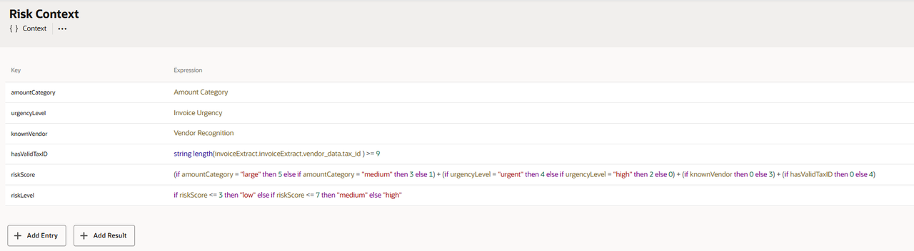

##	Task 8:	Create Required Reviewer (List) Component

1.  From the diagram palette, drag **List** onto the canvas

2.  Select the List element, and Click *Edit* to Open Properties. Provide per below

| **Field**        | **Value**          |       
| --- | ----------- |
| Name         | Change to **Required Reviewer**    |
| Description  | Determines required reviewers based on risk level |
{: title="Required Reviewer Properties"}

3. Create a connection from **Risk Context** → **Required Reviewer**

4.  Select the **Required Reviewer** element and *Edit* to Open Properties. Click Edit (✏️) next to the Name field

***Define List Entries***

1.  Click Add (➕) to create the first entry:
    - Keep Expression as the type
    - Expression: if Risk Context.riskLevel = "low" then ["departmentManager"] else []

2.  Click Add for the second entry:
    - Keep Expression as the type
    - Expression: if Risk Context.riskLevel = "medium" then ["departmentManager", "finance"]else []

3.  Click Add for the third entry:
    - Keep Expression as the type
    - Expression: if Risk Context.riskLevel = "high" then ["departmentManager", "finance", "director"]else []


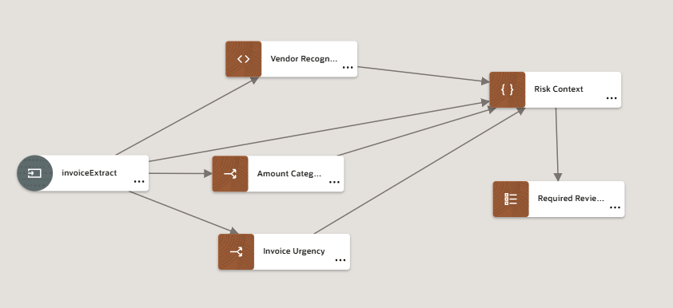

##	Task 9:	 Create Approval Routing (Decision Table) Component

1.  From the diagram palette, drag Decision Table onto the canvas

2.  Select the Decision Table element

| **Field**        | **Value**          |       
| --- | ----------- |
| Name         | Change to **Approval Routing**    |
| Description  | Determines final approval routing and SLA |
{: title="Approval Routing Properties"}

3.  Create connections to the Approval Routing decision table from:
    - Amount Category
    - Risk Context
    - Invoice Urgency
    - Vendor Recognition
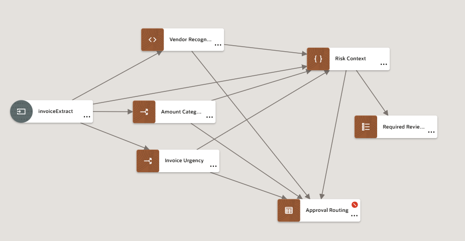

4.  Select the **Approval Routing** element and *Edit* to Open Properties. Click Edit (✏️) next to the Name field

***Configure Decision Table Structure***

1.  The table will open with one input column and one output column. Click on the first input column header (Enter Expression cell). *Select* **Amount Category** from the dropdown

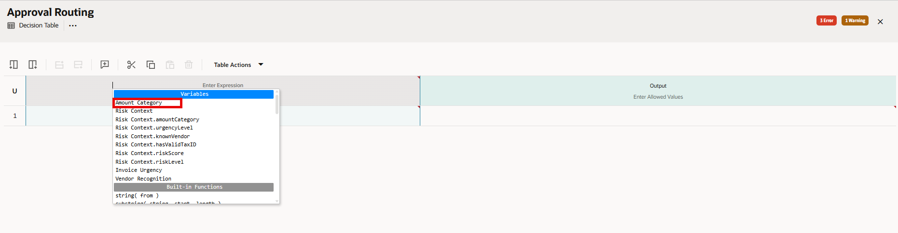

2.  Add Additional Input columns
  - Click the **Amount Category** column header
  - Click **Add column after** (➕) from the top tool bar
  - In the new column's Enter Expression cell, enter **Risk Context.riskLevel**
  - Add another column after Risk Context:
    - Enter Expression: **Invoice Urgency**
  - Add one more column:
    - Enter Expression: **Vendor Recognition**

3.  Configure Output Columns
  - The default output column is named after your decision, if not name it as **Approval Routing**
  - Click **Enter Allowed Values** for the output column
  - Mode: Select Text
  - **Allowed Values**: Select **list of values**
  - Enter each value in new line: fast-track,standard,enhanced,executive,expedited

4.  Add Additional Output Columns
  - Click the output column and select **Add column after**
  - Name the new column: **SLA Days**
  - Configure as **Number** type
  - Add another output column:
    - Name: **Special Review Required**
    - Configure as **True or False** type

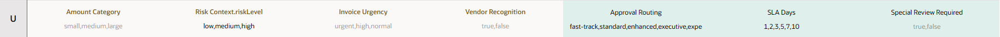

***Configure Decision Table Rules***

1.  Click **Add rule after** (from the table actions toolbar at the top) several times to create multiple rows

2.  Fill in the rules as follows:

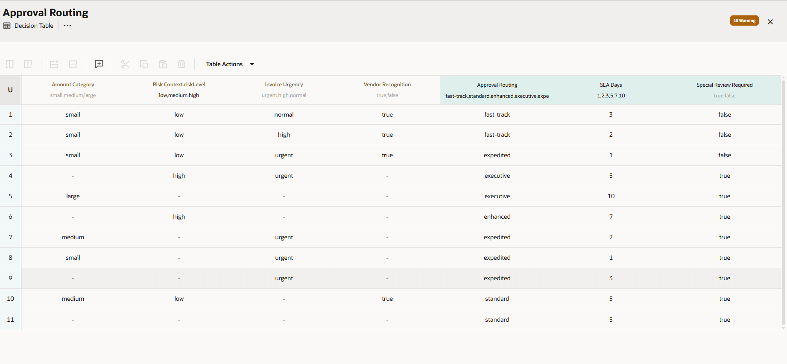

3.  Observe that there are some conflict rules as indicated in the Warnings. You can configure the decision table to choose the first matching rule by Selecting the hit policy as *First(F)*. Now the warnings will disappear.

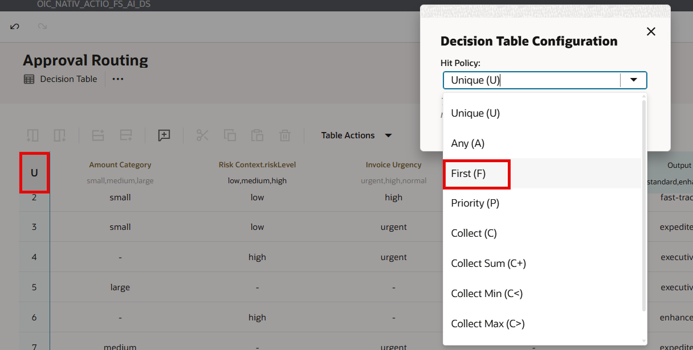

##	Task 10:	 Test the Decision Model

1.  Click **Test Decision Model** from the right pane. *Toggle* the **Start Test** which will allow us to enter the json payload directly.

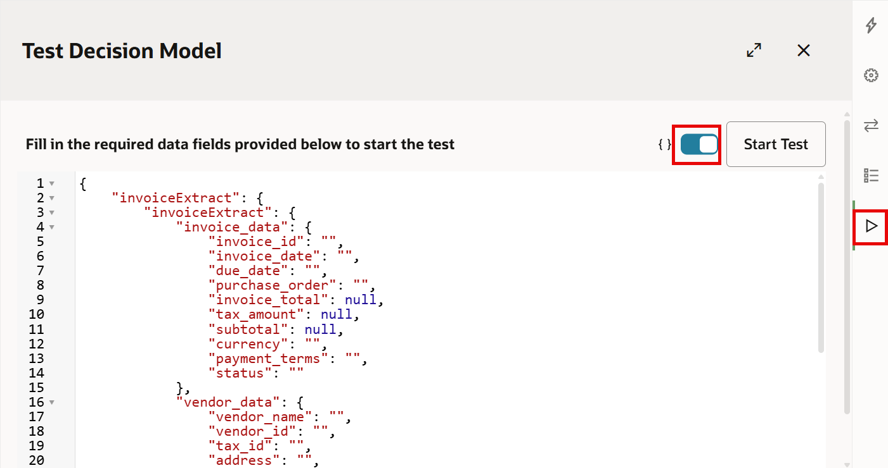

2.  We will execute 2 Test Cases  

Test Case 1: A routine technology purchase from a trusted vendor that follows standard processing

Test Case 2: A consulting services invoice from a new vendor that's overdue, requiring expedited processing despite being from an unknown vendor due to urgency  

3.  Copy Sample below to execute Test Case 1 and provide the JSON in the test window. Click on **Start Test**

```
<copy>
{
  "invoiceExtract": {
      "invoiceExtract": {
          "invoice_data": {
              "invoice_id": "INV-2023789",
              "invoice_date": "2023-05-10",
              "due_date": "2023-06-10",
              "purchase_order": "PO-24680",
              "invoice_total": 12500.75,
              "tax_amount": 1031.25,
              "subtotal": 11469.50,
              "currency": "USD",
              "payment_terms": "Net 30",
              "status": "UNPAID"
          },
          "vendor_data": {
              "vendor_name": "TechSupplies International",
              "vendor_id": "TSI-13579",
              "tax_id": "45-6789012",
              "address": "1010 Technology Drive, San Jose, CA 95128",
              "contact": {
                  "name": "Accounts Receivable",
                  "phone": "408-555-1357",
                  "email": "ar@techsupplies.example.com"
              },
              "payment_details": {
                  "bank_name": "Pacific Banking Corporation",
                  "account_number": "XXXX2468",
                  "routing_number": "XXXXX1357"
              }
          },
          "line_items": [
              {
                  "item_number": "1",
                  "description": "Network Switch - 48 Port",
                  "quantity": 2,
                  "unit_price": "3750.00",
                  "amount": "7500.00",
                  "tax_rate": "8.25%",
                  "tax_amount": "618.75"
              },
              {
                  "item_number": "2",
                  "description": "Ethernet Cables - CAT6",
                  "quantity": 50,
                  "unit_price": "25.50",
                  "amount": "1275.00",
                  "tax_rate": "8.25%",
                  "tax_amount": "105.19"
              },
              {
                  "item_number": "3",
                  "description": "Installation Services",
                  "quantity": 1,
                  "unit_price": "2694.50",
                  "amount": "2694.50",
                  "tax_rate": "8.25%",
                  "tax_amount": "222.29"
              }
          ]
      },
      "CurrentDateTime": "2023-05-20T14:30:00Z"
  }
}
</copy>
```
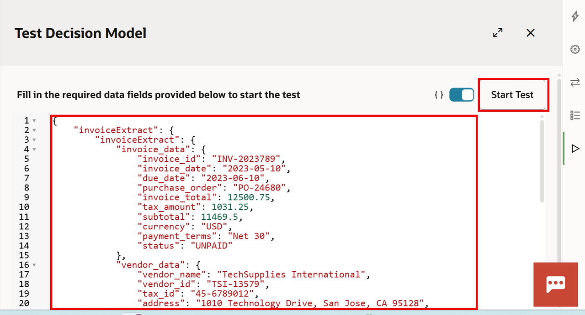

4.  Click on each green checkmark to see individual decision results. Verify the **Approval Routing decision** output as per the Business Rules specified. Also, Verify the **Required Reviewer** Decision output. The result should be **departmentManager**

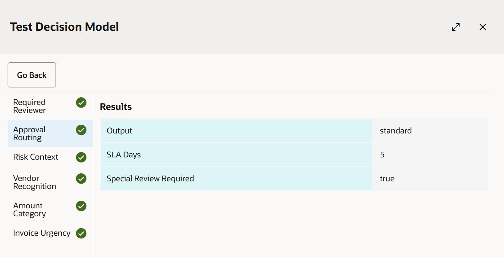


5.  Similarly, test another usecase using the below sample payload. Verify various decision outputs.

```
<copy>
{
  "invoiceExtract": {
      "invoiceExtract": {
          "invoice_data": {
              "invoice_id": "INV-2023321",
              "invoice_date": "2023-04-05",
              "due_date": "2023-05-05",
              "purchase_order": "PO-98765",
              "invoice_total": 3250.00,
              "tax_amount": 268.13,
              "subtotal": 2981.87,
              "currency": "USD",
              "payment_terms": "Net 30",
              "status": "UNPAID"
          },
          "vendor_data": {
              "vendor_name": "Professional Consulting Group",
              "vendor_id": "PCG-7890",
              "tax_id": "23-456",
              "address": "567 Business Park Drive, Austin, TX 78701",
              "contact": {
                  "name": "Finance Department",
                  "phone": "512-555-2468",
                  "email": "finance@profconsulting.example.com"
              },
              "payment_details": {
                  "bank_name": "Lone Star Bank",
                  "account_number": "XXXX3698",
                  "routing_number": "XXXXX1478"
              }
          },
          "line_items": [
              {
                  "item_number": "1",
                  "description": "Business Process Analysis",
                  "quantity": 40,
                  "unit_price": "125.00",
                  "amount": "5000.00",
                  "tax_rate": "8.25%",
                  "tax_amount": "412.50"
              },
              {
                  "item_number": "2",
                  "description": "Documentation Services",
                  "quantity": 20,
                  "unit_price": "75.00",
                  "amount": "1500.00",
                  "tax_rate": "8.25%",
                  "tax_amount": "123.75"
              },
              {
                  "item_number": "3",
                  "description": "Travel Expenses",
                  "quantity": 1,
                  "unit_price": "850.00",
                  "amount": "850.00",
                  "tax_rate": "8.25%",
                  "tax_amount": "70.13"
              }
          ]
      },
      "CurrentDateTime": "2023-05-20T14:30:00Z"
  }
}
</copy>
```

##	Task 11: Create Decision Service

1.  Select **Services** tab from the right side pane

2.  Click Add new service (➕). Provide Service Name: **InvoiceProcessingService**. Click OK

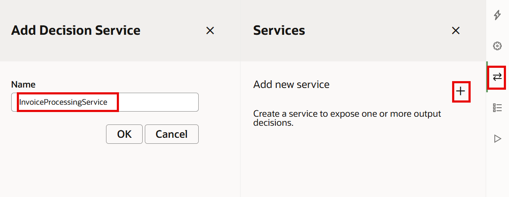


3.  Configure Service: Click the vertical 3 dots
    - Output Decisions: Click and *select* **Approval Routing**
    - Input Data: Click and *select* **invoiceExtract**

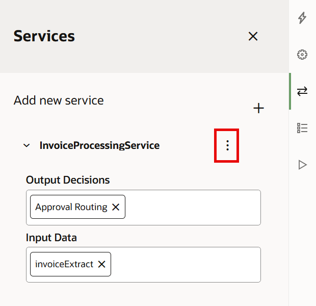

## Task 12: Activate Decision Model

1.  Navigate back to the Project Workspace.

2.  *Select* (...) next to the Decision Model and Select **Activate** action

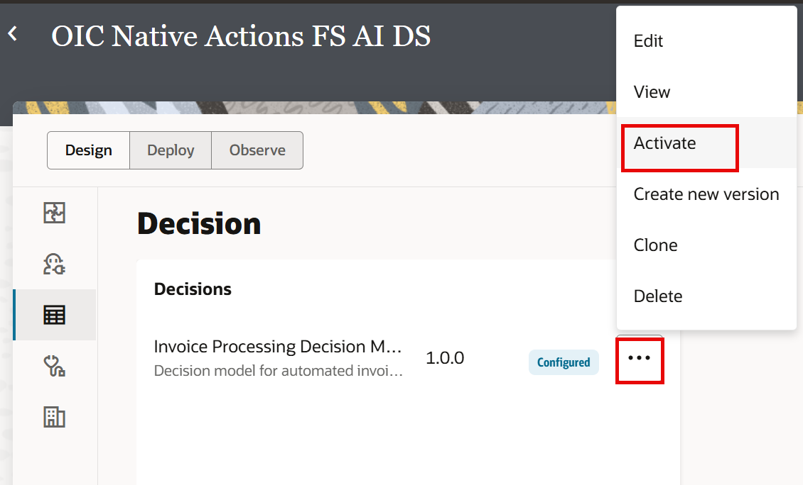

3.  Now, the Decision Model is in **ACTIVE**. The model can now be used in Oracle Integration flow.

## Task 13: Congratulations 🎉

You have successfully created a comprehensive decision model with the following components:

1.  **invoiceExtract Input Data Type** - Complex data structure for invoice information
2.  **Amount Category (If-Then-Else)** - Categorizes invoice amounts
3.  **Invoice Urgency (If-Then-Else)** - Determines urgency based on invoice age
4.  **Vendor Recognition (Expression)** - Identifies known vendors
5.  **Risk Context (Context)** - Calculates comprehensive risk assessment
6.  **Required Reviewer (List)** - Determines reviewer lists based on risk
7.  **Approval Routing (Decision Table)** - Final routing decision with multiple outputs

The decision model demonstrates how different OIC Decision components can work together to create sophisticated business logic for automated invoice processing. The model can now be used in Oracle Integration flow.

You may now **proceed to the next lab**.

## Learn More

* [Design Decision Models](https://docs.oracle.com/en/cloud/paas/application-integration/decision-modeling/design-decision-models.html)

## Acknowledgements
* **Author** - Kishore Katta, Director Product Management - Oracle Integration & OPA
* **Last Updated By/Date** - Kishore Katta - May 2025
