# Create an Integration Flow to Read Invoice PDF and apply Business Rules

## Introduction

This lab walks you through the steps to create an Integration flow as per the below Integration Architecture.

This use case describes how to use Native Actions in Oracle Integration to connect with file server, object storage and serverless functions.

1.  Vendors drop invoice PDF files into the File Server.
2.  Oracle Integration orchestrates the logic as below:
    - A scheduler triggers the Integration flow.
    - File Server Native Action gets the file from the source.
    - Document Understanding Native Action uploads the Invoice PDF file to OCI AI Service
    - OCI AI Document Understanding Service extract the Invoice Data
    - The transformed Invoice data is sent to Decision Model. Again, Decision Native Action is used to perform this activity
    - Decision Model applies several Business rules and determines the Approval Routing and places into appropriate tracking Queue.
    - Invoice is parsed and inserted into the ERP Application (Optional)
3.  OIC Decision Model
    - Evaluates if vendor is in known vendor list
    - Categorizes invoice amount as small/medium/large
    - Determines urgency based on invoice age
    - Aggregates outputs from supporting decisions and additional risk factors to calculate overall risk level
    - Determines reviewer list based on risk level from Risk Context
    - Makes final routing decision using inputs from all previous components

The following diagram shows the interaction between the systems involved in this use case.
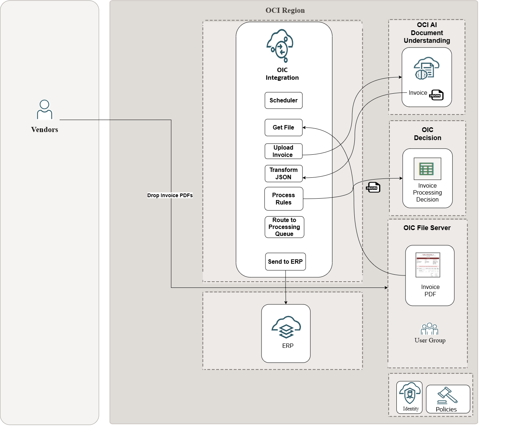

The Final Integration Flow should look like below.


Estimated Time: 60 minutes

### Objectives

In this lab, you will:

* Use File Server Native Action
* Use AI Document Understanding Native Action
* Use Decision Native Action

### Prerequisites

This lab assumes you have:

* All previous labs completed.

## Task 1: Create Integration Flow

In this section you will design an Integration Flow leveraging the OIC Native Actions as per the high level architecture indicated above

***Create Integration Flow***

1. In the **Integrations tile**, click *Add*, then *Create*

2. On the **Create integration** dialog, select and click on **Schedule**.

3. In the *Create integration* dialog, enter the following information:

    | **Element**          | **Value**          |       
    | --- | ----------- |
    |Name | Invoice Processing LL |
    |Description | Integration to process invoice using native actions and apply business rules |
    {: title="Create Integration Flow"}

    Accept all other default values. This will open Integration Flow Canvas. We will design the flow as per the high level architecture described above.

    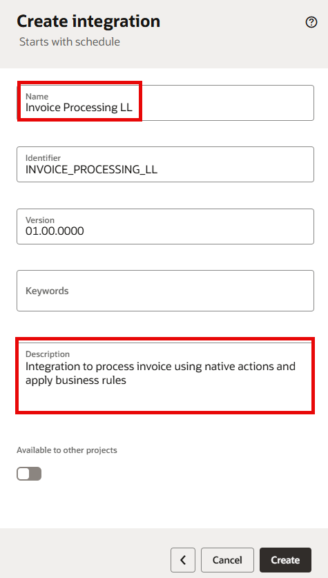

***Get Invoice PDF File Reference from File Server***

1.  Click *+* icon next to the **Schedule** activity and Select *File Server* action from the action palette.

    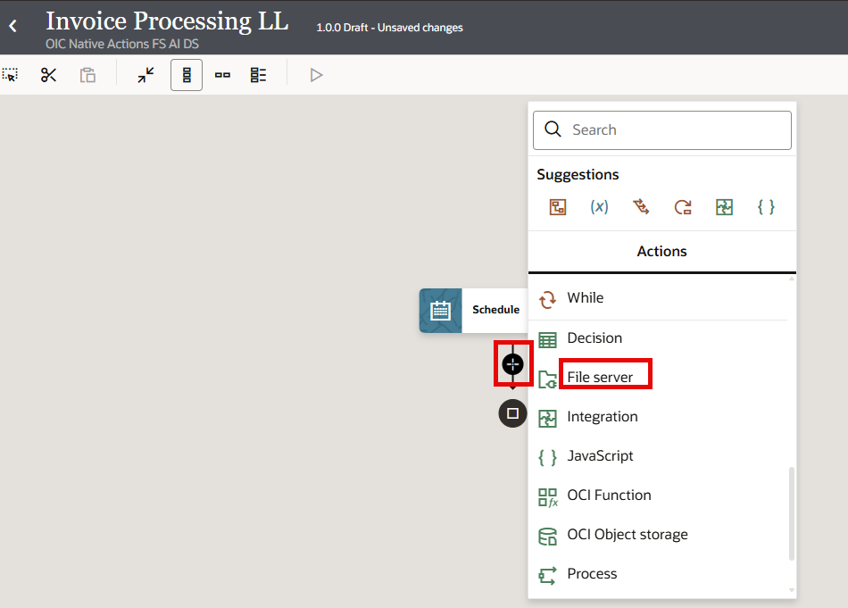

2.  In the **Configure FS Native Action** provide per below values.

    | **Property**          | **Value**          |       
    | --- | ----------- |
    | What do you want to call your endpoint? | getInvoiceFile |
    | Select Resource | File |
    | Select Operation | Get File Reference |
    | Input Directory | &lt; directory path configured in File Server for your user &gt; |
    | File Name | Invoice\_Global\_Innovations\_Ltd.pdf |
    {: title="Configure FS Native Action "}

    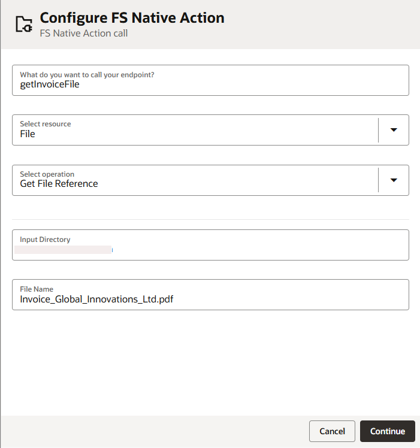

    Click *Continue* and **Finish** the wizard. **Save** your integration.

    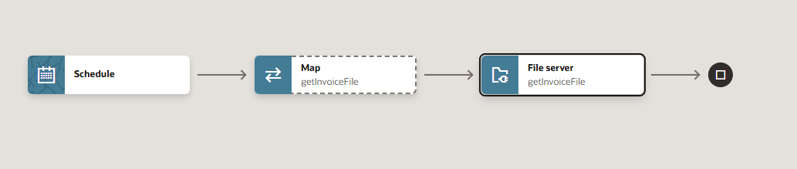

***Add Document Understanding Native Action***

1.  Click *+* icon next to the **getInvoiceFile** action and Select *Document Understanding* action from the action palette.

2.  In the **Configure Baisic Info** wizard provide per below

    | **Property**          | **Value**          |       
    | --- | ----------- |
    | What do you want to call your endpoint? | extractInvoiceInfo |
    | What does this endpoint do | This action extracts invoice information from a PDF file invoking OCI Document Understanding Service |
    {: title="Configure Basic Info Properties "}

    Click *Continue*. In the **Configure Configuration** page provide per below

    | **Property**          | **Value**          |       
    | --- | ----------- |
    | Compartment| Select the compartment which you have created or access to |
    | Document Type | Invoice |
    {: title="Configure Configuration Properties "}

    Click *Continue* and *Finish* the wizard. **Save** your integration.

***Edit the Map Activity -> extractInvoiceInfo***

1.  Select the **Map** activity **extractInvoiceInfo** and *Click* on **(...)** and Select *Edit*. OCI AI Document Understanding accepts base64encoded data as input.

2.  In the mapper expand the Target **extractInvoiceInfoRequest -> Request Wrapper -> Body -> Document -> Data**. Right Click on **Data** and Select *Create Target Node*

    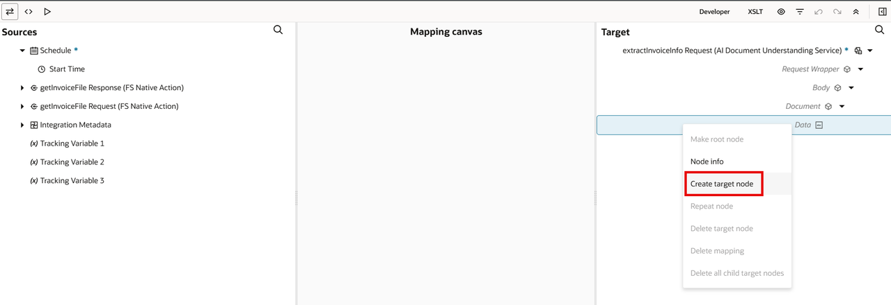

3.  In the **Expression Window** Select **Switch to Developer Mode**. Expand the **Components** pane at the top. From the **Advanced** functions category, *Drag and Drop* the  encodeReferenceToBase64() function into the expression Window. Pass the input parameter as File Reference from **getInvoiceFileResponse -> Get File Reference Response -> File Definitions.. -> File Reference**
    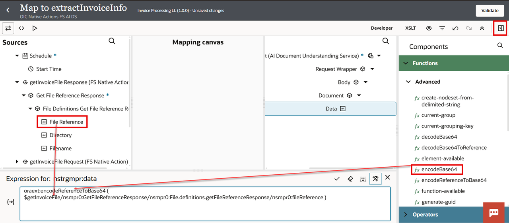

Click the *Tick* mark to validate the expression. Close the **expression** window and *Validate*. Navigate back to the Integration Canvas. *Save* your integration.
    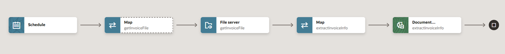

***Add Decision Native Action***

1.  Click *+* icon next to the **extractInvoiceInfo** action and Select *Decision* action from the action palette.

2.  In the **Configure Baisic Info** wizard provide per below

    | **Property**          | **Value**          |       
    | --- | ----------- |
    | What do you want to call your endpoint? | invoiceApprovalDecision |
    | What does this endpoint do | This action sends the extracted invoice data to OIC Decision Model and applies the business rules |
    {: title="Configure Basic Info Properties "}

    Click *Continue*. In the **Configure Configuration** page provide per below

    | **Property**          | **Value**          |       
    | --- | ----------- |
    | Decision Application Name | Select **InvoiceProcessingDecisionModel** which is already activated in the previous Lab |
    | Version |  Select **01.00.0000** |
    | Active Service | Select **InvoiceProcessingService** |
    {: title="Configure Configuration Properties "}

    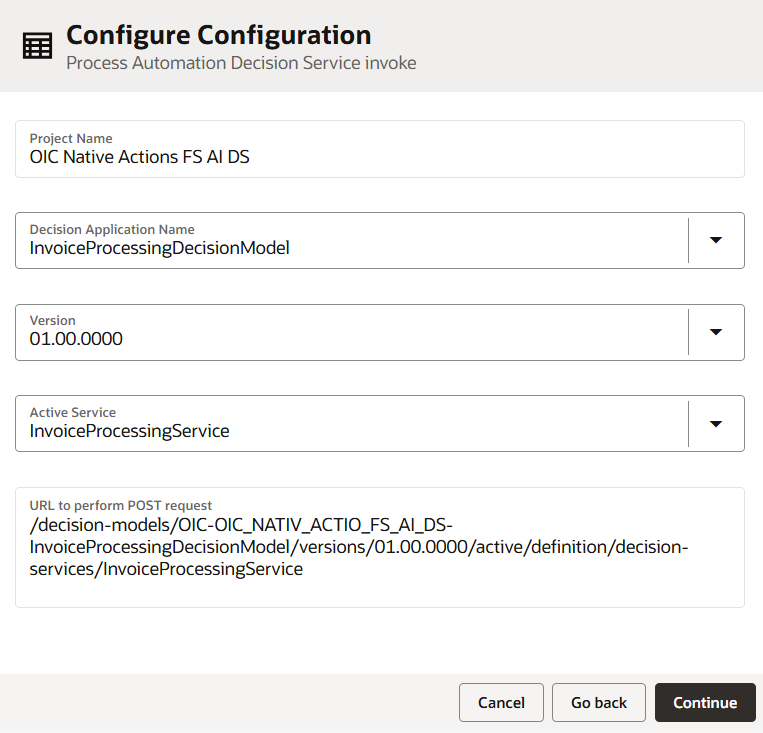

    Click *Continue* and *Finish* the wizard. **Save** your integration.

***Edit the Map Activity -> invoiceApprovalDecision***

1.  Select the **Map** activity **invoiceApprovalDecision** and *Click* on **(...)** and Select *Edit*.
    Now, we will map the extracted invoice information from Document Understanding service to the Decision Model Service Request.

    On the Source Side *Expand* the variable **extractInvoiceData Response --> Analyze Document Response --> Response Wrapper --> Body --> Invoice --> Fields**

    On the Target Side *Expand* the Variable **invoiceApprovalDecision Request -> Request Wrapper -> Invoice Extract -> Invoice Extract**

    >Note: The mapping below requires some date transformation from source. We will be using mapper functions to do the same. Wherever, there is a **$** symbol provided in the mapping below use the appropriate element from the Source Fields. DO NOT USE the expression as-is given in the table below. Use the below table as reference and create your mapping transformations.

    | **Source**          | **Target**          |       
    | --- | ----------- |
    | Invoice Id |  Invoice Data -> InvoiceId |
    | xp20:format-dateTime ($Invoice Date, "[Y0001]-[M01]-[D01]" ) |  Invoice Data -> Invoice Date |
    | xp20:format-dateTime ($Due Date, "[Y0001]-[M01]-[D01]" ) |  Invoice Data -> Due Date |
    | Purchase Order |  Invoice Data -> Purchase Order |
    | Invoice Total |  Invoice Data -> Invoice Total |
    | Total Tax |  Invoice Data -> Tax Amount |
    | Subtotal |  Invoice Data -> Subtotal |
    | Payment Term |  Invoice Data -> Payment Terms |
    | Vendor Name |  Vendor Data --> Vendor Name |
    | Vendor Tax Id |  Vendor Data --> Tax Id |
    | Vendor Address |  Vendor Data --> Address |
    | Items |  Line Items |
    | position() |  Line Items --> Item Number |
    | Items -> Description |  Line Items --> Description|
    | Items ->  Quantity|  Line Items --> Quantity |
    | Items -> Unit Price |  Line Items --> Unit Price |
    | Items -> Amount |  Line Items --> Amount |
    | Items -> Tax |  Line Items --> Tax Rate |
    | xp20:format-dateTime ($Schedule->Start Time, "[Y0001]-[M01]-[D01]" ) |  Current Date Time |
    {: title="Mapping Rules "}

    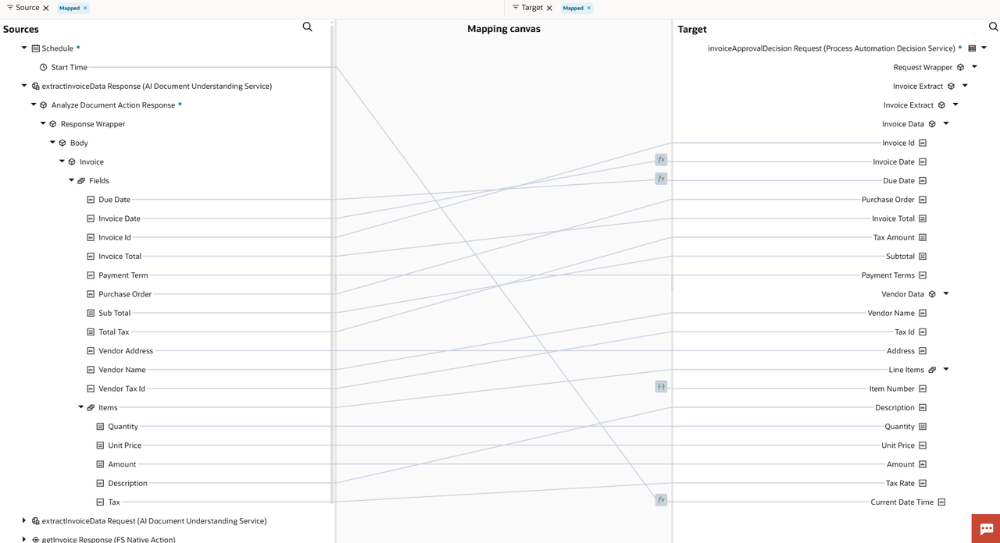

    Click on **Validate** and make sure there are no errors. *Save* your integration.

***Add logger Action***

1.  **Add** a *logger* action after the **invoiceApprovalDecision** activity and name it as **LogTrackingInfo**.

2.  In the **Configure Logger** page, drag and drop **vendorName (extracted from pdf)** element, **Approval Routing (output of decision)** and **SLA Days (output of decision)** elements to logging message text box. Construct a readable expression using the concat() function as per below

    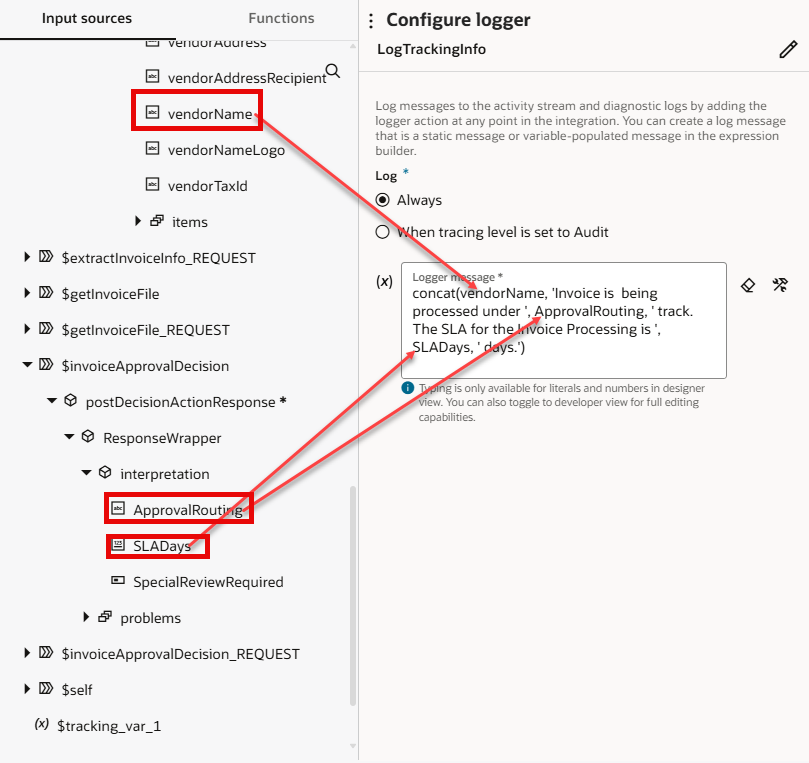

***Define Business Identifiers & Activate the Integration Flow***

1. Manage business identifiers that enable you to track fields in messages during runtime.

2. Click on the *(I) Business Identifiers* menu on the top right.

3. From the **Source** section, expand *Schedule* &gt; *start Time* fields to the right side section tracking\_var\_1

   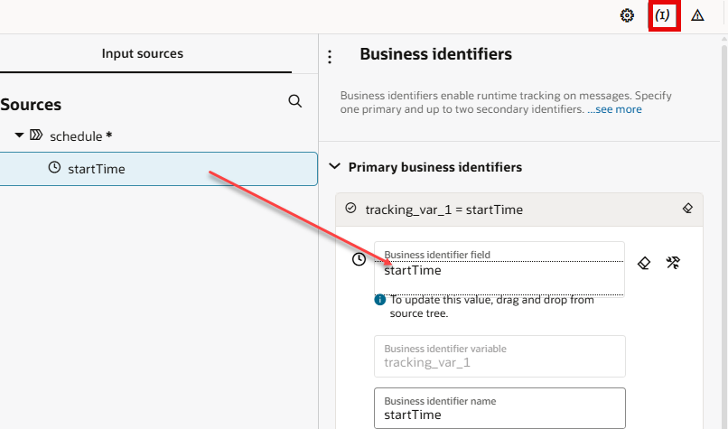

4. Click on the *(I) Business Identifiers* menu on the top right and Click *Save* and Click on *&lt;* *(Go back)* button.

## Task 2: Activate the Integration.

1.  In the Project **Design** View, Select three dots (...) which is next to the Integration Flow. From the list of Actions select *Activate*. You can create a deployment and activate. Alternatively, you can activate individual integration as well.

    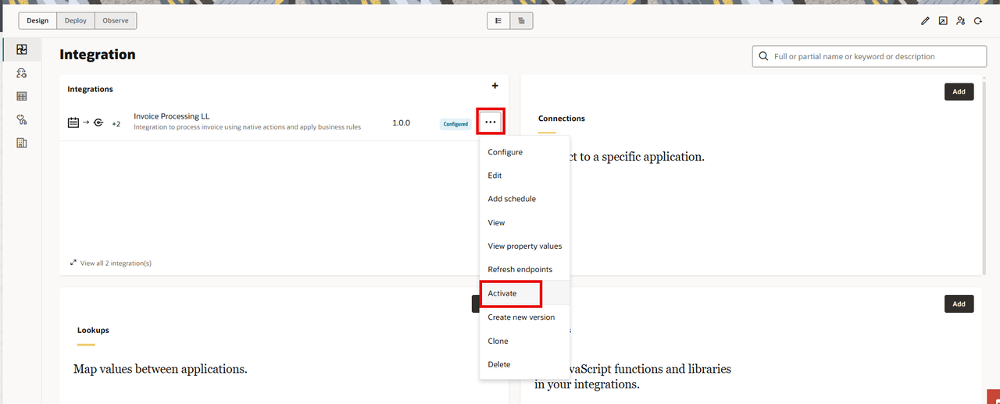

2.  In the **Activate Integration** page select *Tracing Level* as *Debug*, and Click on *Activate*

## Task 3: Test & Monitor the Integration.

1.  Upload one of the Sample PDF file (available in the lab artifacts) to the directory configured in the Integration Flow File Server Action. Make sure the name of the file matches with the one given in the file server action.

2.  In the Project **Design** View, Select three dots (...) which is next to the Integration Flow. From the list of Actions select *Run*.

3.  In the **Configure & Run** page, Select *Request Type* as **Ad hoc Request**. Click on *Run*

4.  An Instance of the integration is created. Select *Instance Id*. Go to the Logger action and Click on *(...)* and Select *Activity Stream*.

    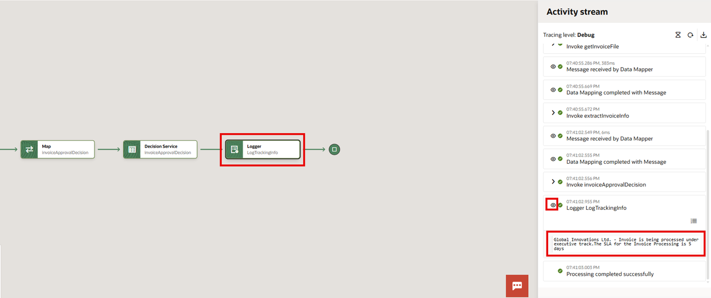

5.  Click on the *Eye* icon next to the Logger Action in the activity stream. Observe the blurb printed and Validate with the Business Rules created.

## Task 4: Bonus Section

We have not implemented the Integration flow to send the invoice data to appropriate Approval Routing Queue for further processing. Let's say if you have to send the invoice to an ERP Cloud or any downstream application. Implementing a content based routing queue gives greater flexibility to decouple the architecture from the main Integration flow. Detailed steps are not provided in this section. However, the following high level hints should get help you design the extended usecase. Make sure you create a version of your integration and perform the enhancements.

**Extending Your Integration with OIC Event System**

Take your invoice processing solution to the next level by implementing asynchronous approval routing using Oracle Integration Cloud's native event-driven architecture!

***High Level Steps***

  - Add OIC Event Publisher native action after your logger component. Use below Event Payload Structure as reference

    ```
    <copy>
      {
      "invoice_id": "INV-001",
      "approval_routing": "fast-track",
      "SLA_days": "10",
      "review_required": "true"
      }
    </copy>
    ```

  - Define a custom Header called **approvalRouting**. This will help to trigger respective subscriber integrations based on the approval routing passed in the header.

  - Map Decision output and extracted Invoice data to event structure and custom header.

  - Create Multiple Subscriber Integrations with a logger component added to each subscriber integration
    - For example: create an Executive-Track Approval Subscriber integration
    - create a filter based on custom header value as below

      ```
      <copy>
        {"type":"jq_filter","filter-def":".approvalrouting==\"executive\""}
      </copy>
      ```
    - Similarly, create Expedited-Track, Fast-Track Subscriber Integration Flows
    - Activate and Execute the updated Integration Flows and Subscriber Integrations. Verify if the Subscriber integrations are triggered as per the Approval Routing values returned by the Decision Model

**Extended Use Case: Strategic Payment Terms Optimization**

Enhance your invoice processing solution with intelligent payment terms calculation that leverages your existing approval routing decisions to optimize cash flow and vendor relationships!

Your enhanced solution now automatically determines optimal payment terms by reusing the intelligence from your approval routing decision combined with additional business factors:

- Leverage approval routing insights - Fast-track invoices get preferential payment terms
- Vendor trust levels - Known vendors receive better payment conditions
- Amount-based terms - Large invoices may warrant extended terms for cash flow
- Urgency-driven scheduling - Past-due situations require immediate attention

***High Level Steps***

  - Create a new version of the Decision Model and implement your changes

  - Create a new Decision Table **Payment Terms Optimizer** with Hit policy **Unique(U)**

  - Create connections to the Payment Terms Optimizer decision table from:
      - Invoice Urgency (if-else)
      - Vendor Recognition (list)
      - Invoice Extract (input data type)
      - Approval Routing (Decision Table)

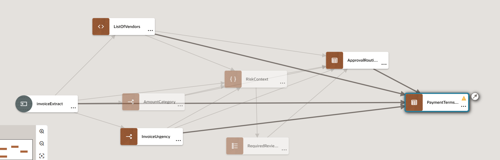

  - Create the Decision Table rules per below
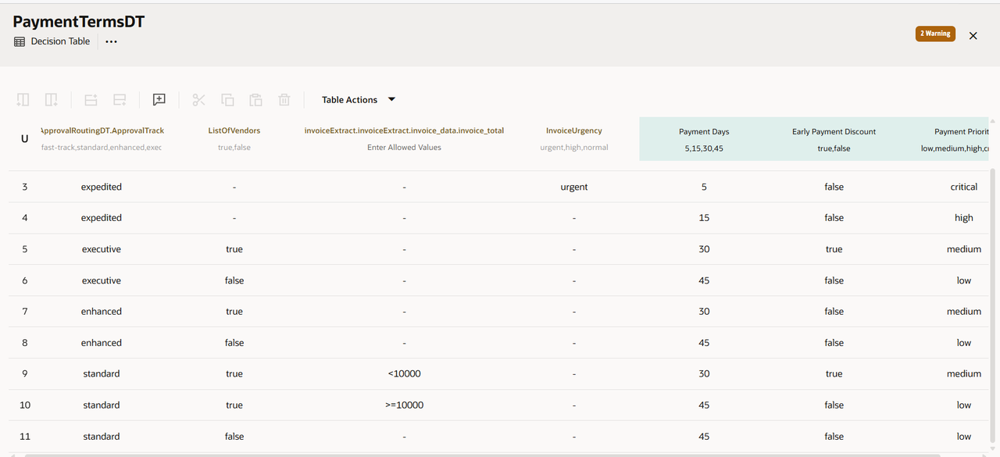

  - Create and Test Decision Service
      - Update the existing Service **InvoiceProcessingService**
      - Output Decisions: Add **Payment Terms Optimizer** Decision in in addition to the existing ones
      - Input Data: No Changes required
      - Activate the new version of Decision Model

  - Navigate to the Integration Flow and edit the Document Understanding native action and select the Service and the version of Decision Model. Fix the logger statement at the end of the flow as required and print the Payment Terms specific information.

## Task 5: Congratulations 🎉

🎉 Congratulations on completing the Workshop! 🎉

You have successfully built an end-to-end intelligent invoice processing system that combines the power of Oracle Cloud Infrastructure (OCI) Document Understanding with Oracle Integration Cloud (OIC) Decisions. You built an intelligent system that automatically processes invoices from document to decision using Oracle's AI and integration services.

Key Takeaways:

**OCI Document Understanding**

- Automated data extraction from invoice PDFs (vendor info, amounts, dates, line items)
- Structured JSON output from unstructured documents
- High accuracy OCR for converting Invoices to text data

**OIC Decisions Components**

- If-Then-Else logic for amount categorization and urgency assessment
- Expressions for vendor recognition and risk calculations
- Context for comprehensive risk scoring with multiple factors
- Decision Table for approval routing with streamlined rules
- FEEL language for date calculations and business logic

**OIC Native Actions Used**

- File Server Native Action - Direct file upload and retrieval without custom connectors
- OCI Document Understanding Native Action - Built-in AI document processing capabilities
- Decisions Native Action - Embedded business rules engine within integration flows
- No custom coding required - All features available as drag-and-drop components

OIC's native actions provide enterprise-grade AI and decision capabilities with simple drag-and-drop orchestration, eliminating the complexity of managing multiple APIs and custom integrations.

## Learn More

* [Getting Started with Oracle Integration 3](https://docs.oracle.com/en/cloud/paas/application-integration/index.html)

* [About Projects](https://docs.oracle.com/en/cloud/paas/application-integration/integrations-user/integration-projects.html)

* [Activate Integration](https://docs.oracle.com/en/cloud/paas/application-integration/integrations-user/activate-and-deactivate-integrations.html)

* [Monitor Integration](https://docs.oracle.com/en/cloud/paas/application-integration/integrations-user/track-integration-instances.html#GUID-46A7C0A0-CBE4-4F1B-9B45-62A5AFA89D74)

## Acknowledgements

* **Author** - Kishore Katta, Director Product Management, Oracle Integration & OPA
* **Last Updated By/Date** - Kishore Katta, May 2025
