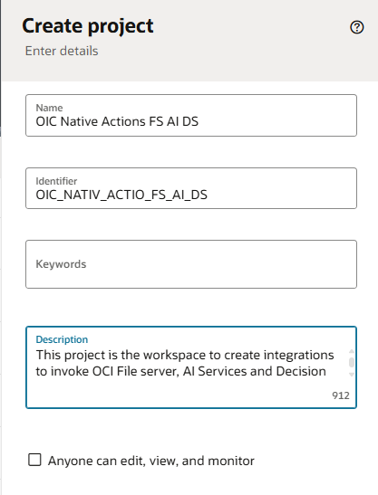

# Create a Project

## Introduction

This lab will walk you through the steps to create a project.

>Note: If project is already created and want to use the same project, you can use it and create all the integration flows in the same project.

Estimated Time: 5 minutes

### Objectives

In this lab, you will:

* Create a Project

### Prerequisites

This lab assumes you have:

* All previous labs completed.

## Task 1: Create Project workspace

***Create Project***

1.  Login into OIC Console

2.  In the left Navigation pane of OIC console, Click *Projects* and Click *Add*, then *Create*

3.  In the **Create Project** dialog, enter the following information and click on *Create*:

| **Field**        | **Value**          |       
| --- | ----------- |
| Name         | OIC Native Actions FS AI DS     |
| Identifier         | Generated automatically       |
| Description  | This project is the workspace to create integrations to invoke OCI File server, AI Services and Decision Service |
{: title="Create Project"}

You may now **proceed to the next lab**.

## Learn More

* [Getting Started with Oracle Integration 3](https://docs.oracle.com/en/cloud/paas/application-integration/index.html)

* [About Projects](https://docs.oracle.com/en/cloud/paas/application-integration/integrations-user/integration-projects.html)

* [Activate Integration](https://docs.oracle.com/en/cloud/paas/application-integration/integrations-user/activate-and-deactivate-integrations.html)

* [Monitor Integration](https://docs.oracle.com/en/cloud/paas/application-integration/integrations-user/track-integration-instances.html#GUID-46A7C0A0-CBE4-4F1B-9B45-62A5AFA89D74)

## Acknowledgements

* **Author** - Kishore Katta, Director Product Management, Oracle Integration & OPA
* **Last Updated By/Date** - Kishore Katta, May 2025
