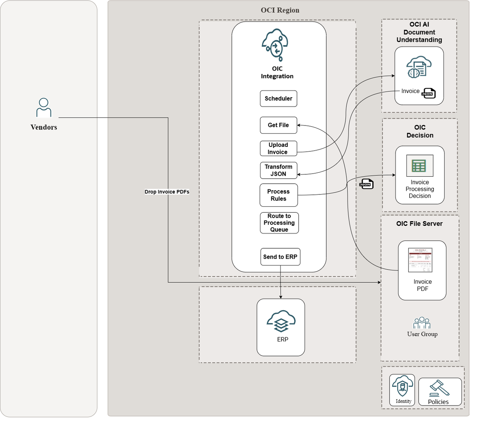
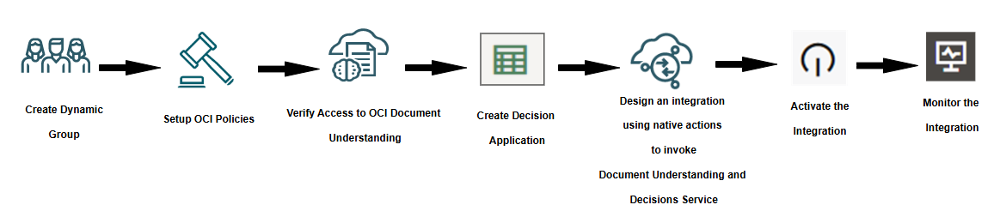

# Introduction

In today's fast-paced business environment, organizations process thousands of invoices monthly, often relying on manual data entry and approval workflows that are time-consuming, error-prone, and costly. This workshop demonstrates how to transform your invoice processing using Oracle Integration(OIC) by combining AI-powered document understanding with intelligent decision automation.

You'll learn to build an end-to-end solution that automatically extracts structured data from PDF invoices using OCI Document Understanding and applies sophisticated business rules through OIC Decision Models to determine appropriate approval routing. This hands-on lab showcases the power of Oracle's native cloud services working together to eliminate manual processing while ensuring compliance with business policies.

The workshop walks through a realistic business scenario where invoices are automatically categorized by amount, vendor recognition, urgency, and risk level, then routed through different approval tracks - from fast-track processing for low-risk invoices to executive approval for high-value or high-risk transactions.

**Business Scenario:**
Your organization, Global Manufacturing Corp, is a mid-sized manufacturing company with operations across North America and Europe. The company processes approximately 2,500 supplier invoices monthly across multiple departments including IT, Facilities, Raw Materials, and Professional Services.

*Current State Challenges:*
- Manual Data Entry: 8 minutes per invoice to manually key data from PDFs, consuming 333+ staff hours monthly

- High Error Rates: 12% error rate in manual processing requiring costly rework and vendor follow-up

- Inconsistent Approvals: Approval decisions vary by individual rather than following consistent business rules

- Processing Delays: Average 7-day processing time causing vendor complaints and missed early payment discounts

- No Vendor Differentiation: Known trusted vendors receive same scrutiny as new unverified vendors

- Compliance Gaps: Limited audit trail and systematic duplicate invoice detection

- Poor Visibility: No real-time tracking of processing status or bottlenecks

## About this Workshop

In this workshop, you will learn how to:

- Configure OCI Document Understanding to extract structured data from invoice PDFs with high accuracy
- Design and implement comprehensive decision models using various OIC Decision components including if-then-else logic, expressions, contexts, lists, and decision tables
- Create scheduled integration flows using OIC native actions for seamless document processing
- Map extracted document data to decision service inputs for intelligent business rule processing
- Implement conditional routing based on decision outcomes so that it can be can be passed onto approval workflows (out of the scope for this use case implementation)
- Test end-to-end invoice processing scenarios with different risk profiles and approval requirements
- Apply AI and decision automation principles to other document-driven business processes

**Solution Architecture:**
You'll implement an intelligent invoice processing system that addresses these challenges through:

1.  *Automated Data Extraction:*

    - OCI Document Understanding processes PDF invoices with maximum accuracy
    - Automatically extracts vendor information, invoice amounts, line items, and payment terms
    - Eliminates manual data entry, reducing processing time from 8 minutes to 30 seconds per invoice
    - Provides structured data for consistent downstream processing

2.  *Intelligent Risk Assessment:*
    - Multi-factor risk scoring considering:
      - Invoice amount categories: Small (<$5K), Medium ($5K-$25K), Large (>$25K)
      - Vendor recognition: Known vendors from approved vendor database vs. new vendors (handled in the business rules logic for demonstration purpose)
      - Invoice age urgency: Normal (<15 days), High (15-30 days), Urgent (>30 days)
      - Data quality factors: Valid tax ID, complete vendor information, matching line item totals

3.  *Automated Routing:*
    - Fast-Track Processing (3-day SLA): Small amounts from known, trusted vendors
    - Standard Processing (5-day SLA): Regular invoices meeting normal risk criteria
    - Enhanced Review (7-day SLA): Medium-risk invoices requiring additional verification
    - Executive Approval (10-day SLA): High-value or high-risk invoices requiring senior management review
    - Expedited Processing (1-2 day SLA): Urgent invoices regardless of amount to avoid late payment penalties

4.  *Business Rule Automation:*
    - Consistent application of approval policies across all departments
    - Automatic vendor verification against approved vendor list
    - Systematic duplicate detection based on vendor, amount, and date proximity
    - Early payment discount identification and fast-track routing for qualifying invoices

Here is the high level architecture reference of the workshop

Note: Inserting records into ERP Cloud is out of the scope of this workshop. However, feel free to play around with the extracted/transformed invoice data and push it to the downstream systems.

Estimated Time: 3 hours

### Objectives

Here are some high-level objectives for the workshop on Oracle Integration using native actions:

1.  Understand OIC Native Actions
    - Gain insights into the capabilities of OIC native actions and how they can be used to integrate with OCI AI services effectively
2.  Automate File Transfer
    - Learn how to configure OIC to download Invoice PDF files from a File server
3.  Extract invoice data
    - Configure OCI Document Understanding to extract structured data from invoice PDFs
3.  Implement Decision Application
    - Implement complex business rules to process invoices as per compliance
4.  Process Invoice Files in OIC
    - Discover Decisions service and invoke as native action in OIC
5.  Hands-on activities and exercises
    - Provide hands-on exercises to practice usage of native actions to invoke file server, AI Document Understanding and Decisions service

By the end of this workshop, you will have a comprehensive understanding of how to leverage OIC's native actions to invoke OCI AI Document Understanding service, Decision Model and File Server, creating a seamless and automated integration design.

**High level workflow of the Workshop**

### Prerequisites

This lab assumes you have the following:
* Oracle Cloud Account with credits to provision services.
* Access to Oracle Cloud Infrastructure (OCI) with permissions to create and manage OCI AI Document Understanding Service.

You may now **proceed to the next lab**.

## Learn More

* [Oracle Integration 3 Documentation](https://docs.oracle.com/en/cloud/paas/application-integration/index.html)
* [Oracle Integration 3 Native Actions](https://docs.oracle.com/en/cloud/paas/application-integration/integrations-user/add-actions-app-driven-orchestration-integration.html#GUID-63CCAB23-A32C-4655-9490-191A011E9EEA)

## Acknowledgements
* **Author** - Kishore Katta, Oracle Integration Product Management
* **Last Updated By/Date** - Kishore Katta, May 2025
