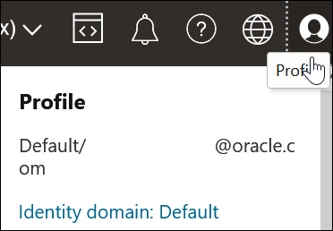
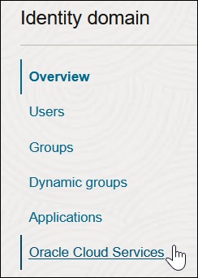
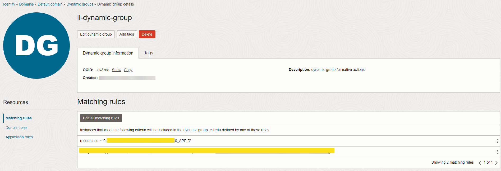
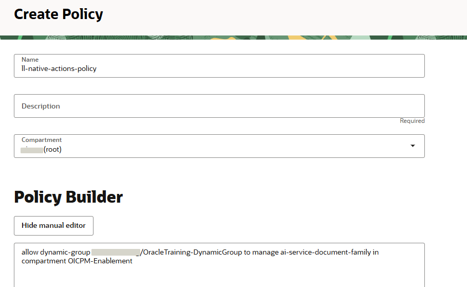
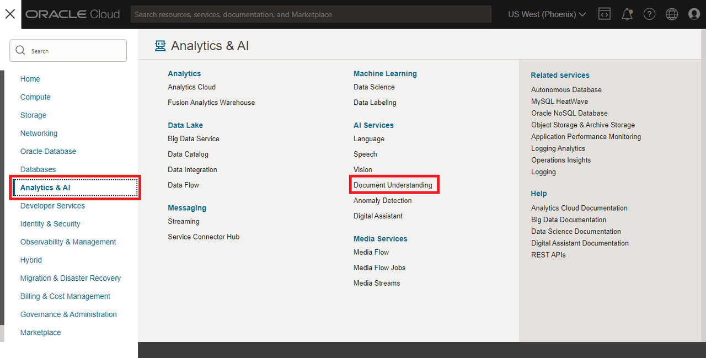
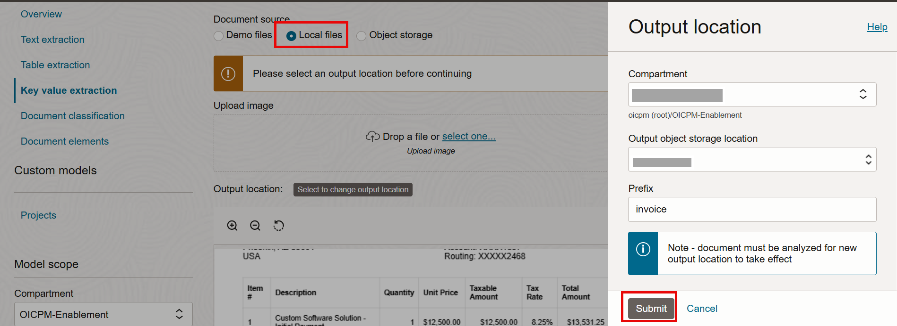

# Setup

## Introduction

This lab walks you through the pre requisite setup like creating policies required to access OCI AI resources to complete the workshop.

Estimated Time: 45 minutes

### Objectives
In this lab, you will:
- Create Dynamic Group in OCI
- Create policy for group and service to allow OIC to access OCI Document Understanding Service

### Prerequisites
This lab assumes you have:
- Ensure that your cloud tenancy uses identity domains. Invoking Oracle Cloud Infrastructure functions from an integration does not work in cloud tenancies that are not enabled for identity domains.
- Completed all the previous labs
- Created a group and added the required User to the group to have access to OCI console.

## Task 1: Pre-Requisites setup for Native Actions

You will create a dynamic group and add policies to use AI Document Understanding Service and manage objects.

1.  Sign in to the OCI Console as a tenancy administrator.

2.  Obtain the client ID of the OAuth application for the Oracle Integration instance. In the upper right corner, select Profile, then click the identity domain.


3.  In the left navigation pane, click *Oracle Cloud Services*.


4.  Select the OIC service instance, and scroll down to **General Information** and copy the client ID value to use it in the dynamic group creation.

5.  In the OCI Console, Open the navigation menu and click *Identity & Security*, Select the domain (example: Default domain).


6. In the left navigation pane, click *Dynamic groups*

7.  Click *Create Dynamic Group*.

8.  Provide a name (example: ll-dynamic-group) and description. In the **Matching Rules** section, enter the below rules. The resource ID you specify must match the client ID of the OAuth application of your Oracle Integration instance.

```
<copy>
  resource.id = 'oic-instance-client-ID'
</copy>
```
TIP: The rule is required to group the OIC instance which matches the client id.



## Task 2: Create policy for the dynamic group and service

1.  In the OCI Console, Open the navigation menu and click *Identity & Security*. Under Identity, click *Policies*.

2.  Click Create *Policy*, specify a name (example: ll-native-actions-policy) and description for the new policy, and select the tenancy's root compartment.

3.  Use the Manual Editor to create the policy per below. Modify the dynamic group name and compartment name as per your configuration.

    ```
    <copy>
    Allow dynamic-group <dynamic_group_name> to manage ai-service-document-family in compartment <compartment_name>
    </copy>
    ```

This enables the Oracle Integration instance associated with the dynamic group to call Oracle Cloud Infrastructure Document Understanding in this particular compartment.

## Task 3: Download Sample Invoice PDF Files

Some sample files have been provided that you can use when testing OCI Document Understanding on the cloud console.

1.  Download the zip file at this [link](https://objectstorage.us-phoenix-1.oraclecloud.com/p/SCvcp5FBbuS8A4VLOio3A9kp3hvZIEho_mwLuczxPxHh-zETSjUFntrCK9LN4x9e/n/oicpm/b/oiclivelabs/o/oic3/native-actions-odu-decision/LabArtifacts.zip) and save it to your local computer.

2.  Unzip the file to a folder on your local computer. You will use these files in the next task.

## Task 4: Analyze Document Data

Use features of Document Understanding to analyze document files.

1.  Using the burger menu on the top left corner of the OCI console, select **Analytics and AI**, then select Document Understanding under *AI Services*



2.  On the Document Understanding page, select the  feature in the left list, **Key Value extraction**

Select *Document Source* as **Local Files**.

3. In the Output Location window provide Compartment Name, Output object Storage location and Prefix and Click on **Submit**



4. Select one of the Invoice File from the LabArtifacts.zip downloaded earlier. Analyze the invoice Result on the right hand side.

You may now **proceed to the next lab**.

## Learn More

* [Setup Your Tenancy with OCI Document Understanding Pre-Requisites](https://docs.oracle.com/en/cloud/paas/application-integration/integrations-user/add-actions-app-driven-orchestration-integration.html#GUID-92FEDC69-2842-4538-BA04-CC12B7E1DC13__BBBBB)
* [Setup policies for OCI Document Understanding Service](https://docs.oracle.com/en-us/iaas/Content/document-understanding/using/about_document-understanding_policies.htm)

## Acknowledgements
* **Author** - Kishore Katta, Director Product Management - Oracle Integration & OPA
* **Last Updated By/Date** - Kishore Katta - May 2025
