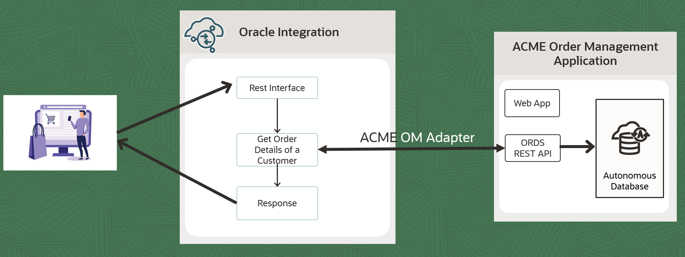

# Create Connection

## Introduction

This Lab will walk you through the steps to create an ACME OM Application Connection and REST adapter connection.

Estimated Time: 10 minutes

### Objectives
In this lab, you will:
- Create a REST Interface to expose the Integration flow
- Create a ACME Adapter Connection to invoke ACME Order Management Application API

### Prerequisites
This lab assumes you have:
- Completed all the previous labs.

## Task 1: Create REST Interface Trigger
Create a connection using REST Adapter.
1. In the left Navigation pane of OIC, Click **Design** &gt; **Connections** and Click **Create**.

2. In the *Create Connection* dialog, select the **REST** adapter. To find the adapter, enter *REST* in the search field. Click on the highlighted adapter.

3. In the *Create Connection* dialog, enter the following information and click on **Create**:

    | **Field**        | **Value**          |       
    | --- | ----------- |
    | Name         | REST Interface     |
    | Role         | Trigger       |
    | Description  | REST Interface Connection for OIC LiveLabs |
    {: title="Rest Interface Connection"}

    Keep all other values as default.

4. In the *Configuration* page, enter the following information:

    | **Field**  | **Values** |
    |---|---|
    |Security Policy | OAuth 2.0 Or Basic Authentication |
    {: title="Rest Interface Connection Properties"}

5. Click on **Test**  and wait until you receive a confirmation box that the test was successful.

6. Click **Save** and wait for the confirmation box. Exit the connection canvas by clicking the back button on the top left side of the screen.

## Task 2: Create REST Connection using ACME OM Application adapter

Create a connection using newly published **Acme OM Application** Adapter to invoke Acme Application API.

1. In the left Navigation pane of OIC, Click **Design** &gt; **Connections** and Click **Create**.

2. In the *Create Connection* dialog, select the **Acme** adapter. To find the adapter, enter *REST* in the search field. Click on the highlighted adapter.

3. In the *Create Connection* dialog, enter the following information and click on **Create**:

> Note: We see only Invoke role as the adapter is implemented for Invoke Flows. Refer ADD document invoke section.

| **Field**        | **Value**          |       
| --- | ----------- |
| Name         | Acme OM Connection     |
| Role         | Invoke       |
| Description  | Acme adapter Connection for ACME OM Application |
{: title="Acme Connection"}

Keep all other values as default.

4.  In the *Configuration* page, enter the following information:

| **Field**  | **Values** |
|---|---|
|Base URL | ORDS URL noted in **Setup** section |
|Security Policy |  No Authentication |
{: title="ACME Connection Properties"}

> Note: A list of security policies added in your ADD file will be available in the published adapter

5. Click on **Test**  and wait until you receive a confirmation box that the test was successful.

6. Click **Save** and wait for the confirmation box. Exit the connection canvas by clicking the back button on the top left side of the screen.

You may now **proceed to the next lab**.

## Learn More

* [Oracle Integration REST Adapter](https://docs.oracle.com/en/cloud/paas/application-integration/rest-adapter/rest-adapter-capabilities.html)

## Acknowledgements
* **Author** - Kishore Katta, Director Product Management, OIC & OPA
* **Last Updated By/Date** - Kishore Katta, April 2024
