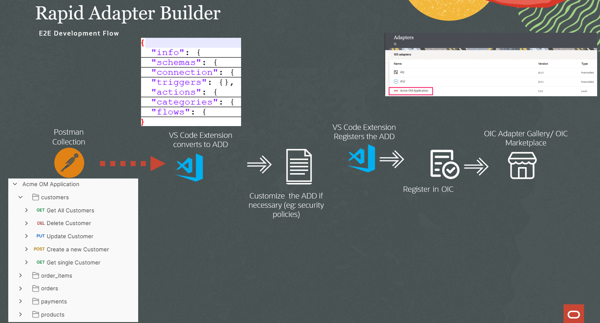
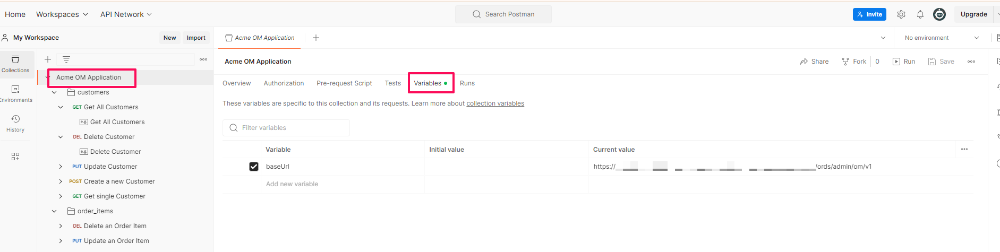
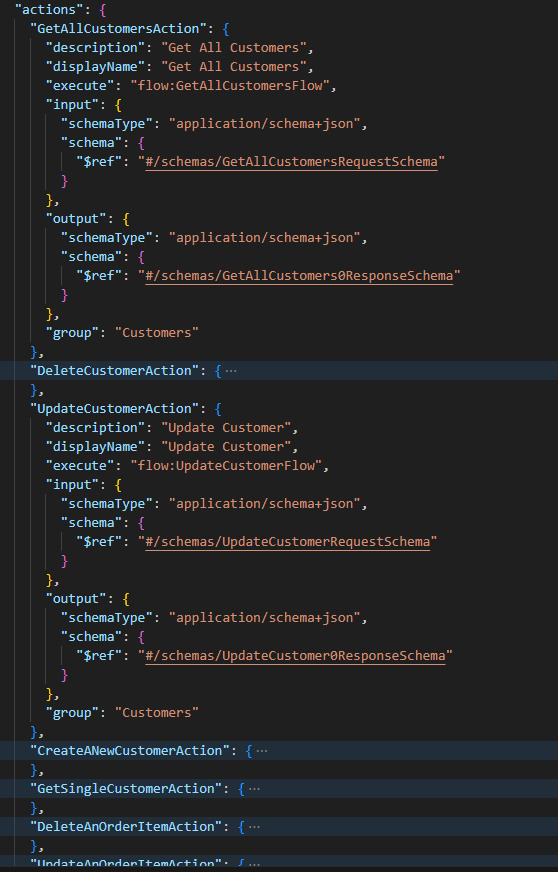
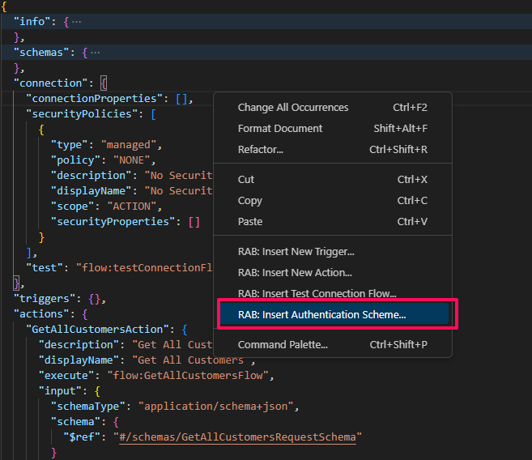
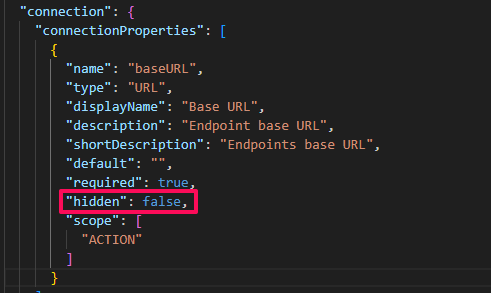
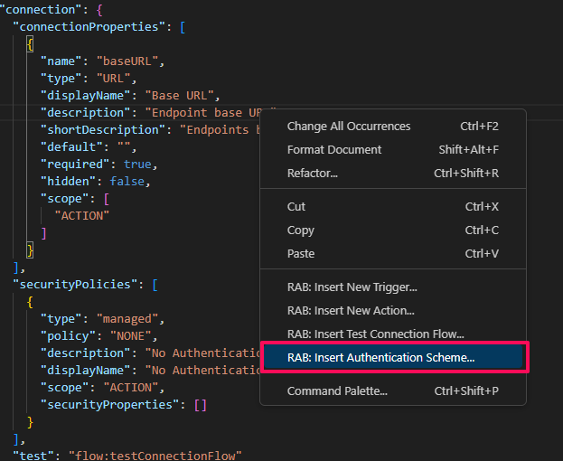
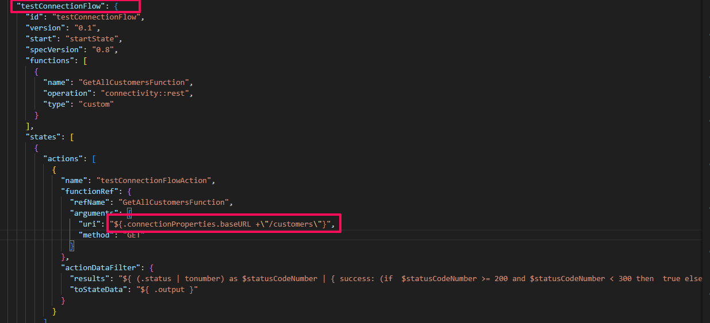

# Develop a Custom Adapter with RAB

## Introduction

In this lab you will understand and develop a Custom Adapter, using the RAB framework



Estimated Time: 45 minutes

### Objectives

In this lab, you will:

* **Initialize a workspace using the VS Code extension**: Set up a structured workspace folder to organize artifacts related to adapter development.
* **Configure the publisher profile for the extension**: Enter client credentials to authenticate with your target OIC instance where you'll publish the adapter.
* **Import and test the Postman collection**: Import the ACME Order Management APIs Postman collection and test the API calls locally.
* **Understand the structure of the Adapter Definition Document (ADD)**: Learn about the different sections that make up an adapter's metadata definition.
* **Generate the Adapter Definition Document (ADD)**: Use the extension to automatically generate an initial ADD from the ACME Postman collection.
* **Review and update the Adapter Definition Document (ADD)**: Examine and manually modify the generated ADD file to customize the adapter's behavior.
* **Register the Adapter on Oracle Integration**: Validate and publish the finalized custom adapter to your OIC instance.

### Prerequisites

This lab assumes you have successfully completed all previous lab sections
- Install and Confgiure Visual Studio with RAB Extension
- Install Postman

## Task 1: Import and test the Postman Collection

1.  [Download](https://objectstorage.us-phoenix-1.oraclecloud.com/p/gv0J-Iza_p0uU8Cct_XwRupcPO1tnNivFkJP0UJp_eB9S52_JWdJJi4W8rD2zjQi/n/oicpm/b/oiclivelabs/o/oic3/get-started-rab/lab-artifacts-rab.zip) the lab artifacts and unzip in your local directory.

2.  Open the Postman application and sign in with your account.

3.  Select **Import** and browse the Postman collection file from the lab artifacts saved earlier in local directory. The collection will consists of a set of resources related to Acme Ordermanagement Application created in ORDS in the previous section.

    

4.  Select **Acme OM Application** and click on **Variables** in the right hand side pane. In the Current Value text field provide the ORDS url noted in the **Setup** section of previous lab. Your url pattern should be like ex: https://&lt;ords_host&gt;/ords/admin/om/v1

    

5.  Test a couple of API's under **Customers** resource. Select *Get All Customers* resource and make sure you get a response back to ensure Acme Order Management Application REST API is working.


## Task 2: Initialize a workspace in Visual Studio

1.  Create a folder named **AcmeOMApp** in your local directory.

2.  In VS Code, click *Explorer* .

3.  Click *Open Folder*, and choose a folder on your system as the workspace for adapter development.
    The folder is now listed on the left in the Explorer view.

>   Note: You can also click File in the top ribbon, and select Open Folder... to open a folder in VS Code.

4.  Press *Ctrl + Shift + P* to open the command palette, type **RAB: Initialize Workspace**, and hit Enter.

    The VS Code extension now initializes the workspace, and creates a few directories and template files in the workspace. The directories and files created are displayed in the Explorer view on the left. The following directories and files are created:

    - api: You can save all OpenAPI files in this folder.
    - definitions: The extension creates a default adapter definition document, main.add.json, in this folder. You can overwrite the default document with the data from a Postman collection or an OpenAPI file. Additionally, all the other adapter definition documents you generate are saved in this folder. The file names of all adapter definition documents are appended with .add.json.
    - misc: You can save all Postman collections in this folder. Ensure that the file names of all Postman collections are appended with .postman_collection.json.
    - logo.svg: A default logo file for your adapter is created under the root folder. You can replace this file with the required image. The logo should be of svg format only.

5.  Open postman collection that you downloaded earlier using any text editor. Navigate to the **variable** section which is almost at the end of the file. Provide the ORDS url in the value property.


6.  Navigate to the local directory structure **misc** directory. Copy and paste the updated postman collection into the **misc** directory. You may delete the existing postman collection generated as part of the workspace initialization.


##  Task 3: Configure the publisher profile for the extension.

1.  In VS Code, click *OIC Rapid Adapter Builder*  on the sidebar.

2.  In the resulting view, click Edit in the Publisher Profiles section. The publisher-profiles.yaml file opens in the editor.

3.  Update the file with the client credentials you obtained earlier. In addition, update the active field with the name of the profile to use. The following example shows the details of 3 Oracle Integration instances, named dev, uat and oic3demo, stored in a .yaml file. See highlighted below and provide the values as per your client application configuration.

| **Field**        | **Value**          |       
| --- | ----------- |
| name         | oic3demo     |
| host         | https://design.integration.&lt;region&gt;.ocp.oraclecloud.com       |
| integrationInstance  | The name of your Oracle Integration instance.|
| tokenUrl  | The IDCS get token url ex: https://idcs-xxxxx.identity.oraclecloud.com/oauth2/v1/token|
| clientId  | The client ID of the configured application in IDCS noted earlier|
| clientSecret  | The client secret of the configured application in IDCS noted earlier|
| scope  | The allowed scope of the configured application in IDCS noted earlier.|
{: title="Configure Publisher Profile Values"}


4.  Save publisher yaml file

##  Task 4: Generate the Adapter definition document

Using the VS Code extension for Rapid Adapter Builder, you can generate an adapter definition document from the exported Postman collection.

1.  In VS Code, click *Explorer*  on the sidebar to bring up the Explorer view. The directory structure of your workspace folder is displayed.

2.  Click the **misc** directory listing to expand it. Select the **Acme OM Application.postman_collection.json** file. Right Click *RAB: Convert POSTMAN Collection*


3.  In the Select request(s) pane, *select all* requests to convert, and Select **Get All customers** as test connection.


Click *Done*

4.  In the dialog box that appears, click *Update main*. Now, the VS Code extension converts the data from the Postman collection and adds it to the default adapter definition document (main.add.json) within the definitions directory of your workspace. In addition, the document opens in the VS Code editor.

5.  Copy the **acme-order.svg** (downloaded from lab-artifacts zip) into your workspace under root folder. You may delete the default logo.svg file generated as part of workspace initialization. The copied graphic will be the icon used in OIC for the custom adapter.

##  Task 5: Understand the Adapter definition document (Read Only Task)

An adapter definition document is a JSON-formatted document that describes the functional behavior and the implementation for an adapter. You build an adapter by authoring an adapter definition document. The adapter definition document logically consists of several sections as shown below.


***info section***: While developing your adapter, you specify information about the branding and identity of the adapter, the publisher details, and the supported capabilities in the info section of an adapter definition document.

Following is the basic properties you should provide when building an adapter. Some of the following information appears in the OIC adapters details page.

  - A unique ID
  - Display name and description which appears in Oracle Integration Console
  - A version number to determine your adapter release

Sample of Info section


***schemas section***: The VS Code extension for Rapid Adapter Builder generates schemas for requests and responses when you convert a Postman collection to an adapter definition document. This information appears in the schemas section of the document. You can update this information as needed for your requirements.

The JSON schemas define the structure of the input and output payloads. Schemas can reference other definitions in the adapter definition document. Generally, you don't need to update the schemas. However, if necessary, you can edit the schemas to:
- Remove or add certain fields that are required for your adapter.
- Remove nesting and have a flat list.
- Change the response format. For example, an API may return a time stamp as a UNIX epoch. You can transform the value into a human-readable format by editing the schema.

In Oracle Integration, you can view the schema information while configuring the mapping for an adapter in an integration flow. The schema objects appear in the mapper as source or target data structures

Sample of Schemas section


***connection section***: The VS Code extension for Rapid Adapter Builder collects connection and security information about the application's APIs provided in the Postman Collection when you convert the convert into an adapter definition document. This information appears in the connection section. You can update this information and add new connection definitions as needed, according to your requirements.

When designing your adapter, you specify the connection models that the adapter supports. Provide this information in the connection section of the adapter definition document. An integration developer must specify this information when creating a connection that is based upon the adapter.

A connection definition typically includes
  - Connection properties : The connection properties provide the information that an integration needs to connect with a third party w.r.t API endpoints
  - Security Policies : Authentication and Authorization specific information that will be used to connect with the third party Application API
  - Test Connection : You will specify a flow action that needs to execute which is provided in the flow section

You can view the connection information while creating a connection using an adapter in Oracle Integration. The properties provided will be available in the connection configuration page.

Sample of Connection Section which contains url and security policies the application adapter supports.


***action section***: The VS Code extension for Rapid Adapter Builder pulls actions related information from the application's APIs when you convert the Postman collection into an adapter definition document. This information appears in the actions section of the adapter definition document. You can update this information as needed for your requirements.

For business purposes, a company can chose to expose an application's APIs with some operations, such as creating or updating a record. When designing an integration, an integration developer can program the integration to perform these operations by configuring one or more actions. Each action calls one or more application-specific APIs. Actions provide a user-centric encapsulation of the target application's operations.

The adapter definition document specifies all the actions that are available to integration developers. Each action has a reference. An action can also be a flow that implements this action. It can also contain the input schema and output schema definitions if the action has input and output data. In the current lab scenario you will notice definitions such as for example: **creating a customer, get order details of a customer, update products etc.**

Sample of Action section which contains all API operations with Input and Output Schema defined in the Schema section. Each of the actions are grouped logically to provide functional know-how to the integration developer who is configuring the custom adapter.



***categories section***: In the categories section of an adapter definition document, you can categorize actions and triggers, so that it becomes easier to choose the required actions or triggers while configuring an adapter in Oracle Integration.

While modeling an adapter's capabilities, you may have to define a large number of actions and triggers depending on the requirements. As actions and triggers appear in a drop-down list in the design-time user interface of Oracle Integration, it becomes difficult to choose the required value from a long list. For example in this lab scenario you are building adapter for Order Management application which has modules likes Customers, Products, Orders etc. A sample of the categories section is configured as shown below:


The categories appear in an actions or triggers drop-down list in the Adapter Endpoint Configuration Wizard.

***flow section***: When you convert a Postman collection into an adapter definition document, the VS Code extension for Rapid Adapter Builder generates flow definitions using the information in the collection. The flow definitions are in the flows section and are used to invoke the external APIs at runtime. You can update these definitions as needed, according to your requirements.

The flows section of the adapter definition document defines the runtime and design-time activities that an adapter is capable of. The following examples show case how flow definitions can be configured based on your requirement.

**Design-time examples**
  - When an integration developer is configuring a connection based on your adapter, flows can pull data from an external application and display the data in the user interface.
  - When an integration developer selects a custom object in the Integration Designer, flows can drive the dynamic schema.
  - Provide logic for test connection flow
  - Fetch dynamic values for configuring properties in design time.

**Runtime examples**
  - Invoke APIs.
  - Start preprocessing activities, like transforming a JSON payload to an binary encoded avro data.
  - Perform post processing, like transforming the binary encoded avro data to a JSON key value.
  - Conditionally execute an actions

Sample of Flow Section


##  Task 6: Configure the Adapter definition document

In this section you will configure **info** section and also add security policies that the adapter needs to support. Open the **main.add.json** file in VS.

1. In the **info** section provide the following values for the respective properties.

| **Property**        | **Value**          |       
| --- | ----------- |
| id         | livelab:acme-om-application     |
| appInfo &gt; name  | Acme OM Application|
| appInfo &gt; description  | This is an order management application for Acme |
| publisherInfo &gt; name   | Oracle Live Lab |
{: title="Info Section Property Values"}

2.  In the **connection** section Right Click anywhere in the **Connection** section, and click on *RAB: Insert Authentication Scheme* and Select *No Authentication*. You should see a dialog box to override the existing **NONE** section, Select *Yes*.



A new code snippet is added in the **connection** &gt; **connectionProperties** section. Change the property value of **hidden** to *false*. Observe a new property named **baseURL** is added to allow the end user to provide host url of the ACME OM Application. This property **baseURL** will be used in the respective flows to construct the concrete endpoint  of the operations API supports.



Assume ORDS API will be secured by Basic Authentication in future. In such case you can easily add another security policy in the connection section. Right Click anywhere in the **Connection** section, and click on *RAB: Insert Authentication Scheme* and Select *Basic Authentication*.



A code snippet is added in the Connection section with **BASIC_AUTH** security policy.

3.  In the **flows** section go to the **testConnectionFlow** snippet, verify the **get all customers** concrete endpoint url is configured. The endpoint of **get all customers** is captured automatically based on the choice made in **Task 4**. However, we want the test connection flow to use the baseURL specified by the user when configuring the ACME adapter connection instead of a concrete url. Construct a uri as below to get the **baseURL** value dynamically.

Note: We can use .connectionProperties.&lt;property-name&gt; configured in the Connection Properties section.
```
<copy>
  "${.connectionProperties.baseURL +\"/customers\"}"
</copy>
```

Provide the above copied snippet in the **uri** value


> Note: We need a valid endpoint which do not accept any parameters or so to make sure test connection is working. API endpoints of GET VERB are appropriate to configure in the test connection flow.



4.  Save the ADD file

5.  In the **flows** section for every flow action uri modify the **uri** value as you did for the test connection flow. Use the below values for your reference and modify accordingly.

> If you plan to implement adapter for only Customer Resource you may change just the customer related flow actions as per your choice.

| **uri**        | **Value**          |       
| --- | ----------- |
| CreateANewCustomerFlowAction | "${.connectionProperties.baseURL +\"/customers\"}"      |
| DeleteCustomerFlowAction | "${.connectionProperties.baseURL +\"/customers\"}"     |
| GetAllCustomersFlowAction | "${.connectionProperties.baseURL +\"/customers\"}"        |
| UpdateCustomerFlowAction | "${.connectionProperties.baseURL +\"/customers\"}"      |
| GetCustomerPaymentsAndOrdersFlowAction | "${.connectionProperties.baseURL +\"/payments/{p\_customer\_id}\"}"     |
| GetSingleCustomerFlowAction | "${.connectionProperties.baseURL +\"/customers/{p\_customer\_id}\"}"      |
| GetAllOrdersFlowAction | "${.connectionProperties.baseURL +\"/orders\"}"    |
| GetSingleOrderFlowAction | "${.connectionProperties.baseURL + \"/orders/{p\_order\_id}\"}"     |
| CreateANewOrderFlowAction | "${.connectionProperties.baseURL +\"/orders\"}"       |
| UpdateAnOrderFlowAction | "${.connectionProperties.baseURL +\"/orders\"}"      |
| CancelOrderFlowAction | "${.connectionProperties.baseURL+\"/orders\"}"      |
| GetItemsForOrderFlowAction | "${.connectionProperties.baseURL+\"/order\_items/{p\_order\_id\"}"     |
| CreateANewOrderItemFlowAction |"${.connectionProperties.baseURL +\"/order\_items\"}"     |
| UpdateAnOrderItemFlowAction | "${.connectionProperties.baseURL +\"/order\_items\"}"     |
| DeleteAnOrderItemFlowAction | "${.connectionProperties.baseURL +\"/order\_items\"}"      |
| GetAllProductsFlowAction | "${.connectionProperties.baseURL +\"/products\"}"     |
| CreateANewProductFlowAction | "${.connectionProperties.baseURL + \"/products\"}"       |
| UpdateAProductFlowAction | "${.connectionProperties.baseURL + \"/products\"}"       |
| DeleteAProductFlowAction | "${.connectionProperties.baseURL +\"/products\"}"     |
{: title="Flow Action URI Configuration"}

##  Task 7: Validate the Adapter Definition Document

Before you publish the adapter to Oracle Integration, you must validate the adapter definition document. Validating the document ensures that it does not contain any syntactic or semantic errors.

1.  In VS Code, click **Explorer** on the sidebar. The directory structure of your workspace folder is displayed.

2.  Click the **definitions** directory listing to expand it.

3.  Right click the adapter definition document (main.add.json) and then click *RAB: Validate*.

4.  In the output console at the bottom you should see confirmation message, indicates that your adapter definition document is valid and ready to be published.

##  Task 8: Register the Adapter on Oracle Integration

After you have validated the adapter definition document, you can make your adapter available on Oracle Integration.

1.  In the VS editor, press **Ctrl + Shift + P** to open the command palette. From the commands displayed, click the *RAB: Register RAB Bundle* command.

Now, the VS Code extension registers the adapter on your Oracle Integration instance. The adapter is registered on the instance specified as active in the publisher profile.


You should see a confirmation in the Output Console.


2.  Log in to your Oracle Integration instance and check for the registered adapter. In the navigation pane, click Design, and then click Adapters. On the Adapters page, click the Search icon, type the name of your adapter in the **Search** field, and hit **Enter**.


3.  You'll see the adapter you published in the search results. Point to the adapter's row and click  **View** icon to view its details.

You may now **proceed to the next lab**.

## Learn More

* [Work with Adapter Definition Document](https://docs.oracle.com/en/cloud/paas/application-integration/adapter-builder/work-adapter-definition-document.html)

## Acknowledgements
* **Author** - Kishore Katta, Director Product Management, OIC & OPA
* **Last Updated By/Date** - Kishore Katta, April 2024
