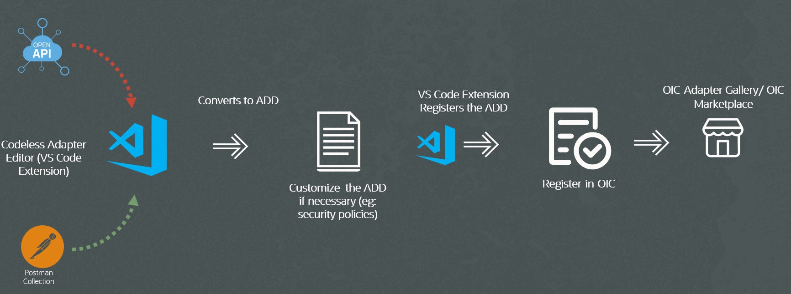

# Introduction

## About this Workshop

The Rapid Adapter Builder in Oracle Integration (OIC) allows you to quickly build custom adapters to integrate with applications that expose RESTful APIs, without needing to develop complex code from scratch. This tutorial will walk through creating an adapter for the ACME Order Management application using its REST APIs and the Rapid Adapter Builder.

An adapter provides an interface to connect an OIC integration flow with a specific application's APIs. Oracle Integration has a growing library of pre-built adapters for many popular applications. However, when there is no existing Oracle adapter for an application you need to integrate with, the Rapid Adapter Builder enables you to build a custom adapter tailored to that application's APIs.

The Rapid Adapter Builder is provided as a Visual Studio Code extension that guides you through generating the metadata definition of an adapter based on an application's Postman API collection or OpenAPI specification. You can then customize and publish this adapter definition document as a functional adapter within your OIC instance.

In this tutorial, you will use the Rapid Adapter Builder's Visual Studio Code extension to build an adapter for the ACME Order Management application's REST APIs. The key steps include:

- Obtaining the ACME Order Management APIs (Postman collection)
- Generating the adapter definition document from the APIs
- Customizing the adapter definition document as needed
- Validating and publishing the adapter to your OIC instance

By the end of this tutorial, you will have a custom ACME Order Management adapter published in your Oracle Integration instance, ready to be leveraged in integration flows for connecting to the ACME Order Management application.

Estimated Time: 2 hours 15 minutes

Watch the video below for a quick overview of Rapid Adapter Builder

[Overview of Rapid Adapter Builder](youtube:CpYIruWdRlI)

### Objectives

**End to End flow of developing OIC Adapter using Rapid Adapter Builder**

By completing this tutorial, you will be able to:

* Understand the purpose and benefits of the Rapid Adapter Builder in Oracle Integration
* Set up the prerequisites for using the Rapid Adapter Builder Visual Studio Code extension
* Generate an adapter definition document from a Postman API collection or OpenAPI specification
* Customize the adapter definition document to tailor the adapter's behavior
* Validate the adapter definition document for any errors
* Publish and register a custom adapter in your Oracle Integration instance
* Verify the published custom adapter is available in your OIC instance
* Create a sample Integration flow using the published adapter
* Understand how to incrementally update an existing custom adapter (Optional)

By accomplishing these objectives, you will gain hands-on experience using the Rapid Adapter Builder to create custom adapters for applications exposing RESTful APIs. This will expand your ability to integrate Oracle Integration with a wider range of cloud applications and on premise applications.

### Prerequisites

* An Oracle Free Tier or Paid Cloud Account.
* A Chrome browser.
* Postman
* Visual Studio

You may now **proceed to the next lab**.

## Learn More

* [Get Started with Oracle Integration 3](https://docs.oracle.com/en/cloud/paas/application-integration/index.html)

* [Get Started with Rapid Adapter Builder in Oracle Integration 3](https://docs.oracle.com/en/cloud/paas/application-integration/rab-tutorial)

## Acknowledgements
* **Author** - Kishore Katta, Director Product Management, OIC & OPA
* **Last Updated By/Date** - Kishore Katta, April 2024
