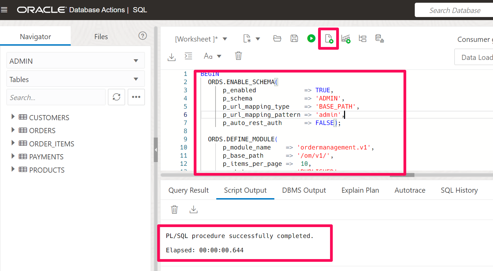

# Setup

## Introduction

This lab walks you through the setup required to complete the workshop. You will be exposing **ACME Order Management Application** API's using ORDS. A custom adapter will be created for the ORDS services exposed.

Estimated Time: 20 minutes

### Objectives
In this lab, you will:
- Create Database Table using a SQL script
- Create ORDS service for the DB tables using a PL/SQL script
- Create a Client Application in IDCS and Obtain Credentials
- Assign the Integration instance developer role to the Client Application
- Install Postman
- Install Visual Studio and RAB Extension


### Prerequisites
This lab assumes you have:
- Completed all the previous labs.


## Task 1: Create a database objects using an SQL script
Follow these steps to create a Database objects which will be used as part of this workshop.

1. From you ATP Database Details page, click the **Database Actions** button and Select **SQL**.

    

2. The SQL Worksheet appears. Select **ADMIN** schema. Before you proceed with the SQL Worksheet, copy below code snippet:
    ```
    <copy>
      CREATE TABLE customers (
        CustomerID NUMBER PRIMARY KEY,
        Name VARCHAR2(50) NOT NULL,
        Address VARCHAR2(100),
        City VARCHAR2(50),
        State VARCHAR2(2),
        ZipCode VARCHAR2(10),
        Phone VARCHAR2(20)  
      );

      /
      CREATE TABLE orders (
        OrderID NUMBER PRIMARY KEY,
        CustomerID NUMBER NOT NULL,
        OrderDate DATE NOT NULL,
        TotalAmount NUMBER(10,2),
        CONSTRAINT fk_customer FOREIGN KEY (CustomerID) REFERENCES customers(CustomerID)
      );
      /
      CREATE TABLE order_items (
        OrderItemID NUMBER PRIMARY KEY,
        OrderID NUMBER NOT NULL,
        ProductID NUMBER NOT NULL,
        Quantity NUMBER NOT NULL,
        Price NUMBER(10,2) NOT NULL,
        CONSTRAINT fk_order FOREIGN KEY (OrderID) REFERENCES orders(OrderID)
      );
      /
      CREATE TABLE products (
        ProductID NUMBER PRIMARY KEY,
        ProductName VARCHAR2(100) NOT NULL,
        UnitPrice NUMBER(10,2) NOT NULL
      );
      /
      CREATE TABLE payments (
        PaymentID NUMBER PRIMARY KEY,
        OrderID NUMBER NOT NULL,
        PaymentDate DATE NOT NULL,
        Amount NUMBER(10,2) NOT NULL,
        CONSTRAINT fk_order_payment FOREIGN KEY (OrderID) REFERENCES orders(OrderID)
      );
      /
    </copy>
    ```

6. Paste the script in the SQL Worksheet, then click **Run Script** button.

    

    This will create 5 tables as below. The table is created successfully when you see the notification in the *Script Output* window.

    

## Task 2: Insert sample data into DB Objects

1.  In the SQL Worksheet execute below set of script to insert data.
    ```
    <copy>
        INSERT INTO CUSTOMERS(
          CustomerID, NAME, PHONE,
          ADDRESS, CITY, STATE, ZIPCODE
        ) VALUES (
          1, 'John Smith', '9848022338',
          '123 Main St', 'New York', 'NY', '10001'  
        );

        INSERT INTO CUSTOMERS(
          CustomerID, NAME, PHONE,
          ADDRESS, CITY, STATE, ZIPCODE
        ) VALUES (
          2, 'Jane Doe', '4152317745',
          '456 Park Ave Apt 2B', 'Los Angeles', 'CA', '90028'  
        );

        INSERT INTO ORDERS VALUES (
          1001, 1, DATE '2023-02-14',
          99.99
        );

        INSERT INTO ORDERS
        VALUES (
          1002, 1, DATE '2023-02-18',
          149.99  
        );

        INSERT INTO PRODUCTS (
          PRODUCTID, PRODUCTNAME,
          UNITPRICE
        ) VALUES (
          10, 'Printer X1500',
          99.99  
        );

        INSERT INTO PRODUCTS VALUES (
          20, '43-inch LED TV',
          199.99  
        );

        INSERT INTO PRODUCTS VALUES (
          30, 'Laptop',
          299.99  
        );

        INSERT INTO ORDER_ITEMS (
          ORDERITEMID, ORDERID, PRODUCTID,
          QUANTITY, PRICE  
        ) VALUES (
          101, 1001, 10,
          2, 99.99
        );

        INSERT INTO ORDER_ITEMS (
          ORDERITEMID, ORDERID, PRODUCTID,
          QUANTITY, PRICE  
        ) VALUES (
          102, 1002, 20,
          2, 199.99
        );

        INSERT INTO PAYMENTS VALUES
          (101, 1001, DATE '2023-02-14', 99.99);

        INSERT INTO PAYMENTS VALUES
          (201, 1002, DATE '2023-02-16', 199.99);
    </copy>
    ```

## Task 3: Create ORDS Service and respective handlers


1.  In the SQL Worksheet execute below set of script to create ORDS service. If your schema name is different modify the p\_schema and p\_url\_mapping\_pattern values accordingly.
    ```
    <copy>
        BEGIN
    ORDS.ENABLE_SCHEMA(
        p_enabled             => TRUE,
        p_schema              => 'ADMIN',
        p_url_mapping_type    => 'BASE_PATH',
        p_url_mapping_pattern => 'admin',
        p_auto_rest_auth      => FALSE);    

    ORDS.DEFINE_MODULE(
        p_module_name    => 'ordermanagement.v1',
        p_base_path      => '/om/v1/',
        p_items_per_page =>  10,
        p_status         => 'PUBLISHED',
        p_comments       => 'ACME Order Management Application');      
    ORDS.DEFINE_TEMPLATE(
        p_module_name    => 'ordermanagement.v1',
        p_pattern        => 'customers',
        p_priority       => 0,
        p_etag_type      => 'HASH',
        p_etag_query     => NULL,
        p_comments       => 'Customers Resource');
    ORDS.DEFINE_HANDLER(
        p_module_name    => 'ordermanagement.v1',
        p_pattern        => 'customers',
        p_method         => 'GET',
        p_source_type    => 'json/collection',
        p_items_per_page =>  0,
        p_mimes_allowed  => '',
        p_comments       => 'Get All Customers',
        p_source         =>
    'SELECT CustomerID,Name,Address,City,State,ZipCode,Phone FROM customers'
        );
    ORDS.DEFINE_HANDLER(
        p_module_name    => 'ordermanagement.v1',
        p_pattern        => 'customers',
        p_method         => 'DELETE',
        p_source_type    => 'plsql/block',
        p_items_per_page =>  0,
        p_mimes_allowed  => '',
        p_comments       => 'Delete Customer',
        p_source         =>
    'BEGIN
            delete_customer (
              p_cust_id => :customerid
              );
              END;'
            );
        ORDS.DEFINE_HANDLER(
            p_module_name    => 'ordermanagement.v1',
            p_pattern        => 'customers',
            p_method         => 'PUT',
            p_source_type    => 'plsql/block',
            p_items_per_page =>  0,
            p_mimes_allowed  => '',
            p_comments       => 'Update Customer',
            p_source         =>
        'BEGIN
                update_customer (
                  p_cust_id => :customerid,  
                  p_name => :name,
                  p_address => :address,
                  p_city => :city,
                  p_state => :state,
                  p_zipcode => :zipcode,  
                  p_phone => :phone   
                  );
              END;'
            );
        ORDS.DEFINE_HANDLER(
            p_module_name    => 'ordermanagement.v1',
            p_pattern        => 'customers',
            p_method         => 'POST',
            p_source_type    => 'plsql/block',
            p_items_per_page =>  0,
            p_mimes_allowed  => '',
            p_comments       => 'Create a new Customer',
            p_source         =>
        'BEGIN
                add_new_customer (
                  p_cust_id => :customerid,  
                  p_name => :name,
                  p_address => :address,
                  p_city => :city,
                  p_state => :state,
                  p_zipcode => :zipcode,  
                  p_phone => :phone   
                  );
              END;'
            );
        ORDS.DEFINE_TEMPLATE(
            p_module_name    => 'ordermanagement.v1',
            p_pattern        => 'customers/:p_customer_id',
            p_priority       => 0,
            p_etag_type      => 'HASH',
            p_etag_query     => NULL,
            p_comments       => 'Customers Resource');
        ORDS.DEFINE_HANDLER(
            p_module_name    => 'ordermanagement.v1',
            p_pattern        => 'customers/:p_customer_id',
            p_method         => 'GET',
            p_source_type    => 'json/query;type=single',
            p_items_per_page =>  0,
            p_mimes_allowed  => '',
            p_comments       => 'Get Single Customer',
            p_source         =>
        'SELECT CustomerID,Name,Address,City,State,ZipCode,Phone FROM customers where customerid = :p_customer_id'
            );
        ORDS.DEFINE_TEMPLATE(
            p_module_name    => 'ordermanagement.v1',
            p_pattern        => 'order_items',
            p_priority       => 0,
            p_etag_type      => 'HASH',
            p_etag_query     => NULL,
            p_comments       => 'Order Items Resource');
        ORDS.DEFINE_HANDLER(
            p_module_name    => 'ordermanagement.v1',
            p_pattern        => 'order_items',
            p_method         => 'DELETE',
            p_source_type    => 'plsql/block',
            p_items_per_page =>  0,
            p_mimes_allowed  => '',
            p_comments       => 'Delete an Order Item',
            p_source         =>
        'BEGIN
                delete_order (
                  p_order_item_id => :orderitemid
                  );
              END;'
            );
        ORDS.DEFINE_HANDLER(
            p_module_name    => 'ordermanagement.v1',
            p_pattern        => 'order_items',
            p_method         => 'PUT',
            p_source_type    => 'plsql/block',
            p_items_per_page =>  0,
            p_mimes_allowed  => '',
            p_comments       => 'Update an Order Item',
            p_source         =>
        'BEGIN
                update_order_item (
                  p_order_item_id => :orderitemid,
                  p_order_id => :orderid,  
                  p_product_id => :productid,
                  p_quantity => :quantity,
                  p_price => :price
                  );
              END;'
            );
        ORDS.DEFINE_HANDLER(
            p_module_name    => 'ordermanagement.v1',
            p_pattern        => 'order_items',
            p_method         => 'POST',
            p_source_type    => 'plsql/block',
            p_items_per_page =>  0,
            p_mimes_allowed  => '',
            p_comments       => 'Create a new Order Item',
            p_source         =>
        'BEGIN
                add_new_order_item (
                  p_order_item_id => :orderitemid,
                  p_order_id => :orderid,  
                  p_product_id => :productid,
                  p_quantity => :quantity,
                  p_price => :price
                  );
              END;'
            );
        ORDS.DEFINE_TEMPLATE(
            p_module_name    => 'ordermanagement.v1',
            p_pattern        => 'order_items/:p_order_id',
            p_priority       => 0,
            p_etag_type      => 'HASH',
            p_etag_query     => NULL,
            p_comments       => 'Order Items Resource');
        ORDS.DEFINE_HANDLER(
            p_module_name    => 'ordermanagement.v1',
            p_pattern        => 'order_items/:p_order_id',
            p_method         => 'GET',
            p_source_type    => 'json/collection',
            p_items_per_page =>  0,
            p_mimes_allowed  => '',
            p_comments       => 'Get All order items of an order',
            p_source         =>
        'SELECT orderitemid,orderid,productid,quantity,price FROM order_items where orderid = :p_order_id'
            );
        ORDS.DEFINE_TEMPLATE(
            p_module_name    => 'ordermanagement.v1',
            p_pattern        => 'orders',
            p_priority       => 0,
            p_etag_type      => 'HASH',
            p_etag_query     => NULL,
            p_comments       => 'Orders Resource');
        ORDS.DEFINE_HANDLER(
            p_module_name    => 'ordermanagement.v1',
            p_pattern        => 'orders',
            p_method         => 'GET',
            p_source_type    => 'json/collection',
            p_items_per_page =>  0,
            p_mimes_allowed  => '',
            p_comments       => 'Get All orders',
            p_source         =>
        'SELECT OrderID,CustomerID,OrderDate,TotalAmount FROM orders'
            );
        ORDS.DEFINE_HANDLER(
            p_module_name    => 'ordermanagement.v1',
            p_pattern        => 'orders',
            p_method         => 'DELETE',
            p_source_type    => 'plsql/block',
            p_items_per_page =>  0,
            p_mimes_allowed  => '',
            p_comments       => NULL,
            p_source         =>
        'BEGIN
                delete_order (
                  p_order_id => :orderid
                  );
              END;'
            );
        ORDS.DEFINE_HANDLER(
            p_module_name    => 'ordermanagement.v1',
            p_pattern        => 'orders',
            p_method         => 'PUT',
            p_source_type    => 'plsql/block',
            p_items_per_page =>  0,
            p_mimes_allowed  => '',
            p_comments       => 'Update an Order',
            p_source         =>
        'BEGIN
                update_order (
                  p_order_id => :orderid,  
                  p_customer_id => :customerid,
                  p_order_date => :orderdate,
                  p_total_amount => :totalamount
                  );
              END;'
            );
        ORDS.DEFINE_HANDLER(
            p_module_name    => 'ordermanagement.v1',
            p_pattern        => 'orders',
            p_method         => 'POST',
            p_source_type    => 'plsql/block',
            p_items_per_page =>  0,
            p_mimes_allowed  => '',
            p_comments       => 'Create a new Order',
            p_source         =>
        'BEGIN
                add_new_order (
                  p_order_id => :orderid,  
                  p_customer_id => :customerid,
                  p_order_date => :orderdate,
                  p_total_amount => :totalamount  
                  );
              END;'
            );
        ORDS.DEFINE_TEMPLATE(
            p_module_name    => 'ordermanagement.v1',
            p_pattern        => 'orders/:p_order_id',
            p_priority       => 0,
            p_etag_type      => 'HASH',
            p_etag_query     => NULL,
            p_comments       => 'Orders Resource');
        ORDS.DEFINE_HANDLER(
            p_module_name    => 'ordermanagement.v1',
            p_pattern        => 'orders/:p_order_id',
            p_method         => 'GET',
            p_source_type    => 'json/query;type=single',
            p_items_per_page =>  0,
            p_mimes_allowed  => '',
            p_comments       => 'Get orders',
            p_source         =>
        'SELECT OrderID,CustomerID,OrderDate,TotalAmount FROM orders where OrderID = :p_order_id'
            );
        ORDS.DEFINE_TEMPLATE(
            p_module_name    => 'ordermanagement.v1',
            p_pattern        => 'payments/:p_customer_id',
            p_priority       => 0,
            p_etag_type      => 'HASH',
            p_etag_query     => NULL,
            p_comments       => 'Payments Resource');
        ORDS.DEFINE_HANDLER(
            p_module_name    => 'ordermanagement.v1',
            p_pattern        => 'payments/:p_customer_id',
            p_method         => 'GET',
            p_source_type    => 'json/collection',
            p_items_per_page =>  0,
            p_mimes_allowed  => '',
            p_comments       => 'Get Customer Orders and Payments',
            p_source         =>
        'SELECT
            c.name,
            o.orderid,
            o.orderdate,
            o.totalamount,
            p.paymentid,
            p.paymentdate,
            p.amount
          FROM
            customers c
            JOIN orders o ON o.customerid = c.customerid  
            JOIN payments p ON p.orderid = o.orderid
          WHERE
            c.customerid = :p_customer_id'
            );
        ORDS.DEFINE_TEMPLATE(
            p_module_name    => 'ordermanagement.v1',
            p_pattern        => 'products',
            p_priority       => 0,
            p_etag_type      => 'HASH',
            p_etag_query     => NULL,
            p_comments       => 'Products Resource');
        ORDS.DEFINE_HANDLER(
            p_module_name    => 'ordermanagement.v1',
            p_pattern        => 'products',
            p_method         => 'GET',
            p_source_type    => 'json/collection',
            p_items_per_page =>  0,
            p_mimes_allowed  => '',
            p_comments       => 'Get All Products',
            p_source         =>
        'SELECT productid,productname,unitprice from PRODUCTS'
            );
        ORDS.DEFINE_HANDLER(
            p_module_name    => 'ordermanagement.v1',
            p_pattern        => 'products',
            p_method         => 'DELETE',
            p_source_type    => 'plsql/block',
            p_items_per_page =>  0,
            p_mimes_allowed  => '',
            p_comments       => 'Delete a Product',
            p_source         =>
        'BEGIN
                delete_product (
                  p_productid => :productid
                  );
              END;'
            );
        ORDS.DEFINE_HANDLER(
            p_module_name    => 'ordermanagement.v1',
            p_pattern        => 'products',
            p_method         => 'PUT',
            p_source_type    => 'plsql/block',
            p_items_per_page =>  0,
            p_mimes_allowed  => '',
            p_comments       => 'Update a Product',
            p_source         =>
        'BEGIN
                update_product (
                  p_productid => :productid,
                  p_product_name => :productname,  
                  p_unit_price => :unitprice
                  );
              END;'
            );
        ORDS.DEFINE_HANDLER(
            p_module_name    => 'ordermanagement.v1',
            p_pattern        => 'products',
            p_method         => 'POST',
            p_source_type    => 'plsql/block',
            p_items_per_page =>  0,
            p_mimes_allowed  => '',
            p_comments       => 'Create a new Product',
            p_source         =>
        'BEGIN
                add_product (
                  p_productid => :productid,
                  p_product_name => :productname,  
                  p_unit_price => :unitprice
                  );
              END;'
            );
        COMMIT;
        END;
    </copy>
    ```



## Task 4: Verify the ORDS Module

1. Navigate to *ATP* instance page and Select **Database Actions**

2. Select **REST** tile from the drop down Menu

3. Under the *Objects* category select **Modules**

4. Verify the *ordermanagement.v1* module type. Copy the Open API 3.0 catalog url highlighted below and confirm in a browser window that it is reachable. We will use the url to verify the ORDS services from Postman in the later section.


5. Select the **ordermanagement.v1** module and verify and Select *Customer* resource and handlers which are created. Click on *GET* handler url and confirm that you are able to see a json response with few records.


## Task 5: Create a Client Application and Obtain Credentials

In Oracle Identity Cloud Service (IDCS), create a client application for your Oracle Integration instance and obtain the client credentials.

> Note: If your tenancy is enabled with domains launch the Confidential application creation from OCI Console &gt; Identity & Security &gt; domains &gt; <your domain> &gt; Integrated Applications. The steps below are pretty much the same.

You'll use these client credentials in your publisher-profile details while publishing an adapter using the Rapid Adapter Builder.

You must obtain the following details for your Oracle Integration instance:

- Host: URL of the Oracle Integration instance
- integrationInstance: Name of the Oracle Integration instance
- The following client credentials:
    - tokenUrl
    - clientId
    - clientSecret
    - scope

1.  In the Oracle Identity Cloud Service Console, go to the **Applications** section to create a new application that allows you to trigger an integration with OAuth.

2.  Click **Add**.

3.  Select **Confidential Application**.

4.  Complete the **Details** page, and click **Next**.

5.  On the **Client** page, select **Configure this application as a client now**, and complete the following:

    - Select **Client Credentials** from the **Allowed Grant Types** list.
    - Select **Specific** in the **Authorized Resources** area of the **Token Issuance Policy** section.
    - Click **Add Scope** under the **Resources** section.
    - Find the Oracle Integration application, and click **&gt;**
    - Add the scope containing **urn:opc:resource:consumer::all**
    - Save your changes

6.  Click through the remaining wizard pages without making changes and save the application

7.  Activate the application for use.

    Make a note of below
      - ClientId
      - Secret
      - Scope (that ends with urn:opc:resource:consumer::all)

## Task 6: Add roles to the client application

To successfully use the client credentials, assign the integration-instance developer role to the client application you created previously.

1.  Go to the **Application Roles** tab of the Oracle Identity Cloud Service application. The list of all applicable roles appears.

2.  Locate and click the ServiceDeveloper role, and then click **Assign Applications**. The Assign Applications dialog appears, displaying the client application you created previously.

3.  Select the client application and click **OK**. Now, IDCS assigns the integration-instance developer role to the application.

## Task 7: Download and Install the Required Software

To use the Rapid Adapter Builder, you require additional applications or software installed on your system.

1.  Download and install the Postman application. Visit the [Download Postman](https://www.postman.com/downloads/) page. Create an account on Postman to access full features.

2.  Download and install VS Code. Visit the [Download Visual Studio Code](https://code.visualstudio.com/download) page.

## Task 8: Install the VS Code Extension for Rapid Adapter Builder

Download and install the VS Code extension for Rapid Adapter Builder.

1.  On Visual Studio Marketplace, visit Oracle's [page](https://marketplace.visualstudio.com/publishers/Oracle)

2.  Find and click the **Oracle Integration Rapid Adapter Builder** tile. The Details page opens.

3.  Click **Install**. The extension file opens in VS Code.

4.  Click **Install** in VS Code. Now, the extension is installed and appears on the sidebar.

You may now **proceed to the next lab**.

## Acknowledgements
* **Author** - Kishore Katta, Director Product Management, OIC & OPA
* **Last Updated By/Date** - Kishore Katta, April 2024
