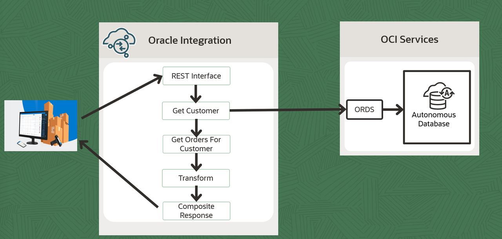

# Create Connections

## Introduction

This Lab will walk you through the steps to create a REST adapter connection to invoke an ORDS API which exposes service in Open API 3.0 format.

Estimated Time: 10 minutes

### Objectives
In this lab, you will:
- Create a REST Interface to expose the Integration flow
- Create a REST Adapter Connection to invoke ORDS API

### Prerequisites
This lab assumes you have:
- Completed all the previous labs.

## Task 1: Create REST Interface Trigger
Create a connection using REST Adapter.
1. In the left Navigation pane of OIC, Click **Design** &gt; **Connections** and Click **Create**.

2. In the *Create Connection* dialog, select the **REST** adapter. To find the adapter, enter *REST* in the search field. Click on the highlighted adapter.

3. In the *Create Connection* dialog, enter the following information and click on **Create**:

    | **Field**        | **Value**          |       
    | --- | ----------- |
    | Name         | REST Interface     |
    | Role         | Trigger       |
    | Description  | REST Interface Connection for OIC LiveLabs |
    {: title="Rest Interface Connection"}

    Keep all other values as default.

4. In the *Configuration* page, enter the following information:

    | **Field**  | **Values** |
    |---|---|
    |Security Policy | OAuth 2.0 Or Basic Authentication |
    {: title="Rest Interface Connection Properties"}

5. Click on **Test**  and wait until you receive a confirmation box that the test was successful.

6. Click **Save** and wait for the confirmation box. Exit the connection canvas by clicking the back button on the top left side of the screen.

## Task 2: Create REST Connection using REST adapter
Create a connection using REST Adapter to invoke ORDS API.

1. In the left Navigation pane of OIC, Click **Design** &gt; **Connections** and Click **Create**.

2. In the *Create Connection* dialog, select the **REST** adapter. To find the adapter, enter *REST* in the search field. Click on the highlighted adapter.

3. In the *Create Connection* dialog, enter the following information and click on **Create**:

    | **Field**        | **Value**          |       
    | --- | ----------- |
    | Name         | REST Inventory OAS     |
    | Role         | Invoke       |
    | Description  | REST Connection for ORDS API |
    {: title="Rest Connection"}
    Keep all other values as default.

4.  In the *Configuration* page, enter the following information:

    | **Field**  | **Values** |
    |---|---|
    |Connection Type | Open API (1.0/2.0/3.0) URL |
    |Connection URL | &lt; Open API URL Copied earlier &gt; (Refer Setup Database Objects Lab)|
    |Security Policy |  OAuth Client Credentials |
    |Access token uri | &lt; Token URL copied earlier &gt; (Refer Setup Database Objects Lab) |
    |Client Id| &lt; client id copied earlier &gt; (Refer Setup Database Objects Lab)|
    |Secret| &lt; secret copied earlier &gt; (Refer Setup Database Objects Lab)|
    {: title="Rest Connection Properties"}

5. Click on **Test**  and wait until you receive a confirmation box that the test was successful.

6. Click **Save** and wait for the confirmation box. Exit the connection canvas by clicking the back button on the top left side of the screen.

You may now **proceed to the next lab**.

## Learn More

* [Oracle Integration REST Adapter](https://docs.oracle.com/en/cloud/paas/application-integration/rest-adapter/rest-adapter-capabilities.html)

## Acknowledgements
* **Author** - Kishore Katta, Director Product Management - Oracle Integration & OPA
* **Last Updated By/Date** - Kishore Katta, May 2023
