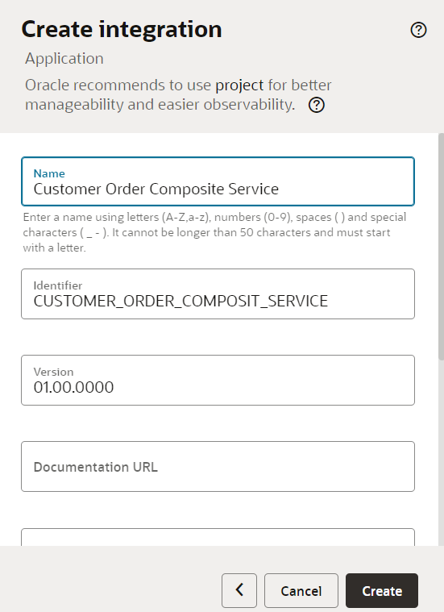
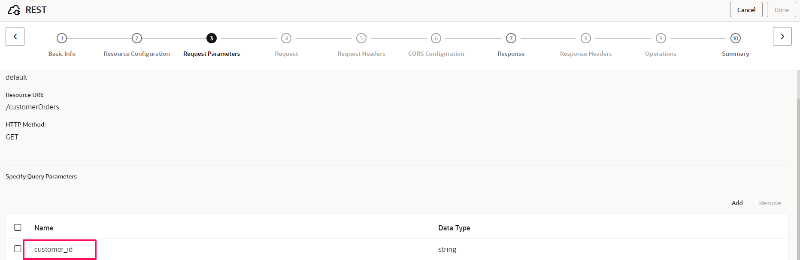
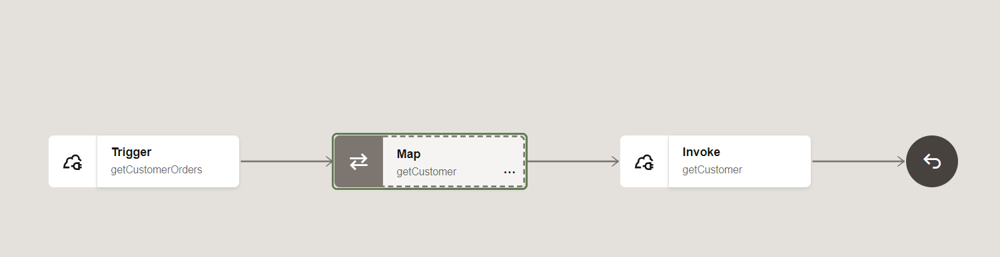
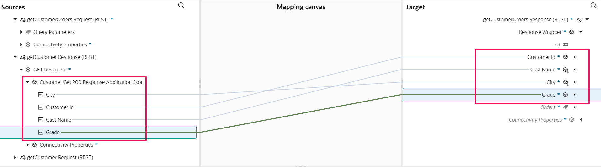

# Create Integration Flow

## Introduction

This lab walks you through the steps to create an Integration flow.

This use case describes how to use Oracle Integration to consume REST API which complies with Open API 3.0 specification.
   - ORDS API is created to get Customer and Orders
   - OIC consumes the ORDS API to get a Customer and Orders
   - OIC enriches the response and sends consolidated Customer and Orders to the client

 The following diagram shows the interaction between the systems involved in this use case.
    

Estimated Time: 30 minutes

### Objectives

In this lab, you will:

* Connect to ORDS API using OAuth Client Credentials grant
* Understand how to enrich and transform the payload


### Prerequisites

This lab assumes you have:

* All previous labs completed.


## Task 1: Create the Integration flow

1. In the left Navigation pane, click **Design** &gt; **Integrations**.

2. On the *Integrations page*, click **Create**.

3. On the *Create integration* dialog, select and click on **Application**.

4. In the *Create integration* dialog, enter the following information:

    | **Element**          | **Value**          |       
    | --- | ----------- |
    |Name | Customer Order Composite Service |
    |Description | This integration shows you how to connect to the REST API secured with OAuth using OPEN API 3.0 format |
    {: title="Create Integration Flow"}

    Accept all other default values.

5. Click **Create**.
   

6. Click on **Horizontal** to change the layout to Horizontal

## Task 2: Define the REST Trigger and Response Interface

1. Search for the *REST Interface* connection which was created in the previous Lab and click on it. This invokes the REST  Adapter Configuration Wizard.

2. On the *Basic Info* page,
     - for the *What do you want to call your endpoint?* element, enter **getCustomerOrders**
     - for the *What does this endpoint do?* element, enter *This endpoint defines the REST interface to get customer orders.*
     - Click **Continue**.

3. In the *Resource Configuration** page,
    - for the *What does this operation do?* element, enter **get orders for customers.**
    - for the *What is the endpoint's relative resource URI?*, enter **/customerOrders**
    - for the *What action do you want to perform on the endpoint?*, select **GET**
    - Select *Add and review parameters for this endpoint* checkbox
    - Select *Configure this endpoint to receive the response* checkbox
    - Click **Continue**.

4. From the *Request Parameters* page, in the *Specify Query Parameter section*, click **Add**. A new row appears.
    - Enter **customer_id** in the *Name* column and select **string** from the *Date Type* column
    - Click **Continue**.
    

5. On the **Response** Page
    - Select the *response payload format* to **JSON Sample**
    - Click the **&lt&lt&ltinline&gt&gt&gt** link.
    - Provide the below JSON and Click **OK**

        ```
        <copy>
        {
          "customer_id" : 3002,
          "cust_name" : "Nick Rimando",
          "city" : "NewYork",
          "grade" : 100,
          "orders" : [ {
            "ord_no" : 70002,
            "purchase_amt" : 65.26,
            "item_desc" : "Office Supplies",
            "ord_date" : "2012-10-05T00:00:00Z",
            "salesman_id" : 5001
          }, {
            "ord_no" : 70008,
            "purchase_amt" : 5760,
            "item_desc" : "Tacos",
            "ord_date" : "2012-09-10T00:00:00Z",
            "salesman_id" : 5001
          }, {
            "ord_no" : 70013,
            "purchase_amt" : 3045.6,
            "item_desc" : "Baby Food",
            "ord_date" : "2012-04-25T00:00:00Z",
            "salesman_id" : 5001
          } ]
        }
        </copy>
        ```
    - In the **What is the media-type of Response Body?** Select **JSON**

6. Click **Continue***

7. Review the summary and click **Done**.

8. Click **Save** to persist changes.


## Task 3: Invoke Get Customer Details

1.  Delete the Map activity created after the Trigger activity and **Save** the Integration Flow

2. Hover over the outgoing arrow for the *getCustomer* activity (after first activity) and Click the **+** sign in the integration canvas.
Search for the *REST Inventory OAS* connection which was created in the previous Lab and click on it. This invokes the REST  Adapter Configuration Wizard.

3. On the **Basic Info** page,
    - for the *What do you want to call your endpoint?* element, enter **getCustomer**
    - Click **Continue**.

3. On the *Operations* page,
    - for the *Operation Selection* Resource, select  **/customer** and for *Verbs* select **GET**
      Note: The endpoints are automatically listed. REST adapter supports discovery of resources from Open API catalog url configured in the connection.
    - Click **Continue**.    

4. On the **Request Parameters** page,
    - Shuttle the *p\_customer\_id* field from *Available Query parameters* to *Selected Query Parameters*
    - Click **Continue**.

5. Review the summary and click **Done**

6. Click **Save** to persist changes

7. Integration flow designed so far
    

## Task 4: Define the Data Mapping for Get Customer

A map action named getCustomer is automatically created. We will define this data mapping.

1. Select the action **Map getCustomer** and click on **...** and click on **Edit**

2. In the Source section, expand **getCustomerOrders Request** and then expand **Query Parameters**

3. In the Target section, expand the **getOrdersForCustomer Request &gt; Query Parameters**.
    - Map the *Customer Id* field from the source section to the *P Customer Id* field in the target section.

4. Select **Validate** and Navigate back to Integration Flow.

## Task 5: Invoke Get Orders By Customer
1.  Delete the Map activity created after the Trigger activity and **Save** the Integration Flow

2. Hover over the outgoing arrow for the *getCustomer* activity (after first activity) and Click the **+** sign in the  integration canvas. Search for the *REST Inventory OAS* connection which was created in the previous Lab and click on it. This invokes the REST  Adapter Configuration Wizard.

3. On the **Basic Info** page,
    - for the *What do you want to call your endpoint?* element, enter **getOrdersForCustomer**
    - Click **Continue**.

3. On the *Operations* page,
    - for the *Operation Selection* Resource, select  **/order** and for *Verbs* select **GET**
      Note: The endpoints are automatically listed. REST adapter supports the discovery of resources from Open API catalog url configured in the connection.
    - Click **Continue**.    

4. On the **Request Parameters** page,
    - Shuttle the *p\_customer\_id* field from *Available Query parameters* to *Selected Query Parameters*
    - Click **Continue**.

5. Review the summary and click **Done**

6. Click **Save** to persist changes

7. Integration flow designed so far
    

## Task 6: Define the Data Mapping for Get Orders
A map action named getOrdersForCustomer is automatically created. We will define this data mapping.

1. Select the action **Map getOrdersForCustomer** and click on **...** and click on **Edit**

2. In the Source section, expand **ShortBIPReport** and then expand **Query Parameters**
3. In the Target section, expand the **getCustomer Request &gt; Query Parameters**.
    - Map the *Customer Id* field from the source section to the *P Customer Id* field in the target section.

4. Select **Validate** and Navigate back to Integration Flow.

## Task 7: Define the Data Mapping for Composite Response

1. Add a **Map** activity after *Invoke get Orders By Customer* action
   We will create a transformation to reply back with Customer Details and All the orders for the given customer id

2. Select the action **Map getCustomerOrders** and click on **...** and click on **Edit**

3. In the Source section, expand **getCustomer Response**, expand **GET Response**, expand **Customer GET 200 Response Application JSON**

4. In the Target section, expand the **getCustomerOrders Response**, expand **Response Wrapper**
   - Map the following fields from the Sources section to the fields in the Target section
  | **Field**        | **Value**|       
  | --- | ----------- |
  | City         | City|
  | Customer Id         | Customer Id|
  | Cust Name         | Cust Name|
  | Grade         | Grade |
  {: title="Customer Details mapping."}

  

5. In the Source section, expand **getOrdersByCustomer Response**, expand **GET Response**, expand **Order GET 200 Response Application JSON**, expand **Items**

6. In the Target section, expand the **getCustomerOrders Response**, expand **Response Wrapper**, expand **Orders**
   - Map the following fields from the Sources section to the fields in the Target section
  | **Field**        | **Value**|       
  | --- | ----------- |
  | Items          | Orders|
  | Item Desc         | Item Desc|
  | Ord Date         | Ord Date|
  | Ord No         | Ord No |
  | Purchase Amt         | Purchase Amt |
  | Salesman Id         | Salesman Id |
  {: title="Order Details Mapping"}

  

  - Click on **Validate**.
     - A confirmation message appears.

  - Click **&lt; (Go back)**

  - Click **Save** to persist changes.

  Your final Integration Flow design should be similar to the below
  

## Task 9: Define Tracking Fields

Manage business identifiers that enable you to track fields in messages during runtime.

1. Click on the **(I) Business Identifiers** menu on the top right.

2. From the **Source** section, expand **execute** &gt; **QueryParameters**. Drag the *customer\_id* field to the right side section:

3. Click on the **(I) Business Identifiers** menu on the top right again to close Business Identifier section

4. Click **Save**.

5. Click on **&lt; (Go back)** button.


## Task 10: Activate the Integration

1. On the *Integrations* page, click on the **Activate** icon of *Customer Order Composite Service* Integration.

2. On the *Activate Integration* dialog, select *a tracing level* to **Debug**

3. Click **Activate**.

  The activation will be complete in a few seconds. If activation is successful, a status message is displayed in the banner at the top of the page, and the status of the integration changes to **Active**.

## Task 11: Run the Integration
Refresh your page after a few seconds.

1. Select *Customer Order Composite Service*,  Click on **...(Actions)** menu and Click on **Run**

2. Configure the URI parameters:
  - for *customer_id*, enter **3002**

3. Click **Run** (in the upper right of the page).

4. Look at the Response section to verify the Customer details and all the orders for the Customer. The response status is 200 OK

5. Click the link which appears on top to track the instance.

The track instance page appears. The Integration state should be processing or successful.
OR you can also track by Selecting on **Home &gt;**, **Observability &gt;** and **Instances**

## Task 12: Congratulations

Congratulations! You have invoked an integration from a web client using REST. On the Oracle Integration side, you've called a REST API secured with OAuth Client credentials grant type, enriching the customer and order information. Finally, transform both the enriched responses to a single JSON which is sent to the Client.


You may now **proceed to the next lab**.

## Learn More

* [Getting Started with Oracle Integration 3](https://docs.oracle.com/en/cloud/paas/application-integration/index.html)

* [Using the REST Adapter with Oracle Integration 3](https://docs.oracle.com/en/cloud/paas/application-integration/rest-adapter/index.html)

* [Activate Integration](https://docs.oracle.com/en/cloud/paas/application-integration/integrations-user/activate-and-deactivate-integrations.html)

* [Monitor Integration](https://docs.oracle.com/en/cloud/paas/application-integration/integrations-user/track-integration-instances.html#GUID-46A7C0A0-CBE4-4F1B-9B45-62A5AFA89D74)

## Acknowledgements

* **Author** - Kishore Katta, Director Product Management, Oracle Integration & OPA
* **Last Updated By/Date** - Kishore Katta, May 2023
