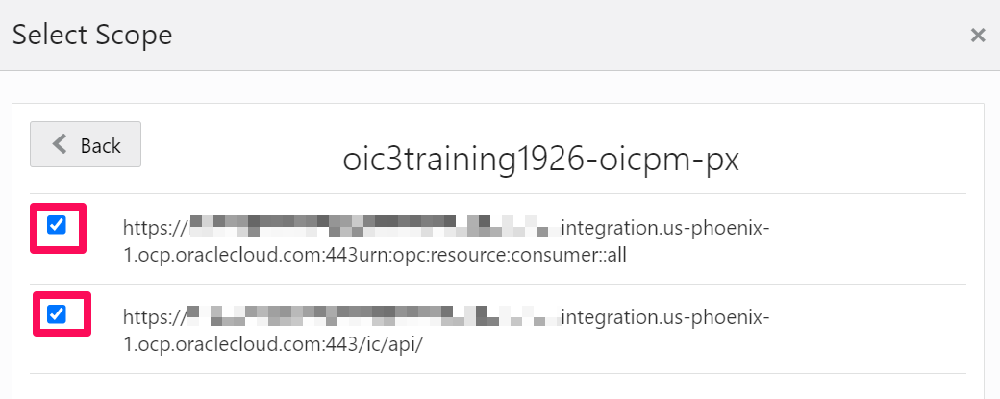
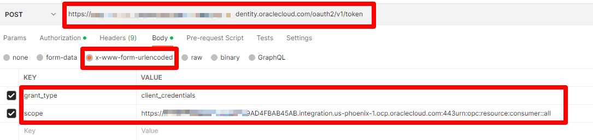
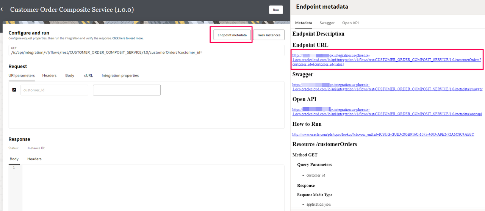

# Invoke OIC3 Integration Flow with OAuth (Bonus Lab)

## Introduction
This lab will walk you through the steps to invoke the OIC Integration flow using OAuth.

Estimated Time: 20 minutes

### Objectives
In this lab, you will:
- Configure a Confidential Application in IDCS to Authenticate with OAuth
- Generate Access Token from Postman
- Invoke OIC3 Integration Flow using OAuth access token

### Prerequisites
This lab assumes you have:
- Completed all previous labs successfully
- Any REST Client ex. POSTMAN

## Task 1: Configure a Confidential Application in IDCS

In this section, you will learn how to Configure a Confidential Application in IDCS to Authenticate with OAuth. Before you can use the REST API with OAuth in Oracle Integration, you need to register your Oracle Integration instance as a trusted application in Oracle Identity Cloud Service.

You need Identity Domain Administrator or Application Administrator credentials to perform this task. We will create a confidential application in IDCS for client credentials grant type.

1.  Access your Oracle Identity Cloud Service instance.

2.  Add a Confidential application for your Oracle Integration instance.
    - In Oracle Identity Cloud Service, from the menu, click *Applications*, then *Add*.
    - Select *Confidential Application* as the type of application.
    - Enter an application name, then click *Next*.
    - Select *Configure this application as a client now* .
    - On the Authorization page, select the following fields:
        - Select *Client Credentials* from the **Allowed Grant Types** list
        - Select **client type** as *Confidential*
        - In the **allowed operations** select *On behalf of*
        - Select *Specific* in the **Authorized Resources** area of the **Token Issuance Policy** section
        - Click *Add Scope* under the **Resources** section
        - Find the Oracle Integration application, and click *>*
        - Add the scope containing **urn:opc:resource:consumer::all** and **/ic/api/**
        
        - Save your changes
    - Click through the remaining wizard pages without making changes and save the application.
    - *Activate* the application for use
    - Make a note of below
        - ClientId
        - Secret
        - Scope (that ends with urn:opc:resource:consumer::all)

3.  Add roles to the client application
    - Go to the **Application Roles** tab of the Oracle Identity Cloud Service application.
    - Select *Assign Applications* for the ServiceAdministrator role
      

## Task 2: Generate Access Token from Postman

1.  Validate client application and generate access token
    - Use the pre-req information (clientid,scret and scope) to generate the access token using this REST api in Postman
        - Create a new request in Postman
        - Provide the OAUTH token Endpoint: https://&lt;idcs_host&gt;/oauth2/v1/token
        - Under **Authorization tab**
            - Use ClientId as username
            - Use Client secret as password
        - Under **body** tab, select *x-www-form-urlencoded* radio button
            - Enter KEY = grant\_type and VALUE = client\_credentials
            - Enter KEY = scope and VALUE = <scope> Refer Task 1 &gt; Step 2 from above
              
        - Click Send and copy the access_token from the response body (ensure to copy only the data between quotes)

## Task 3: Invoke OIC3 Integration Flow using access token

1.  Navigate to *OIC 3 console &gt; Design &gt; Integration*. Select *Customer Order Composite Service*, and Click on **...(Actions)** menu and Click on **Run**

2.  Select the button **Endpoint metadata** and copy the *Endpoint URL*
    

2.  Open another tab in Postman and provide the Integration Flow Endpoint URL. Provide Verb as GET

3.  Under the **Authorization** tab
    - Select Type = Bearer token
    - Paste the copied access token into the token field

4.  Click *Send* button to invoke the Integration Flow interfaced as REST Endpoint. Verify the new instance is created OIC 3 *Observability &gt; Instances* page.

  **Congratulations**! You've learnt how to invoke OIC 3 Integration Flow using Client Credentials OAuth2.0 grant type.

## Learn More

* [Authenticate Request for Invoking Oracle Integration Flows](https://docs.oracle.com/en/cloud/paas/application-integration/rest-adapter/authenticate-requests-invoking-oic-integration-flows.html)

## Acknowledgements
* **Author** - Kishore Katta, Director Product Management, Oracle Integration & OPA
* **Last Updated By/Date** - Subhani Italapuram, Sep 2025
