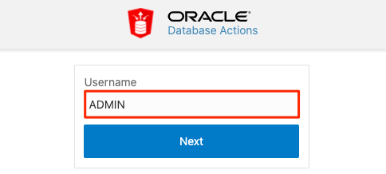
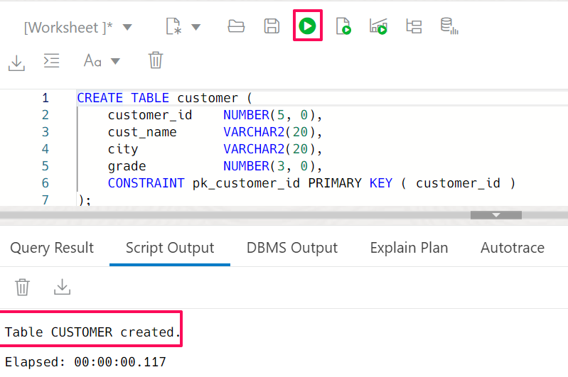
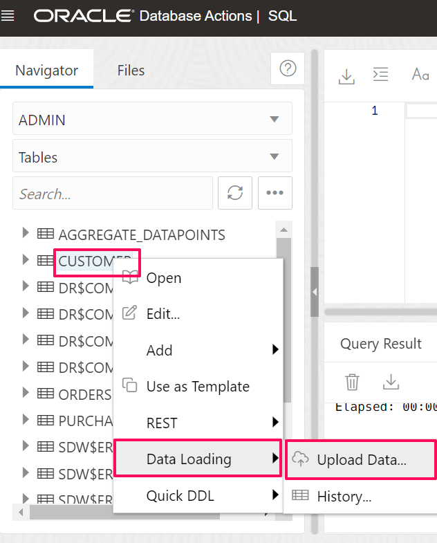
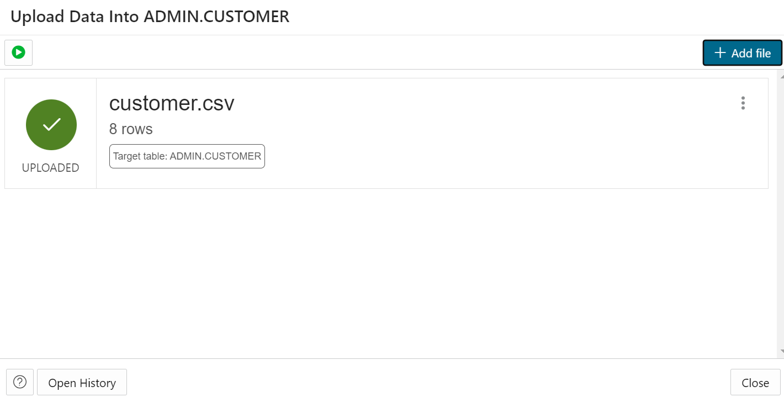
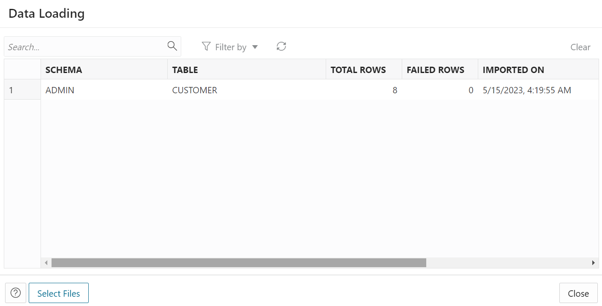
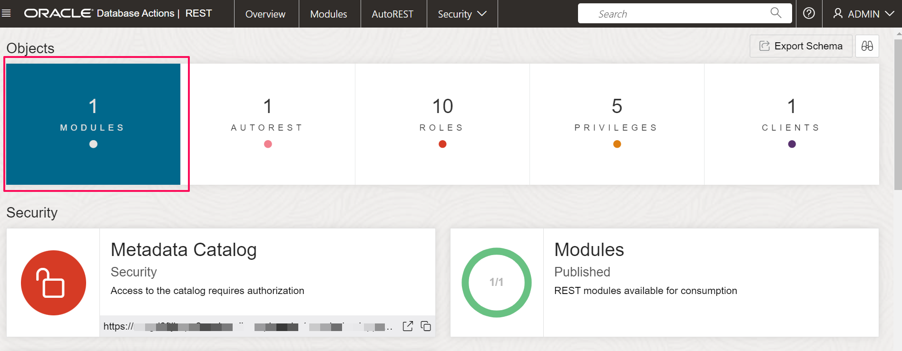
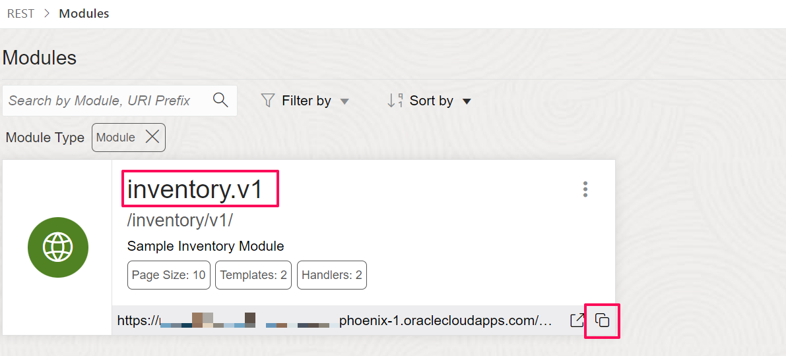
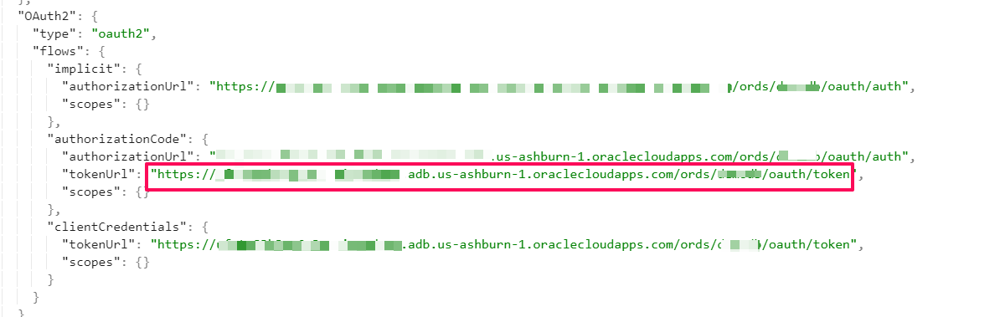

# Database & ORDS Setup

## Introduction

This lab walks you through the setup required to complete the workshop.

Estimated Time: 20 minutes

### Objectives
In this lab, you will:
- Create Database Table using a SQL script
- Create ORDS service for the DB tables using a PL/SQL script
- Secure ORDS service with OAuth Client Credentials grant type

### Prerequisites
This lab assumes you have:
- Completed all the previous labs.


## Task 1: Create a database table using an SQL script
Follow these steps to create a DB table which will be used as part of this workshop.

1.  If you are not already logged in to SQL Worksheet, on your ADW Database Details page, click the **Database Actions** button.

    

    > **Note:** If you are redirected to the Database Actions page, then skip to Step 4. Otherwise, follow the next step to log in manually.  

2. A sign-in page opens for Database Actions. For this lab, simply use your database instance's default administrator account `ADMIN` and click **Next**.

   

3.  Enter the **ADMIN** password you specified when creating the database and click **Sign in**.

    

4. The Database Actions page opens. In the *Development* box, click **SQL**.

    

    > **Note:** If this is the very first time you open the SQL Action, then a click-demo will be displayed. Just hit the **X** button to proceed.

5. The SQL Worksheet appears. Before you proceed with the SQL Worksheet, copy below code snippet:
    ```
    <copy>
    CREATE TABLE customer (
    customer_id    NUMBER(5, 0),
    cust_name      VARCHAR2(40),
    city           VARCHAR2(20),
    grade          NUMBER(3, 0),
    CONSTRAINT pk_customer_id PRIMARY KEY ( customer_id )
    );
    </copy>
    ```

6. Paste the script in the SQL Worksheet, then click **Run It** button. This will create the **CUSTOMER** table. The table is created successfully when you see the notification in the *Script Output* window.

    
Similarly, copy  and run the below script to create **Order** table
    ```
    <copy>
    CREATE TABLE orders (
    ord_no       NUMBER(5, 0),
    purchase_amt    NUMBER(6, 2),
    item_desc    VARCHAR2(30),
    ord_date     DATE,
    customer_id  NUMBER(5, 0),
    salesman_id  NUMBER(5, 0),
    CONSTRAINT pk_ord_no PRIMARY KEY ( ord_no ),
    CONSTRAINT fk_customer_id FOREIGN KEY ( customer_id )
    REFERENCES customer ( customer_id )
    );
    </copy>
    ```

## Task 2: Create ORDS Service for the database objects

In the SQL Worksheet execute below set of script to create ORDS service.
1.  Enable ORDS for the Schema. If your schema name is different modify the
    p\_schema and p\_url\_mapping\_pattern values accordingly.
    ```
    <copy>
    BEGIN
      ORDS.ENABLE_SCHEMA(
      p_enabled             => TRUE,
      p_schema              => 'ADMIN',
      p_url_mapping_type    => 'BASE_PATH',
      p_url_mapping_pattern => 'admin',
      p_auto_rest_auth      => FALSE);
      COMMIT;
    END;
    </copy>
    ```

2.  Create handlers to get a single Customer and get all orders for a Customer.

    ```
    <copy>
    BEGIN
    ORDS.DEFINE_MODULE(
        p_module_name    => 'inventory.v1',
        p_base_path      => '/inventory/v1/',
        p_items_per_page =>  10,
        p_status         => 'PUBLISHED',
        p_comments       => 'Sample Inventory Module');
    ORDS.DEFINE_TEMPLATE(
        p_module_name    => 'inventory.v1',
        p_pattern        => 'customer',
        p_priority       => 0,
        p_etag_type      => 'HASH',
        p_etag_query     => NULL,
        p_comments       => 'Customers Resource');
    ORDS.DEFINE_HANDLER(
        p_module_name    => 'inventory.v1',
        p_pattern        => 'customer',
        p_method         => 'GET',
        p_source_type    => 'json/query;type=single',
        p_items_per_page =>  0,
        p_mimes_allowed  => '',
        p_comments       => 'Get Customer',
        p_source         =>
  'SELECT customer_id, cust_name, city,grade FROM CUSTOMER where customer_id = :p_customer_id'
        );    
    ORDS.DEFINE_TEMPLATE(
        p_module_name    => 'inventory.v1',
        p_pattern        => 'order',
        p_priority       => 0,
        p_etag_type      => 'HASH',
        p_etag_query     => NULL,
        p_comments       => 'Orders Resource');
    ORDS.DEFINE_HANDLER(
        p_module_name    => 'inventory.v1',
        p_pattern        => 'order',
        p_method         => 'GET',
        p_source_type    => 'json/collection',
        p_items_per_page =>  0,
        p_mimes_allowed  => '',
        p_comments       => 'Get orders',
        p_source         =>
  'SELECT ord_no,purchase_amt,item_desc,ord_date,salesman_id FROM ORDERS where customer_id= :p_customer_id'
        );
      COMMIT;
    END;
    </copy>
    ```

## Task 3: Create OAuth ORDS role and privilege
1. Create a role

    ```
    <copy>
    BEGIN
        ORDS.create_role(
          p_role_name => 'inventory_api_role' );
    END;
    </copy>
    ```

2. Create a privilege and associate the privilege with the Inventory REST services

    ```
    <copy>
    BEGIN
        ORDS.create_privilege(
            p_name          => 'inventory_api_priv',
            p_role_name     => 'inventory_api_role',
            p_label         => 'Inventory Privilege',
            p_description   => 'A Inventory privilege created using PL/SQL.');
        ORDS.create_privilege_mapping(
            p_privilege_name => 'inventory_api_priv',
            p_pattern        => '/inventory/v1/*');     
        COMMIT;
    END;
    </copy>
    ```

## Task 4: Create a new client and associate Privilege(s)
1.  Now that we have our rest services secured, we need to create a *Client* and associate the client with one or more  
    privileges. We are going to create a client called *inventory\_partner\_company* which is going to consume the Customer and Order API to get real time customer information and orders for a specific customer.

    ```
    <copy>
    BEGIN
      OAUTH.create_client(
            p_name            => 'inventory_partner_company',
            p_grant_type      => 'client_credentials',
            p_owner           => 'My Inventory Company',
            p_description     => 'A client for API integrations by the My Inventory Company',
            p_support_email   => 'myinventory@mydomain.com',
            p_privilege_names => 'inventory_api_priv');
          OAUTH.grant_client_role(
            p_client_name     => 'inventory_partner_company',
            p_role_name       => 'inventory_api_role'
          );
          COMMIT;
     END;
    </copy>
    ```

2.  Execute the below query and make a note of *ClientId* and *secret*

    ```
    <copy>
    SELECT id, name, auth_flow, response_type, client_id, client_secret
    FROM USER_ORDS_CLIENTS;
    </copy>
    ```
## Task 5: Load sample data

1.  [Download](https://objectstorage.us-phoenix-1.oraclecloud.com/p/Wqfm8dXFdit0yLa5qqIYhNLMPi6D8dRWrGxMGMLyuP7LRr1VWzvXvp2dz3jfNNq1/n/oicpm/b/oiclivelabs/o/oic3/core-competency/understand-rest-adapter/Understand-Rest-Adapter.zip) the zip file and unzip the files in a local drive folder

2.  In the  *SQL Database Actions* select the DB table **Customer** right click **Data Loading &gt Upload Data..**
    
    Click on  **Add File** and Select the **customer.csv** from the local drive folder. Select **Run All** Action from top left.
    
    Click on **Open History** confirm the records are imported and no failed records.
    
    Similarly, load data for **Orders** table using *orders.csv* from local drive folder.

## Task 6: Verify the ORDS Module

1. Navigate to *ADW* instance page and Select **Database Actions**

2. Select **REST** tile from the Database Action Launchpad

3. Under the *Objects* category select **Modules**
   

4. Verify the *inventory.v1* module type. Copy the Open API 3.0 catalog url and confirm in a browser window that it is
    reachable. We will use the url to configure REST adapter connection in OIC 3 in the later section.
   

   Make a note of the OAuth Token URL from the catalog which is of below highlighted format.

   
5. Select the **inventory.v1** module and verify the *Order* and *Customer* resources and handlers which are created
   earlier


You may now **proceed to the next lab**.

## Acknowledgements
* **Author** - Kishore Katta, Director Product Management - Oracle Integration & OPA
* **Last Updated By/Date** - Kishore Katta - May 2023
