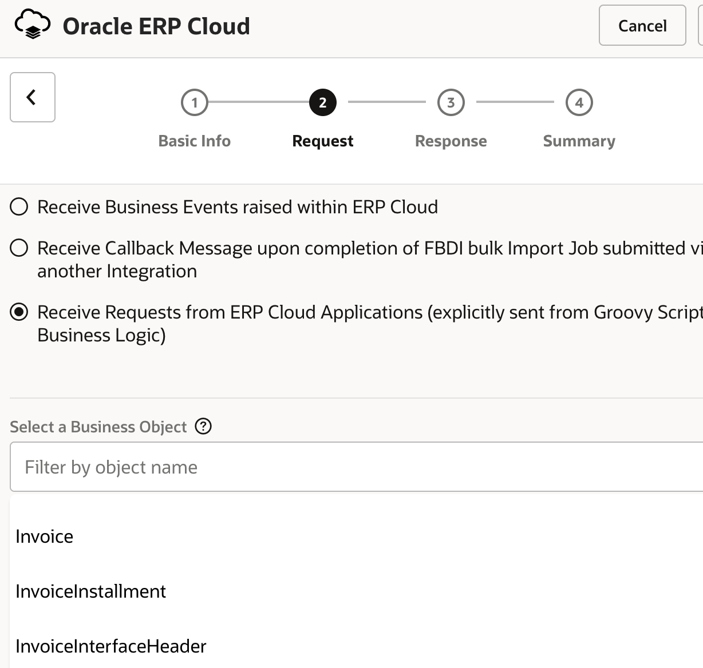
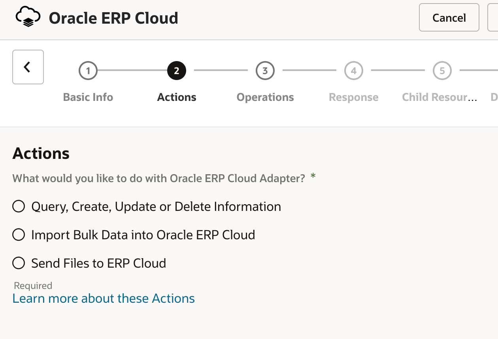

# Functional Details of ERP Cloud Adapter

## Introduction

In this section, we will see the functional usage of the ERP Cloud Adapter and its capabilities w.r.t the design patterns described earlier.

Estimated Time: 15 minutes

### Objectives

In this lab, you will:

* Understand Functional Usage of the ERP Cloud adapter

### Prerequisites

This lab assumes you have:

* All previous labs successfully completed.

##	Task	1: Understand ERP Cloud Adapter usage roles

Adapters Identify and Select the pattern of Integration upfront. The adapter wizard provides an intuitive way to select the task of choice by listing out relevant integration artefacts which provide an abstract view to the Integration Developer

### **When used as a trigger role**

Adapter Configuration wizard supports the ability to process business events, expose an object interface, subscription to completed FBDI jobs

### *Configure Business Events*

Business Event is received as a request that starts the integration. Only events that can be subscribed to are displayed in the Adapter Wizard.

ERP Cloud Adapter Supports Events from various modules such as

- Financials
- Inventory Management
- Maintenance
- Manufacturing
- Order Management
- Product Lifecycle Management
- Procurement
- Supply Chain Collaboration and Visibility
- Project Portfolio Management

### *Configure Business Objects*

Gives a functional view of the ERP Cloud objects to expose a comprehensive interface

### **When used as a invoke role**
Adapter Configuration wizard supports the ability to invoke SOAP/REST services, simplify invocation of FBDI jobs, and send import files (FBDI/Non-FBDI) to ERP Cloud

* ***Query, Create, Update, or Delete Information:*** Provides the standard configuration path for selecting a business object or service. This option displays the standard Operations and Response pages.
Select to browse by business object or service. There is a one-to-one correspondence between the business object and service. The service acts on the business document. The Adapter supports:

    - Business Objects: Select to browse a list of available business objects.

    - Services: Select to browse a list of available services.

    - Business (REST) Resource: Select to browse a list of available Oracle Fusion Applications REST API resources.

* ***Import Bulk Data into Oracle ERP Cloud:*** Provides a scenario for loading and orchestrating data from a secure FTP location to Oracle ERP Cloud.

Data is loaded into a selected product interface table and then imported into the related main product application tables. A callback notification may also be configured to send when the data import completes. This option also shows a modified Operations page and a unique Response page in the Adapter Endpoint Configuration Wizard for importing data.

* ***Send Files to ERP Cloud:*** Select to upload files (FBDI/NonFBDI) to Oracle WebCenter Content (Universal Content Manager) in encrypted or unencrypted format.

You may now **proceed to the next lab**.

## Learn More

* [Getting Started with Oracle Integration](https://docs.oracle.com/en/cloud/paas/integration-cloud)
* [Using the Oracle ERP Cloud Adapter with Oracle Integration](https://docs.oracle.com/en/cloud/paas/integration-cloud/erp-adapter)

## Acknowledgements

* **Author** - Kishore Katta, Product Management, Oracle Integration
* **Contributors** - Subhani Italapuram, Product Management, Oracle Integration
* **Last Updated By/Date** - Kishore Katta, May 2022
